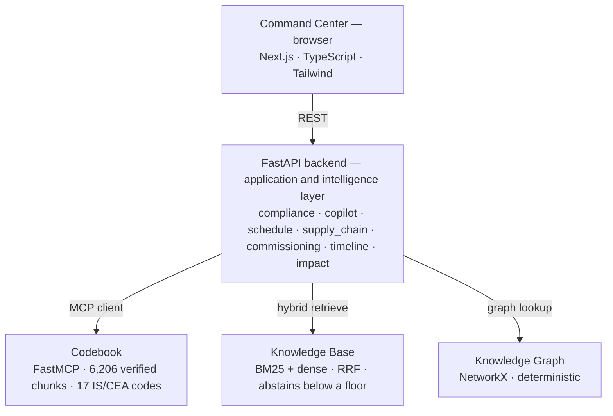
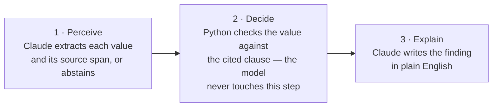

# SiteMind — AI intelligence layer for data-centre EPC delivery

SiteMind reads a Design Basis Report or a vendor submittal, pulls out each engineering
parameter **with the exact sentence it came from**, and checks it against the **real Indian
code clause** that governs it. In seconds you get cited non-conformances, a project copilot,
schedule-risk forecasts, supply-chain visibility, and commissioning QA.

**Live app:** https://sitemind.awni.in

## The one idea that matters

Most AI compliance tools either hallucinate a citation or bury the decision inside a model
that just says "trust me." SiteMind splits the work in two so it can't do either:

- **The model perceives and explains.** Claude (Sonnet 4.6, via the Claude Agent SDK) reads the
  document, extracts each value with its source span, and writes the finding in plain English.
- **Deterministic Python decides.** The pass/fail verdict is a plain threshold against a cited
  clause. The model never makes the call, so a verdict or a citation can never be faked.

Every citation resolves to real primary-source text — digitised IS/CEA codes, never paraphrased
from a model's memory. Every number in the app is computed by a real eval, not asserted: the
flagship is **100% rule-decision accuracy vs a 58.5% naive baseline (n=41)**, with a measured
**0% citation-hallucination rate**.

## Architecture



And how a single compliance call is made — a model only ever touches the outer two stages:



**Stack:** Python · FastAPI · scikit-learn · MiniLM embeddings (HF Inference API) · NetworkX ·
Next.js 14 · TypeScript · Tailwind. No model training anywhere, and deliberately no
agent-orchestration framework — the guarantee layer is plain, auditable Python.

## What's real vs representative

- **Real:** every IS/CEA clause and the text it resolves to, the compliance decision logic, all
  21 eval scripts, document parsing (with mandatory abstention on anything it can't confidently
  extract), and the critical-path schedule recomputation.
- **Representative:** the pre-loaded project documents and schedule are synthetic, modelled on
  public Indian data-centre tenders. The standards and the logic that checks them are real — and
  so is anything you upload yourself.

## Running it

**Prerequisites:** Python **3.12** (the pinned numpy/pandas wheels don't build on 3.13+) and
Node 18+. Every API key is optional — the app degrades gracefully, and the pass/fail decision
is deterministic with or without one.

### 1 · Minimal — fully offline, no keys

Compliance and Commissioning QA work end-to-end with no keys.

```bash
cd backend && ./run.sh                       # :8000  (creates .venv, installs deps)
cd frontend && npm install && npm run dev    # :3000
```

Open http://localhost:3000 and watch the top-bar pill: **green** = talking to the real backend,
**red** = you're seeing mock data (wrong API URL or backend down).

### 2 · Add semantic search (free Hugging Face token)

Copilot, Knowledge Base, and Codebook use MiniLM embeddings through the HF Inference API. Drop a
free token (read scope, from huggingface.co/settings/tokens) into `backend/.env`:

```env
HF_TOKEN=hf_xxxxxxxx
```

Then run all three services:

```bash
cd standards-service && ./run.sh                               # :8010  (Codebook)
cd backend && CODEBOOK_ENABLED=1 RETRIEVAL_ENABLED=1 ./run.sh   # :8000
cd frontend && npm run dev                                      # :3000
```

### 3 · Add LLM prose (optional)

Claude writes the findings and answers when a key is set; with no key it falls back to
deterministic templates.

```env
ANTHROPIC_API_KEY=sk-ant-xxxxxxxx
ANTHROPIC_MODEL_SMART=claude-sonnet-4-6
```

Keys only affect prose and semantic search — **never a verdict**.

**Optional — LLM document extraction (no API key needed).** The compliance upload can read parameters
out of *unseen* phrasing (not just anticipated wording) using Claude via the Claude Agent SDK, on your
Claude Code **subscription** — not a metered key. Every value the model returns passes a deterministic
span-verification gate (the quote must be literally in the document and contain the value) before it
reaches the check, so the zero-hallucination guarantee holds and the regex path stays as the fallback.

```bash
cd backend && VIRTUAL_ENV=.venv uv pip install claude-agent-sdk   # needs the `claude` CLI on PATH
claude setup-token                                                # paste result into backend/.env:
#   CLAUDE_CODE_OAUTH_TOKEN=...
#   LLM_EXTRACTION_ENABLED=1
```

With the flag unset, extraction is the deterministic regex path — the default, and what the demo records.

## Features

- **Compliance Agent** (`/compliance`) — upload a DBR/submittal, get NCRs with a cited clause, the
  exact source span, and a confidence-scored action brief.
- **Project Copilot** (`/copilot`) — cross-document Q&A with citations; guardrailed hybrid
  retrieval (BM25 + dense, reciprocal-rank fused); abstains below a floor instead of guessing.
- **Schedule Risk** (`/schedule`) — CPM + leading-indicator rules (procurement, weather,
  workforce) with recomputed finish impact and three mitigation agents.
- **Supply Chain** (`/supply-chain`) — multi-tier shipment tracking, delay propagation,
  root-cause attribution, severity-tiered alerts.
- **Commissioning QA** (`/commissioning`) — cooling test-log CSV → pass/allowable/fail against an
  ASHRAE thermal envelope → exportable quality package.
- **Timeline** (`/timeline`) — every NCR, RFI, risk, and alert from the five pillars on one
  cross-linked view. Pure aggregation, zero new judgement.
- **Knowledge Graph** (`/graph`) — equipment → spec → standard → RFI, deterministic (NetworkX)
  and clickable, not a vector guess.
- **Codebook** (`/codebook`, `standards-service/`) — a standalone, MCP-consumable standards
  service any agent can query, plus a console for browsing corpora.

## Evals

21 re-runnable eval scripts (18 in `backend/eval/`, 3 in the Codebook service), each reported on
its own — never blended into a single vanity score.

```bash
cd backend && source .venv/bin/activate && python -m eval.run_eval
```

## Known caveats (disclosed, not hidden)

- Some clause verify-links point at a dev host; the clause *text* still resolves in-app.
- Semantic search needs a free `HF_TOKEN`; Compliance and Commissioning need no keys at all.
- ROI figures (~20 engineer-hrs and ~₹15L per issue) are labelled assumptions, not measurements.
- All project data is synthetic/representative, modelled on public tenders.

## Roadmap

Every check maps to a real digitised clause, so coverage grows by **adding clauses, not
retraining a model**. Next in line: IS 875 (wind), IS 13920 (seismic detailing), IS 800 (steel),
and NBC 2016 (fire and egress).
