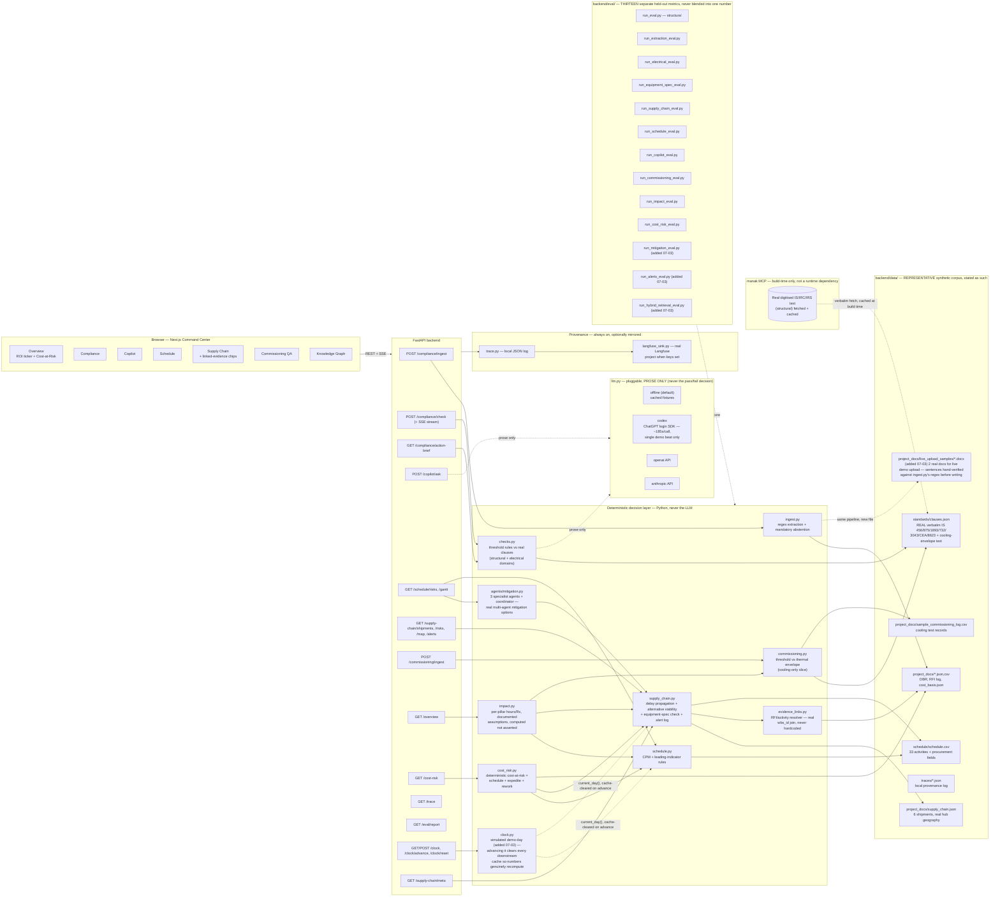

# SiteMind — Architecture

Source-of-truth diagram-as-code (Mermaid). GitHub renders this block natively; for the deck, paste it into
the [Mermaid Live Editor](https://mermaid.live) and export PNG/SVG, or run `npx @mermaid-js/mermaid-cli -i
ARCHITECTURE.md -o architecture.png` locally (no account needed either way).

> Updated 2026-07-03 (third pass): adds the simulated demo clock (`clock.py`, `/api/clock*`) and
> the live-upload sample documents (`project_docs/live_upload_samples/`), on top of the second pass
> the same day (the multi-agent mitigation-option engine, supply-chain alerting, hybrid BM25+dense
> retrieval) and the first pass (all 5 pillars, the platform-wide impact model, deterministic
> cost-at-risk, the computed evidence-linking resolver) — supersedes the earlier 3-pillar version.



## The rule every pillar follows

```
REAL input (uploaded doc / test log / schedule.csv / supply_chain.json)
      │
      ▼
LLM extracts + shows its source span            ← auditable: judge can re-read the input
      │
      ▼
Real cited clause / real computed threshold      ← auditable: judge can re-fetch the clause
(never generated by the LLM)
      │
      ▼
Python compares (checks.py / cost_risk.py /      ← deterministic, re-runnable, testable
 impact.py / commissioning.py)
      │
      ▼
Verdict + citation + (LLM prose, clearly          ← the ONLY LLM-authored part is explanation
 separated from the decision itself)                text, never the pass/fail
```

## Where we ARE agentic, and where we deliberately are not (a stated position)

The brief's "Suggested Technologies" lists Agentic AI / Multi-Agent Systems first,
and its **Predictive Schedule Risk Engine** bullet is the one place it names
multi-agent *specifically*: "Multi-agent system that analyses project schedules...
identifying critical path risks weeks in advance and **generating mitigation
options, not just alerts**." SiteMind answers that literally: `agents/mitigation.py`
runs three specialist agents per flagged schedule risk — a procurement-alternative
check (reuses Supply Chain's real alternative-viability arithmetic), a
resequencing-float check (reads real CPM float from `schedule.py::_cpm`), and a
resource/overtime-recovery check (real productivity-rate arithmetic) — and a plain
coordinator collects every result, including non-viable ones, transparently.

**Why this is genuinely multi-agent and not agentic-washing:** each agent is a
distinct specialist with a bounded, real-data tool-call (not shared logic split
into functions for its own sake), and mitigation-option generation is naturally a
*multiple-valid-answers* question — there isn't one right mitigation, which is
exactly what makes it a legitimate fit for several agents + a coordinator, unlike
a pass/fail decision against a cited standard.

**Why NOT a framework (LangGraph/CrewAI/AutoGen) even here:** each agent is one
bounded tool-call over data already loaded in-process — no planning loop, no
inter-agent negotiation, no retries against an uncertain environment. A
framework's state/replanning machinery would add complexity this scoped task
doesn't need.

**Why the OTHER pillars stay plain deterministic Python, no agents at all:** an
autonomous agent deciding pass/fail — or deciding *which* tool/clause to trust —
reopens exactly the hallucination risk this project exists to eliminate. A
multi-step agent loop can silently drift: retrieve the wrong clause, paraphrase it
slightly, or "reason" its way to a plausible-sounding but wrong verdict, with no
single deterministic checkpoint a judge can audit. Compliance/Commissioning pin
the **decision** in Python (`checks.py`, `commissioning.py`) — testable,
re-runnable, and covered by held-out evals — and use the LLM for exactly one
bounded job per finding: write prose around a decision and citation it did not
make. **The line, stated plainly:** agentic where the task is naturally
multi-option and every option is a real, grounded computation (schedule
mitigation); never agentic where the task is a single verifiable yes/no against a
cited standard (compliance, commissioning, cost-risk, the impact model).

## Scalability — how this grows without retraining anything

The compliance engine is **clause-driven, not model-driven**: every check is a JSON clause entry plus a
threshold function in `checks.py`, so breadth scales by *adding data*, never by retraining or fine-tuning.
Concretely, three independent axes scale this way:

- **More clauses, same engine.** Going from 3 structural standards to 5 domains (structural + electrical)
  this cycle meant adding 11 clauses to `clauses.json` and 9 threshold checks — zero changes to `checks.py`'s
  decision architecture, `ingest.py`'s extraction pattern, or the eval harness shape. The next codes on the
  roadmap (IS 875 Pts 1/2/4/5, IS 13920, IS 800, IS 1893 Pt 4, NBC 2016 — see root `README.md`'s "Roadmap")
  are the same operation repeated, each shipping with its own held-out eval rather than diluting an existing
  one.
- **More pillars, same pattern.** Compliance → Copilot → Schedule → Supply Chain → Commissioning were each
  added as an isolated FastAPI router + a pure-function decision module + a dedicated eval — Supply Chain's
  equipment-spec extension and Commissioning's cooling-only slice both prove a *narrow, honestly scoped*
  new pillar can ship without touching the other four's code or evals.
- **More documents, same pipeline.** `ingest.py` runs identical regex-extraction + mandatory-abstention logic
  on any uploaded file — the live-upload demo samples prove this by construction, not by claim: same code
  path as the bundled DBR, on a document the pipeline had never seen before.

**What does NOT scale this way, stated plainly:** the regex-based extractor is narrow by design (5 checkable
parameter types) — broadening it to open-ended clause coverage would need either a much larger
hand-verified pattern library or a constrained LLM-extraction step with the same mandatory-abstention
discipline, not a bigger model. That trade-off is unbuilt, not hidden.

### System scalability — the honest current state, and the real path past it

The brief sizes a single hyperscale project at 15,000–40,000 equipment line items and up to 200 concurrent
trade contractors. Today's build is **single-project and file-backed**: `data_loader.py` reads JSON/CSV
straight off disk into memory, and every pillar's module (`schedule.py`, `supply_chain.py`, `commissioning.py`,
`impact.py`, `cost_risk.py`...) memoizes its computation with `functools.lru_cache`, invalidated wholesale by
`clock.py` on every simulated-day advance. That's the right shape for a demo — zero infra, instant cold
start, fully offline — and it is also the actual current ceiling: it holds one project's data in one
process's memory, not many projects concurrently, and a cache invalidated "wholesale" doesn't scale to
frequent concurrent writes from 200 contractors updating records independently.

**What doesn't need to change:** the decision layer itself. Every check is a stateless, pure function over
whatever data it's handed (`checks.py(params, clauses)`, `cost_risk_from(...)`, `impact_from(...)`) — there
is no shared mutable state inside a request, so FastAPI workers scale horizontally behind a load balancer
today, with no rewrite. The 15,000–40,000-line-item volume the brief names is a per-document parameter
count, not a per-check cost — `checks.py` runs in time proportional to the parameters actually extracted,
not the clause library size, so a bigger document doesn't mean a slower check.

**What would need to change, named plainly, for a real multi-project deployment:** replace the JSON/CSV
data layer with a real datastore (Postgres for structured records + an object store for uploaded
documents) so multiple projects and concurrent writers don't share one in-memory snapshot; replace
`clock.py`'s wholesale cache-clear with per-entity invalidation keyed by what actually changed; and move
the embedding index behind a real vector store (the Copilot pillar currently holds embeddings in-process)
once corpus size crosses what fits in one worker's memory. None of these are architecture rewrites — the
deterministic-decision core, the pillar-per-router split, and the clause-driven check engine are already
shaped the right way for it — they're the concrete next-phase infrastructure work, unbuilt because a
hackathon prototype doesn't need it yet, not because the design doesn't anticipate it.

## What this diagram is honest about

- **The LLM never decides pass/fail.** Every arrow into `LLM` is labeled "prose only" — compliance
  thresholds, schedule risk rules, supply-chain delay/alternative arithmetic, the impact model, and
  cost-at-risk are all plain Python. This is the whole credibility thesis (see the root `README.md`'s
  "What's REAL vs REPRESENTATIVE" section) and the diagram makes it structurally visible, not just
  claimed in text.
- **manak is a build-time dependency, not a runtime one.** The live app never calls out to manak during a
  demo — clauses are fetched once and cached to `clauses.json`, so a flaky venue network can't break the
  compliance pillar. The dotted line marks this explicitly. manak's corpus is structural-only; the
  electrical domain (IS 732/3043/CEA/8623) is grounded in real, verified-genuine BIS/CEA PDFs instead —
  each clause's `Citation.source_type` field records exactly which reliability tier it belongs to
  (manak-verified / primary-native-pdf / primary-scan-ocr / cross-source-unverified).
- **evidence_links.py never hardcodes a cross-reference.** The SHP-002 <-> RFI-EL-112 <->
  DC1-04-EL-030 connection DEMO_STORY.md narrates is computed live from a real shared key (the wbs_id
  appears verbatim in the RFI's own reference text) — the same discipline `action_brief.py` already
  applied to Compliance findings, now generalized to Supply Chain.
- **impact.py and cost_risk.py compute, never assert.** Every hours/Rs figure traces to a real per-pillar
  signal (NCR count, CPM-recomputed schedule impact, supply-chain days-at-risk, commissioning FAIL count)
  x a constant stated in the UI (`basis`/formula breakdown), never a bare number.
- **Thirteen evals, thirteen separate boxes.** They are deliberately not merged into one "accuracy" number
  anywhere in the codebase or this diagram — see `sitemind/PROGRESS.md` for why that distinction matters.
- **Data is labeled REPRESENTATIVE**, not real project data — consistent with the honesty framing in
  `sitemind/README.md`'s "What's REAL vs REPRESENTATIVE" section. This now explicitly includes
  `cost_basis.json` (added 2026-07-03) — the cost-at-risk *formula* and its live inputs are real; the
  per-item base costs are order-of-magnitude synthetic figures.
- **Supply-chain alerts are an in-app log, not a push channel.** No SMTP/webhook/SMS integration exists —
  `SupplyChainAlert.advance_warning_days` is a real computed lead-time (how early the system COULD have
  raised the alert, from real milestone data), not a claim that a notification was delivered anywhere.
- **Hybrid retrieval never touches the evaluated abstention floor.** `agents/copilot.py`'s BM25+dense
  fusion (`_rrf_fuse`, RRF) only changes which chunks are SELECTED once a query already clears the
  dense-only floor `eval/run_copilot_eval.py` calibrates — confirmed byte-identical (0.25 sweep-optimal /
  0.40 deployed, accuracy 1.0 on n=12) before and after hybrid retrieval was added.
- **The simulated clock changes time, never data.** `clock.py`'s `_offset_days` is the only mutable
  state it introduces; advancing it recomputes `schedule.risks()`/`supply_chain.shipments()` /
  `risks()`/`alerts()` for real (verified live: +20 days grew both active alerts'
  `advance_warning_days` by exactly +20 and grew the schedule at-risk count 5→9), and `reset()`
  restores the exact prior baseline — nothing in `schedule.csv`/`supply_chain.json` is touched.
- **The live-upload documents are new input, not a new code path.** `INGEST` runs the identical
  regex-extraction pipeline on `live_upload_samples/*.docx` as it does on any other upload — the
  only thing "new" is the file; every extracted value and NCR was independently verified via real
  `POST /api/compliance/ingest` + `/check` calls before being called done, not eyeballed.
