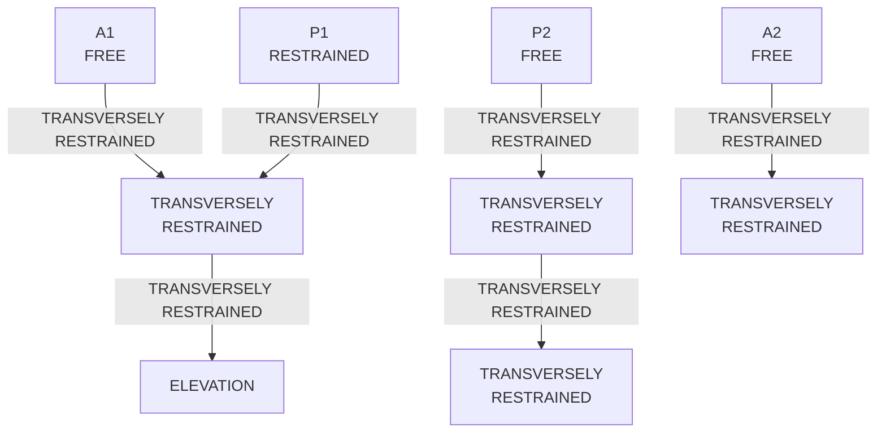
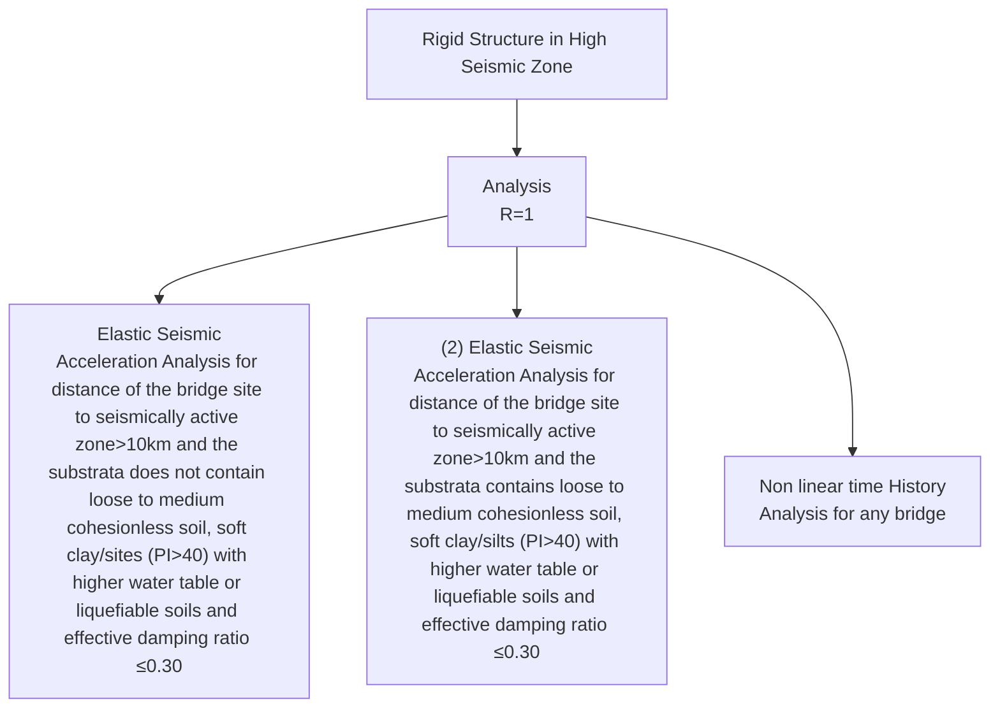
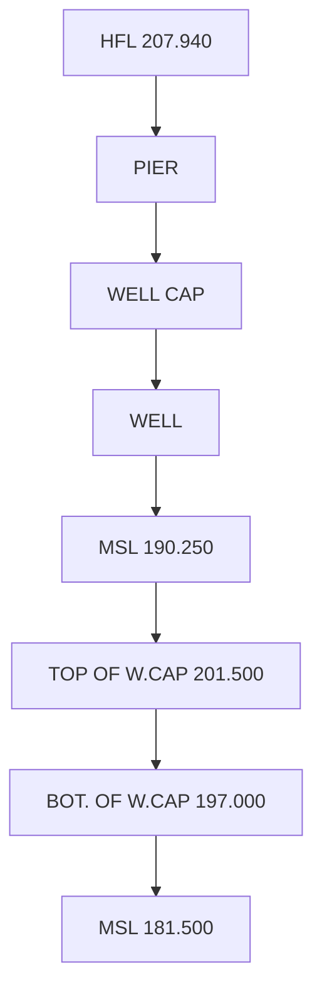

# GUIDELINES

# FOR

# SEISMIC DESIGN OF ROAD BRIDGES

seal

INDIAN ROADS CONGRESS
ESTABLISHED 1934
संन्मार्गत् लोक सेवा

# GUIDELINES FOR SEISMIC DESIGN OF ROAD BRIDGES

Published by:

INDIAN ROADS CONGRESS

Kama Koti Marg,
Sector-6, R.K. Puram,
New Delhi-110 022

MAY, 2018

Price : ₹ 1000/-

(Plus Packing & Postage)

(All Rights Reserved. No part of this publication shall be reproduced, translated or transmitted in any form or by any means without the permission of the Indian Roads Congress)

## CONTENTS

<table><tr><td>S. No.</td><td>Description</td><td>Page No.</td></tr><tr><td colspan="2">Personnel of the Bridges Specifications and Standards Committee</td><td>i-ii</td></tr><tr><td colspan="2">Chapter-1 Preface</td><td>1</td></tr><tr><td colspan="2">Chapter-2 Introduction</td><td>5</td></tr><tr><td>2.1</td><td>General</td><td>5</td></tr><tr><td>2.2</td><td>Scope of Guideline</td><td>5</td></tr><tr><td>2.3</td><td>Relaxation Clauses</td><td>6</td></tr><tr><td>2.4</td><td>General Principles</td><td>6</td></tr><tr><td>2.5</td><td>Seismic Effects on Bridges</td><td>6</td></tr><tr><td>2.6</td><td>Design Philosophy</td><td>7</td></tr><tr><td>2.7</td><td>Definitions &amp; Symbols</td><td>9</td></tr><tr><td colspan="2">Chapter-3 Conceptual Design</td><td>18</td></tr><tr><td>3.1</td><td>General</td><td>18</td></tr><tr><td>3.2</td><td>Site selection</td><td>18</td></tr><tr><td>3.3</td><td>Structural system and configuration</td><td>18</td></tr><tr><td>3.4</td><td>Bearings and expansion joints</td><td>21</td></tr><tr><td>3.5</td><td>Time period of bridge</td><td>22</td></tr><tr><td>3.6</td><td>Structural Ductility and Energy Dissipation</td><td>22</td></tr><tr><td>3.7</td><td>Use of Seismic Devices</td><td>23</td></tr><tr><td colspan="2">Chapter-4 Seismic Induced Forces and Site Conditions</td><td>24</td></tr><tr><td>4.1</td><td>General</td><td>24</td></tr><tr><td>4.2</td><td>Ground Motion (Horizontal and Vertical)</td><td>24</td></tr><tr><td>4.3</td><td>Seismic Zone Map and Design Seismic Spectrum</td><td>27</td></tr><tr><td>4.4</td><td>Soil Structural Interaction, Damping and Soil properties</td><td>27</td></tr><tr><td>4.5</td><td>Importance Factor</td><td>29</td></tr><tr><td>4.6</td><td>Seismic effects on live load combination</td><td>29</td></tr><tr><td>4.7</td><td>Seismic effects on earth pressure &amp; dynamic component</td><td>30</td></tr><tr><td>4.8</td><td>Hydrodynamic forces on Bridge Piers and Foundations</td><td>30</td></tr><tr><td>4.9</td><td>Load combinations under SLS and ULS</td><td>33</td></tr><tr><td colspan="2">Chapter-5 Seismic Analysis Methods</td><td>34</td></tr><tr><td>5.1</td><td>General</td><td>34</td></tr><tr><td>5.2</td><td>Seismic Analysis Methods</td><td>34</td></tr><tr><td>5.3</td><td>Time - History Method</td><td>38</td></tr><tr><td>5.4</td><td>Minimum Design Horizontal Force</td><td>39</td></tr><tr><td>5.5</td><td>Requirements of method of Seismic Analysis</td><td>40</td></tr><tr><td colspan="2">Chapter-6 Seismic Analysis Methods</td><td>41</td></tr><tr><td>6.1</td><td>General</td><td>41</td></tr></table>

6.2 Basic Design Principles 41  
6.3 Seismic Design Aspects 41  
6.4 Design Provisions 42  
6.5 Long span bridges 44  
6.6 Special Types of Bridges 44

## Chapter-7 Seismic Design Method 45

7.1 General 45  
7.2 Force Based Design Method 45  
7.3 Capacity Design 46  
7.4 Structural components to be designed on the basis of capacity design 51  
7.5 Design of Concrete Sections with Ductile Detailing 51  
7.6 Second order effects 54  
7.7 Design of Joints 54  
7.8 General procedure for calculation of capacity design effects 54

## Chapter-8 Design of Bridge Components 57

8.1 General 57  
8.2 Superstructure 57  
8.3 Substructures: Piers and Abutments 57  
8.4 Foundation 59  
8.5 Bearings, Seismic connection & Experience Joints 63

## Chapter - 9 Ductile Detailing of Structures 76

9.1 Ductile Detailing of Reinforced Concrete Structures 76  
9.2 Ductile Detailing of Steel and Steel Composite Structures 78

## Chapter - 10 Seismic Isolation Devices 89

10.1 General 89  
10.2 Seismic Analysis of Structure Incorporating Isolation Devices 90  
10.3 Elastic Seismic Acceleration Method 90  
10.4 Elastic Response Spectrum Analysis 90  
10.5 Time History Analysis 94  
10.6 Vertical Component of Seismic Action 94  
10.7 Properties of Isolation Devices 95  
10.8 Verification of Bridge Sub-structure and Superstructure with 95 Isolating System

## Reference Seismic Codes 98

Appendix A-1 – Illustration of elastic seismic acceleration method 99  
Appendix A-2 – Illustration of elastic response spectrum method 111  
Appendix A-3 – Illustration of Seismic Acceleration Method Preamble 117  
Appendix A-4 – Illustration of hydrodynamic Pressure on Bridge Piers 127  
Appendix A-5 – Illustration of Liquefaction of soil 131

# PERSONNEL OF THE BRIDGES SPECIFICATIONS AND STANDARDS COMMITTEE

(as on 23 $^{rd}$ October, 2017)

1 Kumar, Manoj (Convenor)  
Director General (Road Development) & Special Secretary to Govt. of India, Ministry of Road Transport and Highways, New Delhi  
2 Singh, B.N.
(Co-convenor)  
Additional Director General, Ministry of Road Transport & Highways, New Delhi  
3 Verma, Dr.S.K.
(Member-Secretary)  
Chief Engineer S&R, Ministry of Road Transport & Highways, New Delhi

## Members

4 Alam, Pervez  
Chief Operating Officer, Hindustan Construction Company Ltd.  
5 Arora, D.S.  
Jt. Managing Director (Retd.), UP State Bridge Corporation Ltd.  
6 Banerjee, A.K.  
Member (Technical) (Retd.), National Highway Authority of India  
7 Bansal, Shishir  
Chief Project Manager, Delhi Tourism, DTTDC Ltd.  
8 Basa, Ashok  
Managing Director, CEM Consultant (P) Ltd.  
9 Bhowmick, Alok  
Managing Director, B&S Engineering Consultants Pvt. Ltd., UP  
10 Bordoloi, A.C.  
Commissioner & Spl. Secretary, P.W.B. & N.H. Deptt (Retd.), PWD Assam

11 Chand, Faqir

Advisor, STUP

12 The CMD, Engg. Proj. (I) Ltd.
(Bakshi, S.P.S.)

Engineering Project (India) Ltd., New Delhi

13 The Director General, BRO (Shrivastava, Lt. Gen. S.K)

Border Roads Organization, New Delhi

14 The Director General,
INSDAG (Banerjee, Sushim)

Institute for Steel Development & Growth (INSDAG), Kolkata

15 Dheeraj

Superintending Engineer, Ministry of Road Transport and Highways, New Delhi

16 Dohare, R.D.

Chief Engineer (Retd.), Ministry of Road Transport and Highways, New Delhi

17 The Engineer-in-Chief, MES (Sharma AVSM, Lt. Gen. Suresh)

Military Engineer Service (MES), New Delhi

18 Ghoshal, A.

Principal Advisor, STUP Consultants (P) Ltd. Kolkata

19 Gupta, Dr. Supratic

Asst. Professor, IIT, New Delhi

20 Heggade, V.N.

Vice President, Gammon Engineers & Contractors, Mumbai

21 Khanna, Shobha

Manager, M.P. Metro Rail Corporation

22 Kondai, Bikshapathi

Director General, National Academy of Construction, Hyderabad

23 Kumar, Ashwani

Superintending Engineer, Ministry of Road Transport and Highways, New Delhi

24 Kumar, Satander

Scientist (Retd.), CRRI

<table><tr><td>25</td><td>Pandey, A.K.</td><td>Superintending Engineer, Ministry of Road Transport and Highways, New Delhi</td></tr><tr><td>26</td><td>Pandey, R.K.</td><td>Member (Project), National Highway Authority of India (NHAI), NewDelhi</td></tr><tr><td>27</td><td>Parameswaran, Dr. Lakshmy</td><td>Chief Scientist (BAS), Central Road Research Institute (CRRI), New Delhi</td></tr><tr><td>28</td><td>Patankar, V.L</td><td>DG(RD)&amp;SS (Retd.), Ministry of Road Transport and Highways, New Delhi</td></tr><tr><td>29</td><td>Pateriya, Dr. I.K.</td><td>Director (Technical), National Rural Road Development Agency, New Delhi</td></tr><tr><td>30</td><td>Puri, S.K.</td><td>DG(RD)&amp;SS (Retd.), Ministry of Road Transport and Highways, New Delhi</td></tr><tr><td>31</td><td>Raina, Dr. V.K.</td><td>Consultant, World Bank</td></tr><tr><td>32</td><td>Raizada, Pratap S.</td><td>Senior Vice President, Gammon India Ltd. Mumbai</td></tr><tr><td>33</td><td>Sharan, G.</td><td>DG(RD)&amp;SS (Retd.), Ministry of Road Transport and Highways, New Delhi</td></tr><tr><td>34</td><td>Sharma, R.S.</td><td>Managing Director, M/s STP Ltd., New Delhi</td></tr><tr><td>35</td><td>Shekhar, Saurav</td><td>Director, SA Infra Consultants Pvt. Ltd.</td></tr><tr><td>36</td><td>Sinha, N.K.</td><td>DG(RD)&amp;SS (Retd.), Ministry of Road Transport and Highways, New Delhi</td></tr><tr><td>37</td><td>Srivastava, A.K.</td><td>Chief Engineer, Ministry of Road Transport and Highways, New Delhi</td></tr><tr><td>38</td><td>Subbarao, Dr. Harshavardhan</td><td>Chairman &amp; Managing Director, Construma Consultancy (P) Ltd. Mumbai</td></tr><tr><td>39</td><td>Tandon, Mahesh Prof.</td><td>Managing Director, Tandon Consultants (P) Ltd., New Delhi</td></tr><tr><td>40</td><td>Verma, G.L.</td><td>Managing Director, Engineering &amp; Planning Constructions, New Delhi</td></tr></table>

Corresponding Members

<table><tr><td>1</td><td>Kand, Sunil C.</td><td>Director, C.V Kand Consultant, Bhopal</td></tr><tr><td>2</td><td>Koshi, Ninan</td><td>DG(RD)&amp;SS (Retd.), Ministry of Road Transport and Highways, New Delhi</td></tr><tr><td>3</td><td>Manjure, P.Y.</td><td>Director, Freyssinet Prestressed Concrete Company Ltd (FPCC), Mumbai</td></tr><tr><td>4</td><td>Reddi, Dr. S.A.</td><td>Former JMD GIL</td></tr><tr><td>5</td><td>The Director, SERC, TN</td><td>(Iyer, Prof. Nagesh R)</td></tr></table>

Ex-Officio Members

<table><tr><td>1</td><td>President, Indian Roads Congress</td><td>(Pradhan, N.K.) E-in-C cum Secretary, Works Department, Odisha</td></tr><tr><td>2</td><td>Honorary Treasurer, Indian Roads Congress</td><td>(Kumar, Manoj) Director General (Road Development) &amp; Spl. Secretary, Ministry of Road Transport and Highways</td></tr><tr><td>3</td><td>Secretary General, Indian Roads Congress</td><td>Nirmal, Sanjay Kumar</td></tr></table>

## 1 PREFACE

This Guideline has been prepared by Loads and Load Combinations Committee (B-2) of Indian Roads Congress and finalized in the year 2017.

The draft was considered by the Bridges Specifications and Standards committee (BSS) in its meeting held on 23.10.2017 and approved the document with certain suggestions. The document incorporating the suggestions of BSS committee was placed before the Council in its meeting held on 03.11.2017 at Bengaluru (Karnataka). The Council Approved the Document.

The composition of Loads and Load Combinations Committee (B-2) is as given below:

<table><tr><td>Banerjee, A.K.</td><td>......</td><td>Convenor</td></tr><tr><td>Parameswaran, (Mrs.) Dr. Lakshmy</td><td>......</td><td>Co-Convenor</td></tr><tr><td>Sharma, Aditya</td><td>......</td><td>Member Secretary</td></tr></table>

Members

<table><tr><td>Ahuja, Rajeev</td><td>Mukherjee, M.K.</td></tr><tr><td>Bandyopadhyay, N</td><td>Pandey, Alok</td></tr><tr><td>Bhowmick, Alok</td><td>Pattiwar, Sandeep</td></tr><tr><td>Dhodapkar, A.N.</td><td>Puri, S K</td></tr><tr><td>Garg, Dr Sanjeev</td><td>Rao, M.V.B</td></tr><tr><td>Garg, Sanjay</td><td>Sharan, G</td></tr><tr><td>Gupta, Vinay</td><td>Subbarao, Dr. Harshavardhan</td></tr><tr><td>Huda, Y.S.</td><td>Thakkar, Dr S.K.</td></tr><tr><td>Jain, Sanjay Kumar</td><td>Venkatram, P.G.</td></tr><tr><td>Kanhere, Dr. D.K.</td><td>Verma, G.L</td></tr><tr><td>Mathur, A.K.</td><td>Viswanathan, T</td></tr></table>

Corresponding Members

<table><tr><td>Heggade, V.N</td><td>Kumar, Ashok</td></tr><tr><td>Jain, Dr. Sudhir K</td><td>Murthy, Dr M.V</td></tr><tr><td>Joglekar, S.G.</td><td></td></tr></table>

Ex-Officio Members

<table><tr><td>President, IRC(Pradhan, N.K.)</td><td>DG(RD) &amp; SS MORTH(Kumar, Manoj)</td></tr></table>

Secretary General, IRC

(Nirmal, S.K.)

Many bridges in India have suffered severe damages during earthquakes in the past. Bridges are vital communication links of infrastructure in a road network and should remain operational after an earthquake. In the year 1958, seismic provisions were introduced for the first time, for bridge design in IRC: 6, wherein the country was divided into 4 regions based on the damage likely to occur, i.e., Region1-Epicentral tracts, Region 2- liable to severe damage, Region 3 - liable to moderate damage and Region 4- liable to minor or no damage, and the same provisions continued till 1979. Meanwhile, IS: 1893 came up with a different map with five seismic zones, which was introduced in IRC: 6 during 1981. Also, for computation of seismic force, horizontal seismic coefficient, importance factor and a coefficient to account for different soil and foundation system as given in IS:1893:1970 were introduced in IRC:6. Also, with major highway development programs taken up in the country in the last few decades and increasing frequency of occurrences of earthquakes, particularly, the devastating Bhuj Earthquake in 2001, introduction of interim seismic provisions in IRC: 6 during 2003 was found essential pending finalization of a comprehensive guideline for seismic design of highway bridges. In this interim provision, a new seismic map of India showing four seismic zones (as in IS: 1893 Part 1:2002) along with zone factor was introduced. For computation of seismic force a force based approach was adopted using spectral acceleration (included for three different types of soil), importance factor, dead load and part live load and a single Response Reduction Factor for all bridge components. Also, mandatory provisions were included to prevent dislodgment of superstructure and ductile detailing of piers in line with IS: 13920 to minimize the damage, especially in seismic zones IV and V. Also, to mitigate earthquake forces, special seismic devices such as base isolation bearings, STUs, etc. were recommended. Subsequently, the Interim Seismic provisions, mentioned above, were replaced with new seismic force clause in 2008, which essentially adopted a force based design approach and addressing the issues like- Consideration of simultaneous action of seismic forces acting in three different directions, near field effects, dynamic earth pressure and hydrodynamic forces during earthquake.

Till the year 2011, the bridges were being designed based on working stress approach. Meanwhile there had been rapid developments in state-of-the-art in the area of seismic resistant design of bridges, like capacity design approach, which have been incorporated in many international standards of countries like Japan, USA, New Zealand and Eurocode. Similarly, the bridge design codes in India also witnessed a major change with the introduction of Limit State Design approach for design in IRC: 6, IRC: 112, IRC: 24 and IRC: 22.

During the year 2010, the need was felt to prepare a comprehensive “Guidelines for Seismic Design of Road bridges”, to cater to the requirements of Limit State Design approach, following the NDMA guidelines to follow IS 1893, as mandated to B-2 Committee. The basic framework of this guideline was prepared by Prof. S.K. Thakkar and Members were identified for drafting various Chapters and initial drafting of few chapters were carried out. However, during the 2015- 2017, B-2 Committee focused mainly on completing this guideline and the following subgroup was constituted vide 3 $^{rd}$ , meeting of B2 Committee dated 26 September 2015 and later on inducted two more members vide 5 $^{th}$ & 8 $^{th}$ meetings on 20 $^{th}$ February 2016 & 20 $^{th}$ August 2016 respectively.

• Prof. S.K. Thakkar  
• Dr. Lakshmy Parameswaran  
• Mr. Aditya Sharma  
• Dr. Sanjeev Kumar Garg  
- Mr. Rajiv Ahuja  
- Mr. Vinay Gupta

• Mr. Alok Bhowmick

\- Mr. G.L. Verma

• Mr. Ashok Mathur

The Sub Group conducted 22 meetings to discuss and finalise various chapters which were subsequently sent to main committee for discussion and approval.

This Guideline is essentially applicable for seismic design of bridges with a design service life of 100 years, considering Design Basis Earthquake (DBE). It has adopted the seismic map and spectral acceleration graphs (both for elastic acceleration method and elastic response spectrum method) as specified in IS: 1893-Part-I-2016. It also adopts the method prescribed for evaluation of liquefaction potential, as specified in IS: 1893-Part-I-2016. For the estimation of seismic forces, Elastic Seismic Acceleration method, Elastic Response Spectrum method and Linear Time History method have been specified. The Guideline describes the various types of special investigations to be carried out for bridges to be constructed in near field zones, skew and curved bridges and so on.

The approach adopted for design in this Guideline relies on the principles of capacity design, wherein a strength hierarchy is established in a bridge to ensure that the damage is controllable, i.e., plastic hinges occur only where the designer intends. Also, the ductile detailing of concrete and steel piers have been adequately covered in this Guideline. Also, emphasis is given to prevent dislodgement of superstructure and provisions included in the Guideline accordingly.

This Guideline is organized in ten chapters and five informative Appendices.

In Chapter 2, the Scope, seismic effects on bridges, general principles of earthquake resistant design of bridges, design philosophy and special investigations / analysis to be carried out for different type of bridges are included.

Chapter 3 mainly deals with the aspects to be considered during conceptual design in order to achieve a safe performance of bridges under seismic action. This essentially includes the aspects to be considered during selection of site, structural system and configuration, bearings and expansion joints, structural ductility and energy dissipation and type of seismic devices.

In Chapter 4, details of seismic induced forces in horizontal (both transverse and longitudinal) and vertical direction and their combination, which are to be considered for design, are discussed. As stated above, the seismic zone Map and design seismic spectrum included are same as that in IS: 1893: Part 1:2016. It may be noted that the damping coefficient of 5% has been specified irrespective of whether the structure is made of steel or concrete. Computation of dynamic component of earth pressure and hydrodynamic forces on bridge pier and foundations have been elaborated. Also, the load combinations under ULS and SLS have been discussed. Appendix A-4 includes an illustration of computation of hydrodynamic forces on a bridge pier based on the methodology discussed in this Chapter.

Chapter 5 essentially covers in detail the methods for computation of seismic induced forces using elastic seismic acceleration method, elastic response spectrum method and linear time history analysis method. Also, guidance is provided to select the appropriate analytical method to be adopted, which has been prescribed in Table 5.3. Also, the illustrations of

Elastic Seismic Acceleration method and Elastic Response spectrum method have been included with appropriate examples in Appendix A-1 and A-2.

Chapter 6 deals with the general design provisions for bridge components. For seismic design of the bridge, weak column and strong beam concept has been followed and plastic hinges are allowed to form in bridge piers at predetermined locations. In fact, strength based design approach, amalgamating the force based approach and capacity design principle, has been prescribed in this Guideline for seismic design.

Chapter 7 covers in detail the force based approach, capacity design principles and capacity design steps to be followed and the structural components which are to be capacity protected. Also included are how the plastic hinge regions are to be designed, special confining reinforcement for plastic hinge region, design of portion of pier in between plastic hinge and the connections. As the failure mode of pier can be either, flexure or shear, the minimum shear force to be considered has been duly incorporated. This Chapter is mainly in line with the latest Eurocode provision and illustrative examples are included in Appendix A-3.

Chapter 8 deals with design of various structural components such as superstructure, piers and abutments and foundations under seismic action. Identification of potentially liquefiable soils is emphasized and an illustrative example has been included in Appendix A-5. Provisions for bearings, seismic connections including STU's and expansion joints have been elaborated. The aim of these provisions is essentially to prevent the dislodgement of superstructure by provision of reaction blocks, restrainers, rigid link or tie bars and so on.

As the design approach essentially depends on the ductility of pier, this can be achieved by ductile detailing of concrete and steel pier. Though IRC 112 has a Chapter on ductile detailing, additional provisions have been included in the Guideline for concrete piers. A new addition in this Guideline is the ductile detailing of steel components, as these aspects are not included in any of the IRC steel bridge codes. The ductile detailing provisions are discussed in detail in Chapter 9.

Main focus of Chapter 10 is Seismic Isolation Devices. This Guideline permits the use of seismic isolation bearings for the design of bridges. The use of viscous dampers for seismic protection has been emphasized. Besides, the situations where seismic isolation devices need to be provided, analysis and design of bridge provided with seismic isolation devices are elaborated in this Chapter.

This comprehensive Guideline is intended to benefit the bridge designers for sustainable design of bridges under seismic conditions and suitably for better understanding of the behavior of the bridge structures under seismic condition adopting Limit State Method of design.

After publication of this Guideline, the existing provision for seismic design in Clause 219 of IRC: 6 -2017 stands superseded.

## 2 INTRODUCTION

### 2.1 General

This chapter contains the scope for applications of guideline, relaxation clauses, general principles of seismic design of bridges, seismic effects on bridge structures, special investigations & studies and design philosophy for earthquake resistant design of bridges.

### 2.2 Scope of Guideline

The broad scope and the application of these guidelines is as under:-

1. The provisions of present guidelines are applicable for assessment of earthquake forces and design of new Highway Bridges, River Bridges, Road over Bridges, Road under Bridges, Underpasses, Flyover Bridges, Pedestrian Bridges, Submersible Bridges, and Utility Bridges etc.
2. The guidelines are applicable for bridges with design life up to 100 years and shall be designed for Design Basis Earthquake (DBE) only. Bridges having design life more than 100 years are not covered under these guideline.
3. The methodology of estimation of seismic forces given in these guidelines can be adopted for seismic evaluation of existing bridges and retrofitting of existing structures
4. The provisions of these guidelines are for earthquake resistant design of regular bridges in which the seismic actions are mainly resisted through flexure of piers and abutments i.e. bridges composed of vertical abutment/pier-foundation system supporting the deck structure with or without bearings.
5. Bridges having complex geometry and situated at locations requiring special investigations & detailed studies have also been covered under these guidelines.
6. Ductile detailing is part of these guidelines.
7. The present guidelines also cover the seismic design of the bridges with seismic isolation devices.
8. The hydro dynamic effect of water on submerged substructure and method of assessment of liquefaction assessment of soil is also included in these guidelines.
9. The earthquake resistant design due to ground motion effects has been included in these guidelines. The ground surface rupture, tsunami, landslides and near-field effects of earthquake hazards are not included in these guidelines.

### 2.3 Relaxation Clauses

i. Culverts and minor bridges up to 10m length in all seismic zones need not be designed for seismic effects.  
ii. Bridges in seismic zones II and III satisfying both limits of total length not exceeding 60 m and individual simply supported spans not exceeding 15 m need not be designed for seismic effects.  
iii. The dynamic earth pressures on abutments during earthquakes shall not be considered in Zones II and III.

### 2.4 General Principles

The following general principles shall be followed in earthquake resistant design of bridges:

i. The bridge should be designed for DBE/MCE according to the design philosophy specified in the guidelines, using limit state design procedure employing Force Based Method of seismic design and response reduction factors. The Force Based Design should meet the design philosophy and the principles of capacity design should be followed to protect the structure from collapse.  
ii. In case site specific spectra is used, the minimum values of seismic forces and displacements in the structure shall not be smaller than those arrived at from the code response spectrum.  
iii. The scour to be considered during seismic design shall be based on average of yearly maximum design floods. The average may preferably be based on consecutive 7 years' data. In any case, the scour depth to be considered for design during seismic shall not be less than 0.9 times the maximum design scour depth.  
iv. The earthquake accelerations should be applied to full mass in case of submerged structures and not on buoyant mass.  
v. The seismic force on live load in bridges should not be considered in longitudinal direction. The seismic force on live load should be considered on reduced live load in transverse direction.  
vi. The earthquake accelerations on embedded portion of bridge foundation should be reduced as explained in Chapter 4

### 2.5 Seismic Effects on Bridges

The seismic effects on bridges can be classified as (i) Seismic displacements (ii) Pier failure (iii) Expansion Joint failure (iv) bearing failure (vi) Abutment slumping and (vii) foundation failure, (viii) Partial and complete collapse of bridges due to soil liquefaction.

In horizontally curved superstructure, transverse movement of superstructure translates into longitudinal movement at a joint, which could lead to unseating of deck. In skewed bridges, the centre of mass usually does not coincide with centre of stiffness, which causes rotation of superstructure and large displacements at supports. Also, bridges with large skew angle could rotate and unseat the superstructure under seismic action.

Under earthquake action the bridge decks are subjected to transverse or longitudinal displacement depending on the direction of earthquake. In some situations when sufficient bearing seat width is not provided, the unseating of deck take place. The asynchronous movement of two adjoining spans during earthquake leads to pounding action and cause damage to deck /beam ends, if adequate separation gaps are not provided.

Bridge piers designed without ductile detailing are prone to spalling of cover concrete, buckling of longitudinal reinforcement and crumbling of core concrete. Effect of vertical acceleration, in near field region, often changes the failure mode of bridge pier from flexure to shear. Shear failure of bridge piers may be due to inadequate or no ductile detailing or improper/ premature curtailment of longitudinal reinforcement or design not based on capacity design methods.

Expansion joints are subjected to compression or tension failure during earthquake. When superstructure is subjected to substantial lateral and longitudinal force during earthquake, it can lead to failure of bearing or of connections to substructure.

During earthquake slumping of abutment fill and rotation of abutments occur in case the abutment fill is incompletely consolidated. Abutment back wall may get damaged due to superstructure impact. When bridges are founded on soft or liquefiable soils, amplification of structural vibration response under seismic action had resulted in unseating of bridge deck, especially in simply supported spans.

### 2.6 Design Philosophy

i. Under Design Basis Earthquake (DBE), a moderate earthquake, which may occur more frequently in the life of a structure; the bridge should be able to withstand earthquake with minor structural damage.  
ii. Under Maximum Considered Earthquake (MCE), a large earthquake, which may occur once in the life of a structure; the bridge may be subjected to significant structural damage but not collapse. The damage should be readily accessible for inspection and repair.  
iii. The bridges with design life of up to 100 years may be designed for DBE only. The bridges with design life of more than 100 years may be designed both for DBE and MCE.

#### 2.6.1 Special Investigations and Detailed Studies

##### 2.6.1.1 Special Investigations:

Detailed seismic studies shall be required under following situations:

i. Bridges with individual span length more than 150 m.  
ii. Bridges with pier height more than 30 m in zone IV and V.

iii. Cable supported bridges, such as extradosed, cable stayed and suspension bridges.  
iv. Arch bridges having more than 50 m span.  
v. Bridges using innovative structural arrangements and materials.  
vi. Where bridge is located in the near field that is the bridge site is within 10 km of known active tectonic fault.  
vii. Geological discontinuity exists at the site.  
viii. Site with loose sand or poorly graded sands with little or no fines, liquefiable soil.  
ix. Special types of bridges: Bascule Bridge, Horizontally Curved Girder Bridge having ≤ 100m radius, Bridge with high skew- ≥ 30 degree, seismically isolated bridges, Bridges with Passive Dissipating Devices (PED), Bridges with Shock Transmission Unit (STU), Bridges with Innovative Designs.

##### 2.6.1.2 Detailed Seismic Studies

For specific cases of bridges, some additional studies/analysis should be required, which are described in Table 2.1.

<table><caption><b>Table 2.1 &nbsp;Cases Requiring Special Studies and Analysis</b></caption><tr><td>Sr</td><td>Cases in which additional special studies/analysis is required</td><td>Special studies/analysis</td></tr><tr><td>1</td><td>Bridges with individual span length more than 150 m and/or pier height is more than 30 m in zone IV and V.Cable supported bridges, such as extradosed, cable stayed and suspension bridgesArch bridges having more than 50 m span</td><td>Use of Site specific response spectrum of the bridge including geometrical nonlinearity, P-delta effect and soil structure interaction is needed. Dynamic analysis may be done to ascertain the energy dissipation characteristics of ductile members.</td></tr><tr><td>2</td><td>Continuous bridge of length between expansion joint larger than 600 m in all seismic zones. Geological discontinuities or marked topographical features are present</td><td>Spatial variation of ground motion shall be considered.</td></tr><tr><td>3</td><td>Bridge site close to a fault (&lt; 10 km) which may be active in all seismic zones.</td><td>The information about the active faults should be sought by bridge authorities for projects situated within 100 km of known epicenters as a part of preliminary investigations at the project preparation stageHelp from geological / seismological expert with enough experience will be required to calculate fault movement.</td></tr><tr><td>4</td><td>In zone IV and V, if the soil condition is poor, consisting of marine clay or loose sand with little or no fines (e.g., where the soil up to 30 m depth has average SPT N value equal to or less than 20)</td><td>Site specific spectrum shall be obtained.</td></tr><tr><td>5</td><td>Site with loose sand or poorly graded sands with little or no fines, liquefiable soil in all seismic zones.</td><td>Liquefaction analysis is required (Details given Appendix A-5).</td></tr><tr><td>6</td><td>Horizontally Curved Bridge having ≤ 100 m radius, Bridge with high skew-≥ 30 degree in all seismic zones</td><td>Carry out three dimensional Modelling including substructure and foundations of bridge considering skew angle. Torsional motions of the bridge about a vertical axis under seismic action shall be considered. Possibility of unseating of bridge deck about acute corner to be checked and ruled out. In single span bridges Bearings shall be designed to resist torsional effects</td></tr>
</table>

\*\* For type of analysis under above conditions, reference to Table 5.2 shall be made

### 2.7 Definitions & Symbols

#### 2.7.1 Definitions

**1. Asynchronous motion:**

Spatial variability of the seismic action means that the ground motion at different supports of the bridge is different and as a result the definition of seismic action cannot be based on the characterization of ground motion at a single point, as is usually the case.

**2. Base:**

The level at which inertial forces generated in the substructure and superstructure are transferred to the foundation.

**3. Capacity Design:**

The design procedure used in structures designed to achieve of ductile behaviour to secure the hierarchy of strengths of various structural components necessary for leading to intended configuration of plastic hinges and for avoiding brittle failure modes.

**4. Centre of Mass:**

The point through which the resultant of the masses of a system acts. This point corresponds to the centre of gravity of the system.

**5. Connection:**

A connection is an extension of area of the member into the adjoining member.

**6. Critical Damping:**

The minimum damping above which free vibration motion is not oscillatory.

**7. Damping:**

The effect of internal friction, imperfect elasticity of material, slipping, sliding, etc., responsible in reducing the amplitude of vibration and is expressed as a percentage of critical damping.

**8. Design Seismic Force:**

The seismic force prescribed by this standard for each bridge component that shall be used in its design. It is obtained as the maximum elastic seismic force divided by the appropriate response reduction factor specified in this standard for each component.

**9. Design Seismic Force Resultant :**

The force resultant (namely axial force, shear force, bending moment or torsional moment) at a cross-section of the bridge due to design seismic force for shaking along a considered direction applied on the structure.

**10. Ductility:**

Ductility of a structure, or its members, is the capacity to undergo large inelastic deformations without significant loss of strength or stiffness.

**11. Ductile Detailing:**

The preferred choice of location and amount of reinforcement in reinforced concrete structures to provide for adequate ductility in them. In steel structures, it is the design of members and their connections to make them adequately ductile.

**12. Acceleration Response Spectrum:**

A plot of horizontal acceleration value, as a fraction of acceleration due to gravity, versus natural period of vibration T used in the design of structures.

**13. Importance Factor I:**

The coefficient for achieving the level of seismic design force which represents importance of structure in case of seismic activities.

**14. Linear Elastic Analysis:**

Analysis of the structure considering linear properties of the material and of the load Versus deformation of the different components of the structure.

**15. Liquefaction:**

Liquefaction is the state in saturated cohesionless soil wherein the effective shear strength is reduced to negligible value for all engineering purposes due to rise in pore pressures caused by vibrations during an earthquake when they approach the total confining pressure. In this condition the soil tends to behave like a fluid mass.

**16. Maximum Elastic Force Resultant :**

The force resultant (namely axial force, shear force, bending moment or torsional moment) at a cross-section of the bridge due to maximum elastic seismic force for ground shaking along a considered direction applied on the structure.

**17. Maximum Elastic Seismic Force:**

The maximum force in the bridge component due to the expected seismic shaking in the considered seismic zone obtained using elastic response spectrum.

**18. Modes of Vibration: (see Normal Mode)**

**19. Modes Participation Factor $P_{k}$ :**

Combination of mode k of vibration of the bridge participates when subjected to base excitation, equal to

$$
\frac {\sum_ {c = 1} ^ {n} m i \varnothing_ {i} ^ {k}}{\sum_ {c = 1} ^ {n} m i \left(\varnothing_ {i} ^ {k}\right) ^ {2}}
$$

**20. Natural Period T:**

Natural period of a structure is its time period of undamped vibration.

**21. Fundamental Natural Period $T_{1}$ :**

It is the highest modal time period of vibration along the considered direction of earthquake motion.

**22. Modal Natural Period $T_{k}$ :**

The modal natural period of mode k is the time period of vibration in mode k.

**23. Normal Mode:**

Mode of vibration at which all its masses attain maximum values of displacements and rotations simultaneously, and they also pass through equilibrium positions simultaneously.

**24. Over Strength:**

Strength considering all factors that may cause an increase, e.g., steel strength being higher than the specified characteristic strength, effect of strain hardening in steel with large strains, concrete strength being higher than specified characteristic value, rounding off steel reinforcement and redundancy in the structure.

**25. Principal Axes:**

Principal axes of a structure are two mutually perpendicular horizontal directions in plan of a structure along which the geometry of the structure is oriented.

**26. Response Reduction Factor R:**

The factor by which the elastic lateral force shall be reduced to obtain the design lateral force in components.

**27. Response Spectrum:**

It is a representation of the maximum response of idealized single degree of freedom systems of different periods for a fixed value of damping, during an earthquake. The maximum response is plotted against the undamped natural period and for various damping values, and can be expressed in terms of maximum absolute acceleration, maximum relative velocity or maximum relative displacement.

**28. Seismic Mass:**

Seismic weight divided by acceleration due to gravity.

**29. Seismic Weight W:**

Total dead load plus portion of live load as per relevant clause of IRC:6.

**30. Strength:**

The usable capacity of a structure or its members to resist the applied loads.

**31. Stiffness of Piers:**

The force required to produce unit deformation in the top of pier under a lateral load applied at its top.

**32. Zone Factor Z:**

A factor to obtain the design spectrum depending on the perceived seismic risk of the zone in which the structure is located. This factor applies to maximum considered earthquake.

#### 2.7.2 Symbols

The symbols and notations given below apply to provisions of this standard. The units used for the items covered by these symbols shall be consistent throughout, unless specifically noted otherwise.

| Symbol | Description |
| --- | --- |
| C | Bridge Flexibility Factor |
| I | Importance Factor |
| $P_k$ | Modes Participation Factor |
| T | Natural Period |
| $T_1$ | Fundamental Natural Period |
| $T_k$ | Modal Natural Period |
| W | Seismic Weight |
| S | Soil Profile Factor |
| Z | Zone Factor |
| $r_1$ | Force Resultant due to full design seismic force along x direction |
| $r_2$ | Force Resultant due to full design seismic force along z direction |
| $r_3$ | Force Resultant due to full design seismic force along vertical direction |
| $T_v$ | Fundamental Time Period |
| m | Mass per unit length |
| l | Span in metres |
| EI | Flexural Rigidity |
| F | Total Horizontal Force |
| $C_e$ | Coefficient as a function of ratio of height of submerged portion of pier (H) to Radius of enveloping cylinder  $R_e$ |
| $C_1 C_2 C_3 C_4$ | Pressure coefficients to estimate flow load due to stream on the substructure |
| $M_a$ | Mass of water per unit pier height |
| ρ | Water density |
| $R_e$ | Radius of enveloping cylinder |
| $F_h$ | Horizontal seismic force to be resisted |
| $A_h$ | Design seismic horizontal coefficient |
| $S_a$ | Design acceleration coefficient for different soil types |
| $V_c$ | Design shear |
| $M_c$ | Design moment |
| $N_c$ | Design axial force |
| $M_o$ | Over-strength Moment |
| $\gamma_o$ | Over-strength factor |
| $\eta_k$ | Normalised axial force |
| $N_{Ed}$ | Axial Force at plastic hinge location |
| $A_c$ | Area of Cross section |
| $f_{ck}$ | Characteristic concrete cube strength |
| $M_E$ | Design Moment in the seismic design situation at plastic hinge location |
| h | Clear height of the column |
| $\gamma_{of}$ | Magnification factor for friction due to ageing effects |
| $R_{df}$ | Maximum design friction force of the bearing |
| $M_{Ed}$ | Design moment under seismic load combination, including second order effects |
| $M_{Rd}$ | Design flexural resistance of the section |
| $V_{ed}$ | Maximum value of shear under the seismic combination |
| $a_s$ | $L_s/h$  is the shear span ratio of the pier |
| $L_s$ | Distance from the plastic hinge to the point of zero moment |
| $d_{Ed}$ | Relative transverse displacement |
| $\Delta M$ | Increase of the moments of the Plastic Hinges |
| $\Delta A_c$ | Variation of action effects of the plastic mechanism |
| $M_G$ | Values due to permanent actions |
| $A_G$ | Permanent action effects |
| $V_s$ | Shear wave velocity |
| $PI$ | Plasticity Index |
| $N$ | Standard Penetration number |
| $L_{ov}$ | Minimum overlap length |
| $I_m$ | Minimum support length |
| $d_{eg}$ | Effective displacement |
| $d_g$ | Design Value of peak ground displacement |
| $L_g$ | Distance beyond which ground motion is taken as uncorrelated |
| $a_g$ | Ground Acceleration |
| $T_c$ | Upper part of the period of the constant part of the spectral acceleration |
| $d_{es}$ | Effective seismic displacement of the support due to deformation of the structure |
| $d_{Ed}$ | Total longitudinal design seismic displacement |
| $d_E$ | Design seismic displacement |
| $d_T$ | Displacement due to thermal movements |
| $\psi_2$ | Combination factor for quasi-permanent value of thermal action |
| $d_y$ | Yield deflection of supporting element |
| $Q$ | Weight of the section of the deck linked to a pier or abutment, or in case of two deck sections linked linked together, the lesser of the two weights |
| $U$ | Resulting vertical force |
| $D$ | Dead load reaction |
| $S_{T1}$ | Distance between Stirrups legs or Cross-Ties |
| $S_{T2}$ | Distance between Stirrups legs or Cross-Ties |
| $P_r$ | Required compressive strength of the member |
| $P_{d}$ | Design axial compressive strength (without elastic buckling) |
| $A_{f}$ | Area of flange in the smaller connected column |
| $\theta_{p}$ | Beam deflection at mid span |
| $L$ | Span of beam |
| $t$ | Thickness of column web or doubler plate |
| $d_{p}$ | Panel-zone depth between continuity plate |
| $b_{p}$ | Panel-zone width between column flanges |
| $\Sigma M_{pc}$ | Sum of the Moment capacity in the column above and below the beam centreline |
| $\Sigma M_{pb}$ | Sum of the moment capacity in the beams at the intersection of the beam and column centrelines |
| $T_{eff}$ | Effective time period |
| $\xi_{eff}$ | Effective damping |
| $M_{d}$ | Mass of the superstructure |
| $n_{eff}$ | Effective damping correction factor |
| $d_{cd}$ | Design displacement of isolation system |
| $S_{e}$ | Spectral acceleration corresponding to  $T_{eff}$ |
| $T_{c}$ | Upper limit of the time period of the constant spectral acceleration branch |
| $T_{D}$ | Value defining the beginning of the constant displacement response range of the spectrum |
| $K_{si}$ | Displacement stiffness |
| $K_{ti}$ | Translation stiffness |
| $K_{fi}$ | Rotation stiffness |
| $K_{bi}$ | Effective stiffness |
| $K_{eff}$ | Composite stiffness |
| $H_{i}$ | Height of pier |
| $d_{id}$ | Displacement of superstructure at pier ‘i’ |
| $e_{x}$ | Eccentricity in the longitudinal direction |
| $r$ | Radius of gyration of the deck mass about the vertical axis through its centre of mass |
| $x_{i}$  and  $y_{i}$ | Coordinates of pier I relative to the effective stiffness centre |
| $K_{yi}$  and  $K_{xi}$ | Effective composite stiffness of isolation device unit and pier I, in y and x directions, respectively |
| $d_{cf}$ | Design displacement |
| $V_{f}$ | Shear force transferred through the isolation system |
| $y_{IS}$ | Amplification factor |
| $F_{max}$ | Maximum inertial force of the superstructure |
| $\xi_{b}$ | Contribution of the dampers to the effective damping  $\xi_{eff}$ |
| $C_{j}$ | Fraction of missing mass for  $j^{th}$  mode. |
| $D_{k}$ | Diameter of core measured to the outside of the spiral or hoops |
| $d_{i}$ | Thickness of any layer  $i$ |
| $E_{c}$ | Modulus of elasticity of concrete |
| $E_{s}$ | Modulus of elasticity of steel |
| $f_{ck}$ | Characteristic strength of concrete at 28 days in MPa |
| $f_{y}$ | Yield stress of steel |
| $g$ | Acceleration due to gravity |
| $Lm$ | Number of modes of vibration considered |
| $m_{j}$ | Total mass of the  $j^{th}$  mode, |
| $\overline{NP}_{k}$ | Modal participation factor of mode k of vibration |
| $P_{b}$ | Pressure due to fluid on submerged superstructures |
| $R$ | Response Reduction Factor |
| $\frac{S_{a}}{g}$ | Bridge flexibility factor along the considered direction |
| $\left( \frac{S_{a}}{g} \right)_{k}$ | Bridge flexibility factor of mode k of vibration |
| $T_{1}$ | Fundamental natural period of vibration of bridge in considered direction |
| $T_{k}$ | Natural Period of Vibration of mode k |
| $U$ | Vertical force at support due to seismic force |
| $u(s)=$ | Displacement at position s caused in the acting direction of inertial force when the force corresponding to the weight of the superstructure and substructure above the ground surface for seismic design is assumed to act in the acting direction of inertial force |
| $V$ | Lateral Shear Force |
| $W_{e}$ | Weight of water in a hypothetical enveloping cylinder around a substructure |
| $W(s)=$ | Weight of the superstructure and substructure at position s |
| $\delta$ | Displacement at the acting position of inertial force of the superstructures when the force corresponding to 80% of the weight of the substructure above the ground surface for seismic design and all weight of the superstructure portion supported by it is assumed to act in the acting direction of inertial force (m). |
| $\beta$ | Ratio of natural frequencies of modes  $i$  and  $j$ |
| $\{ \varphi_{k} \}$ | Mode shape vector of the bridge in mode k of vibration |
| $\varnothing_{kj}$ | Mode shape coefficient for  $j^{th}$ , degree of freedom in  $k^{th}$  mode of vibration |
| $\lambda$ | Net response due to all modes considered. |
| $\lambda_{k}$ | Response in mode k of vibration. |
| $\lambda^{*}$ | Maximum response due to closely-spaced modes |
| $\lambda^{missing}$ | Maximum response of missing mass |
| $\rho_{ij}$ | Coefficient used in combining modal quantities of modes i and j by CQC Method |
| $\omega$ | Natural Frequency of structure |

## 3 CONCEPTUAL DESIGN

### 3.1 General

The chapter generally deals with the aspects to be considered during conceptual design for safe performance of bridges under seismic action. This includes the criteria for site selection, selection of bridge structural configuration based on seismic behaviour, choice of articulation system such as bearing and expansion joints, effect of time period on design of bridges & structural ductility and energy dissipation

### 3.2 Site Selection

While finalising the bridge site, apart from other considerations, seismic vulnerability needs to be taken into account. The preferred bridge sites from consideration of seismic hazard is the one which is not near active faults, where the soil do not have potential for liquefaction and where stiff and stable soil is available to provide required resistance against the forces generated due to earthquake. The site prone to landslide should be preferably avoided. These considerations are to be followed as far as practicable and in case these are not possible to be adhered to, mitigating measures are to be taken the bridges in Zones IV and V should be founded preferably on rock, firm alluvium or stable soil layers.

### 3.3 Structural System and Configuration

#### 3.3.1 Preferred Structural Configuration

The preferred structural system and configuration from seismic behaviour considerations are given in the table below, along with the non-preferred types, for which special design and detailing are required.

<table><caption><b>Table 3.1 &nbsp;Structural System & Configuration based on Seismic Behaviour</b></caption><tr><td>S. No.</td><td>Seismically preferred</td><td>Seismically not preferred</td></tr><tr><td rowspan="2">1.0</td><td colspan="2">Superstructure</td></tr><tr><td>1. Integral Bridges. (Helps to avoid unseating of the superstructure from support and also improves seismic response due to high redundancy)2. Right Bridges or Bridges with mild curvature, small skews (i.e. radius of Curvature ≥ 100 m &amp; Skew ≤ 30°). (Right Bridges provides a direct load path with predictable response under seismic loads. Bridges with sharp curvature and large skew angles experience larger and unpredictable deformations, which in turn, results in larger ductility demands and also imparts torsional effects);3. Continuous Bridges (Helps to avoid unseating of the superstructure from support in longitudinal direction)4. Lighter Superstructure with low seismic mass (Reduces the seismic demand for substructure and foundation design)</td><td>1. Suspended Spans resting on Cantilever arms (Connection is subjected to large unpredicted displacement and rotations)2. Superstructure with high seismic mass.</td></tr><tr><td>2.0</td><td colspan="2">Substructure</td></tr><tr><td></td><td>1. Multiple column bent for substructure are preferable because their redundancy and ability to produce ductile behaviour2. Adjacent Piers of near equal heights and near equal stiffness (i.e. Variation in stiffness ≤ 25%). (Stiffness irregularities cause concentration of seismic shear forces in the shorter columns, which may cause brittle shear failure)3. Piers of such shapes where plastic hinge will form at the top of foundation (Helps to restrict the damage to inspectable portion above ground only, during a seismic event)</td><td>1. Plate Type Piers (Very large difference in stiffness in two orthogonal directions)2. PCC and Masonry Piers in Seismic zone IV and V3. Piers with such shapes, where plastic hinge is likely to form at intermediate height. (Causes large shear force in substructure for formation of plastic hinge)4. Piles extended up to pier cap without pile cap and without reduction in pile size above ground5. Piers with flares near top and bottom in case of portal structure</td></tr><tr><td>3.0</td><td colspan="2">Bearings and Expansion Joints &amp; Seismic Devices</td></tr><tr><td></td><td>1. Bearings with high damping characteristics to dissipate energy (i.e. High Damping Elastomeric Bearings and Lead Rubber Bearings, friction pendulum bearings which reduces seismic demand in substructure and foundation).2. Bearings where vertical load bearing mechanism is segregated from lateral load resisting mechanism (Ensures predictable response of the bearings under seismic event) e.g. Pot cum PTFE bearings.3. Detailing where adequate gap at Expansion Joints are provided to cater for seismic movements. (To avoid pounding of deck).4. Bearing Design to ensure structural integrity and avoidance of unseating of structure under extreme seismic displacements, considering out of phase movements wherever applicable.5. Use Seismic devices (like STU's, Viscous Dampers, LRB's to improve seismic performance of Bridges (As it reduces seismic demand)</td><td>1. Metallic Rocker and Rocker-cum-Roller bearings in Seismic zone IV and V (Rigidity of bearings increases seismic demand).</td></tr><tr><td>4.0</td><td colspan="2">Foundations</td></tr><tr><td></td><td>1. Foundation type preferred which adds to flexibility to the system and increases time period.</td><td></td></tr>
</table>

3.3.2 Masonry and plain concrete arch bridges with spans more than 10m shall be avoided in seismic zones IV and V and in ‘Near Field Region’

### 3.4 Bearings and Expansion Joints

#### 3.4.1 General Requirements:

Horizontal actions on the deck shall be transmitted to the supporting members through the structural connections which may be monolithic (e.g. in case of integral bridges), or through bearings. Seismic stoppers / Seismic links may be used to transmit the entire design seismic action, provided dynamic shock effects are mitigated and properly taken into account.

When seismic links / stoppers are used to transmit seismic actions, they should allow non-seismic displacements of the bridge without transmitting any significant loads to the substructure and foundation on this account.

When seismic links / stoppers are used, elastomeric bearings placed vertically shall be used in between the stoppers and the Superstructure to mitigate the dynamic effects. The behaviour of the structure as a whole needs to be modelled properly in the analysis, duly taking into account the force-displacement relationship of the linked structure.

#### 3.4.2 Bearings:

Function of a bearing is to transfer the vertical and lateral loads from Superstructure to the foundation through substructure, fulfilling the design requirements and allowing the displacements and rotations as required by the structural analysis with very low resistance during the whole life time. The bearings are generally of following types:

1. Metallic Rocker and Roller-cum rocker type rigid bearings, where the load transmission is through linear knife edges.
2. Pot cum PTFE Bearings / Spherical Bearings of rigid type with Fixed or Free Sliding arrangement where load transfer from superstructure is over a specified area in plan.
3. Flexible Elastomeric bearings where the bearing allows relative movements between superstructure and substructure by its flexibility and by preventing the transmission of harmful forces, bending moments and vibrations.

While the Rigid bearings specified in a) and b) above can be used under any circumstances, following the provisions of relevant IRC codes, following guidelines are recommended in case of elastomeric bearings :

Elastomeric Bearings can be used with following possible arrangements:

i. Elastomeric Bearings provided on individual supports to transfer vertical loads and nonseismic lateral loads and to accommodate imposed deformations and translations. Seismic actions are transferred to substructure by lateral connections (monolithic or through pin bearings/guided bearings) of the deck to other supporting members (piers or abutments).

ii. On all or individual supports, with the same function as in (i) above, combined with seismic links / seismic stoppers which are designed to resist seismic actions.  
iii. On all supports to resist both seismic as well as non-seismic actions. In this case the seismic response of substructure and Superstructure shall remain essentially elastic and therefore response reduction factor for design shall be considered as 1.

In case of Elastomeric Bearing use with arrangements as in (i) and (ii) above, the normal low damping elastomeric bearings (i.e. damping ratio less than 0.06 can be used).

In case of elastomeric bearings used with arrangements as in (iii), these bearings shall be designed as ‘isolation bearings. Low damping bearing can also be used as isolation bearing for which reference can be made to IRC:83. For use of high damping bearing reference to Chapter 8 shall be made.

#### 3.4.3 Expansion Joints:

The design expansion gap to be provided at the expansion joint, shall be adequate to ensure damage tolerant structure under a design seismic event. Parts of the bridge susceptible to damage by their contribution to energy dissipation during the design seismic event should be designed in a manner aiming at enabling the bridge to be used by emergency traffic, following the seismic event and at easily repairable damages.

### 3.5 Time Period of Bridge

i. It is preferable to design bridges in zones IV and V in such a way that fundamental period falls in most favourable range in both longitudinal and transverse directions such that the seismic demands are smaller both in the structure and foundation.  
ii. Various methods to enhance time periods of piers may be explored such as using framed substructure, cantilever piers with near equal stiffness in two principal directions and use of seismic isolation bearings.  
iii. For computing time period, due consideration shall be given to the flexibility available to the bridge from pile/well foundation due to soil structure interaction for maximum and no scour condition. The consideration of flexibility leads to longer period of vibration of substructure resulting in reduced seismic demand.

### 3.6 Structural Ductility and Energy Dissipation

Seismic design of bridge is generally achieved by providing adequate strength and ductility of substructure. The energy dissipation takes place due to inelastic behaviour of pier. The location of plastic hinge should be predetermined and the required flexural strength of the plastic hinge shall be obtained using capacity-based design approach.

RCC/PSC substructure shall be designed as under reinforced and adequately detailed to avoid premature failure due to shear and bond. Plastic hinge regions shall be provided with close spaced transverse stirrups to confine the compressed concrete within the core region and to prevent buckling of longitudinal reinforcement.

In steel substructure, the compression zones require detailing to avoid premature buckling and joints require proper detailing to ensure overall ductile behaviour of the structure.

### 3.7 Use of Seismic Devices

Special devices such as Shock Transmission Units (STU's), seismic isolation bearings and viscous dampers offer feasible solutions for seismic resistant design of bridges.

Multi span bridges, with continuous superstructure, are generally provided with fixed bearing over one pier or abutment. In order to distribute the seismic force generated by superstructure to other piers/abutments STU's may be used between superstructure and other piers/abutments where free bearings are used.

Seismic isolation devices/ bearings are provided in multi span continuous bridges which are rigid or stiff with time period less than 1.0 seconds, founded on firm soil strata, to reduce the seismic demand by enhancing the time period and increasing the damping.

Viscous dampers are used to connect the structural members both in longitudinal and transverse direction. They help in dissipating the seismic energy and thereby reduce the displacement. For seismic devices Chapter-10 shall be referred for more details.

## 4 SEISMIC INDUCED FORCES AND SITE CONDITIONS

### 4.1 General

The chapter primarily cover the seismic induced forces in horizontal and vertical direction and their combination. The chapter includes seismic zone map, design seismic spectrums which are same as that of IS: - 1893-Part-I-2016, response reduction factor R, importance factor, effects of soil structure interaction and hydrodynamic forces on bridge piers and foundations.

### 4.2 Ground Motion (Horizontal and Vertical)

The horizontal ground motions in longitudinal and transverse directions of bridge cause most damaging effects in earthquakes. The vertical motion in bridge can arise due to vertical ground motion and vertical motion in cantilever spans arising due to horizontal motion of piers. The effect of vertical ground motions is important in bridges with long spans, prestressed concrete spans, bridges with long horizontal cantilevers and where stability is the criteria of design. The vertical ground motions can be quite significant in near field earthquakes.

#### 4.2.1 Components of Ground Motion

The characteristics of seismic ground motion expected at any location depend upon the magnitude of earthquake, depth of focus, distance of epicenter and characteristics of the path through which the seismic wave travels. The random ground motion can be resolved in three mutually perpendicular directions. The components are considered to act simultaneously, but independently and their method of combination is described in Section 4.2.2

In zones IV and V the effects of vertical components shall be considered for all elements of the bridge. However, the effect of vertical component may be omitted for all elements in zone II and III, except for the following cases:

(a) prestressed concrete superstructure  
(b) bearings and linkages  
(c) horizontal cantilever structural elements  
(d) for stability checks and  
(e) bridges located in the near field regions

#### 4.2.2 Combination of Component Motions

The seismic forces shall be assumed to come from any horizontal direction. For this purpose two separate analyses shall be performed for design seismic forces acting along two orthogonal horizontal directions. The design seismic force resultants (i.e. axial force, bending moments, shear forces, and torsion) at any cross-section of a bridge component resulting from the analyses in the two orthogonal horizontal directions $(x,z)$ shall be combined as below:

1. $\pm r_{1}\pm0.3r_{2}$
2. $\pm0.3r_{1}\pm r_{2}$

Where,

$r_{1}=$ Force resultant due to full design seismic force along x direction.

$r_{2}=$ Force resultant due to full design seismic force along z direction.

When vertical seismic forces are also considered, the design seismic force resultants at any cross section of a bridge component shall be combined as below:

1. $\pm r_{1}\pm0.3r_{2}\pm0.3r_{3}$
2. $\pm0.3r_{1}\pm r_{2}\pm0.3r_{3}$
3. $\pm0.3r_{1}\pm0.3r_{2}\pm r_{3}$

Where,

$r_{1}$ and $r_{2}$ are as defined above and $r_{3}$ is the force resultant due to full design seismic force along the vertical direction.

Note: The earthquake motion have been combined for all cases irrespective of whether structure is orthogonal/skew/curved/irregular.

#### 4.2.3 Vertical component of Seismic action

Analysis for vertical seismic action requires time period of superstructure in vertical direction. Time period for the superstructure has to be worked out separately using the property of the superstructure, in order to estimate the seismic acceleration coefficient ( $S_{a}/g$ ) for vertical acceleration. It can be obtained by free vibration analysis of superstructure using standard structural analysis software. However, for simply supported superstructure with nearly uniform flexural rigidity, the fundamental time period $T_{v}$ , for vertical motion can be estimated using the expression:

$$
T _ {v} = \frac {2}{\pi} l ^ {2} \sqrt {\frac {m}{E I}}
$$

Eq. 4.1

Where,

l is the span metres, m is the mass per unit length (N-m), and EI is the flexural rigidity of the superstructure in $N-m^{2}$ .

EI may be estimated for simply supported span as (I³/48 ▲), where ▲ is deflection of span due unit point load applied on it.

The seismic zone factor for vertical ground motions may be taken as two-thirds of that for horizontal motions.

#### 4.2.4 Design Forces for elements of Structures and use of response reduction factor

The forces on various members obtained from the elastic analysis of bridge structure are to be divided by Response Reduction Factor given in Table 4.1 before combining with other forces as per load combinations given in Table 1 & Table B.1 to B.4 of IRC: 6 - 2017 for working stress approach and limit state design respectively.

<table><caption><b>Table 4.1 &nbsp;Response Reduction Factors (R)</b></caption><tr><td>BRIDGE COMPONENT</td><td>‘R’ WITH DUCTILE DETAILING</td><td>‘R’ WITHOUT DUCTILE DETAILING (for Bridges in Zone II only)</td></tr><tr><td colspan="3">Substructure</td></tr><tr><td>(i) Masonry / PCC Piers, Abutments</td><td>1.0</td><td>1.0</td></tr><tr><td>(ii) RCC Wall piers and abutments transverse direction (where plastic hinge cannot develop)</td><td>1.0</td><td>1.0</td></tr><tr><td>(iii) RCC Wall piers and abutments in longitudinal direction (where hinges can develop)</td><td>3.0</td><td>2.5</td></tr><tr><td>(iv) RCC Single Column</td><td>3.0</td><td>2.5</td></tr><tr><td>(v) RCC/PSC Frame ( Refer Note VI)</td><td>3.0</td><td>2.5</td></tr><tr><td>(vi) Steel Framed</td><td>3.0</td><td>2.5</td></tr><tr><td>(vii) Steel Cantilever Pier</td><td>1.5</td><td>1.0</td></tr><tr><td>Bearings and Connections (see note(V) also)</td><td>1.0</td><td>1.0</td></tr><tr><td>Stoppers (Reaction Blocks)Those restraining dislodgement or drifting away of bridge elements.</td><td>1.0</td><td>1.0</td></tr>
</table>

**Notes:**

i. Bracing and bracing connection primarily carrying horizontal seismic force for steel and steel composite superstructure, R factor shall be taken as 3 where ductile detailing is adopted.  
ii. Response reduction factor is not to be applied for calculation of displacements of elements of bridge as a whole.  
iii. When elastomeric bearings are used to transmit horizontal seismic forces, the response reduction factor (R) shall be taken as 1.0 for all substructure. In case substructure and foundation will remain in elastic state, no ductile detailing is required.  
iv. Ductile detailing is mandatory for piers of bridges located in seismic zones III, IV and V where plastic hinges are likely to form and when adopted for bridges in seismic zone II, for which “R value with ductile detailing” as given in Table 4.1 shall be used.

v. Bearings and connections shall be designed to resist the lesser of the following forces, i.e., (a) design seismic forces obtained by using the response reduction factors given in Table 4.1 and (b) forces developed due to over strength moment when hinge is formed in the substructure. For calculation of overstrength moments, $(M_{o})$ shall be considered as $M_{o}=y_{o}M_{Rd}$ $\gamma_{o}=$ Overstrength factor and $M_{RD}$ is plastic moment of section, for detail refer Chapter 7. Over-strength factors for Concrete members: $\gamma_{o}=1.35$ & for Steel members: $\gamma_{o}=1.25$  
vi. The shear force for over strength moments in case of cantilever piers shall be calculated as $M_{RD}/h$ , “h” is height shown in Fig 7.1 in Chapter 7. In case of portal type pier capacity of all possible hinges need to be considered.  
vii. Capacity Design should be carried out where plastic hinges are likely to form.

### 4.3 Seismic Zone Map and Design Seismic Spectrum

For the purpose of determining the seismic forces, the Country is classified into four zones as shown in Fig. 4.1. For each Zone a factor ‘Z’ is associated, the value of which is given in Table 4.2.

<table><caption><b>Table 4.2 &nbsp;ZONE FACTOR (Z)</b></caption><tr><td>Zone No.</td><td>Zone Factor (Z)</td></tr><tr><td>V</td><td>0.36</td></tr><tr><td>IV</td><td>0.24</td></tr><tr><td>III</td><td>0.16</td></tr><tr><td>II</td><td>0.10</td></tr>
</table>

### 4.4 Soil Structural Interaction, Damping and Soil properties

For bridges founded on soft/ medium soil where deep foundation is used for the purpose of seismic analysis, soil structure interaction shall be considered. However, it shall not be considered for open foundation on rocky strata.

While modelling the substructure and foundation of the bridge considering soil–structure interaction effects, flexibility of soil is included with the help of soil springs. The effect of considering soil-structure interaction, in general, results in longer time period for the pierfoundation system, thereby reducing the seismic forces. However, considering soil flexibilities shall result in large displacements. Therefore, soil parameters, like elastic properties and spring constants shall be properly estimated. There are situations, where one obtains a range of values for soil properties. In such cases, the highest values of soil stiffness shall be used for calculating the natural period and lowest value shall be used for calculating displacement.

geo

| Zone | Description |
| --- | --- |
| Zone V | Red area (Zone V) |
| Zone IV | Green area (Zone IV) |
| Zone III | Yellow area (Zone III) |
| Zone II | Blue area (Zone II) |

Based upon Survey of India Outline Map printed in 1993.

The territorial waters of India extend into the sea to a distance of twelve nautical miles measured from the appropriate base line.

The boundary of Meghalaya shown on this map is as interpreted from the North-Eastern Areas (Recoganisation) Act, 1971, but has yet to be verified.

Responsibility for correctness of internal details shown on the map rests with the publisher.

The state boundaries between Uttaranchal & Uttar Pradesh, Bihar & Jharkhand and Chhatisgarh & Madhya Pradesh have not been verified by Government

NOTE– Towns falling at the boundary of zones demarcation line between two zones shall be considered in higher zone.

### 4.5 Importance Factor

Bridges are designed to resist Design Basis Earthquake (DBE) level, or other higher or lower magnitude of forces, depending on the consequences of their partial or complete non-availability, due to damage or failure from seismic events. The level of design force is obtained by multiplying (Z/2) by factor 'I', which represents seismic importance of the structure. Combination of factors considered in assessing the consequences of failure and hence choice of factor 'I'-include inter alia,

a. Extent of disturbance to traffic and possibility of providing temporary diversion,  
b. Availability of alternative routes,  
c. Cost of repairs and time involved, which depend on the extent of damages, - minor or major  
d. Cost of replacement, and time involved in reconstruction in case of failure  
e. Indirect economic loss due to its partial or full non-availability

The importance of bridge will be categorized according to following types:

<table><caption><b>Table 4.3 &nbsp;Importance Factors</b></caption><tr><td>Seismic Class</td><td>Illustrative Examples</td><td>Importance Factor ‘I’</td></tr><tr><td>Normal Bridges</td><td>All Bridges except those mentioned in other classes</td><td>1</td></tr><tr><td>Important Bridges</td><td> a) River bridges and flyovers inside cities b) Bridges on National and State Highways c) Bridges serving traffic near ports and other centres of economic activitiesd) Bridges crossing two existing/proposed railway lines (Future lines shall not be considered as proposed railway line)</td><td>1.2</td></tr><tr><td>Large critical bridges in all seismic zones</td><td> a) Long bridges more than 1km length across perennial rivers and creeks b) Bridges for which alternative routes are not available c) Bridges crossing more than two existing/ proposed railway lines</td><td>1.5</td></tr>
</table>

Note: While checking for seismic effects during construction, the importance factor of 1 should be considered for all bridges in all zones

### 4.6 Seismic Effects on Live Load Combination

The seismic force shall not be considered when acting in direction of traffic, but shall be consider in direction perpendicular to traffic.

The horizontal seismic force in the direction perpendicular to the traffic shall be calculated 20 percent of live load (excluding impact factor).

The vertical seismic force shall be calculated for 20 percent live load (excluding impact factor).

All live load combination for verification of equilibrium, structural strength, serviceability limit state etc. the Tables B.1 to B.4 of IRC: 6-2017 shall be referred.

### 4.7 Seismic Effects on Earth Pressure and Dynamic Component

For seismic effects on earth pressure and dynamic component the clause 214.1.2 of IRC-6-2017 shall be referred.

The modified earth pressure forces described in above clause need not be considered on the portion of the structure below scour level.

For embedded portion of foundation at depths exceeding 30 m below scour level, the seismic force due to foundation mass may be computed using design seismic coefficient equal to $0.5A_{h}$ . For portion of foundation between the scour level and up to 30 m depth, the seismic force due to that portion of foundation mass may be computed using seismic coefficient obtained by linearly interpolating between $A_{h}$ at scour level and $0.5A_{h}$ at a depth 30 m below scour level

### 4.8 Hydrodynamic Forces on Bridge Piers and Foundations

The hydrodynamic action on bridge piers can be computed by any of the following procedures:

i. Total hydrodynamic force and pressure distribution along the height of submerged piers following the method of cylinder analogy shall be adopted. This method is suitable when Seismic Coefficient Method of analysis is employed.  
ii. Computing ‘Added Mass’ of water contained in enveloping cylinder and adding this mass with the inertial mass of pier. This method is suitable when dynamic analysis such as Response Spectrum Method or Time History method is employed. Method of computing added mass of water is explained in Appendix A-4

When the earthquake occurs, hydrodynamic forces shall be considered acting on all submerged parts of structures such as piers, well caps, wells, pile caps, piles and the connecting beams between the two wells if existing, over the submerged height up to scour level in addition to the seismic force calculated on the mass of the respective part of the structure. This force shall be considered to act in the horizontal direction corresponding to the direction of earthquake motion. The total horizontal force shall be evaluated by Eq. 4.2

$$
F = C _ {e} \times \alpha_ {h} \times W \tag {Eq.(4.2)}
$$

**Where :**

$C_{e}$ = A coefficient given in Table 4.4 as a function of ratio of height of submerged portion of pier (H) to Radius of enveloping cylinder $R_{e}$

$\alpha_{h}$ = Design horizontal seismic coefficient as given in IRC 6 – 2017

W = Weight of the water of the enveloping cylinder

The pressure distribution is shown in Fig. 4.2. Values of $C_{1}$ , $C_{2}$ , $C_{3}$ and $C_{4}$ are stated in Table 4.5. Some typical cases of submerged structures of piers and the corresponding enveloping cylinders are shown in Fig. 4.3(a) shows single unit structures whereas Fig. 4.3(b) shows enveloping cylinders for pile groups. For the evaluation of volume of water the diameter of the enveloping cylinder of water which is shown in Fig. 4.3(a) and Fig. 4.3(b) as per the direction of earthquake motion should be considered without deducting for the volume of structure.

Table 4.4 Value of $C_{e}$

| $\frac{H}{R_e}$ | $C_e$ |
| --- | --- |
| 1.0 | 0.390 |
| 2.0 | 0.575 |
| 3.0 | 0.675 |
| 4.0 | 0.730 |

Table 4.5 Values of Coefficients $C_{1}$ , $C_{2}$ , $C_{3}$ and $C_{4}$

| $C_1$ | $C_2$ | $C_3$ | $C_4$ |
| --- | --- | --- | --- |
| 0.1 | 0.410 | 0.025 | 0.9345 |
| 0.2 | 0.673 | 0.093 | 0.8712 |
| 0.3 | 0.832 | 0.184 | 0.8103 |
| 0.4 | 0.922 | 0.289 | 0.7515 |
| 0.5 | 0.970 | 0.403 | 0.6945 |
| 0.6 | 0.990 | 0.521 | 0.6390 |
| 0.8 | 0.999 | 0.760 | 0.5320 |
| 1.0 | 1.000 | 1.00 | 0.4286 |

Method of computation of added mass of water

The total ‘effective mass’ in a horizontal direction of a submerged pier should be assumed to be sum of:

i. The actual mass of the pier without giving allowance for buoyancy  
ii. The mass of water enclosed within the pier in case of hollow pier  
iii. The added mass $M_{a}$ of water per unit of pier height, contained in enveloping cylinder

The added mass of water per unit of pier height, contained in enveloping cylinder is computed using Eq. 4.3

$$
M _ {\alpha} = C _ {\mathrm{e}} \times \rho \times \pi \times R _ {\mathrm{e}} ^ {2} \tag {Eq.4.3}
$$

Where:

$C_{e}=$ a coefficient in Table 4.4, a function of $H/R_{e}$

ρ= the water density

$R_{e}=$ the radius of enveloping cylinder

This added mass $M_{a}$ is used in computing ‘effective mass’ as explained above. The effective mass is then used in working out natural periods and mode shapes of bridge and response spectrum analysis. No separate calculation for working out Hydro dynamic pressure is then necessary.

text_image

C3F=RESULTANT
PRESSURE ON C1H
C1H
H
C2Pb
SCOUR
LEVEL
C4H
Pb=1.2F/H

flowchart

This diagram illustrates the structural and enveloping of a cylindrical object, showing how different shapes (rectangles, cylinders, and a vertical structure) interact with a target structure based on earthquake motion direction.

text_image

ENVELOPING CYLINDER
DIRECTION OF
EARTHQUAKE MOTION
DIRECTION OF
EARTHQUAKE MOTION
ENVELOPING CYLINDER

The illustrative worked out example is presented in Appendix A-4

### 4.9 Load Combinations under SLS and ULS

For Combination of loads for limit state design, the Annexure B of IRC: 6-2017 shall be referred.

## 5 SEISMIC ANALYSIS METHODS

### 5.1 General

This chapter discuss in detail the methods of computation of seismic induced forces using elastic seismic acceleration method, elastic response spectrum methods and linear time history method. Two types of spectra are introduced which is in line with the provision of IS: - 1893-Part-1-2016. For determining spectrum to be used to estimate of (Sa/g), the type of soil on which the structure rests is explained in Table 5.1. Also the guidance is provided to select the appropriate analytical method in Table 5.3.

### 5.2 Seismic Analysis Methods

The Seismic analysis of the bridges shall be carried out using the following methods as per applicability defined in Table 5.3, depending upon the complexity of the structure and the input ground motion.

a. Elastic Seismic Acceleration Method (Seismic Coefficient Method)  
b. Elastic Response Spectrum Method  
c. Time history Method

#### 5.2.1 Elastic Seismic Acceleration Method:

For most of the structures of low to medium heights with small spand and small length of bridge, elastic seismic acceleration method (Seismic coefficient method) is adequate. In this method structure is analysed its fundamental(single) mode of vibration. The seismic force to be resisted by bridge components shall be computed as follows:

$F_{h}=A_{h}x$ (Dead load + Appropriate live load)  
Where,  
$F_{h}$ = horizontal seismic force to be resisted.  
$A_{h}$ = design horizontal seismic coefficient

The design horizontal seismic coefficient shall be determined as follows:

$$
A _ {h} = \frac {\left(\frac {Z}{2}\right) \left(\frac {S _ {a}}{g}\right)}{\left(\frac {R}{I}\right)}
$$

Z = Zone factor as given in Table 4.2 (Ground acceleration corresponding to Maximum considered earthquake)

I = Importance Factor given in Table 4.3  
R = Response reduction factor given in Table 4.1 for the corresponding structures; and

Sa/g= Design acceleration coefficient for different soil types, normalized with peak ground acceleration, corresponding to natural period T of structure (considering soil-structure interaction, if required). It shall be as taken corresponding to 5 percent damping, given by expressions below:

1. For use in Elastic Seismic Acceleration Method (Seismic Coefficient Method) [refer Fig. 5.1(a)]:
2. For use in Elastic Response Spectrum method Refer Fig 5.1 (b)

line

| Natural Period T, 5 | Type I ROCK OR HARD SOIL (Sa/g) | Type II MEDIUM SOIL (Sa/g) | Type III SOFT SOIL (Sa/g) |
| --- | --- | --- | --- |
| 0 | 2.5 | 2.5 | 2.5 |
| 1 | ~0.8 | ~1.1 | ~1.4 |
| 2 | ~0.4 | ~0.6 | ~0.8 |
| 3 | ~0.2 | ~0.3 | ~0.4 |
| 4 | ~0.15 | ~0.25 | ~0.3 |
| 5 | ~0.15 | ~0.25 | ~0.3 |
| 6 | ~0.15 | ~0.25 | ~0.3 |

line

| Natural Period T, 5 | Type I ROCK OR HARD SOIL (Sa/g) | Type II MEDIUM SOIL (Sa/g) | Type III SOFT SOIL (Sa/g) |
| --- | --- | --- | --- |
| 0 | 1.0 | 1.0 | 1.0 |
| 0.2 | 2.5 | 2.5 | 2.5 |
| 0.5 | 2.5 | 2.5 | 2.5 |
| 0.7 | 2.5 | 2.5 | 2.5 |
| 1.0 | ~1.0 | ~1.3 | ~1.6 |
| 2.0 | ~0.5 | ~0.7 | ~0.9 |
| 3.0 | ~0.3 | ~0.4 | ~0.5 |
| 4.0 | ~0.2 | ~0.3 | ~0.35 |
| 5.0 | ~0.2 | ~0.3 | ~0.35 |
| 6.0 | ~0.2 | ~0.3 | ~0.35 |

$$
\frac {S _ {\mathrm{a}}}{g} = \left\{ \begin{array}{l l} \text {For rocky or hard soil site:} \left\{ \begin{array}{l l} 2. 5 & 0 <   T <   0. 4 0 \mathrm{s} \\ 1 / T & 0. 4 0 \mathrm{s} <   T <   4. 0 0 \mathrm{s} \\ 0. 2 5 & T > 4. 0 0 \mathrm{s} \end{array} \right. \\ \text {For medium stiff soil sites:} \left\{ \begin{array}{l l} 2. 5 & 0 <   T <   0. 5 5 \mathrm{s} \\ 1. 3 6 / T & 0. 5 5 \mathrm{s} <   T \leq 4. 0 0 \mathrm{s} \\ 0. 3 4 & T > 4. 0 0 \mathrm{s} \end{array} \right. \\ \text {For soft soil sites:} \left\{ \begin{array}{l l} 2. 5 & 0 \leq T \leq 0. 6 7 \mathrm{s} \\ 1. 6 7 / T & 0. 6 7 \mathrm{s} \leq T \leq 4. 0 0 \mathrm{s} \\ 0. 4 2 & T > 4. 0 0 \mathrm{s} \end{array} \right. \end{array} \right.
$$

Note: in the absence of calculations of fundamental period of small bridges, the value of $\frac{S_{a}}{g}$ may be taken as 2.5

Fundamental time period of bridge component is to be calculated by any rational method of analysis by adopting the Modulus of Elasticity of Concrete ( $E_{cm}$ ) as per IRC: 112, and considering moment of inertia of cracked section, which can be taken as 0.75 times the moment of inertia of gross uncracked section, in the absence of rigorous calculation.

The fundamental natural period T (in seconds) of pier/abutment of the bridge along a horizontal direction may be estimated by the following expression:

$$
T = 2. 0 \sqrt {\frac {D}{1 0 0 0 F}}
$$

Where,

D = Appropriate dead load of the superstructure and live load in kN

F = Horizontal force in kN required to be applied at the centre of mass of superstructure for one mm horizontal deflection at the top of the pier/abutment for the earthquake in the transverse direction; and the force to be applied at the top of the bearings for the earthquake in the longitudinal direction.

Its applicability on specific structure type is given below along with comparison in Table 5.2

1. Pier height of bridge is less than 30 m.
2. Bridge having no abrupt or unusual changes in mass, stiffness or geometry along its span.
3. Bridge should be straight in and adjacent piers do not differ in stiffness by more than 25%.

This method is not applicable for arch bridge of span more than 30m, cable supported bridges, suspension bridges and other innovative bridge. This method is illustrated in Appendix A-1

#### 5.2.2 Elastic Response Spectrum Method:

This is a general method, suitable for more complex structural systems (e.g. continuous bridges, bridges with large difference in pier heights, bridges which are curved in plan, etc), in which dynamic analysis of the structure is performed to obtain the first as well as higher modes of vibration. The forces are obtained for each mode by use of response spectrum as given in Fig 5.1 (b) above and

$$
\frac {S _ {\mathrm{a}}}{g} = \left\{ \begin{array}{l} \text {For rocky or hard soil site:} \left\{ \begin{array}{c c} 1 + 1 5 T & T <   0. 1 0 \mathrm{s} \\ 2. 5 & 0. 1 0 \mathrm{s} <   T <   0. 4 0 \mathrm{s} \\ 1 / T & 0. 4 0 \mathrm{s} <   T <   4. 0 0 \mathrm{s} \\ 0. 2 5 & T > 4. 0 0 \mathrm{s} \end{array} \right. \\ \text {For medium stiff soil sites:} \left\{ \begin{array}{c c} 1 + 1 5 T & T <   0. 1 0 \mathrm{s} \\ 2. 5 & 0. 1 0 \mathrm{s} <   T <   0. 5 5 \mathrm{s} \\ 1. 3 6 / T & 0. 5 5 \mathrm{s} <   T <   4. 0 0 \mathrm{s} \\ 0. 3 4 & T > 4. 0 0 \mathrm{s} \end{array} \right. \\ \text {For soft soil sites:} \left\{ \begin{array}{c c} 1 + 1 5 T & T <   0. 1 0 \mathrm{s} \\ 2. 5 & 0. 1 0 \mathrm{s} <   T <   0. 6 7 \mathrm{s} \\ 1. 6 7 / T & 1. 6 7 \mathrm{s} <   T <   4. 0 0 \mathrm{s} \\ 0. 4 2 & T <   4. 0 0 \mathrm{s} \end{array} \right. \end{array} \right.
$$

The following steps are required in Elastic Response Spectrum Method

1. Formulation of an appropriate mathematical model consisting of lumped mass system using 2D/3D beam elements. The mathematical model should suitably represent dynamic characteristic of superstructure, bearings, substructure, and foundation and soil/ rock spring. In rock and very stiff soil fixed base may be assumed.
2. Determination of natural frequency and mode shapes following a standard transfer matrix, stiffness matrix, finite element method or any other approach.
3. Determine total response by combining responses in various modes by mode combination procedure such as Square Root of the Sum of the Squares (SRSS), Complete Quadratic Combination (CQC) etc.
4. Calculate the base shear values computed at (3).

This method is suitable for pier height more than 30m and for Bridges having abrupt or unusual changes in mass, stiffness or geometry along its span. Applicability of this method also explained in Table 5.3. This method is illustrated in Appendix A-2

#### 5.2.3 Geotechnical Aspects for determining the Spectrum:

For determining the correct spectrum to be used in the estimate of $(\mathrm{S}_a / \mathrm{g})$ , the type of soil on which the structure is placed shall be identified by the classification given in Table 5.1, as:

1. Soil type I - Rock or hard soils;
2. Soil type II - Medium or stiff soils; and
3. Soil type III - Soft soils.

<table><caption><b>Table 5.1 &nbsp;Classification of Types of Soils for Determining the Spectrum to be Used to Estimate Design Earthquake Force</b></caption><tr><td>Sr. No.</td><td>Soil Type</td><td>Remarks</td></tr><tr><td>i)</td><td>I Rock or Hard soils</td><td>a) Well graded gravel (GW) or well graded sand (SW) both with less than 5 percent passing 75 μm sieve (Fines)b) Well graded gravel-sand mixtures with or without fines (GW-SW)c) Stiff to hard clays having N above 30, where N is standard penetration test valued) Poorly graded sand (SP) or clayey sand (SC), all having N above 30</td></tr><tr><td>ii)</td><td>II Medium or Stiff soils</td><td>a) Poorly graded sands or poorly graded sands with gravel (SP) with little or no fines having N between 10 and 30b) Stiff to medium stiff fine-grained soils, like silts of low compressibility (ML) or clays of low compressibility (CL) having N between 10 and 30</td></tr><tr><td>iii)</td><td>III Soft soils</td><td>All soft soils other than SP with N&lt;10. The various possible soils are:a) Silts of intermediate compressibility (MI);b) Silts of high compressibility (MH);c) Clays of intermediate compressibility (CI);d) Clays of high compressibility (CH);e) Silts and clays of intermediate to high compressibility (MI-MH or CI-CH);f) Silt with clay of intermediate compressibility (MI-CI); andg) Silt with clay of high compressibility (MH-CH).</td></tr>
</table>

### 5.3 Time - History Method

In bridges where pier height are high, bridge has abrupt or unusual changes in mass, stiffness or geometry along its span and has large differences in these parameters between adjacent supports, special seismic devices such as dampers, isolator shock transmission unit etc are provided and where the large spatial variation need to considered than time history method should be used. The dynamic analysis of a bridge by time history method may be carried out using direct step-by-step method of integration of equations of motion suitable steps small enough to include response of highest modes of vibration. This method is also recommended in situations where large number of modes vibration are expected to participate in bridge response.

#### 5.3.1 General

The seismic motion shall be represented in terms of ground acceleration time-histories and related quantities (velocity and displacement). When a spatial model of the structure is required, the seismic motion shall consist of three simultaneously acting accelerograms. The same accelerogram may not be used simultaneously along both horizontal directions. Depending on the nature of the application and on the information actually available, the description of the seismic motion may be made by using artificial accelerograms and recorded or simulated accelerograms.

#### 5.3.2 Artificial Acelerograms

Artificial accelerograms shall be generated using elastic response Spectra given in Fig 5.1(b) and site specific elastic response spectra. The duration of the accelerograms shall be consistent with the magnitude and other relevant features of the seismic event underlying the establishment of $a_{g}$ . (peak ground acceleration). When site-specific data are not available, the duration of the time history shall be not less than 30 sec out of which the strong motion duration shall not be less than 6 sec.

The characteristics of artificial accelerograms should observe the following rules:

a. Minimum of 3 sets of time history should be used.  
b. The mean of the zero period spectral response acceleration values (calculated from the individual time histories) should not be smaller than the value of $a_{g}$ (peak ground acceleration) for the site in question.

#### 5.3.3 Recorded or Simulated Accelerograms

Recorded accelerograms are generated through a physical simulation of source and travel path mechanisms. The samples used are adequately qualified with regard to the seismic genetic features of the sources and to the soil conditions appropriate to the site. This values are scaled to the value of ag for the zone under consideration. Scaling shall be carried out so that the peak ground acceleration shall not lower than 1.3 times the 5 % damped elastic response spectrum of the design seismic loads in the period ranging between 0.2 T $_{1}$ and 1.5 T $_{1}$ were T $_{1}$ is natural period of the fundamental mode of the structure.

### 5.4 Minimum Design Horizontal Seismic Force

Bridges and its components shall be designed and constructed to resist the effects of design Horizontal Seismic force specified above. But regardless of horizontal seismic acceleration coefficient $A_{h}$ arrived at as per clause 5.2.1., bridges shall have lateral load resisting system capable of resisting horizontal seismic acceleration coefficient not less than $A_{h-Min}$ given in Table 5.2 below

Table 5.2 Minimum Design Horizontal Seismic Acceleration Coefficient

| Seismic Zone | $A_{h-Min}$ |
| --- | --- |
| II | 0.011 |
| III | 0.017 |
| IV | 0.025 |
| V | 0.038 |

### 5.5 Requirements of method of Seismic Analysis

The requirement of seismic analysis for various types of bridges depend upon terrain and seismicity which is elaborated in Table 5.3 below

<table><caption><b>Table 5.3 &nbsp;Method of Analysis on Various Type of Bridges</b></caption><tr><td colspan="2">Type Of Bridge/Pier Height/Span</td><td>Condition</td><td>Pier Height</td><td colspan="2">Method of analysis in Seismic</td><td>Remarks</td></tr><tr><td></td><td></td><td></td><td></td><td>II &amp; III</td><td>IV &amp; V</td><td></td></tr><tr><td rowspan="12">Right Bridge or Skew Up to 30° or curved span having radius more than 100 m</td><td rowspan="2">Simply Supported individual span</td><td rowspan="2">0 to 60m</td><td>Up to 30m</td><td>ESAM</td><td>ESAM</td><td></td></tr><tr><td>Above 30 m</td><td>ERSM</td><td>ERSM</td><td></td></tr><tr><td rowspan="2">Simply Supported individual span</td><td rowspan="2">60 to 150m</td><td>Up to 30m</td><td>ESAM</td><td>ERSM</td><td></td></tr><tr><td>Above 30 m</td><td>ERSM</td><td>ERSM</td><td></td></tr><tr><td rowspan="2">Individual Span</td><td rowspan="2">&gt;150m</td><td>Up to 30m</td><td>ESAM</td><td>ERSM</td><td></td></tr><tr><td>Above 30 m</td><td>ERSM</td><td>ERSM</td><td></td></tr><tr><td rowspan="2">Continuous/Integral Bridges</td><td>&lt;150m between exp. joints.</td><td>All heights</td><td>ERSM</td><td>ERSM</td><td></td></tr><tr><td>&gt;150m between exp. joints</td><td>All heights</td><td>ERSM</td><td>ERSM*</td><td>Spatial Variation of ground motion to be considered</td></tr><tr><td>Bridges Located on Geological discontinuity</td><td>All Spans</td><td>All heights</td><td>ERSM*</td><td>ERSM*</td><td>Refer Note 3</td></tr><tr><td>Major Bridges in “Near field or Bridges on soils consisting of marine clay or loose sand (eg where soil up to 30m depth has an avg SPT value≤10)</td><td>All Spans</td><td>All heights</td><td>ERSM*</td><td>ERSM#</td><td>#site Specific Spectrum preferable</td></tr><tr><td rowspan="2">Arch Bridges</td><td>Filled up Arch</td><td>-</td><td>ESAM</td><td>ESAM</td><td></td></tr><tr><td>All other Arch</td><td>-</td><td>ERSM</td><td>ERSM</td><td></td></tr><tr><td rowspan="3">Bridge With</td><td>Difference in Pier Heights/ Stiffness</td><td>Large</td><td>All heights</td><td>ERSM</td><td>ERSM</td><td>Refer Note 4</td></tr><tr><td>Curved in Plan</td><td>&lt; 100 m radius</td><td>All heights</td><td>ERSM</td><td>ERSM*</td><td></td></tr><tr><td>Skew Angle</td><td>&gt;30°</td><td>All heights</td><td>ERSM</td><td>ERSM*</td><td></td></tr><tr><td></td><td>Cable Stay, Suspension &amp; Extradosed span</td><td>Main Span &lt;600m</td><td>All heights</td><td>ERSM*</td><td>ERSM#</td><td>#site Specific Spectrum for zone IV &amp; V preferable</td></tr><tr><td colspan="2">Bridges founded on site with sand or poorly graded sand with little or no fines or in liquefiable soil in all seismic zones</td><td></td><td>All heights</td><td>ERSM</td><td>ERSM</td><td>Evaluation of liquefaction potential shall be carried out as given in Appendix A2</td></tr><tr><td colspan="2">Bridges with Shock Transmission Units (STU), Seismic isolation devices or Seismic dampers etc</td><td></td><td>All heights</td><td>ERSM#</td><td>ERSM#</td><td>#site Specific Spectrum preferable</td></tr>
</table>

Notes. 1) From following analysis methods higher order analysis should be performed wherever bridge is falling under more than one category  
ESAM - Elastic Seismic Acceleration Method  
ERSM – Elastic Response Spectrum Method  
ERSM\*- Elastic Response Spectrum Method & Time History Method  
ERSM#- Elastic Response Spectrum and Time History Method with Site specific studies  
2) Bridges having 0 to 15m span and overall length is less than 60m falls in seismic zone II and III no seismic check need to consider.  
3) Geological discontinuity is a plane or surface that marks a change in physical or chemical characteristics in a soil or rock mass. A discontinuity can be in the form of a bedding plane, joint, cleavage, fracture, fissure, crack, or fault plane  
4) The adjacent pier do not differ in stiffness by more than 25 %. Percentage of difference shall be calculated based on lesser of the two stiffness

## 6 GENERAL DESIGN PROVISIONS

### 6.1 General

The contents of this chapter deals with general provision adopted for seismic design of bridges. Strong beam and week column concept is followed and plastic hinges are allowed to form in bridge piers at predetermined locations. In fact a strength based design approach amalgamating the force based approach and capacity design principle for seismic design has been detailed in this chapter.

### 6.2 Basic Design Principles

The superstructure, substructure- piers and abutments, bearings, expansion joints, backfill in abutments, bridge approach, foundation and founding soil are vulnerable to damage due to vibratory effects of earthquake motion. The earthquake resistant design measures shall consider these effects on the bridge components arising due to three orthogonal components of ground motions in order to minimize damage. In this section ‘Basic Design Principles’ for seismic design of various bridge components are laid down.

### 6.3 Seismic Design Aspects

6.3.1 Strength, ductility and energy dissipation

i. The beneficial effect of bridge flexibility, damping characteristics, energy dissipation and isolation by using seismic protection /isolation devices and ductility in seismic response reduction should be duly accounted in seismic analysis and design.  
ii. The seismic design of the bridge is achieved by providing adequate strength and ductility in the members resisting seismic action under design earthquake motion. The horizontal strength and stiffness of substructure should not vary significantly along the bridge length.  
iii. The likely location of plastic hinge regions in the event of major earthquakes should be pre identified.  
iv. Unless external seismic isolation /protection devices are used to reduce the seismic demand on structure, the majority of energy dissipation in the structure takes place due to inelastic action in plastic hinges occurring in major earthquakes. The ductility provisions in plastic hinge regions should therefore be ensured as required by seismic codes.  
v. The capacity protected regions of substructure/foundation can be designed elastically without ductility provisions.

#### 6.3.2 Capacity Design

Force demands for essentially elastic components adjacent to ductile components should be determined by capacity-design principle, that is, joint-force equilibrium conditions; considering plastic hinge capacity at hinge location multiplied by over strength factor. The over strength factors should not be used where plastic hinges are not likely to be formed. Force demands calculated from linear elastic analysis should not be used in capacity protected regions.

#### 6.3.3 Overstrength Factor

The over strength factor is a multiplying factor to plastic moment capacity at hinge location. This factor represents various sources of over strength such as unintentional increase in material properties, post-yield strain hardening, rounding off dimension of members and providing excess reinforcement than required.

#### 6.3.4 Ductility Capacity and Demand

The global displacement capacity of structure should not be less than the estimated displacement demands under a design earthquake and local displacement capacity of its individual members. The ductility capacity should be greater than ductility demand.

### 6.4 Design Provisions

#### 6.4.1 Superstructure

i. The superstructures with simply supported spans on bearings are vulnerable to damage because these are prone to being unseated or toppled from their supporting sub-structures due to either shaking or differential support movement associated with ground motion. In such cases, provision such as larger seat widths, using unseating prevention devices, holding-down devices or interlinking of spans by linkages should be made to prevent spans dislodgement off their supports.  
ii. The superstructure should remain elastic even when the plastic hinge location in columns/piers reach their plastic moment capacity.  
iii. In order to ensure elastic behaviour in superstructure capacity design principle shall be adopted.

#### 6.4.2 Substructure

i. Plastic hinges should develop in columns rather than in capping beams or superstructures under seismic conditions. The locations of potential plastic hinges in piers should be pre-selected so as to ensure their accessibility for inspection and repair.  
ii. The shear failure in columns should be avoided by ductile design and detailing practice. The pier shall be capable of resisting shear corresponding

to over strength plastic moment developed in plastic hinge region. This shall be ensured by ductile design and detailing practices.

iii. The number of piers and abutments that will resist seismic force in longitudinal or transverse directions should be pre-selected

#### 6.4.3 Bearings and Expansion Joints

i. The inertia forces generated on superstructure due to seismic effects should preferably be transferred to piers/abutments through fixed bearings capable of withstanding horizontal loads.  
ii. Wherever the fixed bearings are used, they shall be designed for the design seismic action determined through capacity design. Alternatively linkages shall be used to withstand seismic action.  
iii. The out of phase motion between two piers due to various causes such as different soil properties under pier foundations, wave travel time effect in longer spans and different stiffness of piers due to unequal heights or cross-sectional dimensions shall be considered in working out design seismic displacement in bearings & expansion joints.  
iv. Wherever movable bearings are used, they shall allow seismic displacements due to possible out of phase motion of piers. Additionally these bearings should be provided with displacement limiting devices such as stoppers, linkages etc.  
v. Wherever the elastomeric bearings are used, these bearing shall accommodate imposed deformations and normally resist only non-seismic actions. The resistance to seismic action is provided by structural connections of the deck to piers or abutments through suitable means.  
In case, in-plane horizontal seismic forces are to be transmitted using these elastomeric bearings, they shall be checked using minimum dynamic frictional value and minimum vertical loads, including combined effect of vertical and horizontal components of earthquake. In such cases suitable devices for preventing dislodgement of superstructure shall be provided.  
Where high damping elastomeric bearings are used to resist seismic action, these may be designed to act as seismic isolation bearing for which Chapter-8 shall be referred.

#### 6.4.4 Foundation

i. Force demands on foundations should be based on capacity design principle that is, plastic capacity of bases of columns/piers multiplied with an appropriate over strength factor. Foundation elements should be designed to remain essentially elastic. Pile foundations may experience limited inelastic deformations; in such cases these should be designed and detailed for ductile behaviour.

ii. In case of well and pile foundations, the foundations should be taken deeper into soil layers where liquefaction is not likely to occur.

### 6.5 Long span bridges

Long span bridges like cable stayed, suspension bridges, or the bridges crossing non-homogeneous soil formations can be affected by spatial and temporal variations in ground motions. The number and location of intermediate joints should be decided duly considering the above effects. The different piers are subjected to different ground motions at any one time, because seismic waves take time to travel from one pier to another. Detailed seismic studies considering multi-support excitation shall be necessary to determine earthquake effects on such bridges.

### 6.6 Special Types of Bridges

These bridges shall be designed for site-specific spectrum for which no separate importance factor shall be specified. The site specific spectrum, time history of design earthquakes, DBE and MCE shall be specified for seismic design.

## 7 SEISMIC DESIGN METHOD

### 7.1 General

This Chapter includes Force Based Design Method to be used for design of members for the seismic forces computed from Seismic Analysis as described in Chapters-4 and Chapter-5 and Capacity Design to be followed for checking the member sections adjacent to ductile components/plastic hinges. Members designed for ductility, components adjacent to plastic hinges have to remain elastic during earthquake and the procedure to be adopted to ensure the same is specified herein.

### 7.2 Force Based Design Method

The seismic design should be carried out using Force Based Design method. In this method of design the strength is determined from elastic seismic response based forces reduced by response reduction factors specified in Chapter-4. The response reduction factors represent primarily the ductility and redundancy in the system. The following are broad steps in Force Based Design:

a. The structural configuration of the bridge is chosen and member sizes are estimated. In most cases the configuration will be governed by non-seismic load considerations. However consideration must be given to minimize seismic effects while selecting structural configuration, member shapes and foundation type based on ‘Conceptual Design’ as given in Chapter-3.  
b. Stiffness of the member shall be estimated based on cracked moment of inertia for the analysis. In case of RCC bridge piers, 75% of the gross moment of inertia may be considered as cracked moment of inertia, in the absence of detailed calculation. The gross section stiffness may be used for superstructures of bridges supported on bearings for seismic force computation. In the case of integral bridges it would be appropriate to use effective stiffness of superstructure duly considering the cracking of the section for seismic force estimation. The stiffness of superstructure in longitudinal and transverse directions would be normally different.  
c. The time periods are calculated based on appropriate member stiffness. The time periods of the bridge in two principal horizontal directions that is longitudinal and transverse directions could be different due to different stiffness of substructure in two directions. Time period in vertical direction shall be obtained duly considering the stiffness of superstructure and its support condition, i.e., connection between superstructure and substructure.  
d. Seismic Analysis shall be carried out by applicable methods as specified in Chapter-5. The elastic response analysis shall be carried out by considering as many modes to ensure the participation of 90% of the total mass. The response is then combined by appropriate method.
e. The response reduction factor corresponding to redundancy, assessed ductility and material of system is selected as specified in the code. The Design Seismic Forces are obtained by dividing Elastic Seismic Forces by Response Reduction Factor. It may be noted that the Response Reduction Factors in bridges as given in Chapter-4 would be different for different components.  
f. The locations where plastic hinges can form in the bridge are to be pre-identified as per requirement of applying capacity design principles. The concept of strong beam weak column is normally followed for bridge seismic design with substructure consisting of single pier/column, multiple columns or framed substructure. In this design strategy, the plastic hinges will form at base or top of columns and not in beam/superstructure or foundations.

#### 7.2.1 Design Earthquake – DBE and MCE

All bridges shall be designed for Design Basis Earthquake (DBE). Bridges having design life more than 100 years shall be designed for both Design Basis Earthquake (DBE) and Maximum Considered Earthquake (MCE) for which specialist literature shall be referred.

#### 7.2.2 Ultimate Limit state

The limit state is defined as that condition of a structure at which it ceases to satisfy the provisions for which it was designed.

While designing for DBE, only Ultimate Limit State (ULS) shall be ensured and the load combinations and load factors, as specified in IRC: 6-2017 for Ultimate Limit State shall be considered.

Capacity Design Effects shall be treated as Ultimate Loads for which sections will be checked independently as per the procedure described below.

### 7.3 Capacity Design

After completing the Force Based Design for seismic forces, following broad steps shall be followed for Capacity Design for members designed with ductile detailing.

a. The required design moment at potential locations of plastic hinges is determined for the load combinations specified in the code.  
b. The structural design of the member sections at plastic hinge locations is then carried out following the limit state of design. The sections outside the plastic hinge are designed to remain elastic for capacity design effects and are detailed accordingly.  
c. Longitudinal and transverse reinforcement is determined for combination of forces while following rules for ductile detailing.
d. The plastic hinge regions are detailed according to code recommendations to ensure that ductility demands in these regions are reliably accommodated. This is achieved by closely spaced and well anchored transverse reinforcement.  
e. The final step in the design is to determine the forces in the members adjacent to plastic hinge which are to remain elastic, by capacity design procedure explained in the following section. This includes sections of pier outside the plastic hinge and the foundations.

#### 7.3.1 Definition

The Capacity Design is a philosophy for the design of ductile structures subjected to strong earthquakes which advocates a hierarchy in failure modes, giving priority to the ductile failure model (that allow larges deformations and more energy dissipation) and avoiding the occurrence of brittle failure model. This leads to endorsement of plastic hinges in the critical zones of structural elements and avoids brittle failure modes such as shear. The capacity design deals with the proportioning of strengths between ductile and non-ductile regions of the structure by design. Application of this concept for seismic design leads to high degree of protection against collapse of structure during an earthquake. The method is applicable to members designed for ductile behaviour where plastic hinges can form. For bridges designed with no ductile behaviour, the application of the capacity design procedure is not applicable.

#### 7.3.2 Capacity Design Principle

The capacity to resist and dissipate energy are related to the exploitation of the non-linear response.

In a structure designed to ensure ductile behaviour, the locations of plastic hinge regions are pre-selected to enable development of suitable plastic mechanism. The plastic hinge regions are then designed and detailed for adequate ductility.

All other regions are provided with additional strength called capacity design effects so that they remain elastic when the selected plastic hinges develop their over strength.

To provide adequate margin of strength between ductile and non-ductile failure modes, capacity design is achieved by providing over strength against seismic load in locations adjacent to plastic hinges, which are to essentially remain elastic. The shear resistance of plastic hinges, as well as both shear and flexural resistances of other regions, shall thus be designed to resist capacity design effects.

#### 7.3.3 Main Advantages of Capacity Design Method

Main advantage of the use of capacity design method are:

1. Plastic deformations can occur only at pre-determined locations.
2. A suitable mechanism for energy dissipation is deliberately and thoughtfully chosen by the designer.
3. A clear hierarchy in the required strength is established. Thereby regions intended to remain elastic are provided with strength (capacity) in excess of the over-strengths of the plastic regions.
4. Limitations for the locations where special detailing is required (i,e. in the potential plastic hinge regions).

#### 7.3.4 Capacity Design Steps

The following broad steps are required in capacity design:

##### 7.3.4.1 Determination of plastic hinge locations

Firstly, choose a complete and admissible plastic hinge mechanism(s) that can dissipate the energy; pre identify plastic hinge locations. In bridge piers these locations could be at pier base for cantilever piers or both at pier base and top for portal frame; this would depend upon restraint conditions at pier ends.

##### 7.3.4.2 Computation of capacity design effects

For structures with ductile behaviour, the design force demand, that is, capacity design effects $F_{c}$ ( $V_{c}$ , $M_{c}$ , $N_{c}$ ) for elastic elements adjacent to ductile elements would be determined from joint-force equilibrium condition, considering over strength moment $M_{o}$ at the plastic hinge. $V_{c}$ , $M_{c}$ & $N_{c}$ represent Capacity design shear, moment and axial force respectively.

(a) The over-strength moment $M_{o}$ at plastic hinge location is given by:

$$
\mathrm{M} _ {\mathrm{o}} = \gamma _ {\mathrm{o}} \mathrm{M} _ {\mathrm{Rd}}
$$

Where:

$\gamma_{o}$ is the over-strength factor

$M_{Rd}$ is the plastic moment (design flexural strength) of the section, in the selected direction and sense, based on the actual section geometry, reinforcement and material properties (with $\gamma_{M}$ values for load combinations of IRC:6-2017). In computing $M_{Rd}$ , biaxial bending under the permanent effects and the seismic effects corresponding to the design seismic action in the selected direction and sense, shall be considered.

The plastic moment capacity of hinge, $M_{Rd}$ should be greater than the seismic demand that is, the bending moment obtained from elastic analysis divided by response reduction factor.

(b) The value of the over-strength factor should reflect the probable deviation of material strength and strain hardening. Over-strength factors recommended are:

● Concrete members: $\gamma_{0}=1.35$  
- Steel members: $\gamma_{\mathrm{o}} = 1.25$

For reinforced concrete sections with confining reinforcement provided as per provisions of IRC 112 and in which the value of the normalized axial force:

$$
\eta_ {\mathrm{k}} = \mathrm{N} _ {\mathrm{Ed}} / (\mathrm{A} _ {\mathrm{c}} f _ {\mathrm{ck}}) > 0. 0 8,
$$

the above over-strength factor shall be multiplied by a factor,

$$
K = [ 1 + 2 (\eta_ {k} - 0. 0 8) ^ {2} ]
$$

Where,

$N_{Ed}$ is the value of the axial force at the plastic hinge location corresponding to the design seismic combination, positive if compressive

$A_{c}$ is the area of cross section

$f_{ck}$ is the characteristic concrete cube strength.

(c) The capacity design effect that is the capacity moment $M_{c}$ and capacity shear $V_{c}$ at any section of the pier outside the plastic hinge above the pier base can be determined from Fig. 7.2 which shows potential locations of plastic hinges in cantilever and frame type piers

In case of a cantilever pier the plastic hinge mechanism will form at the base of pier. The over strength moment, $M_{o}$ at the base of pier is equal to plastic moment x over strength factor. The over strength bending moment diagram for the pier in this case is linear across the height with zero moment at the top and $M_{o}$ at the base. $V_{c}$ is obtained by dividing $M_{o}$ by effective column height h.

In case of frame type pier, over strength bending moment diagram is shown in Fig 7.1 and $V_{c}$ is obtained by sum of the over strength moment capacities at the top and bottom of pier divided by effective pier height h.

(d) Capacity Design Moment diagram $M_{c}$ is illustrated in Fig. 7.1 below in case of frame type pier. In case of cantilever pier, $M_{c}$ will be zero at top and maximum at base. Within members having plastic hinge(s), the capacity design moment $M_{c}$ at the vicinity of the hinge (Fig 7.1) shall not be taken greater than the relevant design flexural resistance $M_{Rd}$ of the nearest hinge.

A=Deck, B=Pier, P.H.=Plastic Hinge, $M_{E}$ = Design Moment in the seismic design situation at plastic hinge location

The $M_{Rd}$ curves shown in Fig. 7.1 correspond to a pier having variable cross section (increasing downwards). In case of pier with a uniform cross section and reinforcement, $M_{Rd}$ is also uniform. For value of $L_{h}$ , Refer IRC:112.

text_image

A
M_E^t M_Rd^t γ_0M_Rd^t = M_0^t
P.H
M_C
B
P.H
Lh
M_0^b = γ_0M_Rd^b M_Rd^b M_E^b

The illustrative example for capacity design is presented in Appendix A-3

(e) Capacity Design Shear force in Pier

To avoid a brittle shear failure, capacity design shear force Vc for pier shall be based on over strength moment capacities of the plastic hinges and is given by:

$$
\mathrm{V} _ {\mathrm{c}} = \Sigma \mathrm{M} _ {\mathrm{o}} / \mathrm{h}
$$

Where

$\Sigma M_{o}=$ Sum of the over strength moment capacities of the hinges resisting lateral loads, as detailed. In case of twin pier this would be the sum of the over strength moment capacities at the top and bottom of the column. For single stem piers the over strength moment capacity at the bottom should be used.

h = Clear height of the column

(f) The capacity design effects need not be taken greater than the elastic design effects resulting from the design seismic combinations considered with Response Reduction factor, R=1.0

##### 7.3.4.3 Design for Capacity Design Effects

i. Proportion the structural members for design loads and detail plastic hinge region for ductility.  
ii. The potentially brittle regions, or those components, adjacent to plastic hinge, are capacity protected by ensuring that their strength exceeds the demands originating from the over strength of plastic hinges. These regions are therefore designed to remain elastic. This approach enables traditional detailing of these elements such as designed for gravity loads and wind forces. The distinction is thus clearly made in the capacity design method with respect to nature of detailing for potentially plastic hinge regions and

regions outside the hinge region which are to remain elastic.

iii. The capacity design effects should be calculated in the bridge separately for seismic action acting in each of the longitudinal and transverse directions.  
iv. The foundation would be capacity protected by designing it for over strength moment, $M_{o}$ at the base of pier. The pier, plastic hinge region and foundation are also designed to resist over strength shear, $V_{c} = \Sigma M_{o}/h$ , to avoid shear or anchorage failure. However, while checking foundations for base pressure and pile capacity, para 8 under Notes below Table B.4 shall be followed.

v. Bridge Piers with Elastomer Bearings:

In the bridge piers supporting elastomeric bearings and intended to have ductile behaviour, members where no plastic hinges are intended to form and which resist shear forces from the bearings shall be designed for the capacity design effects in bearings, that is, the maximum shear force that these bearings would transmit to the pier under seismic conditions. The capacity design effect in the bearing shall thus be calculated on the basis of maximum deformation of the bearings corresponding to design displacement of the deck and a bearing stiffness increased by 30%.

vi. Bridge Piers with Sliding Bearings:

When sliding bearing participate in the plastic mechanism, their capacity shall be assumed equal to $\gamma_{of}R_{df}$ ,

where:

$\gamma_{of} = 1.30$ is a magnification factor for friction due to ageing effects and $R_{df}$ is the maximum design friction force of the bearing.

### 7.4 Structural Components to be Designed on the Basis of Capacity Design

The fixed bearings, connections and foundations would be designed to remain elastic under seismic conditions. These components should thus be designed for the forces determined from the capacity design effect estimated from equilibrium condition of the joint under reference.

Force demands on the foundations should be based on the plastic capacity of columns/piers multiplied by over strength factor. Foundation elements should be designed to remain essentially elastic. When designed according to the capacity design principles, the nominal strength of the cap beam and foundation is greater than the over strength capacity, so that there is little or no damage to the cap beam and foundation. Pile foundations may experience limited inelastic deformation at their top. In such cases, these regions should be designed and detailed for ductility.

### 7.5 Design of Concrete Sections with Ductile Detailing

#### 7.5.1 Seismic Design Force for Substructure

Provisions given herein for the ductile detailing of RC members subjected to seismic forces shall be adopted for supporting components of the bridge. Sections shall be checked for the following forces:

a. In a single-pier type substructure, maximum shear force that develops when the substructure has maximum moment that it can sustain (i.e., the over strength plastic moment capacity), the critical section is at the bottom of the column or pier as shown in Fig. 7.2(a) & 7.2(c).  
b. In multiple-column frame type or multiple-pier type substructures, maximum shear force that is developed when plastic moment hinges are formed in the substructure so as to form a collapse mechanism, the critical sections are at the bottom and/or top of the columns/piers as shown in Fig. 7.2(b).

#### 7.5.2 Design of Plastic Hinge Regions

##### 7.5.2.1 Flexural Resistance of Section at plastic hinge location

Check

$$
\mathrm{M} _ {\mathrm{Ed}} \leq \mathrm{M} _ {\mathrm{Rd}}
$$

Where,

$M_{Ed}$ is the design moment under the seismic load combination, including second order effects.

$M_{Rd}$ is the flexural resistance of the section as stated in clause 7.3.4.2 (a) above.

##### 7.5.2.2 Confinement

Where plastic hinge can occur, the detailing of confining reinforcement shall conform to provisions of Section 17 of IRC:112.

#### 7.5.3 Design of Components outside the region of Plastic Hinges

Once the position of the plastic hinges has been determined and these regions detailed to ensure a ductile performance, the structure between the plastic hinges is designed considering the capacity of the plastic hinges. The intention here is:

a. To reliably protect the bridge against collapse so that it will be available for service after a major shaking.  
b. To localize structural damage to the plastic hinge regions where it can be controlled and repaired.

##### 7.5.3.1 Flexural Resistance of sections outside the region of plastic hinges

Check

$$
\mathrm{M} _ {\mathrm{C}} \leq \mathrm{M} _ {\mathrm{Rd}}
$$

where:

$M_{c}$ is the capacity design moment as specified in 7.3.4 (c) above

$M_{Rd}$ is the design flexural resistance of the section in accordance with provisions of IRC:112, taking into account the interaction of the corresponding design effects (axial force and, when applicable, bending moment in the other direction) as already stated in Clause 7.3.4.2 (a).

##### 7.5.3.2 Shear Resistance of members outside the region of plastic hinges

###### 7.5.3.2.1 Check for shear resistance shall be carried out as per the section 10 of IRC:112 with following additional rules :

1. The design shear force shall be taken equal to the capacity design shear in accordance with Clause 7.3.4 above.
2. The resistance values, $V_{Rd'C}$ , $V_{Rd'S}$ and $V_{Rd'max}$ derived in accordance with section 10 of IRC:112 shall be reduced by dividing by the additional safety factor $\gamma_{Bd}$ against brittle failure. Following value of $\gamma_{Bd}$ shall be used.

$$
1 \leq \gamma _ {\mathrm{Bd}} = \gamma _ {\mathrm{Bd1}} + 1 - \frac {\mathrm{R.V} _ {\mathrm{Ed}}}{\mathrm{V} _ {\mathrm{C}}} \leq \gamma _ {\mathrm{Bd1}}
$$

Where,

$\gamma_{Bd1}$ shall be taken as 1.25

$V_{Ed}$ is the maximum value of the shear under the seismic combination as per IRC:6

$V_{c}$ is the capacity design shear determined in accordance with Clause 7.3.4.2,

However without considering the limitation of Clause 7.3.4.2 (f).

###### 7.5.3.2.2 For circular concrete sections of radius r where the longitudinal reinforcement is distributed over a circle with radius $r_{s}$ , and in the absence of a rigorous assessment, the effective depth

$$
d _ {e} = \mathrm{r} + \frac {2 r _ {s}}{\pi}
$$

may be used instead of ‘d’ in the relevant expression for the shear resistance. The value of internal lever arm ‘z’ may be assumed to be $z = 0.9d_{e}$ .

#### 7.5.4 Shear resistance of plastic hinges

1. Clause 7.5.3.2.1 is applicable.
2. The angle $\theta$ between concrete compression strut and the main tension chord shall be assumed to be equal to $45^{\circ}$ .
3. The dimension of the confined concrete core to the centre line of the perimeter hoop shall be used in lieu of the section dimension ‘ $b_{w}$ ’ and ‘ $d$ ’.
4. Clause 7.5.3.2.2 may be applied on the dimensions of the confined concrete

core.

e) For members with shear span ratio $\alpha_{s}<2.0$ , check of the pier section against diagonal tension and sliding failure should be carried out in accordance with section 10 of IRC:112. In these checks, the capacity design effects should be used as design action effects.

Where :

$\alpha_{s} = L_{s} / h$ is the shear span ratio of the pier.

$L_{s}$ = distance from the plastic hinge to the point of zero moment.

h = depth of cross section in the direction of flexure of the plastic hinge.

### 7.6 Second Order Effects

For linear analysis, approximate methods may be used for estimating the influence of second order effects on the critical sections (plastic hinges).

In the absence of a more accurate procedure, the increase in bending moments of the plastic hinge section due to second order effects may be assumed to be equal to:

$$
\Delta M _ {\cong} \frac {1 + R}{2} d _ {E d} N _ {E d}
$$

Where $N_{Ed}$ is the axial force and $d_{Ed}$ is the relative transverse displacement of the ends of the ductile member under consideration and R is response reduction factor.

### 7.7 Design of Joints

Beam-column joints should be designed properly to resist the forces caused by axial loads, bending and shear forces in the joining members. Forces in the joint should be determined by considering a free body of the joint with the forces on the joint member boundaries properly represented.

The joint shear strength should be entirely provided by transverse reinforcement. Where the joint is not confined adequately (i.e. where minimum pier and pile cap width is less than three column diameters) the special confinement requirement should be satisfied.

### 7.8 General Procedure for Calculation of Capacity Design Effects

1. Design the concrete sections of substructure & foundation for loading combinations given in IRC:6-2017 as per provisions of IRC:112 in usual manner.
2. Calculate $M_{Rd}$ , design flexural strength of the section at location of plastic hinge as stated in para 7.3.4.2 (a) separately for each of two horizontal components of the design seismic action.
3. Calculate $M_{o}=$ Over-strength moment of section at location of plastic hinge as stated in para 7.3.4.2 (a) & (b).
4. Calculate Capacity design moment Mc and shear $V_{c}$ from over-strength bending moment diagram as stated in para 7.3.4.2 (c), (d) & (e). These capacity design effects are to be treated as ultimate effects and sections beyond plastic hinges only need to be checked for these effects independently after having completed the design as in para (i) above. The capacity design moments and shears obtained as above are mainly due to seismic effects with small permanent effects.

(v) In case of significant permanent effects compared to seismic effects such as due to earth pressure on abutments and substantial hydrodynamic and water current forces on substructure, the following procedure may be adopted.

a) Calculate the variation of action effects $\Delta A_{c}$ (moment or shear) of the plastic mechanism, caused by the increase of the moments of the plastic hinges ( $\Delta M$ ), from the values due to the permanent actions ( $M_{G}$ ) to over-strength moment $M_{o}$ of the sections.

$$
\Delta M = M _ {o} - M _ {G}
$$

Where $M_{o}$ is as stated Clause 7.3.4.2.

b) The effects $\Delta A_{c}$ may in general be estimated from equilibrium conditions while reasonable approximations regarding the compatibility of deformations are acceptable.

c) The final capacity design effects $A_{c}$ shall be obtained by superimposing the variation $\Delta A_{c}$ to the permanent action effects $A_{G}$ .

$$
A _ {C} = A _ {G} + \Delta A _ {C}
$$

## 8 DESIGN OF BRIDGE COMPONENTS

### 8.1 General

This chapter explains the procedure for seismic design of various bridge components such as superstructure, substructure, foundations, bearing and expansion joints. Superstructure shall be checked for vertical seismic along with other load. Transfer of force mechanism from bearing to substructure and foundation has also been covered under this Chapter.

This chapter deals with the earthquake resistant design of regular bridges in which the seismic actions are mainly resisted at abutments or through flexure of piers, that is, bridges comprising of conventional pier-foundation system supporting the deck structure with/without bearings. However for all special and major bridges, detailed dynamic studies should be carried out as mentioned in Chapter 6

### 8.2 Superstructure

The superstructure shall be designed for the design seismic forces calculated based on various analysis methods specified in Chapter 6 in combination with other appropriate loads. The effect of vertical seismic component is particularly important in Superstructure and needs to be investigated in situations mentioned in clause 5.3 under “General Design Provisions”.

Under simultaneous action of horizontal and vertical accelerations, the superstructure shall be checked for equilibrium in accordance with Table B.1 of IRC:6.

The superstructure shall be secured, where necessary, to the substructure, particularly in seismic zones IV and V and in the near fault zones. Vertical hold-down devices may be provided to secure superstructure against uplift wherever necessary. Anti-dislodging elements in horizontal direction shall be provided in seismic zone IV and V and near fault zones.

These vertical hold down devices and/or anti-dislodging elements may also be used to secure the suspended spans, if any, with the restrained portions of the superstructure. The frictional forces shall not be relied upon in the design of these hold-down devices or anti-dislodging elements.

### 8.3 Substructures: Piers and Abutments

8.3.1 The substructure shall be designed for seismic forces calculated based on seismic analysis method specified in Chapter 6. The conceptual design and geometry of the substructure shall be based on the provision given in Chapter 4. The calculation of time period shall be considered keeping in view the geometry of superstructure, substructure, foundation and connection between substructure and superstructure. The effect of both horizontal and vertical component of seismic needs to be investigated for all possible combination as per the provision given in Chapter 5 “General Design Provisions”.

#### 8.3.2 Force transfer mechanism from bearing to abutment and pier

The transfer of force through connection between substructure and superstructure is an important aspect in design of substructure. The connections between supporting and supported members shall be designed in order to ensure structural integrity and avoid unseating under extreme seismic displacements. The piers shall be designed to withstand shear forces corresponding to the pier's plastic hinge capacity. The maximum induced shear in the piers shall be limited to the plastic hinge moment (or moments) divided by the height of pier as ascertained in Chapters 4 and 7.

For Seismic Zone IV and V, use of elastomeric bearings for resisting horizontal seismic actions by shear deformation, shall not be permitted. In such cases PoT, POT Cum PTFE and Spherical Bearings shall be adopted over elastomeric bearings for resisting seismic loads.

In seismic design, the fixed bearing shall be checked for full seismic force along with braking / tractive force, ignoring the relief due to frictional forces in other free bearings. The structure under the fixed bearing shall be designed to withstand the full seismic and design braking / tractive force.

#### 8.3.3 Load Combination

For design of substructure, the seismic force shall be assumed to act from any horizontal direction. For this purpose, two separate analyses shall be performed for design seismic forces acting along two orthogonal horizontal directions. The design seismic force resultants at any cross-section of a bridge component resulting from the analysis in the two orthogonal horizontal directions shall be combined as per Clause 4.2.2

#### 8.3.4 Vertical component of seismic action

The effect of the vertical seismic component on substructure and foundation may be omitted in zones II and III. The vertical accelerations should be specially considered in bridges with large spans, those in which stability is the criteria of design and in situation where bridges are located close to epicentre.

However, the effect of vertical seismic component is particularly important in the following components/situation and needs to be investigated for bridges in all seismic zones.

1. Prestressed concrete components,
2. Bearings and linkages,
3. Horizontal cantilever structural elements, and
4. Situations where stability (overturning/sliding) becomes critical.

#### 8.3.5 Seismic Design Force for substructure

The seismic design of substructure and transfer of seismic forces shall be adopted as given in Chapters 7. The bridge substructure shall be conceptualised in such a manner to ensure that intended configuration of plastic hinges should avoid the brittle failure mode of the structure under seismic action. This can be achieved by using capacity design principal.

Effects of abutment flexibility shall be considered in the seismic analysis and design of all bridges. Bridge inertial forces shall be based on its structural capacity and the soil resistance that can be reliably mobilized.

Skewed abutments are highly vulnerable to damage during seismic actions. For bridges with skew angles more than 30 degrees, the skew angle at piers and abutments shall preferably be reduced, even at the expense of increasing the bridge length if possible. For bridges having skew angle $\geq$ 30 degree and horizontally curved radius $\leq$ 100m, special studies shall be performed and provision given Table 2.1 shall be followed.

The energy dissipation capacity of the abutments should be considered for bridges whose response is dominated by the abutments.

Provisions given in Chapter 9 for ductile detailing of members subjected to seismic forces shall be adopted for design of supporting components of the bridge. Further, the design shear force at the critical sections of substructures shall be the lower of the following:

1. Maximum elastic shear force at the critical section of the bridge component divided by the response reduction factor for the components as per Table 4.1.
2. Maximum shear force that develops when the substructure has maximum moment that it can sustain (i.e., the over strength plastic moment capacity) in single column or singlepier type substructure.
3. Maximum shear force that is developed when plastic moment hinges are formed in the substructure so as to form a collapse mechanism in multiple column frame type or multiple-pier type substructures, in which the plastic moment capacity shall be the over strength plastic moment capacity.

8.3.6 Verification of strength of piers and abutments under Seismic Load Combination Serviceability Limit State (SLS) checks need not be performed for Seismic Load Combinations. Under ULS, strength and stability are to be ensured under Seismic Load Combination.

For checking the equilibrium of substructure, and structural strength different partial safety factor are specified for different load combinations, for which Table B.1 and B.2 of Annex – B of IRC: 6 shall be referred.

In general, the compliance criteria stated above aim explicitly at satisfying the non-collapse requirement in conjunction with certain specific detailing rules, the same criteria are deemed to cover implicitly the damage minimization requirement as well.

### 8.4 Foundation

#### 8.4.1 General

Performance of bridge structure is highly dependent on foundation system. The content of this section will establish the criteria for design of bridge foundation under the prevailing soil condition with the provision of most suitable type of foundation.

#### 8.4.2 Seismic action

The seismic action shall be governed by the basic concepts and data requirements as given below;

1. Geotechnical or geological data shall be available in sufficient detail to allow the determination of an average ground type and / or the associated response spectrum.
2. Correlation of In-situ data with data from adjacent area of similar geological characteristics.
3. Existing seismic micro zonation maps and special criteria/requirements which are supported by ground investigation.
4. For special long span bridges, the profile for shear wave velocity (Vs) in the ground shall be regarded as the most reliable tool of site dependent characteristics for determining the seismic action.

#### 8.4.3 Design of bridge foundation & soil requirements

8.4.3.1 Design of bridge foundation under seismic condition is dependent on underlying soil conditions. The assessment shall be carried out to determine nature of supporting ground to ensure that hazards of rupture, slope stability, liquefaction and high densification susceptibility in the event of an earthquake are minimised.

8.4.3.2 Important bridges preferably shall not be constructed in the immediate vicinity of faults. Special investigations and detailed studies shall be carried out for important structures to be constructed near potentially active faults as mention in Clause 2.6.

##### 8.4.3.3 Slope stability

A verification of ground stability shall be carried out for structure to be constructed on or near natural or artificial slopes to ensure the safely and/or serviceability of the structure under design earthquake. The response of ground slopes to design earthquake shall be calculated either by dynamic analysis such as finite elements or rigid block models or by simplified static methods.

##### 8.4.3.4 Design & Analysis of Foundations

The following method of analysis for foundations shall be adopted:

1. In modelling, the behaviour of soil media, the possible effects of pore water pressure increase under cyclic loading shall be taken into account for which reference to special literature shall be made.
2. For equilibrium and for base pressure check of foundation, reference shall be made to IRC:78. Table B.4 of Annexure B of IRC: 6 shall be referred for structural design of foundation under ULS.
3. Safety against overturning and sliding shall be checked as per relevant clause of IRC:78.
4. No reduction in shear strength need to be applied for strongly dilatant cohesion less soil such as dense sand.
5. Liquefaction may occur in case of saturated cohesion-less soil during earthquake vibration. The liquefaction potential of sites liable to liquefy should be estimated as given in Appendix A-5. The remedial measures for liquefaction should be undertaken, if feasible. The structural design of bridge may be modified if required on account of these effects.

#### 8.4.4 Potentially liquefiable soils

1. A decrease in the shear strength and /or stiffness caused by the increase in pore water pressure in saturated cohesion less soil during earthquake ground motion, such as to give rise to significant permanent deformation or even a condition of near zero effective stress in the soil shall be referred to as liquefaction.
2. An evaluation of the liquefaction susceptibility shall be done when foundation soils include layers of loose sands with or without silt/clay fines, beneath water tables.
3. Investigations required for this purpose shall be minimum include the in-situ Standard Penetration Test (SPT) or Core Penetration Test (CPT) as well as determination of grain size distribution curve in the laboratory.
4. The evaluation of a liquefaction susceptibility may be omitted when saturated sandy soil are found at depth greater than 20 m from ground surface.
5. The liquefaction hazards may be neglected when at least one of the following conditions is fulfilled.

a. The sands have a clay content greater than 25% with Plasticity Index PI>10  
b. The sands have silt contents greater than 35% and corrected N value more than 20  
c. The sands are clean with corrected N value more than 30  
vi) The liquefaction potential shall be evaluated by well-established methods of geotechnical engineering and as per methods given in Appendix A-5 of this guidelines.  
vii) Ground improvement against liquefaction should either to compact the soil to increase its penetration on resistance or use drainage to reduce the excess pore water pressure generated by ground shaking. The feasibility of ground improvement is mainly governed by the fines content and depth of the soil.

viii) The use of pile foundation should be considered with caution due to large force induced in piles by loss of soils support in liquefiable layers.

#### 8.4.5 Excessive settlement of soil under cyclic loads

The excessive settlement may occur during seismic activities. The following consideration shall be taken in design to avoid excessive settlement of foundations:-

1. The susceptibility of foundation soil densification and excessive settlement caused by earthquake induced cyclic stresses shall be taken into account when extended layers of thick loose cohesionless material exist at shallow depth.
2. If the settlement caused by densification or cyclic degradation affects, ground improvements methods for stability of shallow foundation.

#### 8.4.6 Foundation Systems

##### 8.4.6.1 General Requirements

1. The forces from foundation shall be transferred to the ground without substantial permanent deformation of founding soil.
2. The seismically induced ground deformations are compatible with functional requirement of the structure.
3. The seismic action effects for foundation structure shall be based on capacity design consideration accounting for over strength factor.

##### 8.4.6.2 Design Aspects for foundation system

i) The foundation shall be stiff enough to uniformly transmit the localized action received from superstructure to the ground.  
ii) The evaluation of bearing capacity of soil under seismic loading should take into account strength and stiffness degradation mechanism which may start at low strain levels.  
iii) The rise of pore water pressure under cyclic loading should be taken into account either by considering its effects on undrained strength (in total stress analysis) or on pore pressure (in effective stress analysis).  
iv) For special long span structure such as cable stay & extradosed type bridge foundations, non-linear soil behaviour should be taken into account in determining possible permanent deformation during earthquake.

v) For pile foundation analysis should be carried out to determine internal forces along the pile along with deflection and rotation at pile head. This shall be based on discrete model that can realistically reproduce.

a) Flexure stiffness of pile  
b) Soil structure interaction  
c) The degree of freedom of the rotation of the pile cap.

vi) The side resistance of soil layers that are susceptible to liquefaction or the substantial strength degradation shall be ignored. The effect of large force induced in piles by loss of soil support in liquefiable layers shall be considered.  
vii) Pile should in ideally be designed to remain elastic, but may under special circumstances be allowed to develop plastic hinge at their heads.  
viii) Spread foundations such as footing, rafts, box/circular caissons shall not fall into the plastic hinge range under the design seismic action.

### 8.5 Bearings, Seismic Connections and Expansion Joints

#### 8.5.1 General

Bearing is a device placed over the substructure to support the superstructure and effectively transmit the loads and forces between these two components. Bearings may also be provided at articulation joints for suspended spans as well as central hinge bearing of superstructure. Free bearings are designed to transmit vertical load and allow movements caused due to thermal effects, shrinkage effects, creep effects, braking forces, other seismic as well as non-seismic effects etc. Whereas, Restrained and Fixed bearings are designed to transmit horizontal forces in addition to vertical loads from superstructure to the substructure.

Seismic Connections are devices that are provided in addition to bearings, wherever required. Seismic connections such as Metallic Pin and Guide bearing, Seismic Reaction Blocks, Seismic Links, etc. are provided to connect superstructure with sub-structure through them for specific purpose of seismic force transfer in a specific manner. Reaction Blocks include vertical concrete upstands from the respective pier cap with vertical elastomeric bearing sandwiched between superstructure and the concrete upstands, Shear Key, Longitudinal Restrainer etc. Seismic Links include Cable Restrainers, Linkage Bots, etc and are generally used for retrofitting purposes.

Expansion joints are provided to bridge the gap between the two adjacent spans of superstructures or between abutment and superstructure, simultaneously allowing for movements. Expansion Joints shall avoid leakage of water.

#### 8.5.2 Bearing

All bearings may need replacement during service life of the bridge, as these have shorter service life than that of the bridge.

Bearings may be designed to cater to the seismic forces, in addition to the vertical and horizontal non seismic forces. However, in seismic zones IV & V, it may not always be feasible to design the bearings for the applicable minimum and maximum vertical load in combination of horizontal forces due to comparatively large magnitude of seismic effects. In such cases, the vertical load carrying bearings may be designed only for vertical loads and movements and suitable seismic devices may be provided to cater to the horizontal forces. These may be in the form of Pin or Guide Bearings, Reaction Blocks or any other acceptable arrangement.

Some suggested arrangements of these devices are shown in Figs. 8.1 & 8.2. In Seismic Zones II & III, the designer is free to exercise his choice of bearing arrangement.

a. Simply Supported Superstructure

flowchart

text_image

LONGITUDINAL AXIS
SEISMIC REACTION BLOCKS
BOX GIRDER
SUPERSTRUCTURE
ELASTOMERIC PAD
TRANSVERSE AXIS
BIARING
PIER CAP
PIER CAP
HALF PLAN OF
PIER CAP P1
HALF PLAN OF ABUTMENT/
PIER CAP A1, P2, A2

b. Continuous Superstructure

##### 8.5.2.1 Bearing Arrangements in Seismic Zones IV & V

Following arrangements for different types of the commonly used bearings shall be incorporated in the bridges, appropriately:

**i) Longitudinal Direction**

a. In case of simply supported superstructure supported on elastomeric bearings, where elastomeric bearings, without in-built fixity arrangements are provided, separate Seismic Reaction Blocks or Pins for carrying the horizontal forces shall be provided at all longitudinally restrained bearing locations. Seismic Reaction Blocks shall be provided with sufficient slack to accommodate movement of the free elastomeric bearings, as appropriate. These Seismic Reaction Blocks shall be designed for full capacity design forces ignoring any force shared by other bearings. Fig. 8.3 a) for illustrations.  
b. At restrained bearing location, elastomeric bearing without in-built fixity arrangements shall not be used as fixed bearing. The restrained bearing (elastomeric bearing with in-built fixity arrangement also permitted as restrained bearing) shall be designed for capacity design forces. And, additional seismic Reaction Blocks shall be provided for additional safety, which shall be designed with R value same as that for the pier or abutment, as the case may be. Fig. 8.3 b) for illustrations.  
c. Alternative to the b) above at restrained piers, the vertical load carrying bearing may be free in longitudinal direction, in which case Seismic Reaction Blocks shall be designed to carry the capacity design forces for the entire horizontal force. Fig. 8.3 c) for illustrations.  
d. In case of integral bridges or semi-integral bridges or where at least one pier is monolithic with the superstructure in a continuous superstructure module, requirements of fixity of a), b) & c) above don't apply. In this case, the piers with bearings may be provided with any appropriate type of bearings, with or without Reaction Blocks for Transfer of transverse horizontal forces.

**ii) Transverse Direction**

a. At all longitudinally free or restrained bearing locations (simply supported or continuous superstructure) Seismic Reaction Blocks shall be provided in transverse direction at each pier location. In case the vertical load carrying bearing is transversely free or in an elastomeric bearing, without in-built fixity arrangements, Seismic Reaction Blocks shall be designed for capacity design forces. In case transversely restrained bearings (elastomeric bearings with in-built fixity arrangement also permitted as restrained bearing) are provided at longitudinally free piers, these bearings shall be designed for capacity design forces and separate seismic attachments, designed with R value same as that for the pier, shall be provided for additional safety. Fig. 8.3 for illustrations.

b. The requirements of a) above also apply to the longitudinally free piers of framed type bridges where at least one pier is monolithic with superstructure.

text_image

R1 R2
R1 R2
R1 R2
1 2
1 2
1 2

PLAN

- SUPPORT CONDITION 1 : LONGITUDINALLY RESTRAINED ; TRANSVERSELY RESTRAINED
  SUPPORT CONDITION 2 : LONGITUDINALLY FREE ; TRANSVERSELY RESTRAINED  
• ELASTOMERIC BEARINGS DESIGNED FOR VERTICAL LOADS AND APPLICABLE MOVEMENTS ONLY.  
• R1 : REACTION BLOCK TO TAKE LONGITUDINAL AND TRANSVERSE CAPACITY DESIGN FORCES  
• R2 : REACTION BLOCK TO TAKE TRANSVERSE CAPACITY DESIGN FORCES.

text_image

R3 R4
R3 R4
R3 R4
1 2
1 2
1 2

PLAN

• SUPPORT CONDITION 1 & 2 : SAME AS IN a) ABOVE  
- ELASTOMERIC BEARINGS DESIGNED FOR VERTICAL LOADS, APPLICABLE MOVEMENTS, LONGITUDINAL CAPACITY DESIGN FORCES AT RESTRAINED LOCATIONS AND TRANSVERSE CAPACITY DESIGN FORCES AT ALL LOCATION.  
- R3 : REACTION BLOCK TO TAKE LONGITUDINAL AND TRANSVERSE ELASTIC DESIGN FORCES WITH SAME VALUE OF 'R' AS FOR THE PIER/ABUTMENT.  
- R4 : REACTION BLOCK TO TAKE TRANSVERSE ELASTIC DESIGN FORCES WITH SAME VALUE OF 'R' AS FOR THE PIER/ABUTMENT.

text_image

R1 R2
R1 R2
R1 R2
1 2
1 2
1 2

PLAN

• SUPPORT CONDITION 1 & 2 : SAME AS ABOVE  
• BEARINGS FREE IN ALL HORIZONTAL DIRECTIONS, SUCH AS FREE POT BEARINGS.  
• R1 & R2 : SAME AS IN a) ABOVE.

##### 8.5.2.2 Restrained Bearings

In Seismic zones IV & V, the design seismic actions on Restrained bearings shall be determined as for capacity design. Restrained bearings may be designed solely for the effects of the design seismic combinations, provided that they can be replaced without difficulty and that seismic reaction blocks are provided for additional safety which are designed with R value same as for the pier/ abutment, as the case may be.

##### 8.5.2.3 Free Bearings

Free bearings shall accommodate, without damage, the total design seismic displacement, in addition to displacements due to other applicable effects.

##### 8.5.2.4 Elastomeric Bearings

For use of elastomeric bearings reference to Chapter 3 shall be made. The elastomeric bearing used as part of Seismic reaction Block shall invariably have to be provided with attachments to keep it in position, as these are oriented vertically. The design of such elastomeric bearings need not be checked for minimum pressure criteria of IRC:83.

##### 8.5.2.5 Minimum overlap lengths

Where relative displacement between supported and supporting members is anticipated under seismic conditions, a minimum overlap length between the two shall be provided. This overlap shall be such as to ensure that the function of the support is maintained under extreme seismic displacements.

8.5.2.5.1 At an end support on an abutment or end pier the minimum overlap length $L_{ov}$ may be estimated as follows:

$$
L_{ov} = I_{m} + d_{eg} + d_{es}
$$

Where

$$
d_{eg} = \varepsilon_{s} L_{eff} < 2d_{g} \qquad \varepsilon_{s} = 2d_{g} / L_{g}
$$

- $I_{m}$ is the minimum support length = 40 cm
- $d_{eg}$ is the effective displacement of the two parts due to different seismic ground displacement,
- $d_{g}$ is the design value of the peak ground displacement = $0.025\,\alpha_{g} S T_{C} T_{D}$
- $L_{g}$ is the distance beyond which ground motion may be considered uncorrelated; taken as 500 m
- $\alpha_{g}$ is the ground acceleration
- S is the soil factor
- $T_{c}$ is the upper limit of the period of the constant part of the spectral acceleration

$$
T_c = \begin{cases} 0.4 & \text{for Type I (Rock or Hard Soil) } N > 30 \\ 0.5 & \text{for Type II (Medium Soil)} \\ 0.65 & \text{for Type III (Soft Soil) } N < 10 \end{cases}
$$

$T_{D}$ is the value defining the beginning of the constant displacement response range of the spectrum = 2.0

When the bridge site is at a distance less than 5km form a known seismically active fault, capable to produce a seismic event of magnitude $\geq 6.5$ , the value of $d_{eg}$ estimated above shall be doubled. $L_{eff}$ is the effective length of deck, taken as the distance from the deck joint in question to the nearest fixed pier (fixed bearing or STU or seismic link). If the deck is fixed (fixed bearing or STU or seismic link) at more than one pier, then $L_{eff}$ shall be taken as the distance between support and the center of the group of such fixed piers.

$d_{es}$ is the effective seismic displacement of the support due to the deformation of the structure, estimated as follows:

- For decks fixed at piers either monolithically or through fixed bearings, $d_{es} = d_{ED}$ , where $d_{Ed}$ is the total longitudinal design seismic displacement,  
where $d_{E}$ = design seismic displacement  
$d_{g}$ = long term displacement due to permanent and quasi-permanent actions (eg. posttensioning, shrinkage and creep of concrete)  
$d_{T}$ = displacement due to thermal movements  
$\psi_{2} =$ combination factor for quasi-permanent value of thermal action

$$
\mathrm{d} _ {\mathrm{Ed}} = \mathrm{d} _ {\mathrm{E}} + \mathrm{d} _ {\mathrm{g}} + 0. 5 0 \mathrm{d} _ {\mathrm{T}}
$$

\- For decks connected to piers or to an abutment through seismic links with slack equal to 's':

$$
\mathrm{d} _ {\mathrm{es}} = \mathrm{d} _ {\mathrm{Ed}} + \mathrm{s}
$$

8.5.2.5.2 In case of an intermediate separation joint between two sections of the deck $I_{ov}$ , shall be estimated by taking the square root of the sum of the squares of the values calculated for each of the two sections of the deck as above. In the case of an end support of a deck section on an intermediate pier, lov should be estimated as above and increased by the maximum seismic displacement of the top of the pier $d_{E}$ .

#### 8.5.3 Seismic Connections

##### 8.5.3.1 Seismic Reaction Block

Seismic Reaction Blocks shall be provided between adjacent sections of the superstructure at supports and expansion joints. Anti-dislodgement elements like seismic reaction blocks and seismic arrestors shall be designed for the level of forces as defined in para 8.5.2.1 above.

##### 8.5.3.2 Seismic Links

Usually, Seismic links are considered to be part of retrofitting measures. Seismic links shall be provided with proper slack so as to allow the non-seismic displacements of the bridge. These may be used to transmit the entire design seismic action provided that potential shock effects are adequately prevented.

In the latter case the analysis for the seismic action shall be based on an appropriate model taking into account a linear approximation of the force-displacement relationship of the linked structure (Fig. 8.5).

line

| Point | Description |
| --- | --- |
| A | Start of the linear path (A) |
| B | Intermediate point on the B curve (B) |
| C | End of the linear path (C) |
| Dashed line | Linear trend (C) |
| Dashed line | Non-linear path (B) |
| Dashed line | Linear trend (C) |
| Dashed line | Non-linear path (B) |
| Dashed line | Linear trend (C) |
| Dashed line | Non-linear path (B) |
| Dashed line | Linear trend (C) |
| Dashed line | Non-linear path (B) |
| Dashed line | Linear trend (C) |
| Dashed line | Non-linear path (B) |
| Dashed line | Linear trend (C) |
| Dashed line | Non-linear path (B) |
| Dashed line | Linear trend (C) |
| Dashed line | Non-linear path (B) |
| Dashed line | Linear trend (C) |
| Dashed line | Non-linear path (B) |
| Dashed line | Linear trend (C) |
| Dashed line | Non-linear path (B) |
| Dashed line | Linear trend (C) |
| Dashed line | Non-linear path (B) |
| Dashed line | Linear trend (C) |
| Dashed line | Non-linear path (B) |
| Dashed line | Linear trend (C) |
| Dashed line | Non-linear path (B) |
| Dashed line | Linear trend (C) |
| Dashed line | Non-linear path (B) |
| Dashed line | Linear trend (C) |
| Dashed line | Non-linear path (B) |
| Dashed line | Linear trend (C) |
| Dashed line | Non-linear path (B) |
| Dashed line | Linear trend (C) |
| Dashed line | Non-linear path (B) |
| Dashed line | Linear trend (C) |
| Dashed line | Non-linear path (B) |
| Dashed line | Linear trend (C) |
| Dashed line | Non-linear path (B) |
| Dashed line | Linear trend (C) |
| Dashed line | Non-linear path (B) |
| Dashed line | Linear trend (C) |
| Dashed line | Non-linear path (B) |
| Dashed line | Linear trend (C) |
| Dashed line | Non-linear path (B) |
| Dashed line | Linear trend (C) |
| Dashed line | Non-linear path (B) |
| Dashed line | Linear trend (C) |
| Dashed line | Non-linear path (B) |
| Dashed line | Linear trend (C) |
| Dashed line | Non-linear path (B) |
| Dashed line | Linear trend (C) |
| Dashed line | Non-linear path (B) |
| Dashed line | Linear trend (C) |
| Dashed line | Non-linear path (B) |
| Dashed line | Linear trend (C) |
| Dashed line | Non-linear path (B) |
| Dashed line | Linear trend (C) |
| Dashed line | Non-linear path (B) |
| Dashed line | Linear trend (C) |
| Dashed line | Non-linear path (B) |
| Dashed line | Linear trend (C) |
| Dashed line | Non-linear path (B) |
| Dashed line | Linear trend (C) |
| Dashed line | Non-linear path (B) |
| Dashed line | Linear trend (C) |
| Dashed line | Non-linear path (B) |
| Dashed line | Linear trend (C) |
| Dashed line | Non-linear path (B) |
| Dashed line | Linear trend (C) |
| Dashed line | Non-linear path (B) |
| Dashed line | Linear trend (C) |
| Dashed line | Non-linear path (B) |
| Dashed line | Linear trend (C) |
| Dashed line | Non-linear path (B) |
| Dashed line | Linear trend (C) |
| Dashed line | Non-linear path (B) |
| Dashed line | Linear trend (C) |
| Dashed line | Non-linear path (B) |
| Dashed line | Linear trend (C) |
| Dashed line | Non-linear path (B) |
| Dashed line | Linear trend (C) |
| Dashed line | Non-linear path (B) |
| Dashed line | Linear trend (C) |
| Dashed line | Non-linear path (B) |
| Dashed line | Linear trend (C) |
| Dashed line | Non-linear path (B) |
| Dashed line | Linear trend (C) |
| Dashed line | Non-linear path (B) |
| Dashed line | Linear trend (C) |
| Dashed line | Non-linear path (B) |
| Dashed line | Linear trend (C) |
| Dashed line | Non-linear path (B) |
| Dashed line | Linear trend (C) |
| Dashed line | Non-linear path (B) |
| Dashed line | Linear trend (C) |
| Dashed line | Non-linear path (B) |
| Dashed line | Linear trend (C) |
| Dashed line | Non-linear path (B) |
| Dashed line | Linear trend (C) |
| Dashed line | Non-linear path (B) |
| Dashed line | Linear trend (C) |
| Dashed line | Non-linear path (B) |
| Dashed line | Linear trend (C) |
| Dashed line | Non-linear path (B) |
| Dashed line | Linear trend (C) |
| Dashed line | Non-linear path (B) |
| Dashed line | Linear trend (C) |
| Dashed line | Non-linear path (B) |
| Dashed line | Linear trend (C) |
| Dashed line | Non-linear path (B) |
| Dashed line | Linear trend (C) |
| Dashed line | Non-linear path (B) |
| Dashed line | Linear trend (C) |
| Dashed line | Non-linear path (B) |
| Dashed line | Linear trend (C) |
| Dashed line | Non-linear path (B) |
| Dashed line | Linear trend (C) |
| Dashed line | Non-linear path (B) |
| Dashed line | Linear trend (C) |
| Dashed line | Non-linear path (B) |
| Dashed line | Linear trend (C) |
| Dashed line | Non-linear path (B) |
| Dashed line | Linear trend (C) |
| Dashed line | Non-linear path (B) |
| Dashed line | Linear trend (C) |
| Dashed line | Non-linear path (B) |
| Dashed line | Linear trend (C) |
| Dashed line | Non-linear path (B) |
| Dashed line | Linear trend (C) |
| Dashed line | Non-linear path (B) |
| Dashed line | Linear trend (C) |
| Dashed line | Non-linear path (B) |
| Dashed line | Linear trend (C) |
| Dashed line | Non-linear path (B) |
| Dashed line | Linear trend (C) |
| Dashed line | Non-linear path (B) |
| Dashed line | Linear trend (C) |
| Dashed line | Non-linear path (B) |
| Dashed line | Linear trend (C) |
| Dashed line | Non-linear path (B) |
| Dashed line | Linear trend (C) |
| Dashed line | Non-linear path (B) |
| Dashed line | Linear trend (C) |
| Dashed line | Non-linear path (B) |
| Dashed line | Linear trend (C) |
| Dashed line | Non-linear path (B) |
| Dashed line | Linear trend (C) |
| Dashed line | Non-linear path (B) |
| Dashed line | Linear trend (C) |
| Dashed line | Non-linear path (B) |
| Dashed line | Linear trend (C) |
| Dashed line | Non-linear path (B) |
| Dashed line | Linear trend (C) |
| Dashed line | Non-linear path (B) |
| Dashed line | Linear trend (C) |
| Dashed line | Non-linear path (B) |
| Dashed line | Linear trend (C) |
| Dashed line | Non-linear path (B) |
| Dashed line | Linear trend (C) |
| Dashed line | Non-linear path (B) |
| Dashed line | Linear trend (C) |
| Dashed line | Non-linear path (B) |
| Dashed line | Linear trend (C) |
| Dashed line | Non-linear path (B) |
| Dashed line | Linear trend (C) |
| Dashed line | Non-linear path (B) |
| Dashed line | Linear trend (C) |
| Dashed line | Non-linear path (B) |
| Dashed line | Linear trend (C) |
| Dashed line | Non-linear path (B) |
| Dashed line | Linear trend (C) |
| Dashed line | Non-linear path (B) |
| Dashed line | Linear trend (C) |
| Dashed line | Non-linear path (B) |
| Dashed line | Linear trend (C) |
| Dashed line | Non-linear path (B) |
| Dashed line | Linear trend (C) |
| Dashed line | Non-linear path (B) |
| Dashed line | Linear trend (C) |
| Dashed line | Non-linear path (B) |
| Dashed line | Linear trend (C) |
| Dashed line | Non-linear path (B) |
| Dashed line | Linear trend (C) |
| Dashed line | Non-linear path (B) |
| Dashed line | Linear trend (C) |
| Dashed line | Non-linear path (B) |
| Dashed line | Linear trend (C) |
| Dashed line | Non-linear path (B) |
| Dashed line | Linear trend (C) |
| Dashed line | Non-linear path (B) |
| Dashed line | Linear trend (C) |
| Dashed line | Non-linear path (B) |
| Dashed line | Linear trend (C) |
| Dashed line | Non-linear path (B) |
| Dashed line | Linear trend (C) |
| Dashed line | Non-linear path (B) |
| Dashed line | Linear trend (C) |
| Dashed line | Non-linear path (B) |
| Dashed line | Linear trend (C) |
| Dashed line | Non-linear path (B) |
| Dashed line | Linear trend (C) |
| Dashed line | Non-linear path (B) |
| Dashed line | Linear trend (C) |
| Dashed line | Non-linear path (B) |
| Dashed line | Linear trend (C) |
| Dashed line | Non-linear path (B) |
| Dashed line | Linear trend (C) |
| Dashed line | Non-linear path (B) |
| Dashed line | Linear trend (C) |
| Dashed line | Non-linear path (B) |
| Dashed line | Linear trend (C) |
| Dashed line | Non-linear path (B) |
| Dashed line | Linear trend (C) |
| Dashed line | Non-linear path (B) |
| Dashed line | Linear trend (C) |
| Dashed line | Non-linear path (B) |
| Dashed line | Linear trend (C) |
| Dashed line | Non-linear path (B) |
| Dashed line | Linear trend (C) |
| Dashed line | Non-linear path (B) |
| Dashed line | Linear trend (C) |
| Dashed line | Non-linear path (B) |
| Dashed line | Linear trend (C) |
| Dashed line | Non-linear path (B) |
| Dashed line | Linear trend (C) |
| Dashed line | Non-linear path (B) |
| Dashed line | Linear trend (C) |
| Dashed line | Non-linear path (B) |
| Dashed line | Linear trend (C) |
| Dashed line | Non-linear path (B) |
| Dashed line | Linear trend (C) |
| Dashed line | Non-linear path (B) |
| Dashed line | Linear trend (C) |
| Dashed line | Non-linear path (B) |
| Dashed line | Linear trend (C) |
| Dashed line | Non-linear path (B) |
| Dashed line | Linear trend (C) |
| Dashed line | Non-linear path (B) |
| Dashed line | Linear trend (C) |
| Dashed line | Non-linear path (B) |
| Dashed line | Linear trend (C) |
| Dashed line | Non-linear path (B) |
| Dashed line | Linear trend (C) |
| Dashed line | Non-linear path (B) |
| Dashed line | Linear trend (C) |
| Dashed line | Non-linear path (B) |
| Dashed line | Linear trend (C) |
| Dashed line | Non-linear path (B) |
| Dashed line | Linear trend (C) |
| Dashed line | Non-linear path (B) |
| Dashed line | Linear trend (C) |
| Dashed line | Non-linear path (B) |
| Dashed line | Linear trend (C) |
| Dashed line | Non-linear path (B) |
| Dashed line | Linear trend (C) |
| Dashed line | Non-linear path (B) |
| Dashed line | Linear trend (C) |
| Dashed line | Non-linear path (B) |
| Dashed line | Linear trend (C) |
| Dashed line | Non-linear path (B) |
| Dashed line | Linear trend (C) |
| Dashed line | Non-linear path (B) |
| Dashed line | Linear trend (C) |
| Dashed line | Non-linear path (B) |
| Dashed line | Linear trend (C) |
| Dashed line | Non-linear path (B) |
| Dashed line | Linear trend (C) |
| Dashed line | Non-linear path (B) |
| Dashed line | Linear trend (C) |
| Dashed line | Non-linear path (B) |
| Dashed line | Linear trend (C) |
| Dashed line | Non-linear path (B) |
| Dashed line | Linear trend (C) |
| Dashed line | Non-linear path (B) |
| Dashed line | Linear trend (C) |
| Dashed line | Non-linear path (B) |
| Dashed line | Linear trend (C) |
| Dashed line | Non-linear path (B) |
| Dashed line | Linear trend (C) |
| Dashed line | Non-linear path (B) |
| Dashed line | Linear trend (C) |
| Dashed line | Non-linear path (B) |
| Dashed line | Linear trend (C) |
| Dashed line | Non-linear path (B) |
| Dashed line | Linear trend (C) |
| Dashed line | Non-linear path (B) |
| Dashed line | Linear trend (C) |
| Dashed line | Non-linear path (B) |
| Dashed line | Linear trend (C) |
| Dashed line | Non-linear path (B) |
| Dashed line | Linear trend (C) |
| Dashed line | Non-linear path (B) |
| Dashed line | Linear trend (C) |
| Dashed line | Non-linear path (B) |
| Dashed line | Linear trend (C) |
| Dashed line | Non-linear path (B) |
| Dashed line | Linear trend (C) |
| Dashed line | Non-linear path (B) |
| Dashed line | Linear trend (C) |
| Dashed line | Non-linear path (B) |
| Dashed line | Linear trend (C) |
| Dashed line | Non-linear path (B) |
| Dashed line | Linear trend (C) |
| Dashed line | Non-linear path (B) |
| Dashed line | Linear trend (C) |
| Dashed line | Non-linear path (B) |
| Dashed line | Linear trend (C) |
| Dashed line | Non-linear path (B) |
| Dashed line | Linear trend (C) |
| Dashed line | Non-linear path (B) |
| Dashed line | Linear trend (C) |
| Dashed line | Non-linear path (B) |
| Dashed line | Linear trend (C) |
| Dashed line | Non-linear path (B) |
| Dashed line | Linear trend (C) |
| Dashed line | Non-linear path (B) |
| Dashed line | Linear trend (C) |
| Dashed line | Non-linear path (B) |
| Dashed line | Linear trend (C) |
| Dashed line | Non-linear path (B) |
| Dashed line | Linear trend (C) |
| Dashed line | Non-linear path (B) |
| Dashed line | Linear trend (C) |
| Dashed line | Non-linear path (B) |
| Dashed line | Linear trend (C) |
| Dashed line | Non-linear path (B) |
| Dashed line | Linear trend (C) |
| Dashed line | Non-linear path (B) |
| Dashed line | Linear trend (C) |
| Dashed line | Non-linear path (B) |
| Dashed line | Linear trend (C) |
| Dashed line | Non-linear path (B) |
| Dashed line | Linear trend (C) |
| Dashed line | Non-linear path (B) |
| Dashed line | Linear trend (C) |
| Dashed line | Non-linear path (B) |
| Dashed line | Linear trend (C) |
| Dashed line | Non-linear path (B) |
| Dashed line | Linear trend (C) |
| Dashed line | Non-linear path (B) |
| Dashed line | Linear trend (C) |
| Dashed line | Non-linear path (B) |
| Dashed line | Linear trend (C) |
| Dashed line | Non-linear path (B) |
| Dashed line | Linear trend (C) |
| Dashed line | Non-linear path (B) |
| Dashed line | Linear trend (C) |
| Dashed line | Non-linear path (B) |
| Dashed line | Linear trend (C) |
| Dashed line | Non-linear path (B) |
| Dashed line | Linear trend (C) |
| Dashed line | Non-linear path (B) |
| Dashed line | Linear trend (C) |
| Dashed line | Non-linear path (B) |
| Dashed line | Linear trend (C) |
| Dashed line | Non-linear path (B) |
| Dashed line | Linear trend (C) |
| Dashed line | Non-linear path (B) |
| Dashed line | Linear trend (C) |
| Dashed line | Non-linear path (B) |
| Dashed line | Linear trend (C) |
| Dashed line | Non-linear path (B) |
| Dashed line | Linear trend (C) |
| Dashed line | Non-linear path (B) |
| Dashed line | Linear trend (C) |
| Dashed line | Non-linear path (B) |
| Dashed line | Linear trend (C) |
| Dashed line | Non-linear path (B) |
| Dashed line | Linear trend (C) |
| Dashed line | Non-linear path (B) |
| Dashed line | Linear trend (C) |
| Dashed line | Non-linear path (B) |
| Dashed line | Linear trend (C) |
| Dashed line | Non-linear path (B) |
| Dashed line | Linear trend (C) |
| Dashed line | Non-linear path (B) |
| Dashed line | Linear trend (C) |
| Dashed line | Non-linear path (B) |
| Dashed line | Linear trend (C) |
| Dashed line | Non-linear path (B) |
| Dashed line | Linear trend (C) |
| Dashed line | Non-linear path (B) |
| Dashed line | Linear trend (C) |
| Dashed line | Non-linear path (B) |
| Dashed line | Linear trend (C) |
| Dashed line | Non-linear path (B) |
| Dashed line | Linear trend (C) |
| Dashed line | Non-linear path (B) |
| Dashed line | Linear trend (C) |
| Dashed line | Non-linear path (B) |
| Dashed line | Linear trend (C) |
| Dashed line | Non-linear path (B) |
| Dashed line | Linear trend (C) |
| Dashed line | Non-linear path (B) |
| Dashed line | Linear trend (C) |
| Dashed line | Non-linear path (B) |
| Dashed line | Linear trend (C) |
| Dashed line | Non-linear path (B) |
| Dashed line | Linear trend (C) |
| Dashed line | Non-linear path (B) |
| Dashed line | Linear trend (C) |
| Dashed line | Non-linear path (B) |
| Dashed line | Linear trend (C) |
| Dashed line | Non-linear path (B) |
| Dashed line | Linear trend (C) |
| Dashed line | Non-linear path (B) |
| Dashed line | Linear trend (C) |
| Dashed line | Non-linear path (B) |
| Dashed line | Linear trend (C) |
| Dashed line | Non-linear path (B) |
| Dashed line | Linear trend (C) |
| Dashed line | Non-linear path (B) |
| Dashed line | Linear trend (C) |
| Dashed line | Non-linear path (B) |
| Dashed line | Linear trend (C) |
| Dashed line | Non-linear path (B) |
| Dashed line | Linear trend (C) |
| Dashed line | Non-linear path (B) |
| Dashed line | Linear trend (C) |
| Dashed line | Non-linear path (B) |
| Dashed line | Linear trend (C) |
| Dashed line | Non-linear path (B) |
| Dashed line | Linear trend (C) |
| Dashed line | Non-linear path (B) |
| Dashed line | Linear trend (C) |
| Dashed line | Non-linear path (B) |
| Dashed line | Linear trend (C) |
| Dashed line | Non-linear path (B) |
| Dashed line | Linear trend (C) |
| Dashed line | Non-linear path (B) |
| Dashed line | Linear trend (C) |
| Dashed line | Non-linear path (B) |
| Dashed line | Linear trend (C) |
| Dashed line | Non-linear path (B) |
| Dashed line | Linear trend (C) |
| Dashed line | Non-linear path (B) |
| Dashed line | Linear trend (C) |
| Dashed line | Non-linear path (B) |
| Dashed line | Linear trend (C) |
| Dashed line | Non-linear path (B) |
| Dashed line | Linear trend (C) |
| Dashed line | Non-linear path (B) |
| Dashed line | Linear trend (C) |
| Dashed line | Non-linear path (B) |
| Dashed line | Linear trend (C) |
| Dashed line | Non-linear path (B) |
| Dashed line | Linear trend (C) |
| Dashed line | Non-linear path (B) |
| Dashed line | Linear trend (C) |
| Dashed line | Non-linear path (B) |
| Dashed line | Linear trend (C) |
| Dashed line | Non-linear path (B) |
| Dashed line | Linear trend (C) |
| Dashed line | Non-linear path (B) |
| Dashed line | Linear trend (C) |
| Dashed line | Non-linear path (B) |
| Dashed line | Linear trend (C) |
| Dashed line | Non-linear path (B) |
| Dashed line | Linear trend (C) |
| Dashed line | Non-linear path (B) |
| Dashed line | Linear trend (C) |
| Dashed line | Non-linear path (B) |
| Dashed line | Linear trend (C) |
| Dashed line | Non-linear path (B) |
| Dashed line | Linear trend (C) |
| Dashed line | Non-linear path (B) |
| Dashed line | Linear trend (C) |
| Dashed line | Non-linear path (B) |
| Dashed line | Linear trend (C) |
| Dashed line | Non-linear path (B) |
| Dashed line | Linear trend (C) |
| Dashed line | Non-linear path (B) |
| Dashed line | Linear trend (C) |
| Dashed line | Non-linear path (B) |
| Dashed line | Linear trend (C) |
| Dashed line | Non-linear path (B) |
| Dashed line | Linear trend (C) |
| Dashed line | Non-linear path (B) |
| Dashed line | Linear trend (C) |
| Dashed line | Non-linear path (B) |
| Dashed line | Linear trend (C) |
| Dashed line | Non-linear path (B) |
| Dashed line | Linear trend (C) |
| Dashed line | Non-linear path (B) |
| Dashed line | Linear trend (C) |
| Dashed line | Non-linear path (B) |
| Dashed line | Linear trend (C) |
| Dashed line | Non-linear path (B) |
| Dashed line | Linear trend (C) |
| Dashed line | Non-linear path (B) |
| Dashed line | Linear trend (C) |
| Dashed line | Non-linear path (B) |
| Dashed line | Linear trend (C) |
| Dashed line | Non-linear path (B) |
| Dashed line | Linear trend (C) |
| Dashed line | Non-linear path (B) |
| Dashed line | Linear trend (C) |
| Dashed line | Non-linear path (B) |
| Dashed line | Linear trend (C) |
| Dashed line | Non-linear path (B) |
| Dashed line | Linear trend (C) |
| Dashed line | Non-linear path (B) |
| Dashed line | Linear trend (C) |
| Dashed line | Non-linear path (B) |
| Dashed line | Linear trend (C) |
| Dashed line | Non-linear path (B) |
| Dashed line | Linear trend (C) |
| Dashed line | Non-linear path (B) |
| Dashed line | Linear trend (C) |
| Dashed line | Non-linear path (B) |
| Dashed line | Linear trend (C) |
| Dashed line | Non-linear path (B) |
| Dashed line | Linear trend (C) |
| Dashed line | Non-linear path (B) |
| Dashed line | Linear trend (C) |
| Dashed line | Non-linear path (B) |
| Dashed line | Linear trend (C) |
| Dashed line | Non-linear path (B) |
| Dashed line | Linear trend (C) |
| Dashed line | Non-linear path (B) |
| Dashed line | Linear trend (C) |
| Dashed line | Non-linear path (B) |
| Dashed line | Linear trend (C) |
| Dashed line | Non-linear path (B) |
| Dashed line | Linear trend (C) |
| Dashed line | Non-linear path (B) |
| Dashed line | Linear trend (C) |
| Dashed line | Non-linear path (B) |
| Dashed line | Linear trend (C) |
| Dashed line | Non-linear path (B) |
| Dashed line | Linear trend (C) |
| Dashed line | Non-linear path (B) |
| Dashed line | Linear trend (C) |
| Dashed line | Non-linear path (B) |
| Dashed line | Linear trend (C) |
| Dashed line | Non-linear path (B) |
| Dashed line | Linear trend (C) |
| Dashed line | Non-linear path (B) |
| Dashed line | Linear trend (C) |
| Dashed line | Non-linear path (B) |
| Dashed line | Linear trend (C) |
| Dashed line | Non-linear path (B) |
| Dashed line | Linear trend (C) |
| Dashed line | Non-linear path (B) |
| Dashed line | Linear trend (C) |
| Dashed line | Non-linear path (B) |
| Dashed line | Linear trend (C) |
| Dashed line | Non-linear path (B) |
| Dashed line | Linear trend (C) |
| Dashed line | Non-linear path (B) |
| Dashed line | Linear trend (C) |
| Dashed line | Non-linear path (B) |
| Dashed line | Linear trend (C) |
| Dashed line | Non-linear path (B) |
| Dashed line | Linear trend (C) |
| Dashed line | Non-linear path (B) |
| Dashed line | Linear trend (C) |
| Dashed line | Non-linear path (B) |
| Dashed line | Linear trend (C) |
| Dashed line | Non-linear path (B) |
| Dashed line | Linear trend (C) |
| Dashed line | Non-linear path (B) |
| Dashed line | Linear trend (C) |
| Dashed line | Non-linear path (B) |
| Dashed line | Linear trend (C) |
| Dashed line | Non-linear path (B) |
| Dashed line | Linear trend (C) |
| Dashed line | Non-linear path (B) |
| Dashed line | Linear trend (C) |
| Dashed line | Non-linear path (B) |
| Dashed line | Linear trend (C) |
| Dashed line | Non-linear path (B) |
| Dashed line | Linear trend (C) |
| Dashed line | Non-linear path (B) |
| Dashed line | Linear trend (C) |
| Dashed line | Non-linear path (B) |
| Dashed line | Linear trend (C) |
| Dashed line | Non-linear path (B) |
| Dashed line | Linear trend (C) |
| Dashed line | Non-linear path (B) |
| Dashed line | Linear trend (C) |
| Dashed line | Non-linear path (B) |
| Dashed line | Linear trend (C) |
| Dashed line | Non-linear path (B) |
| Dashed line | Linear trend (C) |
| Dashed line | Non-linear path (B) |
| Dashed line | Linear trend (C) |
| Dashed line | Non-linear path (B) |
| Dashed line | Linear trend (C) |
| Dashed line | Non-linear path (B) |
| Dashed line | Linear trend (C) |
| Dashed line | Non-linear path (B) |
| Dashed line | Linear trend (C) |
| Dashed line | Non-linear path (B) |
| Dashed line | Linear trend (C) |
| Dashed line | Non-linear path (B) |
| Dashed line | Linear trend (C) |
| Dashed line | Non-linear path (B) |
| Dashed line | Linear trend (C) |
| Dashed line | Non-linear path (B) |
| Dashed line | Linear trend (C) |
| Dashed line | Non-linear path (B) |
| Dashed line | Linear trend (C) |
| Dashed line | Non-linear path (B) |
| Dashed line | Linear trend (C) |
| Dashed line | Non-linear path (B) |
| Dashed line | Linear trend (C) |
| Dashed line | Non-linear path (B) |
| Dashed line | Linear trend (C) |
| Dashed line | Non-linear path (B) |
| Dashed line | Linear trend (C) |
| Dashed line | Non-linear path (B) |
| Dashed line | Linear trend (C) |
| Dashed line | Non-linear path (B) |
| Dashed line | Linear trend (C) |
| Dashed line | Non-linear path (B) |
| Dashed line | Linear trend (C) |
| Dashed line | Non-linear path (B) |
| Dashed line | Linear trend (C) |
| Dashed line | Non-linear path (B) |
| Dashed line | Linear trend (C) |
| Dashed line | Non-linear path (B) |
| Dashed line | Linear trend (C) |
| Dashed line | Non-linear path (B) |
| Dashed line | Linear trend (C) |
| Dashed line | Non-linear path (B) |
| Dashed line | Linear trend (C) |
| Dashed line | Non-linear path (B) |
| Dashed line | Linear trend (C) |
| Dashed line | Non-linear path (B) |
| Dashed line | Linear trend (C) |
| Dashed line | Non-linear path (B) |
| Dashed line | Linear trend (C) |
| Dashed line | Non-linear path (B) |
| Dashed line | Linear trend (C) |
| Dashed line | Non-linear path (B) |
| Dashed line | Linear trend (C) |
| Dashed line | Non-linear path (B) |
| Dashed line | Linear trend (C) |
| Dashed line | Non-linear path (B) |
| Dashed line | Linear trend (C) |
| Dashed line | Non-linear path (B) |
| Dashed line | Linear trend (C) |
| Dashed line | Non-linear path (B) |
| Dashed line | Linear trend (C) |
| Dashed line | Non-linear path (B) |
| Dashed line | Linear trend (C) |
| Dashed line | Non-linear path (B) |
| Dashed line | Linear trend (C) |
| Dashed line | Non-linear path (B) |
| Dashed line | Linear trend (C) |
| Dashed line | Non-linear path (B) |
| Dashed line | Linear trend (C) |
| Dashed line | Non-linear path (B) |
| Dashed line | Linear trend (C) |
| Dashed line | Non-linear path (B) |
| Dashed line | Linear trend (C) |
| Dashed line | Non-linear path (B) |
| Dashed line | Linear trend (C) |
| Dashed line | Non-linear path (B) |
| Dashed line | Linear trend (C) |
| Dashed line | Non-linear path (B) |
| Dashed line | Linear trend (C) |
| Dashed line | Non-linear path (B) |
| Dashed line | Linear trend (C) |
| Dashed line | Non-linear path (B) |
| Dashed line | Linear trend (C) |
| Dashed line | Non-linear path (B) |
| Dashed line | Linear trend (C) |
| Dashed line | Non-linear path (B) |
| Dashed line | Linear trend (C) |
| Dashed line | Non-linear path (B) |
| Dashed line | Linear trend (C) |
| Dashed line | Non-linear path (B) |
| Dashed line | Linear trend (C) |
| Dashed line | Non-linear path (B) |
| Dashed line | Linear trend (C) |
| Dashed line | Non-linear path (B) |
| Dashed line | Linear trend (C) |
| Dashed line | Non-linear path (B) |
| Dashed line | Linear trend (C) |
| Dashed line | Non-linear path (B) |
| Dashed line | Linear trend (C) |
| Dashed line | Non-linear path (B) |
| Dashed line | Linear trend (C) |
| Dashed line | Non-linear path (B) |
| Dashed line | Linear trend (C) |
| Dashed line | Non-linear path (B) |
| Dashed line | Linear trend (C) |
| Dashed line | Non-linear path (B) |
| Dashed line | Linear trend (C) |
| Dashed line | Non-linear path (B) |
| Dashed line | Linear trend (C) |
| Dashed line | Non-linear path (B) |
| Dashed line | Linear trend (C) |
| Dashed line | Non-linear path (B) |
| Dashed line | Linear trend (C) |
| Dashed line | Non-linear path (B) |
| Dashed line | Linear trend (C) |
| Dashed line | Non-linear path (B) |
| Dashed line | Linear trend (C) |
| Dashed line | Non-linear path (B) |
| Dashed line | Linear |

**Key**

s Slack of the link

$d_{\mathrm{y}}$ Yield deflection of supporting element

A: Stiffness of bearing  
B : Stiffness of supporting element  
C : Linear approximation of the curve

Fig. 8.5 Force-Displacement Relationship for Linked Structure

Seismic links may consist of shear key arrangements, buffers, dampers and/or linkage bolts or cable. Friction connections are not considered as positive linkage. Seismic links may be required in the following cases:

a. In combination with elastomeric bearings, if necessary, in order to carry the design seismic action (Fig. 8.6).

text_image

SUPERSTRUCTURE
HIGH STRENGTH
STEEL CABLE AS
SEISMIC LINK
ELASTOMERIC
BEARING
SUB STRUCTURRE

b. In combination with restrained bearings which are not designed by capacity design method (Fig. 8.7).

text_image

SUPERSTRUCTURE
HIGH STRENGTH
STEEL CABLE AS
SEISMIC LINK
FIXED BEARING
SUB STRUCTURRE

c. Between the deck and abutment or pier, at moveable end-supports, in the longitudinal direction (Fig. 8.8).

text_image

SUPERSTRUCTURE
HIGH STRENGTH
STEEL CABLE AS
SEISMIC LINK
FREE BEARING
SUB STRUCTURRE

d. Between adjacent parts of the deck at intermediate separation joints (located within the span) (Fig. 8.9).

text_image

TOP SLAB
INTERMEDIATE DIAPHRAGM
CABLE RESTRAINER
BOTTOM SLAB
BOX GIRDER BRIDGE
ARTICULATION JOINT

The design actions for the seismic links of the previous paragraph shall be determined as follows:

- In cases (a) and (b) as capacity design effects (the horizontal resistance of the bearings shall be assumed zero).  
- In case (c) and (d), in the absence of a rational analysis taking into account the dynamic interaction of the deck(s) and the supporting elements, the linkage elements may be designed for an action equal to $\alpha Q$ where $\alpha = a_{g} / g$ , with $a_{g}$ the design ground acceleration, Q the weight of the section of the deck linked to a pier or abutment, or in case of two deck sections linked together, the lesser of the two weights.

The links shall be provided with adequate slack or margins so as to remain inactive:

● Under the design seismic action in cases (b), (c) and (d)  
● Under non-seismic actions in case (a).

When using seismic links, means for reducing shock effects should be provided.

##### 8.5.3.3 Holding-Down Devices

###### 8.5.3.3.1 Vertical Hold-Down Devices

Vertical hold-down devices shall be provided at all supports (or hinges in continuous structures), where resulting vertical force U due to the maximum elastic horizontal and vertical seismic forces (combined as per relevant clause of the Code) opposes and exceeds 50% of the dead load reaction D. Refer Fig. 8.10 for typical details of holdingdown bars.

text_image

Fixed End
Free End
Hold Down Bars

a. Where vertical force U, due to the combined effect of maximum elastic horizontal and vertical seismic forces, opposes and exceeds 50%, but is less than 100% of the dead load reaction D, the vertical hold-down device shall be designed for a minimum net upward force of 10% of the downward dead load reaction that would be exerted if the span were simply supported.  
b. If the vertical force U, due to the combined effect of maximum horizontal and vertical seismic forces, opposes and exceeds 100% of the dead load reaction D, then the device shall be designed for a net upward force of 1.2 (U-D); however, it shall not be less than 10% of the downward dead load reaction that would be exerted if the span were simply supported.

##### 8.5.3.4 Longitudinal Restrainers

To control excessive displacements from causing collapse of the superstructure spans, restrainers may be provided. Specialist literature may be referred for this purpose. Fig. 8.11 gives typical detail of longitudinal restrainer.

text_image

Fixed End
Free End
Box Girder
Box Girder
Longitudinal Tie Bars
Elastomeric Pads
Concrete Shear Key
Column Head
Column

#### 8.5.4 Shock Transmission Units (STUs)

In case of large continuous bridge superstructure units associated with single restrained pier, it becomes extremely difficult to transfer all the longitudinal forces (including seismic forces) to one restrained pier. At the same time, providing longitudinally restrained bearings over more than one pier within one continuous superstructure unit poses the problem of enormous locked in forces in the substructure and foundation due to creep, shrinkage and thermal movements.

In such circumstances, it may be desirable to provide some or all free with STUs which, once provided, start sharing the quick acting forces, such as breaking/tractive and seismic movements. In such cases, the STUs at free piers get locked during the quick acting forces and the relevant free piers act as temporary restrained piers. Fig 8.12 depicts one such arrangement.

Shock Transmission Units (STUs) are devices which provide velocity-dependent restraint of the relative displacement between the deck and the supporting element (pier or abutment), as follows:

For low velocity movements (v < 0.1 mm/sec), such as those due to temperature effects or creep and shrinkage of the deck, the movement is practically free (with very low reaction). For high velocity movements (v > 1.0 mm/sec), such as those due to seismic or braking actions, the movement is blocked and the device acts practically as restrained connection.

Full description of the required behavior of the STUs (force-displacement and force-velocity relationships) shall be available at the design stage (from the manufacturer of the units), including any influence of environmental factors (mainly temperature, ageing, cumulative travel) on this behaviour. All parameters necessary for the behavior of the STUs (including the values of movements, as well as the geometric data) shall also be made available. Such information shall be based on appropriate authenticated test results.

When STUs without force limiting function are used to resist seismic forces, they shall have a design resistance, $F_{Rd}$ , as follows:

- For ductile bridges: $F_{Rd}$ should be not less than the reaction corresponding to the capacity design effects,  
- For limited ductile bridges: FRd should be not less than the reaction due to the design seismic action from the analysis, multiplied by the Response Reduction Factor used.

All STUs shall be accessible for inspection and maintenance/ replacement.

#### 8.5.5 Expansion Joints

The design of expansion joint is based on its movement capacity. The expansion joint movements should be considered in seismic combinations, as per Table B.2 of Annexure ‘B’ of IRC:6-2017 with appropriate value of ‘R’.

## 9 DUCTILE DETAILING OF STRUCTURES

### 9.1 Ductile Detailing of Reinforced Concrete Structures

#### 9.1.1 General

The detailing rules given have been chosen with the intention that reliable plastic hinges should form at the top and bottom of each pier column (in case of portal frame), or at the bottom only of a single cantilever pier under seismic action and that the bridge should remain elastic between the hinges.

Design strategy to be used is based on assumption that the plastic response will occur in the substructure, where repair of plastic hinges post-earthquake is relatively easy. However, in case of a wall type substructure supported on pile foundations, plastic hinge may not form in the substructure, refer Fig. 7.1 in Chapter 7.

The aim is to achieve a reliable ductile behavior of the structure by providing adequate local and overall structural ductility. The provisions of this clause will be applicable for all bridges in seismic zone III, IV and V where plastic hinges are likely to be formed.

#### 9.1.2 Specification

9.1.2.1 Minimum grade of concrete in RCC components, where plastic hinge is likely to form shall be M30 ( $f_{ck} = 30$ MPa).

9.1.2.2 High strength deformed steel bars having elongation equal to or more than 14.5 percent and conforming to the requirements of IS 1786 shall be used in the structure, particularly in plastic zone.

#### 9.1.3 Layout

9.1.3.1 The use of circular column or square column is preferred for better plastic hinge performance.

9.1.3.2 The bridge component should be proportioned and detailed by the designer so that plastic hinges occur only at the controlled locations (e.g., pier column ends) and not in other uncontrolled places.

#### 9.1.4 Longitudinal Reinforcement in Plastic Hinge Region

9.1.4.1 The area of the longitudinal reinforcement shall not be less than 1.0 percent nor more than 4 percent, of the gross cross section area $A_{g}$ . Splicing of flexural reinforcement is not permitted in the plastic hinge region. Laps shall not be located within plastic hinge region.

9.1.4.2 Curtailment of longitudinal reinforcement in piers due to reduction in seismic bending moment towards top shall conform to provisions of Section 17 of IRC:112.

#### 9.1.5 Transverse Reinforcement

9.1.5.1 The transverse reinforcement for circular columns shall consist of spiral or circular hoops. Continuity of these reinforcements should be provided by either of the following way as shown in (Fig. 9.1(a) or 9.1.(b)):

a. Welding, where the minimum length of weld should be 12 bar diameter, and the minimum weld throat thickness should be 0.4 times the bar diameter.  
b. Lapping, where the minimum length of lap should be 30 bar diameters and each end of the bar anchored with $135^{0}$ hooks with a 10 diameter extension into the confined core.

9.1.5.2 In rectangular columns, rectangular hoops may be used. A rectangular hoop is a closed stirrup, having a $135^{\circ}$ hook with a 10 diameter extension at each end that is embedded in the confined core. Reference shall be made to Fig. 9.1 (a), (b)

#### 9.1.6 Special Confining Reinforcement in Piers:

Where plastic hinge can occur, the detailing of confining reinforcement shall conform to provisions of Section 17 of IRC:112.

text_image

Confining bar of
diameter d
12d
weld
Throat = 0.4d

text_image

30d/100
10d
135° bend

Fig. 9.1 Transverse reinforcement in column

text_image

4sT2
4sT1
A

text_image

4sT2
4sT1
B

$S_{T1}$ & $S_{T2}$ : Distance between Stirrups legs or Cross-Ties  
$S_{T1}$ & $S_{T2}$ = min ( $b_{min}/3$ , 200mm)

text_image

S_T1 & S_T2 = min (b_min/3, 200mm)
3s_T2
C
b_min.

A: 4 Closed Overlapping Stirrups.  
B: 3 Closed Overlapping Stirrups Plus Cross-Ties.  
C: Closed Overlapping Stirrups Plus Cross-Ties.

Fig. 9.2 Typical Confinement Detail in Concrete Piers with Rectangular Section using Overlapping Rectangular Stirrups and Cross-Ties.

### 9.2 Ductile Detailing of Steel and Steel Composite Structures

#### 9.2.1 General

i. Steel is a ductile material by nature; however, compression zones require detailing to avoid premature buckling and the joints require proper detailing to avoid failure at loads less than the capacity of the section, since the framed joints even at working loads are likely to be in plastic or semi plastic range. This will ensure overall ductile behaviour of the structure.  
ii. Steel members shall be so designed and detailed as to give them adequate strength, stability and ductility to resist severe earthquakes in all seismic zones classified in IRC:6 without collapse.

iii. The provisions of this section apply only to steel and composite bridges designed as per IRC:22 and IRC:24 for ductile behaviour so as to ensure a minimum level of curvature/rotation ductility at the plastic hinges and ductility of tension braces.  
iv. When ductile detailing is being followed, only plastic and compact sections shall be used in potential plastic hinge formation zone.  
v. Ductile detailing shall be carried out for bridges located in zones III, IV and V of seismic map as given chapter 4.  
vi. Members forming part of a gravity load resisting system and not intended to resist the lateral earthquake loads need not satisfy the requirements of this section, provided they can accommodate the resulting deformation without premature failure.

#### 9.2.2 Systems to Resist Seismic Forces

Various type of systems used to resist the seismic force can be broadly classified into following categories:

i) Braced Frame Systems: In such frames, lateral forces are mainly resisted by axial forces in members. These can broadly be categorised in following types:

a) Ordinary Concentrically Braced Frames (OCBF)  
b) Special Concentrically Braced Frame (SCBF)  
c) Eccentrically Braced Frame (EBF)

ii) Moment Frame System: In such frames, lateral forces are mainly resisted by flexural action in members. These can broadly be categorised in following types:

1. Ordinary Moment Frame (OMF)
2. Special Moment Frame (SMF)

Special braced/moment frames defined in (i)(b,c and (ii)b above, are detailed to exhibit higher ductility and can be used in any seismic zone. Ordinary concentrically braced frames and Ordinary Moment Frame (OMF) shall not be used in seismic zones IV and V and for bridges with importance factor greater than unity (1> 1.0) in seismic zone III. Provisions for eccentrically Braced Frame (EBF) are not covered in these guidelines and specialist literature may be referred to for detailing of such frames.

#### 9.2.3 Load and Load Combinations

1. Earthquake loads and response reduction factor shall be as per these guideline.  
2. In the limit state design of frames resisting earthquake loads, in addition to the load combinations given in Table B.1 to B.4 of Annexure-B of

IRC:6, the following load combination shall also be considered as required in 9.2.5.1, 9.2.6.2 and 9.2.7.3:

1. 1.2 Dead Load (DL) + 0.5 Live Load (LL) ±2.5 Earthquake Load (EL); and
2. 0.9 Dead Load (DL) & 2.5 Earthquake Load(EL).

#### 9.2.4 Connections, Joints and Fasteners

i. All bolts used in structures designed to resist earthquake loads shall be fully tensioned High Strength Friction Grip (HSFG) bolts or turned and fitted bolts.  
ii. All welds used in structures designed to resist earthquake loads shall be complete penetration butt welds, except in splices in compression members, which shall conform to 9.2.6.2.  
iii. Bolted joints shall be designed not to share load in combination with welds on the same faying surface.

#### 9.2.5 Compression Members

##### 9.2.5.1 Member Strength in Compression

When ratio of required compressive strength of the member, $P_{r}$ to design axial compressive strength (without elastic buckling) $P_{d}$ (i.e., $P_{r} / P_{d}$ ) is greater than 0.4, the required axial compressive strength of member in the absence of applied moment shall also be determined from the load combination given in 9.2.3. The required strength so determined need not exceed the maximum load transferred to the member considering 1.25 times over strength of the connecting beam or bracing element.

##### 9.2.5.2 Splice

1. A partial penetration weld may be provided in splice of compression members, such that the design strength of the joints shall be at least equal to 200 percent of the required strength.  
2. The minimum required strength for each flange splice shall be 1.2 times $f_{y}A_{f}$ , where $A_{f}$ is the area of each flange in the smaller connected column.

#### 9.2.6 Braced Frames:

##### 9.2.6.1 General Provisions

Depending on the geometry, a braced frame can be classified as either a Concentrically Braced Frame (CBF) or an Eccentrically Braced Frame (EBF). CBFs are usually provided in the crossframes and lateral-bracing systems of plate girder/open web girders and piers. In a CBF system, the working lines of members essentially meet at a common point. A CBF can be designed as either a special CBF (SCBF) or an ordinary CBF (OCBF). A higher value of R is assigned to the SCBF system, but more stringent ductility detailing requirements need to be satisfied.

In braced frames, it is to be ensured that plastic deformation only occur in the braces, allowing the main members (axial and bending members) to remain essentially elastic, thus maintaining the gravity load-carrying capacity during a major earthquake.

Different types of braced frame systems are given in Fig. 9.3 to Fig. 9.5. Common provisions for all braced systems are given below. In additions to theses, system specific provisions given in respective subsection shall also be complied.

- The provisions in this section apply for diagonal, X-bracing, V and inverted V-type bracing in concentrically braced frames.  
● For Eccentrically Braced Frames (EBF), specialist literature may be referred.  
- K-bracing shall not be permitted in systems to resist earthquake. In K-bracing system, bracings are connected in the middle of an axial force carrying member and any unbalance in lateral force at joint due to failure of one brace may result in bending of the member leading to failure of member.  
- Along any line of bracing, braces shall be provided such that for lateral loading in either direction, the tension braces will have to resist between 30 to 70 per cent of the total lateral load.  
- The concentrically braced frames should be designed to resist all gravity loads without considering the additional strength provided by bracings/diagonals of bracing system.  
- Concentrically braced frames shall be so designed that yielding of the diagonals in tension takes place before yielding failure of connections and buckling of main bending (beam) and compression (column) members.  
- The bracing members shall be so designed that gross area yielding and not the net area rupture would govern the design tensile strength.  
- For all built-up braces, the spacing of tack fasteners shall be such that the unfavourable slenderness ratio of individual element, between such fasteners, shall not exceed 0.4 times the governing slenderness ratio of the brace itself. Bolted connections shall be avoided within the middle one-fourth of the clear brace length (0.25 times the length in the middle).  
- The connection should be checked for tension rupture and block shear for the load determined in respective clause.  
- The connection shall be designed to withstand a moment of 1.2 times the full plastic moment of the braced section about the buckling axis.  
● Gusset plates shall be checked for buckling out of their plane.

text_image

DIAGONAL BRACED CBF

text_image

INVERTED V-BRACED CBF

text_image

BEAM
(BENDING MEMBER)
V-BRACED CBF

natural_image

Structural diagram of a truss with diagonal bracing, labeled 'X-BRACED C3F' at bottom (no other text or symbols)

text_image

BEAM
(BENDING
MEMBER)
COLUMN
(COMPRESSION
MEMBER)
K-BRACED CBF

natural_image

Technical line drawing of a truss structure with multiple supports and diagonal bracing (no text or symbols)

(A) End / Intermediate x-Frames in I-Girders

natural_image

Pure geometric truss structure diagram with diagonal and horizontal lines, no text or symbols present

(B) Plan Bracing in I-Girders

text_image

BOTTOM CHORD
BOTTOM BRACING
BOTTOM BRACING

(C) Plan Bracing in Trusses  

natural_image

Pure structural diagram of a frame with diagonal bracing and supports (no text or symbols)

D-BRACED EBF

natural_image

Pure structural diagram of a truss or frame structure without any text, numbers, or symbols

SPLIT-V-BRACED EBF

natural_image

Pure structural diagram of a truss or truss structure without any text, numbers, or symbols

V-BRACED EBF  

\- In frames with V bracings, beams to which braces are connected (to form V or inverted V), should be designed to resist all non-seismic forces without considering the support provided by diagonals of V. The beam shall be additionally checked for unbalanced seismic force applied to it after buckling of compression diagonal of V system. For this check, maximum tensile force, $T_{d}$ in tension diagonal and compression force of 0.3 x Member capacity, $0.3P_{d}$ (where, $P_{d}$ is design compressive strength of compression diagonal) of compression diagonal be considered. The top and bottom flanges of the beam at the point of intersection of braces must be adequately braced. The lateral bracing should be designed for 2% of the nominal beam flange strength.

##### 9.2.6.2 Ordinary Concentrically Braced Frames (OCBF)

Ordinary Concentrically Braced Frames (OCBF) should be capable to withstand inelastic deformation corresponding to a joint rotation of at least 0.02 radians without degradation in strength and stiffness below the full yield value. Ordinary concentrically braced frames meeting the requirements of this section shall be deemed to satisfy the required inelastic deformation.

**Bracing Members**

The slenderness ratio of bracing members shall not exceed 120 ε

Where, $\varepsilon$ $=\sqrt{(250/f_{y})}$

$$
\mathrm{f} _ {\mathrm{y}} \quad = \text {yield stress of steel}
$$

The required compressive strength of bracing member shall not exceed 0.8 times $P_{d}$ , where $P_{d}$ is the design strength in axial compression.

Bracing section can be plastic, compact or semi-compact, but not slender, as defined in IRC:24.

**Bracing Connections**

End connections in bracings shall be designed to withstand the minimum of the following:

1. A tensile force in the bracing equal to $1.2 f_{y}A_{g}$ (where, $A_{g}$ is gross cross-sectional area of the member)
2. Force in the brace due to load combinations in 9.2.3; and
3. Maximum force that can be transferred to the brace by the system.

##### 9.2.6.3 Special Concentrically Braced Frames (SCBF)

Special concentrically braced frames (SCBF) should be capable to withstand inelastic deformation corresponding to a joint rotation of at least 0.04 radians without degradation in strength and stiffness below the full yield value. Special concentrically braced frames meeting the following requirements of this section shall be deemed to satisfy the required inelastic deformation.

**Bracing Members**

Bracing members shall be made of E250-B0/BR steel confirming to IS 2062.

The slenderness of bracing members shall not exceed 160 ε.

The required compressive strength of bracing member shall not exceed the design strength in axial compression, $P_{d}$ .

Bracing section shall be plastic as defined in IRC:24.

**Bracing Connections**

Bracing end connections shall be designed to withstand the minimum of the following:

1. Tensile force in the bracing equal to $1.1 f_{y} A_{g}$ ; and
2. Maximum force that can be transferred to brace by the system.

**Compression members**

The compression members used in Special Concentrically Braced Frames (SCBF) shall be plastic as defined in IRC:24.

Splices in compression members shall be located within the middle one-third of the clear member length. Splices shall be designed for the forces that can be transferred to it. In addition, splices in columns shall be designed to resist at least the nominal shear strength of the smaller connected member and 50 percent of the nominal flexural strength of the smaller connected section of the member.

**Eccentrically Braced Frames (EBF)**

In Eccentrically Braced Frames (EBF), ductility is developed by yielding of specified zone of the member called seismic link in bending member. The member may yield either in shear or in bending or in both. These are not common in bridges. For ductile detailing of eccentrically braced frames, if provided, specialist literature may be referred.

#### 9.2.7 Moment Resisting Frames

9.2.7.1 Moment resisting frames shall be designed so that plastic hinges form in the beams or in the connections of the beams to the columns, but not in the columns. Depending on the detailing, a moment resisting frame can be classified as either an Ordinary Moment Frame (OMF) or a Special Moment Frame (SMF). Moment resisting frames are usually provided in the steel piers, end diaphragms of girder bridges and end portals (for wind) of through open web girder bridges. A higher value of R is assigned to the SMF but more stringent ductility detailing requirements need to be satisfied so as to achieve the required plastic joint rotation $\theta_{\rho}$ (Fig. 9.6)

Where:

$$
\begin{array}{l} \theta_ {\rho} = \delta / 0. 5 \mathrm{L} \\ \theta_ {\rho} \quad = \text {beam deflection at mid span} \\ \mathrm{L} \quad = \text {span of beam} \\ \end{array}
$$

text_image

θP
5
.5L
.5L

##### 9.2.7.2 Ordinary Moment Frames (OMF)

Ordinary Moment Frames (OMF) should be capable to withstand inelastic deformation corresponding to a joint rotation ( $\theta_{P}$ ) of 0.02 radians without degradation in strength and stiffness below the full yield value ( $M_{P}$ , plastic moment capacity of the section). Ordinary moment frames meeting the requirements of this section shall be deemed to satisfy the required inelastic deformation.

**Beam-to-Column Joints and Connections**

Connections are permitted to be rigid or semi-rigid moment connections and should satisfy the criteria given below in (i) to (iv).

1. Rigid moment connections should be designed to withstand either the full plastic moment of the connected beam or the maximum moment that can be delivered by the beam to the joint due to the induced weakness at the ends of the beam, whichever is less.
2. Semi-rigid connections should be designed to withstand either a moment of at least 0.5 times to the full plastic moment of the connected beam or the maximum moment that can be delivered by the system, whichever is less. The design moment shall be achieved within a rotation, $\theta_{p}$ of 0.01 radians. The stiffness and strength of semi-rigid connections shall be accounted for in the design and the overall stability of the frame shall be ensured.
3. The rigid and semi-rigid connections should be designed to withstand a shear resulting from the load combination 1.2DL + 0.5LL plus the shear corresponding to the design moment defined above in (i) and (ii) respectively.
4. In rigid fully welded connections, continuity plates (tension stiffener) of thickness equal to or greater than the thickness of the beam flange shall be provided and welded to the column flanges and web.

##### 9.2.7.3 Special Moment Frames (SMF)

Special Moment Frames (SMF) shall be made of E250B0/BR steel of IS 2062 and should be capable to withstand inelastic deformation corresponding to joint rotation ( $\theta_{p}$ ) of 0.04 radians without degradation in strength and stiffness below the full yield value (MP). Special moment frames meeting the requirements of this section shall be deemed to satisfy the required inelastic deformation.

**Beam-to-Column Joints and Connections.**

All beam-to-column connections shall be rigid and designed to withstand a moment of at least 1.2 times the full plastic moment of the connected beam. When a reduced beam section is used, its minimum flexural strength shall be at least equal to 0.8 times the full plastic moment of the unreduced section.

The connection shall be designed to withstand a shear resulting from the load combination $1.2DL + 0.5LL$ plus the shear resulting from the application of $1.2M_{P}$ in the same direction, at each end of the beam (causing double curvature bending). The shear strength need not exceed the required value corresponding to the load combination in 9.2.3.

In column having strong axis connections (beam and column web in the same plane), the panel zone shall be checked for shear buckling in accordance provisions of IRC:24 for design shear defined above. Column web doubler plates or diagonal stiffeners may be used to strengthen the web against shear buckling.

The individual thickness of the column webs and doubler plates shall satisfy the following:

$$
t \geq (d _ {\rho} + d _ {\rho}) / 9 0
$$

where t = thickness of column web or doubler plate,

$d_{\rho}$ = panel-zone depth between continuity plate (Fig. 9.7), and $b_{\rho}$ = panel-zone width between column flanges.

text_image

CONTINUITY
PLATE
dp
bp

Continuity plates (tension stiffener, Fig. 9.7) shall be provided in all strong axis welded connections except in end plate connection.

**Beam and Column Limitation**

Beam and column sections shall be either plastic or compact as defined in IRC:24. At potential plastic hinge locations, they shall necessarily be plastic.

The section selected for beams and columns shall satisfy the following relation:

$$
\Sigma \mathrm{M} _ {\rho \mathrm{c}} / \Sigma \mathrm{M} _ {\rho \mathrm{b}} \geq 1. 2
$$

Where,

$\Sigma \mathrm{M}_{\rho \mathrm{c}} =$ sum of the moment capacity in the column above and below the beam centreline; and

$\Sigma \mathsf{M}_{\rho \mathrm{b}} =$ sum of the moment capacity in the beams at the intersection of the beam and column centrelines.

Lateral support to the column at both top and bottom beam flange levels shall be provided so as to resist at least 2 percent of the beam flange strength, except for the case described below.

IRC: SP:114-2018

A plane frame designed as non-sway in the direction perpendicular to its plane, shall be checked for buckling, under the load combinations specified in 9.2.3.

##### 9.2.7.4 Column Bases

Fixed column bases and their anchor bolts should be designed to withstand a moment of 1.2 times the full plastic moment capacity of the column section. The anchor bolts shall be designed to withstand the combined action of shear and tension as well as prying action, if any.

Both fixed and hinged column bases and their anchor bolts shall be designed to withstand the full shear under any load case or 1.2 times the shear capacity of the column section, whichever is higher.

## 10 SEISMIC ISOLATION DEVICES

### 10.1 General

Seismic waves propagate from ground to superstructure through the substructure. Larger inertial mass of superstructure causes larger seismic force in the entire structure. Quantity of seismic motions actually experienced by a structure largely depends upon the seismic response (force and/ or displacement) of the structure. This response can be reduced by providing Isolation Devices between substructure and superstructure in the case of bearing supported bridges.

This chapter deals with the design of bridges incorporating Seismic Insolation Devices. Some of the currently known seismic isolation devices are:

1. Hydraulic Viscous Damper
2. Elastomeric Bearing Damper (Low Damping Elastomer)
3. High Damping Elastomeric Bearing Damper
4. Lead-Rubber Bearing Damper
5. Friction Damper

Provision of isolation devices is optional and it may be decided by the designer on a case to case basis. Various types of isolation devices have different mechanism of seismic force reduction. Seismic Isolation devices covered in this chapter are permitted to be used for comparatively rigid structures where fundamental time period 'T' of the structure without incorporation of seismic isolation devices is less or equal to 1.0 sec. In the case of Type III soft soil, seismic isolation devices shall be avoided.

Reduction of response is achieved through either of the following phenomena:

1. By lengthening of the fundamental period of the structure (effect of period shift in the response spectrum), which reduces forces but increases displacements;
2. By increasing the damping, which reduces displacements and may reduce forces;
3. By a combination of the two effects (preferred).

Isolation Devices provide single or combination of the following functions:

iv) Vertical-load carrying capability, combined with high lateral flexibility and high vertical rigidity;  
v) Energy dissipation (hysteretic, viscous, frictional);  
vi) Lateral restoring capability;  
vii) Horizontal restraint (sufficient elastic stiffness) under non-seismic service horizontal loads

Strength and integrity of the Isolation Device used is of utmost importance, due to the critical role of its displacement capability for the safety of the bridge. For all types of Isolation Devices excepting simple elastomeric low damping bearings and flat sliding bearings, the design properties shall be verified through established test methods.

text_image

ABUTMENT
C OF BEARING
C OF EXPANSION GAP
PIER
C OF BEARING
ABUTMENT
C OF BEARING
C OF EXPANSION GAP
DAMPER
BEARING
BEARING
DAMPER
BEARING
DAMPER

### 10.2 Seismic Analysis of Structure Incorporating Isolation Devices

The design spectra used shall be same as the one indicated in chapter 5 of these guidelines. Response Reduction factor ‘R’ used for analysis shall be the one corresponding to non-ductile structure, i.e. R=1.0.

### 10.3 Elastic Seismic Acceleration Method

In this case Rigid Deck Model shall be used for analysis. Transfer of earthquake shear through the Isolation Devices shall be determined considering single degree of freedom system; using effective stiffness & damping of Isolation Devices used, mass of superstructure and spectral acceleration corresponding to effective time period $T_{eff}$ and effective damping, $\xi_{eff}$ .

Hence

Effective stiffness $K_{eff} = \Sigma K_{eff,i}$

Where $K_{eff,i}$ is the composite stiffness (Eq. 10.7) of the isolation device and the corresponding substructure (pier) i.

\- Effective damping

$$
\xi_ {\mathrm{eff}} = \frac {1}{2 \pi} \left[ \frac {\sum E _ {d , i}}{K _ {\mathrm{eff}} d ^ {2} {} _ {c d}} \right] \tag {Eq.10.1}
$$

Where,

$\Sigma E_{D,i}$ is the sum of dissipated energies of all isolators i in a full deformation cycle at the design displacement $d_{cd}$ , determined based on the properties of the isolation, explained in further clauses herein.

\- Effective Period

$$
T _ {e f f} = 2 \pi \sqrt {\frac {M _ {d}}{K _ {e f f}}}
$$

Eq. 10.2

This leads to the results shown in Table 10.1 and Figure 10.2. This figure shall be used for Teff ≤ 4 sec. For larger values of $T_{eff}$ , refer specialist literature.

Table 10.1: Spectral acceleration $S_{e}$ and design displacement $d_{cd}$

| $T_{eff}$ | $S_{e}$ | $d_{cd}$ |
| --- | --- | --- |
| $T_{C} \leq T_{eff} \leq T_{D}$ | $2.5 \frac{T_c}{T_{eff}} n_{eff} a_{g}$ | $\frac{T_{eff}}{T_{c}} d_{c}$ |
| $T_{D} \leq T_{eff} \leq 4 \sec$ | $2.5 \frac{T_{C}T_{D}}{T_{eff}^{2}} n_{eff} a_{g}$ | $\frac{T_{D}}{T_{c}} d_{c}$ |

Where,

$$
a _ {\mathrm{g}} = \mathrm{IZ} / 2 \quad \text {Eq.} 1 0. 3
$$

and

$$
\mathrm{d} _ {\mathrm{C}} = \frac {0 . 6 2 5}{\pi^ {2}} a _ {\mathrm{g}} n _ {\text {eff}} T _ {\mathrm{c}} ^ {2} \tag {Eq.10.4}
$$

$$
M _ {\mathrm{d}} = \text {Mass of the superstructure}
$$

$$
n _ {\text {eff}} = \text {effective damping correction factor}
$$

$$
d _ {\mathrm{cd}} = \text {design displacement of isolation system}
$$

$$
S _ {\mathrm{e}} \quad = \text { spectral   Acceleration   corresponding   to   Teff }
$$

$$
T _ {c} \quad = \text {upper limit of the time period of the constant spectral acceleration branch}
$$

$$
\begin{array}{r l} T _ {D} & = \text {value defining the beginning of the constant displacement response range} \\ & \text {of the spectrum} \end{array}
$$

The value of Damping Correction Factor $n_{eff}$ should be taken from the expression

$$
n _ {\text {eff}} = \sqrt {\frac {0 . 1 0}{0 . 0 5 + \xi_ {\text {eff}}}} \tag {Eq.10.5}
$$

Maximum shear force

$$
\mathrm{V} _ {\mathrm{d}} = \mathrm{M} _ {\mathrm{d}} \mathrm{S} _ {\mathrm{e}} = \mathrm{K} _ {\text {eff}} \mathrm{d} _ {\mathrm{cd}} \quad \text {Eq. 10.6}
$$

Where,

$a_{g}$ = design ground acceleration on rocky substrata corresponding to the importance category of the bridge;

I = importance factor of the bridge; and

line

| Natural Period T, 5 | Type I ROCK OR HARD SOIL (Sa/g) | Type II MEDIUM SOIL (Sa/g) | Type III SOFT SOIL (Sa/g) |
| --- | --- | --- | --- |
| 0 | 2.5 | 2.5 | 2.5 |
| 1 | ~0.8 | ~1.2 | ~1.5 |
| 2 | ~0.4 | ~0.6 | ~0.8 |
| 3 | ~0.2 | ~0.3 | ~0.4 |
| 4 | ~0.15 | ~0.25 | ~0.3 |
| 5 | ~0.15 | ~0.25 | ~0.3 |
| 6 | ~0.15 | ~0.25 | ~0.3 |

Note 1: The above equations take account of soil factor 's'

Note 2: Maximum $T_{eff}$ shall be restricted to 4 sec. Brides with higher $T_{eff}$ need special precautions due to very low stiffness against horizontal action.

Note 3: For a pier of height $H_{i}$ with a displacement stiffness $K_{si}$ (kN/m), supported by a foundation with translation stiffness $K_{ti}$ (kN/m), rotation stiffness $K_{fi}$ (kNm/rad), and carrying isolation device i with effective stiffness $K_{bi}$ (kN/m), the composite stiffness $K_{eff,i}$ is (Fig. 10.3):

$$
\frac {1}{K _ {e f f , i}} = \frac {1}{k _ {b i}} + \frac {1}{K _ {t i}} + \frac {1}{K _ {s i}} + \frac {H _ {i} ^ {2}}{K _ {f i}}
$$

Eq. 10.7

The flexibility of the isolator and its relative displacement $d_{bi} = \frac{F_i}{K_{bi}}$ typically is much larger than the other components of the superstructure displacement. For this reason the effective damping of the system depends only on the sum of dissipated energies of the isolators, $\Sigma E_{Di}$ , and the relative displacement of the isolator is practically equal to the displacement of the superstructure at this point ( $d_{bi}/d_{id} = K_{eff,i}/K_{bi} \cong 1$ ). Here, $d_{id} =$ displacement of superstructure at pier ‘i’.

text_image

d_id
d_bi_d
Superstructure
F_i
Isolation Device i
H_i
Pier i
F_i/K_bi
F_i/H_i^2/K_f
F_i/K_si
F_i/K_bi

In essentially non-linear systems, $K_{eff}$ and $\xi_{eff}$ depend on the design displacement $d_{cd}$ . Successive approximations of $d_{cd}$ shall be performed to limit deviations between the assumed and calculated values within $\pm5\%$ .

For the determination of the seismic action effects on the isolating system and the substructure in the principal transverse direction (let's say direction y), the influence of plan eccentricity in the longitudinal direction $e_{x}$ (between the effective stiffness centre and the centre of mass of the deck) on the superstructure displacement did over pier i, shall be evaluated as follows:

$$
\mathrm{d} _ {\mathrm{id}} = \delta_ {\mathrm{i}} \mathrm{d} _ {\mathrm{cd}} \quad \text {Eq. 10.8}
$$

$$
\delta_ {\mathrm{i}} = 1 + \frac {e _ {x}}{r r _ {x}} x _ {i} \tag {Eq.10.9}
$$

with:

$$
r _ {x} ^ {2} = \quad \frac {\sum (x _ {i} ^ {2} K _ {y i} + y _ {i} ^ {2} K _ {x i})}{\sum K _ {y i}} \tag {Eq.10.10}
$$

where:

$e_{x}$ is the eccentricity in the longitudinal direction;

r is the radius of gyration of the deck mass about the vertical axis through its centre of mass;

$x_{i}$ and $y_{i}$ are the coordinates of pier i relative to the effective stiffness centre;

$K_{yi}$ and $K_{xi}$ are the effective composite stiffnesses of isolation device unit and pier i, in the y and x directions, respectively.

Note: In straight bridges usually $y_{i} << x_{i}$ In such cases the term $y_{i}^{2} Kxi$ in expression (10.10) may be omitted.

Relevant clauses of Chapter 4 of these guidelines shall be applied for the combination of components of the seismic action.

### 10.4 Elastic Response Spectrum Analysis

Simultaneous occurrence of seismic actions only two perpendicular horizontal directions (vertical direction not considered) shall be considered for combination rule. Accidental mass eccentricity need not be considered.

The effective damping given by expression (10.1) may be applied only to modes having periods higher than $0.8T_{eff}$ . For all other modes, unless a more accurate estimation of the relevant damping ratio is made, the damping ratio corresponding to the structure without seismic isolation should be used.

The resulting displacement of the stiffness centre of the isolating system ( $d_{cd}$ ) and the resulting total shear force transferred through the isolation interface ( $V_{d}$ ) in each of the two-horizontal directions, are subject to lower bounds as follows:

$$
\rho_ {d} = \frac {d _ {c d}}{d _ {c f}} \geq 0. 8 0 \tag {Eq.10.11}
$$

$$
\rho_ {v} = \frac {V _ {d}}{V _ {f}} \geq 0. 8 0 \tag {Eq.10.12}
$$

Where,

$d_{cf}, V_{f}$ are respectively the design displacement and the shear force transferred through the isolation interface, calculated in accordance with Fundamental mode spectrum analysis of 10.3.

In case the conditions of equations 10.11 & 10.12 are not met, the relevant effects on the isolation system, the deck and the substructures should be multiplied by:

$$
\frac {0 . 8 0}{\rho_ {d}} \text {for the seismic displacements, or} \tag {Eq.10.13}
$$

$$
\frac {0 . 8 0}{\rho_ {v}} \text {for the seismic forces and moments} \tag {Eq.10.14}
$$

### 10.5 Time History Analysis

Provisions of clause 10.4 apply, using expressions 10.11 and 10.12. The method of analysis as covered in Chapter 5 of these guidelines may be used.

### 10.6 Vertical Component of Seismic Action

The effect of the vertical component of the seismic action may be determined by elastic response spectrum analysis, regardless of the method used for the determination of the response to the horizontal seismic action. The combination of the actions shall be as explained in Chapter 4.

### 10.7 Properties of Isolation Devices

Design properties of the Seismic Isolation Devices shall be obtained from the supplier. There are different sets of proprieties for different types of Seismic Isolation Devices. Some of them are as follows:

In case of low-damping elastomeric bearing (viscous damping ratio $\xi\leq0.06$ ), high-damping elastomeric bearing (viscous damping ratio $\xi$ equal to 0.10 to 0.20) and lead-rubber bearing, damping ratio of the composite material and other related parameters are needed for analysis and design of the structure incorporating such Seismic Isolation Devices.

In case of Fluid Viscous Dampers, viscous force displacement parameters, viscous resistance, maximum displacement after incorporating the device into the structure, velocity of movement etc are needed for analysis and design of the structure incorporating such devices.

In case of Friction Sliding Dampers with flat or curved (preferred) surface, parameters such as dynamic sliding friction, maximum displacement after incorporating the device into the structure etc are needed for the design of structure incorporating Friction Sliding Dampers.

### 10.8 Verification of Bridge Sub-structure and Superstructure with Isolating System

$$
\mathrm{d} _ {\mathrm{bi}, \mathrm{a}} \quad = \quad \mathrm{y} _ {\mathrm{IS}} \mathrm{d} _ {\mathrm{bi}, \mathrm{d}}
$$

Eq. 10.15

Where $y_{ls}$ is an amplification factor (taken as 1.50) that is applied only on the design displacement $d_{bi,d}$ in each isolation device i resulting from one of the procedures specified in 10.2.

The maximum total displacement of each isolation device in each direction shall be obtained by adding to the above increased design seismic displacement, the offset displacement potentially induced by:

1. the permanent actions
2. the long-term deformations (post-tensioning, shrinkage and creep for concrete decks) of the superstructure, and
3. 50% of the thermal action

All component of the isolating system shall be capable of functioning without any unacceptable deformations at the total maximum displacements.

Note: The maximum reaction of hydraulic viscous dampers (see 10.11) corresponding to the increased displacement $d_{bi,a}$ may be estimated by multiplying the reaction resulting from the analysis times $y_{is}^{\alpha_{b/2}}$ where $\alpha_{b}$ is the exponent of velocity of viscous damper.

Isolation devices consisting of simple low-damping elastomeric bearings should be verified for the action effects in accordance with relevant clauses of the bearing design code, taking partial factor for material $y_{m}=1.15$ . For simple low damping elastomeric bearings, in addition to the above verification, the following condition should be verified:

$$
\varepsilon_ {\mathrm{q,d}} \leq 2. 0
$$

Eq. 10.16

Where $\varepsilon_{q,d}$ is the shear strain calculated in accordance with relevant clauses of the bearing design code. In this context the movements $v_{x,d}$ and $v_{yd}$ should be taken equal to the maximum total relative displacements in the horizontal directions x and y.

No uplift of isolators carrying vertical force shall be permitted in the seismic design combination.

Sliding elements shall be designed as per relevant clauses of the bearing design code.

The Seismic internal forces $E_{EA}$ , derived from analysis, in the substructures and superstructure due to the design seismic action alone, shall be derived from the results of an analysis in accordance with 10.2. The design seismic forces $E_{E}$ due to the design seismic action alone, may be derived from the forces EEA, after division by the Response Reduction Factor 'R' =1, i.e. $F_{E} = F_{E.A}/q$ with R = 1.0. All members of the structure should be verified to have an essentially elastic behaviour as per the relevant clauses. The design horizontal forces of supporting members (piers or abutments) carrying sliding bearings shall be derived from the maximum friction values as per relevant clauses of the bearing design code.

In the case of sliding bearings as mentioned above and when the same supporting member also carries viscous fluid dampers, then the design horizontal seismic force of the supporting member in the direction of the action of the damper should be increased by the maximum seismic force of the damper, see eqn. 10.17.

When single or multiple mode spectral analysis is carried out for isolating systems consisting of combination of elastomeric bearings and fluid viscous dampers supported on the same supporting elements(s), the phase difference between the maxima of the elastic and the viscous elements may be taken into account, by the following approximation. The seismic force should be determined as the most adverse of those corresponding to the following characteristic states:

a. At the state of maximum displacement. The damper forces are then equal to zero.  
b. At the state of maximum velocity and zero displacement, when the maximum damper forces should be determined by assuming the maximum velocity to be:

$$
V _ {m a x} = 2 \pi d _ {\mathrm{bd}} / T _ {\mathrm{eff}}
$$

Eq. 10.17

Where $d_{bd}$ is the maximum damper displacement corresponding to the design displacement $d_{cd}$ of the isolating system.

c. At the state of the maximum inertial force on the superstructure, that should be estimated as follows:

$$
F _ {m a x} = (f _ {1} + 2 \xi_ {b} f _ {2}) S _ {e} M _ {d}
$$

Eq. 10.18

Where $S_{e}$ is determined from Table 10.1

$$
f _ {1} = \cos [ \arctan (2 \xi_ {\mathrm{b}}) ]
$$

Eq. 10.19a

$$
f _ {2} = \sin [ \arctan (2 \xi_ {\mathrm{b}}) ]
$$

Eq. 10.19b

Where $\xi_{b}$ is the contribution of the dampers to the effective damping $\xi_{eff}$ of expression 10.1.

At this state the displacement amounts to $f_{1}d_{cd}$ and the velocity of the dampers to $v = f_{2}v_{max}$

In isolating systems consisting of a combination of fluid viscous dampers and elastomeric bearings, without sliding elements, the design horizontal force acting on supporting element(s) that carry both bearings and dampers for non-seismic situations of imposed deformation actions (temperature variation, etc.) should be determined by assuming that the damper reactions are zero.

Flow chart for analysis of bridges involving seismic isolators is shown below:

flowchart

## REFERENCE SEISMIC CODES

The following seismic codes are referred in preparing Seismic Design Guidelines of Highway Bridges:

1. IS: 1893-2016 (Part 1), Criteria for Earthquake Resistant Design of Structures : General Provisions and Buildings  
2. IS: 1893-2014, Criteria for Earthquake Resistant Design of Structures (Part 3), Bridges and Retaining Walls, BIS, New Delhi  
3. IRC: 6-2017, Standard Specifications and Code of Practice for Road Bridges, Section II, Loads and Load Combination  
4. IITK-RDSO 2015, Guidelines on Seismic Design of Railway Bridges  
5. Specification for Highway Bridges, Japan Road Association, March 2002, Part V, Seismic Design  
6. Eurocode 8- Design of Structures for Earthquake Resistance, Part 2: Bridges, The European Standard, EN 1998-2:2005  
7. TRANSIT, Bridge Manual 2003, Wellington, New Zealand  
8. NCHRP Project 12-49 Recommended Guidelines for the Seismic Design of Highway Bridges  
9. AASHTO-LRFD Bridge Design Specification, 6th edition, American Association of State Highways and Transportation Officials, Washington, D.C., 2012  
10. CALTRANS Bridge Design Specifications, California Department of Transportation, Sacramento, CA, 1993  
11. CALTRANS Seismic Design Criteria, Version 1.2, 2001  
12. IRC:112-2011 "Code of Practice for Concrete Road Bridges"

## APPENDIX – A-1

### ILLUSTRATION OF ELASTIC SEISMIC ACCELERATION METHOD PREAMBLE

The elastic seismic acceleration method presented here illustrates the computation of seismic forces in accordance with method specified in clause 5.2.1 of Chapter 5. Application of this method involves modelling of structure in a standard software. Simplified formulae also can be used to find out the time period for some cases. In a typical bridge, the modelling would include the elements of superstructure, substructure, bearings, foundation, founding strata etc. However, for the understanding of the elastic seismic acceleration method, typical calculations are presented for following cases for the illustration purpose.

<table><tr><td>Span condition Description</td><td>Simply Supported (Case 1)</td><td>Continuous Span (Case 2)</td><td>Integral Span (Case 3)</td></tr><tr><td>Height of Substructure</td><td>10m</td><td>20m</td><td>40m</td></tr><tr><td>Bearing Type</td><td>Elastomeric</td><td>POT/PTFE</td><td>----</td></tr><tr><td>Foundation Type</td><td>Open (Considered fixed at base)</td><td>Pile (with soil spring)</td><td>Well (with soil spring)</td></tr></table>

Case 1: Illustration of Elastic Seismic Acceleration Method for Simply Supported Span resting on Elastomeric Bearing.

text_image

LONGITUDINAL DIRECTION
SPAN LENGTH
SPAN-1
SPAN LENGTH
OF PIER
OF PIER
OF PIER
OF PIER
ELASTOMERIC BEARING
PEDESTAL
PIERCAP
PIER
GROUND LEVEL.
FOUNDING LEVEL.
PCC
Pn-1
Pn
TYPICAL ELEVATION
LOADS FROM SPAN-1
LOADS FROM SPAN-2
CONTRIBUTORY
MASS
BEARING TYPE
ELASTOMERIC
M1
✓
M2
✓
D1
M1+M2
M
10 m
1.5 m
D:D1+D2
CONTRIBUTORY
MASS
BEARING TYPE
ELASTOMERIC
M3
✓
M4
✓
D2
M3+M4
Pn+1

<table><tr><td>CASE</td><td>1</td></tr><tr><td>Type of Super Structure</td><td>Simply Supported</td></tr><tr><td>Type of Foundation</td><td>Open Foundation</td></tr><tr><td>Type of Bearing</td><td>Elastomeric Bearing</td></tr><tr><td>Type of Seismic Analysis</td><td>Longitudinal</td></tr></table>

Where,

| Symbol | | Description | | Value | Unit |
| --- | --- | --- | --- | --- | --- |
| $M_{1}$ | = | Contributory Mass of Super Structure for Span – 1 | = | 4000 | kN |
| $M_{2}$ | = | Contributory Mass of SIDL & SSDL for Span – 1 | = | 1000 | kN |
| $M_{3}$ | = | Contributory Mass of Super Structure for Span – 2 | = | 4000 | kN |
| $M_{4}$ | = | Contributory Mass of SIDL & SSDL for Span – 2 | = | 1000 | kN |
| $M_{P}$ | = | Contributory Mass of Pier and Pier Cap $P_{n}$ | = | 982.6 | kN |

SIDL = Superimposed Dead Load

SSDL = Surfacing

text_image

TRANSVERSE DIRECTION
1200mm
C.G. OF LIVE LOAD
C.G. OF SIDL
(SUPERIMPOSED DEAD LOAD)
C.G. OF SSDL (SURFACING)
C.G. OF SUPER STRUCTURE
REFERENCE LEVEL
STRUCTURE SHOWN
IS INDICATIVE ONLY
TYPICAL CROSS SECTION

Seismic Modelling for Pier Pn:  

text_image

TYPICAL SECTION FOR
ELASTOMERIC BEARING
PRISMATIC GENERAL
SECTION FOR MODELING
LINE MODEL
LUMPED MASS
SEISMIC MODEL
DEFLECTED OF
LINE MODEL
Δ1 = DEFLECTION OF PIER
Δ2 = DEFLECTION OF BEARING
BEARING SIZE = 500 x 500 mm
S R
Q
P
5
4
3
2
1
TOP OF BEARING
TOP OF PIER CAP = 1000 t
TOP OF PIER
2
1
GROUND LEVEL
V_B
F
Δ1 Δ2
Δ2
0.5 A_s
GROUND LEVEL

| Member | Member Details | Section Properties | Remark* |
| --- | --- | --- | --- |
| Foundation (P) | 4 x 4 x 1.5 m | $A = 16.00 \, \text{m}^{2}$, $I_{xx} = I_{yy} = 21.33 \, \text{m}^{4}$ | Uncracked |
| Pier (Q) | 2 m dia., 8.5 m height | $A = 2.36 \, \text{m}^{2}$, $I_{xx} = I_{yy} = 0.59 \, \text{m}^{4}$ | Cracked |
| Pier Cap (R) | 2.1 x 4 x 1.5 m | $A = 8.40 \, \text{m}^{2}$, $I_{xx} = 3.09 \, \text{m}^{4}$, $I_{yy} = 11.20 \, \text{m}^{4}$ | Uncracked |
| Elastomeric Bearing (S) | 3568.75 kN/m per bearing, no. of bearings = 6 no. | $R_{XY} = n.A.G.v_{XY}/ T_{e}$ (Refer IRC:83, Part-II) | Elastomeric Bearing acts as Spring |

\* - Section if Cracked in Seismic Case

Where,

- $R_{XY}$ = Resultant of the forces resisting to translatory motion,
- $n$ = Total number of bearings on pier cap,
- $A$ = Total plan area of bearing,
- $G$ = Shear modulus of bearing (IRHD 50) = 0.7 MPa,
- $v_{XY}$ = Maximum resultant horizontal relative displacement obtained by vectoral addition of $v_X$ & $v_Y$ (for stiffness computation – unit deflection).
- $T_e$ = Total thickness of elastomer in shear = 50 mm.

$$
R_{XY} / v_{XY} = (6 \times 500 \times 500 \times 0.7) / 50 = 21000 \ \mathrm{N/mm} = 21413 \ \mathrm{kN/m}
$$

**Notes:**

1. Refer simplified formula for Time Period given in Chapter 5.  
2. To find Time Period in Longitudinal Direction, force to be applied (F in kN) at Node '5' for 1 mm deflection at Node '5' ( $\Delta_{1} + \Delta_{2}$ ).  
3. 'D' should be taken as unfactored contributory dead load of superstructure. Contribution of Live Load should not be taken while performing seismic analysis in Longitudinal Direction.  
4. For calculation of Base Shear,

a. For portion of foundation between the scour level & up to 30 m depth, the portion of foundation mass may be computed using seismic coefficient obtained by linearly interpolating between $A_{h}$ at scour level & $0.5A_{h}$ at a depth 30 m below scour level.

b. For embedded portion of foundation at depths exceeding 30 m below scour level, the seismic force due to foundation mass may be computed using design seismic coefficient equal to $0.5A_{h}$ .

5. Alternatively, lumped mass can be modelled in any authenticated commercial analysis tools to find the Time Period/ Frequency. Appropriately mass should be halved taking into consideration of note 4a & 4b.

Illustration:

| | | |
| --- | --- | --- |
| Force required for 1mm deflection at Node '5' (F) | = | 6.76 kN |
| Contributory Mass of Superstructure including SIDL & SSDL (D) | = | 10000 kN |
| Time Period (T) using simplified formula (Chapter 5) | = | 2.43 sec. |
| Time Period (T) computed by authenticated commercial tools | = | 2.45 sec. |

Further calculations have been done using Time Period (T) computed with the help of commercial tools for illustration purpose only.

Design Horizontal Seismic Acceleration Coefficient ( $A_{h}$ ) as per Clause 5.2 is calculated as follows:

| | | |
| --- | --- | --- |
| Design acceleration coefficient for medium stiff soil type, normalized | = | 1.36/T |
| With peak ground acceleration, corresponding to natural period T of Structure & 5 percent damping (Sa/g) | = | 1.36/2.43 |
| | = | 0.56 |
| Seismic Zone | = | Zone IV |
| Zone Factor (Z) | = | 0.24 |
| Importance factor (I) | = | 1.2 |
| Response reduction factor (R) | = | 3.0 |
| $A_h = (Z/2) \times (I/R) \times (S_a/g)$ | = | 0.02683 |

Calculation of Base Shear:

| Sr. No. | Component | Seismic Acceleration Coefficient ( $A_h$ ) | Seismic Force (kN) | Remark |
| --- | --- | --- | --- | --- |
| 1 | From Bearing | 0.02683 | 268.30 | |
| 2 | Pier Cap | 0.02683 | 8.45 | |
| 3 | Pier (above GL) | 0.02683 | 15.80 | |
| 4 | Pier (below GL) | 0.02661 | 2.09 | Seismic Acceleration Coefficient (Ah) modified as per note 4a & 4b. |
| 5 | Foundation | 0.02627 | 15.76 | Seismic Acceleration Coefficient (Ah) modified as per note 4a & 4b. |

Case 2: Illustration of Elastic Seismic Acceleration Method for Two Span Continuous Superstructure resting on POT-PTFE Bearing

text_image

LONGITUDINAL DIRECTION
SPAN LENGTH
SPAN-1
SPAN-2
OF PIER
OF PIER
OF PIER
OF PIER
BEARING - FREE
PEDESTAL
PIERCAP
PIER
Pn-1
GROUND LEVEL
PILE CAP
PCC
PILE
FIXED
BEARING - FREE
LOAD ON PIER Pn
CONTRIBUTORY
MASS
M1
M2
M3
M4
D
M1+M2+M3+M4
20 m
Pn
0.5 m
1.8 m
40 m
Pn+1
TYPICAL ELEVATION

<table><tr><td>CASE</td><td>2</td></tr><tr><td>Type of Super Structure</td><td>Continuous</td></tr><tr><td>Type of Foundation</td><td>Pile Foundation</td></tr><tr><td>Type of Bearing</td><td>POT-PTFE</td></tr><tr><td>Type of Seismic Analysis</td><td>Transverse</td></tr></table>

Where,

<table><tr><td> $M_{1}$ </td><td>=</td><td>Contributory mass of Super Structure on Pier  $P_{n}$ </td><td>=</td><td>8000</td><td>kN</td></tr><tr><td> $M_{2}$ </td><td>=</td><td>Contributory mass of SIDL on Pier  $P_{n}$ </td><td>=</td><td>1000</td><td>kN</td></tr><tr><td> $M_{3}$ </td><td>=</td><td>Contributory mass of SSDL on Pier  $P_{n}$ </td><td>=</td><td>1000</td><td>kN</td></tr><tr><td> $M_{4}$ </td><td>=</td><td>Contributory mass of Appropriate Live Load on Pier  $P_{n}$ </td><td>=</td><td>1500</td><td>kN</td></tr><tr><td> $M_{P}$ </td><td>=</td><td>Contributory Mass of Pier and Pier Cap  $P_{n}$ </td><td>=</td><td>2400</td><td>kN</td></tr></table>

SIDL = Superimposed Dead Load

SSDL = Surfacing

text_image

TRANSVERSE DIRECTION
1200mm
C.G. OF LIVE LOAD
C.G. OF SIDL
(SUPERIMPOSED DEAD LOAD)
C.G. OF SSDL (SURFACING)
C.G. OF SUPER STRUCTURE
REFERENCE LEVEL
STRUCTURE SHOWN
IS INDICATIVE ONLY
TYPICAL CROSS SECTION

Seismic Modelling for Pier Pn:  

text_image

T (DUMMY)
S R
Q
GROUND LEVEL
P
SCOUR LEVEL
SOIL SPRINGS
FOUNDING LEVEL
PRISMATIC GENERAL SECTION
FOR MODELING
U
1
2
3
4
5
6
7
8
9
C.G. OF LIVE LOAD
C.G. OF SIDL
C.G. OF SSDL
C.G. OF SUPER STRUCTURE
TOP OF BEARING
TOP OF PIER
TOP OF PIER
RERFER
NOTE 7.
LINE MODEL
F.D=FIXITY DEPTH
1
2
3
4
5
6
7
8
9
D4
D3
D2
D1
GROUND LEVEL
MASS APPLIED ON
CG OF MEMBER
SCOUR LEVEL
SCOUR LEVEL
FOUNDING LEVEL
LUMPED MASS
SEISMIC MODEL
30m
Ah
0.5Ah
0.5Ah
EQUIVALENT MASS
APPLIED ON CG
OF MEMBER
B

| Member Indication | Member Details | Section Properties | Remark* |
| --- | --- | --- | --- |
| Pile Cap (P) | 8.7 x 5.1 x 1.8 m | $A = 44.37 \, \text{m}^{2}$, $I_{xx} = 96.17 \, \text{m}^{4}$, $I_{yy} = 279.86 \, \text{m}^{4}$ | Uncracked |
| Pier (Q) | 2.6 x 2 m, 18.5 m height | $A = 3.90 \, \text{m}^{2}$, $I_{xx} = 1.30 \, \text{m}^{4}$, $I_{yy} = 2.20 \, \text{m}^{4}$ | Cracked |
| Pier cap (R) | 2.2 x 4.5 x 1.5 m | $A = 9.90 \, \text{m}^{2}$, $I_{xx} = 1.73 \, \text{m}^{4}$, $I_{yy} = 2.93 \, \text{m}^{4}$ | Uncracked |
| Bearing (S) | RIGID | - | POT/PTFE Bearings acts as Rigid Member |
| Dummy (T) | RIGID | - | DUMMY |
| Piles (U) | 6 piles of 1.2 m dia. | $A = 0.85 \, \text{m}^{2}$, $I_{xx} = I_{yy} = 0.076 \, \text{m}^{4}$ | Cracked, Actual 'n' piles to be modelled as per user (project) |

\* - Section if Cracked in Seismic Case.

**Notes:**

1. Refer simplified formula for Time Period given in Chapter 5.  
2. To find Time Period in Transverse Direction, force to be applied (F in kN) at Node '6' for 1 mm deflection at Node '4'.

3. 'D' should be taken as unfactored contributory dead load of superstructure & appropriate live load.  
4. For calculation of Base Shear,

a. For portion of foundation between the scour level & up to 30 m depth, the portion of foundation mass may be computed using seismic coefficient obtained by linearly interpolating between $A_{h}$ at scour level & $0.5A_{h}$ at a depth 30 m below scour level.  
b. For embedded portion of foundation at depths exceeding 30 m below scour level, the seismic force due to foundation mass may be computed using design seismic coefficient equal to $0.5A_{h}$ .

5. Alternatively, lumped mass can be modelled in any authenticated commercial analysis tools to find the Time Period/ Frequency/ Base Shear. Appropriately mass should be halved taking into consideration of note 4a & 4b.  
6. Actual ‘n’ number of piles shall be modelled as per user (project) or any equivalent member of combined stiffness.  
7. The stiffness of soil springs is to be calculated in accordance with provisions of IS:2911 (Part 1/ Sec 2) or any specialist literature.

Illustration:

<table><tr><td>Force required for 1 mm deflection at Node ‘6’ (F)</td><td>= 7.4 kN</td></tr><tr><td>Dead Load Reaction of Superstructure including SIDL &amp; SSDL &amp; Appropriate Live Load</td><td>= 11500 kN</td></tr><tr><td>Time Period (T) using Simplified formula (Annex D of IRC:6-2017)</td><td>= 2.49 sec.</td></tr><tr><td>Time Period (T) computed by authenticated commercial tools</td><td>= 2.60 sec.</td></tr><tr><td>Scour Level below Ground Level</td><td>= 5.00 m</td></tr><tr><td>Founding Level</td><td>= 40.0 m below GL</td></tr><tr><td>Depth of Superstructure</td><td>= 1.8 m</td></tr><tr><td>CG of Superstructure above top of bearing level</td><td>= 1.2 m</td></tr><tr><td>Thickness of Surfacing (SSDL)</td><td>= 100 mm</td></tr><tr><td>CG of SSDL above top of bearing level</td><td>= 1.85 m</td></tr><tr><td>CG of SIDL above top of bearing level</td><td>= 2.4 m</td></tr><tr><td>CG of Live Load above top of bearing level</td><td>= 3.1 m</td></tr></table>

Further calculations have been done using Time Period (T) computed with the help of commercial tools for illustration purpose.

Design Horizontal Seismic Acceleration Coefficient ( $A_{h}$ ) as per Clause 5.2 is calculated as follows:

<table><tr><td>Design acceleration coefficient for rocky or hard soil type, normalized</td><td>=</td><td>1.00/T</td></tr><tr><td>With peak ground acceleration, corresponding to natural period T of</td><td>=</td><td>1.00/2.602</td></tr><tr><td>Structure &amp; 5 percent damping (Sa/g)</td><td>=</td><td>0.38</td></tr><tr><td>Seismic Zone</td><td>=</td><td>Zone IV</td></tr><tr><td>Zone Factor (Z)</td><td>=</td><td>0.24</td></tr><tr><td>Importance factor (I)</td><td>=</td><td>1.2</td></tr><tr><td>Response reduction factor (R)</td><td>=</td><td>3.0</td></tr><tr><td> $A_h = (Z/2) \times (I/R) \times (S_a/g)$ </td><td>=</td><td>0.01843</td></tr></table>

Calculation of Base Shear:

<table><tr><td>Sr. No.</td><td>Component</td><td>Seismic Acceleration Coefficient (Ah)</td><td>Seismic Force (kN)</td><td>Remark</td></tr><tr><td>1</td><td>Live Load (20%)</td><td>0.01843</td><td>5.53</td><td></td></tr><tr><td>2</td><td>From Bearing (DL + SIDL + SSDL)</td><td>0.01843</td><td>184.30</td><td></td></tr><tr><td>3</td><td>Pier Cap</td><td>0.01843</td><td>6.84</td><td></td></tr><tr><td>4</td><td>Pier (above GL)</td><td>0.01843</td><td>43.13</td><td></td></tr><tr><td>5</td><td>Pier (below GL)</td><td>0.01843</td><td>1.20</td><td></td></tr><tr><td>6</td><td>Pile Cap</td><td>0.01843</td><td>36.80</td><td></td></tr><tr><td>7</td><td>Pile (above Scour Level)</td><td>0.01843</td><td>8.44</td><td></td></tr><tr><td>8</td><td>Pile (Scour Level to 30 m below Scour Level)</td><td>0.01382</td><td>70.34</td><td rowspan="2">Seismic Acceleration Coefficient (Ah) modified 9 as per note 4a &amp; 4b.</td></tr><tr><td>9</td><td>Pile (30 m below Scour Level to Founding Level)</td><td>0.009215</td><td>7.82</td></tr></table>

Case 3: Illustration of Elastic Seismic Acceleration Method for Two Span Continuous Superstructure with Integral Pier  

text_image

LONGITUDINAL DIRECTION
SPAN LENGTH
SPAN-1
SPAN-2
OF PIER
OF PIER
OF PIER
BEARING - FREE
PEDESTAL
PIERCAP
BEARING - FREE
INTEGRAL
LOAD ON PIER Pn
CONTRIBUTORY
MASS
BEARING TYPE
(INTEGRAL)
M1
✓
M2
✓
M3
✓
D
M1 + M2 + M3
40 m
40 m
0.5 m
Pn
Pn-1
GROUND LEVEL.
TYPICAL ELEVATION
Pn+1

<table><tr><td>CASE</td><td>3</td></tr><tr><td>Type of Super Structure</td><td>Continuous</td></tr><tr><td>Type of Foundation</td><td>Well Foundation</td></tr><tr><td>Type of Bearing</td><td>Integral</td></tr><tr><td>Type of Seismic Analysis</td><td>Longitudinal</td></tr></table>

Where,

<table><tr><td> $M_{1}$ </td><td>=</td><td>Contributory mass of Super Structure on Pier  $P_{n}$ </td><td>=</td><td>12150</td><td>kN</td></tr><tr><td> $M_{2}$ </td><td>=</td><td>Contributory mass of SIDL on Pier  $P_{n}$ </td><td>=</td><td>3000</td><td>kN</td></tr><tr><td> $M_{3}$ </td><td>=</td><td>Contributory mass of SSDL on Pier  $P_{n}$ </td><td>=</td><td>2400</td><td>kN</td></tr><tr><td> $M_{P}$ </td><td>=</td><td>Contributory Mass of Pier  $P_{n}$ </td><td>=</td><td>6000</td><td>kN</td></tr></table>

SIDL = Superimposed Dead Load

SSDL = Surfacing

text_image

TRANSVERSE DIRECTION
1200mm
C.G. OF LIVE LOAD
C.G. OF SIDL
(SUPERIMPOSED DEAD LOAD)
C.G. OF SSDL (SURFACING)
C.G. OF SUPER STRUCTURE
REFERENCE LEVEL
STRUCTURE SHOWN
IS INDICATIVE ONLY
TYPICAL CROSS SECTION

Seismic Modelling for Pier Pn:  

text_image

PRISMATIC GENERAL SECTION
FOR MODELING
GROUND LEVEL
SCOUR LEVEL
PNN
PNN
SOIL SPRINGS
PNN
PNN
FOUNDING LEVEL
P
S
WW4
WW4
WW4
LINE MODEL
F.D.=FIXITY DEPTH
0
FOUNDING LEVEL
C.G. OF SIDL
C.G. OF SSDL
C.G. OF SUPER STRUCTURE
TOP OF PIER/
SOFFIT OF SUPERSTRUCTURE
2
1
0
6
5
4
3
D3
D3
D1
GROUND LEVEL
MASS APPLIED ON
CG OF MEMBER
SCOUR LEVEL
EQUIVALENT MASS
APPLIED ON CG
OF MEMBER
B
30m
0.5 A
0.5 A
LUMPED MASS
SEISMIC MODEL

<table><tr><td>Member Indication</td><td>Member Details</td><td>Section Properties</td><td>Remark*</td></tr><tr><td>Well Cap (P)</td><td>7.5m dia., 1.5m height</td><td> $A = 44.18 \, \text{m}^{2},$  $I_{xx} = I_{yy} = 155.32 \, \text{m}^{4}$ </td><td>Uncracked</td></tr><tr><td>Pier (Q)</td><td>3 x 2 m, 40 m height</td><td> $A = 4.50 \, \text{m}^{2},$  $I_{xx} = 3.38 \, \text{m}^{4},$  $I_{yy} = 1.50 \, \text{m}^{4}$ </td><td>Cracked</td></tr><tr><td>Dummy (R)</td><td>RIGID</td><td>-</td><td>DUMMY</td></tr><tr><td>Well Stening (S)</td><td>7.5m dia., Well Stening Thickness 0.75 m</td><td>A = 11.93  $m^{2}$ , $I_{xx} = I_{yy} = 68.77 \, m^{4}$ </td><td>Cracked</td></tr><tr><td>PSC Superstructure (T)</td><td>PSC Box Girder Span Length = 30 m</td><td>c/s Area = 8.10  $m^{2}$ </td><td>Uncracked</td></tr></table>

\* - Section if Cracked in Seismic Case.

**Notes:**

1. Lumped mass can be modelled in any authenticated commercial analysis tools to find the Time Period/ Frequency/ Base Shear. Appropriately mass should be halved taking into consideration of note 2a & 2b.  
2. For calculation of Base Shear,

a. For portion of foundation between the scour level & up to 30 m depth, the portion of foundation mass may be computed using seismic coefficient obtained by linearly interpolating between $A_{h}$ at scour level & $0.5A_{h}$ at a depth 30 m below scour level.  
b. For embedded portion of foundation at depths exceeding 30 m below scour level, the seismic force due to foundation mass may be computed using design seismic coefficient equal to $0.5A_{h}$ .

3. Alternatively, lumped mass can be modelled in any authenticated commercial analysis tools to find the Time Period/ Frequency/ Base Shear. Appropriately mass should be halved taking into consideration of note 2a & 2b.  
4. Actual configuration of well foundation shall be modeled as per user (project) or any equivalent member of combined stiffness in case of multiple wells.  
5. The stiffness of soil springs is to be calculated in accordance with provisions of any specialist literature.

Illustration:

| | | |
| --- | --- | --- |
| Time Period (T) computed by authenticated commercial tools | = | 3.06 sec. |
| Scour Level below Ground Level | = | 5.00 m |
| Founding Level | = | 40.0 m below GL |
| Depth of Superstructure | = | 2.5 m |
| C/S area of Superstructure (mid span) | = | 8.1 $m^{2}$ |
| Span of Superstructure (for LHS & RHS) | = | 30 m |
| CG of Superstructure above top of bearing level | = | 1.655 m |
| Load due to Surfacing (SSDL) | = | 40 kN/m |
| Load due to Superimposed Dead Load (SIDL) | = | 50 kN/m |

Design Horizontal Seismic Acceleration Coefficient ( $A_{h}$ ) as per Clause 5.2 is calculated as follows:

| | | |
| --- | --- | --- |
| Design acceleration coefficient for medium stiff soil type, normalized | = | 1.36/T |
| With peak ground acceleration, corresponding to natural period T of Structure & 5 percent damping ( $S_a/g$ ) | = | 1.36/3.06 = 0.444 |
| Seismic Zone | = | Zone IV |
| Zone Factor (Z) | = | 0.24 |
| Importance factor (I) | = | 1.2 |
| Response reduction factor (R) | = | 3.0 |
| $A_h = (Z/2) \times (I/R) \times (S_a/g)$ | = | 0.02131 |

Calculation of Base Shear:

| Sr. No. | Component | Seismic Acceleration Coefficient ( $A_h$ ) | Seismic Force (kN) | Remark |
| --- | --- | --- | --- | --- |
| 1 | From Bearing (DL + SIDL + SSDL) | 0.02131 | 373.99 | |
| 2 | Pier (above GL) | 0.02131 | 126.26 | |
| 3 | Pier (below GL) | 0.02131 | 1.60 | |
| 4 | Well Cap | 0.02131 | 35.31 | |
| 5 | Well Steining (above Scour Level) | 0.02131 | 25.42 | |
| 6 | Well Steining (Scour Level to 30 m below Scour Level) | 0.01598 | 190.61 | Seismic Acceleration Coefficient (Ah) modified as per note 2a & 2b. |
| 7 | Well Steining (30 m below Scour Level to Founding Level) | 0.01066 | 21.19 | Seismic Acceleration Coefficient (Ah) modified as per note 2a & 2b. |

## APPENDIX - A-2

### ILLUSTRATION OF ELASTIC RESPONSE SPECTRUM METHOD

## Design Example:

The elastic response spectrum method is for the consideration of seismic forces. Application of this method involves modelling of structure in a standard software. In a typical bridge the modelling would include the elements of superstructure, substructure, bearings, foundation, founding strata etc., however, for the understanding of the elastic response spectrum method, a manual calculation is presented for 3 modes only. In actual real life problem there will be a need to consider higher modes for which modelling using standard software is recommended.

**Sample Bridge Data:**

<table><tr><td>Seismic Zone</td><td></td><td>=</td><td>V</td><td></td></tr><tr><td>Zone Factor</td><td>z</td><td>=</td><td>0.36</td><td></td></tr><tr><td>Importance Factor</td><td>I</td><td>=</td><td>1.5</td><td></td></tr><tr><td>Response reduction factor</td><td>R</td><td>=</td><td>2.5</td><td></td></tr><tr><td>Self-Weight Of Superstructure + Super Imposed Load</td><td></td><td>=</td><td>1000</td><td>kN</td></tr><tr><td>Self-Weight of Pier Cap</td><td></td><td>=</td><td>250</td><td>kN</td></tr><tr><td>Live Load Reaction on one pier</td><td></td><td>=</td><td>150</td><td>kN</td></tr><tr><td>Elastic modulus</td><td>E</td><td>=</td><td>27805.575</td><td>Mpa</td></tr></table>

**Bridge Configuration**

text_image

Span = 45m
H = 45m

text_image

T₁
T₁
HT
W

| | | | |
| --- | --- | --- | --- |
| W | = | 7 | m |
| HT | = | 2 | m |
| $T_1$ | = | 0.5 | m |
| Area | = | 8 | $m^2$ |
| $I_{longitudinal}$ | = | 4.17 | $m^4$ |
| $I_{transverse}$ | = | 39.17 | $m^4$ |

text_image

T₃
T₂
T₂
HB
T₃
W

| | | | |
| --- | --- | --- | --- |
| W | = | 7 | m |
| HB | = | 4 | m |
| $T_2$ | = | 0.8 | m |
| $T_3$ | = | 0.8 | m |
| Area | = | 15.04 | $m^2$ |
| $I_{longitudinal}$ | = | 31.11 | $m^4$ |
| $I_{transverse}$ | = | 82.84 | $m^4$ |

For purpose of illustration of Elastic Response Spectrum Analysis, it is assumed that Self weight of Superstructure, superimposed dead load, self-weight of pier cap, half mass of $L_{1}$ length of pier and 20% live load (transverse seismic) are lumped on pier top. Two more lumped masses representing the pier mass are considered at intermediate height of pier.

**Time period calculation**

**Transverse Seismic**

$$
\begin{array}{l} \text {Mass matrix} = [ \mathrm{M} ] = \quad \boxed {\left[ \begin{array}{c c c} m _ {1} & 0 & 0 \\ 0 & m _ {2} & 0 \\ 0 & 0 & m _ {3} \end{array} \right]} \\ [ \mathrm{M} ] = \quad \left[ \begin{array}{c c c} 4 8 3. 8 7 5 & 0 & 0 \\ 0 & 3 9 5. 8 7 5 & 0 \\ 0 & 0 & 1 4 5 0. 2 5 \end{array} \right] \\ \end{array}
$$

**Longitudinal Seismic**

$$
\begin{array}{l} \text {Mass matrix} = [ \mathrm{M} ] = \quad \boxed {\left[ \begin{array}{c c c} m _ {1} & 0 & 0 \\ 0 & m _ {2} & 0 \\ 0 & 0 & m _ {3} \end{array} \right]} \\ [ \mathrm{M} ] = \quad \left[ \begin{array}{c c c} 4 8 3. 8 7 5 & 0 & 0 \\ 0 & 3 9 5. 8 7 5 & 0 \\ 0 & 0 & 1 4 2 0 \end{array} \right] \\ \end{array}
$$

**Stiffness Matrix**

$$
\left[ \mathrm{K} \right] = \quad \boxed {\left[ \begin{array}{c c c} k _ {1} + k _ {2} & & 0 \\ - k _ {2} & k _ {2} + k _ {3} & - k _ {3} \\ 0 & - k _ {3} & k _ {3} \end{array} \right]}
$$

$$
\left[ \mathrm{M} \right] = \quad \left[ \begin{array}{c c c} 3. \mathrm{E} + 0 6 & - 1. \mathrm{E} + 0 6 & 0. \mathrm{E} + 0 0 \\ - 1. \mathrm{E} + 0 6 & 2. \mathrm{E} + 0 6 & - 8. \mathrm{E} + 0 5 \\ 0. \mathrm{E} + 0 0 & - 8. \mathrm{E} + 0 5 & 8. \mathrm{E} + 0 5 \end{array} \right]
$$

**Stiffness Matrix**

$$
\left[ \mathrm{K} \right] = \quad \boxed {\left[ \begin{array}{c c c} k _ {1} + k _ {2} & & 0 \\ - k _ {2} & k _ {2} + k _ {3} & - k _ {3} \\ 0 & - k _ {3} & k _ {3} \end{array} \right]}
$$

$$
\left[ \mathrm{M} \right] = \quad \left[ \begin{array}{c c c} 8. \mathrm{E} + 0 5 & 2. \mathrm{E} + 0 5 & 0. \mathrm{E} + 0 0 \\ 2. \mathrm{E} + 0 5 & 3. \mathrm{E} + 0 5 & - 1. \mathrm{E} + 0 5 \\ 0. \mathrm{E} + 0 0 & 1. \mathrm{E} + 0 5 & 1. \mathrm{E} + 0 5 \end{array} \right]
$$

$$
\omega = \text {Natural Frequency of Structure}
$$

$$
[ K - \omega^{2} M ] = 0
$$

Solution of matrix results cubic equation this solve

$$
\omega = \text {Natural Frequency of Structure}
$$

$$
[ K - \omega^{2} M ] = 0
$$

After solving equation

| Transverse Seismic | | Longitudinal Seismic | |
| --- | --- | --- | --- |
| $\omega_1 =$ | 14.731 | $\omega_1 =$ | 6.549 |
| $\omega_2 =$ | 54.805 | $\omega_2 =$ | 25.836 |
| $\omega_3 =$ | 86.704 | $\omega_3 =$ | 42.505 |

Time period

| Transverse Seismic | | | | Longitudinal Seismic | | | |
| --- | --- | --- | --- | --- | --- | --- | --- |
| $T_1 =$ | $2\pi/\omega_1$ | 0.427 | sec | $T_1 =$ | $2\pi/\omega_1$ | 0.960 | sec |
| $T_2 =$ | $2\pi/\omega_2$ | 0.115 | sec | $T_2 =$ | $2\pi/\omega_2$ | 0.243 | sec |
| $T_3 =$ | $2\pi/\omega_3$ | 0.072 | sec | $T_3 =$ | $2\pi/\omega_3$ | 0.148 | sec |

After obtaining the eigen values (natural frequency) of the system the next step is to calculate the Eigen vectors (mode shapes) corresponding to each eigen value

$$
\mathsf {M} _ {1} = \{\phi_ {i} \} [ M ] \{\phi_ {i} \} = 1. 0
$$

$$
\mathrm{M} = \text {Mass matrix}
$$

$$
\phi = \text {Eigen vector}
$$

**Eigen Vector (Mode Shape)**

**Transverse Seismic**

$$
\varnothing_1 = \begin{Bmatrix} 0.005 \\ 0.015 \\ 0.025 \end{Bmatrix}, \quad
\varnothing_2 = \begin{Bmatrix} 0.027 \\ 0.038 \\ -0.008 \end{Bmatrix}, \quad
\varnothing_3 = \begin{Bmatrix} 0.036 \\ -0.030 \\ 0.002 \end{Bmatrix}
$$

**Longitudinal Seismic**

$$
\varnothing_1 = \begin{Bmatrix} 0.003 \\ 0.011 \\ 0.026 \end{Bmatrix}, \quad
\varnothing_2 = \begin{Bmatrix} 0.018 \\ 0.039 \\ -0.013 \end{Bmatrix}, \quad
\varnothing_3 = \begin{Bmatrix} 0.021 \\ -0.005 \\ -0.023 \end{Bmatrix}
$$

**Modal Participation Factor**

The modal participation factor $(p_{k})$ of mode k is

$$
p _ {k} = \frac {\sum_ {i = 1} ^ {n} w _ {i} \phi_ {ik}}{\sum_ {i = 1} ^ {n} w _ {i} (\phi_ {i k}) ^ {2}}
$$

| | Transverse Seismic | | Longitudinal Seismic |
| --- | --- | --- | --- |
| $P_{1} =$ | 44.46 | $P_{1} =$ | 42.539 |
| $P_{2} =$ | 19.68 | $P_{2} =$ | 5.657 |
| $P_{3} =$ | 8.92 | $P_{3} =$ | -22.172 |

The modal mass $(m_{k})$ of mode k is given by,

$$
M_k = \frac {\left[ \sum_ {i = 1} ^ {n} w _ {i} \phi_ {i k} \right]^2}{g \left[ \sum_ {i = 1} ^ {n} W _ {i} (\phi_ {i k}) ^ {2} \right]}
$$

| | Transverse Seismic | | Longitudinal Seismic |
| --- | --- | --- | --- |
| $M_{1}$ | 1937.755 | $M_{1}$ | 1846.5 |
| $M_{2}$ | 278.6248 | $M_{2}$ | 32.66 |
| $M_{3}$ | 81.262 | $M_{3}$ | 671.19 |

Modal contribution of various modes.

| Transverse Seismic | | | Longitudinal Seismic | | |
| --- | --- | --- | --- | --- | --- |
| Mode 1 | $M_1/M$ | 0.831 | Mode 1 | $M_1/M$ | 0.792 |
| Mode 2 | $M_2/M$ | 0.119 | Mode 2 | $M_2/M$ | 0.014 |
| Mode 3 | $M_3/M$ | 0.034 | Mode 3 | $M_3/M$ | 0.288 |

Design lateral Force

Sa/g has been calculated as per codal response spectra for 5% damping

| Transverse Seismic | | Longitudinal Seismic | |
| --- | --- | --- | --- |
| For $T_{1}$ : Sa1/g = | 2.343 | For $T_{1}$ : Sa1/g = | 1.041 |
| For $T_{2}$ : Sa2/g = | 2.5 | For $T_{2}$ : Sa2/g = | 2.5 |
| For $T_{3}$ : Sa3/g = | 2.087 | For $T_{3}$ : Sa3/g = | 2.5 |

Design Lateral force

Design lateral force in mode k: $Q_{ik} = (A_k \, P_k \, \Phi_{ik} \, w_i)$

| Transverse Seismic | | Longitudinal Seismic | |
| --- | --- | --- | --- |
| $A_1 = (Z/2) \times I \times Sa1/g$ | 0.633 | $A_1 = (Z/2) \times I \times Sa1/g$ | 0.281 |
| $A_2 = (Z/2) \times I \times Sa2/g$ | 0.675 | $A_2 = (Z/2) \times I \times Sa2/g$ | 0.675 |
| $A_3 = (Z/2) \times I \times Sa3/g$ | 0.564 | $A_3 = (Z/2) \times I \times Sa3/g$ | 0.675 |

$$
\left[ Q _ {i1} \right] = \left[ \begin{array}{c} A _ {h1}\, P _ {1}\, \Phi_ {11}\, W _ {1} \\ A _ {h2}\, P _ {1}\, \Phi_ {21}\, W _ {2} \\ A _ {h3}\, P _ {1}\, \Phi_ {31}\, W _ {3} \\ A _ {h4}\, P _ {1}\, \Phi_ {41}\, W _ {4} \end{array} \right]
$$

**Transverse Seismic**

$$
Q_1 = \begin{bmatrix} 696.725 \\ 158.114 \\ 9981.654 \end{bmatrix} \mathrm{kN}, \quad
Q_2 = \begin{bmatrix} 1692.32 \\ 1941.64 \\ -1482.20 \end{bmatrix} \mathrm{kN}, \quad
Q_3 = \begin{bmatrix} 2287.516 \\ -1543.968 \\ 418.510 \end{bmatrix} \mathrm{kN}
$$

**Longitudinal Seismic**

$$
Q_1 = \begin{bmatrix} 174.4 \\ 513.5 \\ 4301.2 \end{bmatrix} \mathrm{kN}, \quad
Q_2 = \begin{bmatrix} 318.703 \\ 582.194 \\ -689.175 \end{bmatrix} \mathrm{kN}, \quad
Q_3 = \begin{bmatrix} -1478.588 \\ 315.337 \\ 4876.233 \end{bmatrix} \mathrm{kN}
$$

Base Shear force in each mode

The peak Shear force will be obtained by,

$$
V _ {ik} = \sum_ {j = i + 1} ^ {n} Q _ {ik}
$$

**Transverse Seismic**

| | | Transverse | | | Longitudinal | |
| --- | --- | --- | --- | --- | --- | --- |
| $V_{11} =$ | | $\begin{bmatrix} 12261.495 \\ 11564.769 \\ 9981.654 \end{bmatrix}$ | kN | $V_{11} =$ | $\begin{bmatrix} 4989.062 \\ 4814.702 \\ 4301.168 \end{bmatrix}$ | kN |
| $V_{12} =$ | | $\begin{bmatrix} 2151.757 \\ 459.441 \\ -1482.1951 \end{bmatrix}$ | kN | $V_{12} =$ | $\begin{bmatrix} 211.721 \\ -106.981 \\ -689.175 \end{bmatrix}$ | kN |
| $V_{13} =$ | | $\begin{bmatrix} 1162.058 \\ -1125.457 \\ 418.510 \end{bmatrix}$ | kN | $V_{13} =$ | $\begin{bmatrix} 3712.981 \\ 5191.569 \\ 4876.232 \end{bmatrix}$ | kN |

Horizontal force at each mode (Base shear calculation followed by SRSS method)

| Transverse Seismic | | Longitudinal Seismic | |
| --- | --- | --- | --- |
| $V_{1} =$ | 12502.987 kN | $V_{1} =$ | 6222.684 kN |
| $V_{2} =$ | 11628.483 kN | $V_{2} =$ | 7081.327 kN |
| $V_{3} =$ | 10099.777 kN | $V_{3} =$ | 6538.551 kN |

Response reduction Factor R = 2.5

As per IRC:6-2017 R factor for single pier without ductile detailing R = 2.5

| Transverse Seismic | | Longitudinal Seismic | |
| --- | --- | --- | --- |
| $V_{1}' =$ | 5001.194 kN | $V_{1}' =$ | 2489.073 kN |
| $V_{2}' =$ | 4651.393 kN | $V_{2}' =$ | 2832.531 kN |
| $V_{3}' =$ | 4039.910 kN | $V_{3}' =$ | 2615.420 kN |

Transverse Bending Moment at Pier Base 396355.703 kNm

Longitudinal Bending Moment at Pier Base 240005.966 kNm

Above calculation is only for the understanding of response spectrum method. In actual bridge design there is need to consider more number of mode shapes, soil structure interaction, modeling of superstructure, substructure and foundation may also be required. Consideration of number mode shapes, soil structure interaction etc. involves the solution of more equations and larger matrix which is difficult to solve manually and in such cases use of standard software is recommended.

## APPENDIX – A-3

### ILLUSTRATION OF ELASTIC SEISMIC ACCELERATION METHOD PREAMBLE

This Appendix includes worked out example for Capacity Design to be followed for checking the member sections adjacent to ductile components/plastic hinges. In procedure generally covers the determination plastic hinge locations, computation of capacity design moments within member containing plastic hinges & capacity design shear force of the member.

Example 1: Analyse the seismic forces acting on the top of a Pile cap for the system shown below. The Transverse and Longitudinal section of the Pier are shown in Fig. 1 and Fig. 2 respectively.

text_image

450
11000
450
2.5% SLOPE
2.5% SLOPE
2900
BEARINGS
650
3200
650
1200
1200
10250
2100
RCC PIER (TYP.)
A
A
TRAFFIC
DIRECTION
2100
2100
1700
SECTION A-A
EXISTING
GROUND LEVEL
2000
750
4500
750
1200Φ PILE (TYP.)

text_image

Ø OF BEARING
Ø OF PIER
800 800
Ø OF BEARING
GIRDER
500 800
600
(TYP.)
550
(TYP.)
1700
RCC PIER (TYP.)
EGL
750 4500 750
PILECAP(TYP.)

**1. Material Properties**

<table><tr><td>Grade of concrete for Substructure</td><td> $f_{ck}$ </td><td>= 45 N/mm $^{2}$ </td></tr><tr><td>Grade of concrete for Pile foundation</td><td> $f_{ck}$ </td><td>= 35 N/mm $^{2}$ </td></tr><tr><td>Grade of steel reinforcement for Substructure and Pile foundation</td><td> $f_{y}$ </td><td>= 500 N/mm $^{2}$ </td></tr><tr><td>Clear Cover to reinforcement for Pile foundation</td><td>c</td><td>= 75 mm</td></tr><tr><td>Clear Cover to reinforcement for Substructure</td><td>c</td><td>= 40 mm</td></tr><tr><td>Gross Area of Pier section</td><td> $A_{c}$ </td><td>= 3570000 mm $^{2}$ </td></tr></table>

**2. Calculation of Seismic Forces**

Summary of forces and moments from Superstructure in both Longitudinal and Transverse direction at the bearing level is mentioned in Table 1.

Table 1 Un-Factored forces from Superstructure at bearing level

<table><tr><td>Sr. No.</td><td colspan="2">Description</td><td>P (kN)</td><td> $H_L$  (kN)</td><td> $H_L$  (kN)</td><td> $M_L$  (kNm)</td><td> $M_T$  (kNm)</td></tr><tr><td>1</td><td colspan="2">Dead Load (DL) - Superstructure</td><td>7710</td><td>0</td><td>0</td><td>0</td><td>0</td></tr><tr><td>2</td><td>SIDL (permanent)</td><td>SIDL-F</td><td>700</td><td>0</td><td>0</td><td>0</td><td>40</td></tr><tr><td>3</td><td>SIDL Surfacing</td><td>SIDL-V</td><td>620</td><td>0</td><td>0</td><td>0</td><td>560</td></tr><tr><td>4</td><td></td><td colspan="4">Live load (LL) Reaction Without Impact Factor</td><td></td><td></td></tr><tr><td>i</td><td> $P_{max}$ (LL)</td><td> $Q_1$ </td><td>1982</td><td>0</td><td>0</td><td>238</td><td>3164</td></tr><tr><td>ii</td><td>Max  $M_T$ (LL)</td><td> $Q_2$ </td><td>1321</td><td>0</td><td>0</td><td>159</td><td>4416</td></tr><tr><td>iii</td><td>Max  $M_L$ (LL)</td><td> $Q_3$ </td><td>1326</td><td>0</td><td>0</td><td>1061</td><td>2121</td></tr></table>

<table><tr><td>Notation:</td><td>SIDL</td><td>-</td><td>Super Imposed Dead Load</td></tr><tr><td></td><td>P</td><td>-</td><td>Axial Force</td></tr><tr><td></td><td> $H_{T}$ </td><td>-</td><td>Horizontal Force along Transverse Direction</td></tr><tr><td></td><td> $H_{L}$ </td><td>-</td><td>Horizontal Force along Longitudinal Direction</td></tr><tr><td></td><td> $M_{T}$ </td><td>-</td><td>Transverse moment</td></tr><tr><td></td><td> $M_{L}$ </td><td>-</td><td>Longitudinal moment</td></tr><tr><td></td><td> $P_{max}(LL)$ </td><td>-</td><td>Maximum Vertical load case</td></tr><tr><td></td><td>Max  $M_{T}(LL)$ </td><td>-</td><td>Maximum Transverse moment case</td></tr><tr><td></td><td>Max  $M_{L}(LL)$ </td><td>-</td><td>Maximum Longitudinal moment case</td></tr></table>

Load from Superstructure for longitudinal seismic (DL + SIDL) = 18043 kN

Load from Superstructure for transverse seismic (DL+SIDL+0.2 x LL) = 9441 kN

The fundamental natural period, T, of pier along a horizontal direction is estimated using standard procedure as specified by relevant IRC code.

Time Period of the system along Longitudinal Direction = 1.18 sec

Time Period of the system along Transverse Direction = 0.75 sec

At base of the pier, the factored seismic forces in Ultimate Limit State (ULS) obtained from elastic analysis with Response Reduction factor, R= 1 considering medium type soil and Zone factor and Importance factor as 0.24 and 1.2 respectively are:-

Along Longitudinal Direction = 4418 kN (1)

Along Transverse Direction = 3735 kN (2)

The braking forces for seismic combination at the base of pier are mentioned in Table 2.

Table 2 Braking forces at the base of Pier

<table><tr><td>Sr. No.</td><td>Description</td><td>P (kN)</td><td> $H_L$  (kN)</td><td> $H_L$  (kN)</td><td> $M_L$  (kNm)</td><td> $M_T$  (kNm)</td></tr><tr><td>1</td><td colspan="6">Braking Force under seismic combination,  $F_b$ </td></tr><tr><td>i</td><td> $P_{max}$ (LL)</td><td>0</td><td>284</td><td>0</td><td>4067</td><td>0</td></tr><tr><td>ii</td><td>Max  $M_T$ (LL)</td><td>0</td><td>208</td><td>0</td><td>2976</td><td>0</td></tr><tr><td>iii</td><td>Max  $M_L$ (LL)</td><td>0</td><td>284</td><td>0</td><td>4067</td><td>0</td></tr></table>

The structure is designed for the load combinations corresponding to Ultimate Limit State as suggested by the relevant IRC codes. The Earthquake forces are reduced considering a response reduction factor as 3. Appropriate impact factors are considered to modify the live load forces. The summary of the forces corresponding to seismic load combinations at the base of pier is mentioned in Table 3.

Table 3 Summary of forces at the base of Pier

<table><tr><td>Sl. No</td><td>Description</td><td>P (kN)</td><td> $H_L$  (kN)</td><td> $H_T$  (kN)</td><td> $M_L$  (kNm)</td><td> $M_T$  (kNm)</td></tr><tr><td>1</td><td colspan="6">Earthquake along Longitudinal Direction</td></tr><tr><td>a</td><td>1.35(DL+SIDL-F) + 1.75(SIDL-V) + 0.2( $Q_1$ ) + 0.2( $F_b$ ) + 1.5 $F_{eq}$ </td><td>14682</td><td>1528</td><td>387</td><td>16251</td><td>6331</td></tr><tr><td>b</td><td>1.35(DL+SIDL-F) + 1.75(SIDL-V) +0.2( $Q_2$ ) + 0.2( $F_b$ ) + 1.5 $F_{eq}$ </td><td>14547</td><td>1512</td><td>383</td><td>16005</td><td>6508</td></tr><tr><td>c</td><td>1.35(DL+SIDL-F) + 1.75(SIDL-V) +0.2( $Q_3$ ) + 0.2( $F_b$ ) +1.5 $F_{eq}$ </td><td>14548</td><td>1528</td><td>383</td><td>16415</td><td>6050</td></tr><tr><td>2</td><td colspan="6">Earthquake along Transverse Direction</td></tr><tr><td>a</td><td>1.35(DL+SIDL-F) + 1.75(SIDL-V) + 0.2( $Q_1$ ) + 0.2( $F_b$ ) + 1.5 $F_{eq}$ </td><td>14636</td><td>498</td><td>1292</td><td>5509</td><td>17557</td></tr><tr><td>b</td><td>1.35(DL+SIDL-F) + 1.75(SIDL-V) + 0.2( $Q_2$ ) + 0.2( $F_b$ ) +1.5 $F_{eq}$ </td><td>14501</td><td>483</td><td>1275</td><td>5263</td><td>17565</td></tr><tr><td>c</td><td>1.35(DL+SIDL-F) +1.75(SIDL-V) + 0.2( $Q_3$ ) + 0.2( $F_b$ ) +1.5 $F_{eq}$ </td><td>14502</td><td>498</td><td>1276</td><td>5673</td><td>17108</td></tr></table>

Curtailment of longitudinal bars, if any, should be done at such a level that the design flexural strength of the section at the curtailed level ( $M_{Rd,curtailed}$ ) should be greater than the capacity moment ( $M_{c}$ ) at the curtailed level (Fig. 3). For this example, the curtailment level is assumed to be 6m above the ground level. The reinforcement detailing of the Pier section at the base and at the curtailment level is shown in Fig. 4.

(a) At the base of Pier  
(b) At curtailment level  

At ULS, the design flexural strength of the section in orthogonal directions is estimated for the axial force corresponding to the maximum vertical load case. The $M_{yy}-M_{zz}$ interaction chart for the above sections is shown in Fig. 5.

**Moment Intraction**

MyyMzz[S456] - Section 1

(a) At the base of Pier

**Moment Intraction**

MyyMzz[S456] - Section 1

(b) At curtailment level

| | | |
| --- | --- | --- |
| Ultimate axial force, $N_{ED}$ (At the base of Pier) | = | 14682 kN |
| Design Flexural Strength along Longitudinal Direction, $M_{Rd,L}$ | = | 27660 kNm |
| Design Flexural Strength along Transverse Direction, $M_{Rd,T}$ | = | 29390 kNm |
| Distance between ground level to the top of Pier Cap, h | = | 10.25 m |
| Moment due to Live Load (Longitudinal Direction) = 0.2 x 238 | = | 48 kNm |
| Moment due to Live Load (Transverse Direction) = 0.2 x 3164 | = | 634 kNm |
| Maximum Braking Force = 0.2 x 284 | = | 57 kN |

Factored Moments (ULS) due to permanent actions, i.e. live load and braking force :-

Along Longitudinal Direction = 48 + 57 x 10.25 = 632 kNm

Along Transverse Direction = = 634 kNm

The procedure to calculate the capacity shear is applied separately for each of the two horizontal components of the design seismic action. As per clause 7.2.4.2 (a) the over-strength moment of the sections due to plastic mechanism is obtained by multiplying the design flexural strength of the section with appropriate over-strength factors.

$$
\text {Over - strength factor for concrete substructures} = \gamma_ {\circ} \quad = \quad 1. 3 5
$$

As per clause 7.2.4.2 (b) of this guideline, the over strength factor has to be multiplied with a factor ‘K’ if the value of normalized axial force ‘ $\eta_{k}$ ’ is greater than 0.1.

$$
\text {Where,} \eta_ {\mathrm{k}} = \mathrm{N} _ {\mathrm{ED}} / \mathrm{A} _ {\mathrm{c}} \mathrm{f} _ {\mathrm{ck}} = (1 4 6 8 2 \times 1 0 0 0) / (3 5 7 0 0 0 0 \times 4 5) \quad = \quad 0. 0 9 1 <   0. 1
$$

Since the value of normalized axial force, $\eta_{k}$ , is less than 0.1, the over-strength factor does not require any modification.

$$
\text {The over - strength factor to be considered for Pier section} = 1. 3 5
$$

$$
\begin{array}{l} \text {Over strength moment at the base of Pier along Longitudinal Direction,} \quad = \quad 3 7 3 4 1 \mathrm{kNm} \\ \mathrm{M} _ {\mathrm{o}, \mathrm{L}} = \end{array}
$$

$$
1. 3 5 \times 2 7 6 6 0
$$

$$
\begin{array}{l} \text {Over strength moment at the base of Pier along Transverse Direction,} \quad = \quad 3 9 6 7 7 \mathrm{kNm} \\ \mathrm{M} _ {\mathrm{o}, \mathrm{T}} = 1. 3 5 \times 2 9 3 9 0 \end{array}
$$

**Step 2.1 — Check for curtailment level**

$$
\begin{array}{l} \text {Ultimate axial force,} N _ {E D} (\text {At curtailment level}) = 1 3 8 9 3 \mathrm{kN} \\ \begin{array}{l} \text {Design Flexural Strength at curtailed level along Longitudinal Direction,} \quad = \quad 2 2 8 4 0 \mathrm{kNm} \\ \mathrm{M} _ {\mathrm{Rd}, \mathrm{L}, \text {curtailed}} (\text {From Fig. 4 (b)}) \end{array} \\ \begin{array}{l} \text {Design Flexural Strength at curtailed level along Transverse Direction,} \quad = \quad 2 5 9 8 0 \mathrm{kNm} \\ \mathrm{M} _ {\mathrm{Rd}, \mathrm{T}, \text {curtailed}} (\text {From Fig. 4 (b)}) \end{array} \\ \begin{array}{l} \text {Capacity moment at curtailed section along Longitudinal Direction,} = 1 5 4 8 3 \mathrm{kNm} \\ \mathrm{M} _ {\mathrm{c}, \mathrm{L}, \text {curtailed}} = 3 7 3 4 1 \times (1 0. 2 5 - 6) / 1 0. 2 5 \end{array} \\ \begin{array}{l} \text {Capacity moment at curtailed section along Transverse Direction,} = 1 7 4 2 0 \mathrm{kNm} \\ \mathrm{M} _ {\mathrm{c,T, curtailed}} = 3 9 6 7 7 \times (1 0. 2 5 - 6) / 1 0. 2 5 \end{array} \\ \end{array}
$$

Hence, the design flexural strength of the section at curtailed level is more than the capacity moment at the same level.

**Step 2.2 — Capacity Design Shear in Pier**

As per section 7.8 of this guideline, the increase of moments of plastic hinges, $\Delta M$ , is obtained by deducting the moment due to permanent actions, i.e. live load and braking force (considering appropriate load factors) from the over-strength moment of the section along both the directions. The increase in moment of plastic hinge is:-

$$
\begin{array}{l} \text {Along Longitudinal Direction,} \Delta \mathrm{M} _ {\mathrm{L}} = 3 7 3 4 1 - 6 3 2 \quad = 3 6 7 0 9 \mathrm{kNm} \\ \text {Along Transverse Direction,} \Delta \mathrm{M} _ {\mathrm{T}} = 3 9 6 7 7 - 6 3 4 \quad = 3 9 0 4 3 \mathrm{kNm} \\ \end{array}
$$

As per clause 7.2.4.2 (e), shear corresponding to this increase in moment is obtained as:-

$$
\Delta \mathrm{V} = (\Sigma \Delta \mathrm{M}) / \mathrm{h}
$$

$$
\text {Shear Along Longitudinal Direction} = \Delta \mathrm{M} _ {\mathrm{L}} / \mathrm{h} = 3 6 7 0 9 / 1 0. 2 5 \quad = 3 5 8 2 \mathrm{kN} \tag {3}
$$

$$
\text {Shear Along Transverse Direction} = \Delta \mathrm{M} _ {\mathrm{T}} / \mathrm{h} = 3 9 0 4 3 / 1 0. 2 5 \quad = 3 8 1 0 \mathrm{kN} \tag {4}
$$

Bearings and connections are to be designed for lesser of the following forces:-

(i) Seismic forces obtained using Response reduction factor as applicable for assessment of bearings.  
(ii) Forces developed due to over strength moment when hinge is formed in the substructure

Hence the design seismic forces acting at base of Pier are:-

$$
\begin{array}{l} \text {Along Longitudinal Direction, lesser of (1) and (3)} = 3 5 8 2 \mathrm{kN} \\ \text {Along Transverse Direction, lesser of (2) and (4)} = 3 7 3 5 \mathrm{kN} \\ \end{array}
$$

The factored shear due to permanent actions (braking force for this example) is then added to the shear due to design seismic forces so as to obtain the Final Capacity design shear along both the directions.

$$
\text {Final Capacity Design Shear in Longitudinal Direction} = 3 5 4 1 + 5 7 \quad = 3 5 8 2 \mathrm{kN}
$$

$$
\text {Final Capacity Design Shear in Transverse Direction} = 3 7 3 5 \mathrm{kN}
$$

Checks should be carried out to ensure that the regions of the pier beyond plastic hinge have shear strength greater than the Final Capacity Design shear of the section along both the directions. Also, these regions have to be checked for Capacity design moments developed due to ‘Final Capacity Design Shears’. Then the forces and moments acting at the base of the pile cap are calculated. The foundation is designed for the forces along both the directions separately.

**Step 2.3 — Capacity check for Pile**

The summary of forces acting at the base of pile cap for the considered maximum vertical load case in Longitudinal and Transverse is given in Table 4. The number of piles is considered as 4.

Table 4 Summary of forces at the base of Pile cap

| Description | P (kN) | $H_L$ (kN) | $H_T$ (kN) | $M_L$ (kNm) | $M_T$ (kNm) | P1 | P2 | P3 | P4 | Hor. Load on Pile (kN) |
| --- | --- | --- | --- | --- | --- | --- | --- | --- | --- | --- |
| Longitudinal Seismic Case | 17218 | 3582 | 0 | 37341 | 633 | 7275 | 9632 | 1334 | -1023 | 896 |
| Transverse Seismic Case | 17157 | 0 | 3735 | 48 | 39677 | 1099 | 9916 | 7480 | -1337 | 934 |

The depth of fixity is assumed to be 9m from the pile cap bottom. The reduction factor for fixed head pile is assumed to be 0.8 as per Fig. 5 of IS 2911(Part 1/Sec 2).

Maximum moment on a pile is observed to be

Along Longitudinal Direction = 896 x 9/2x 0.81 = 3266 kNm

Along Transverse Direction = 934 x 9/2x 0.81 = 3405 kNm

The pile diameter is assumed to be 1.2m and the corresponding reinforcement assumed is 19 numbers of (32+20mm) bundled bars. For the above said pile, the capacity at the minimum axial load i.e. -1023 kN and -1337 kN along longitudinal and transverse direction respectively is found out to be 3575 kN and 3484 kN respectively. The capacity of the Pile for longitudinal and transverse seismic case is more than the maximum moment on the pile. The $M_{yy}-M_{zz}$ interaction chart for the above sections is shown in Fig. 6.

(a) Along Longitudinal Direction

Fig. 6 The $M_{yy}-M_{zz}$ interaction chart for the Pile

## APPENDIX – A4

ILLUSTRATION OF HYDRODYNAMIC PRESSURE ON BRIDGE PIERS  

flowchart

Seismic Coefficient for Design = 0.10

For Pier Portion :

| Height of Pier | $H_1$ | = | 6.440 | m |  |
| --- | --- | --- | --- | --- | --- |
| Radius of Pier | $R_1$ | = | 1.00 | m |  |
|  | $H_1/R_1$ | = | 6.44 | >4.0 |  |
| Hence | $C_{e1}$ | = | 0.73 |  |  |
| Vol. of Water in enveloping Cylinder | $V_1$ | = | 20.23 | $m^3$ |  |
| Wt. of Water in enveloping Cylinder | $W_1$ | = | 20.23 | mt |  |
| Hydrodynamic force on Pier | $P_{hyd1}$ | = | 1.48 | mt | (= 0.73 x 0.1 x 20.23 ) |
| C.G of Hydrodynamic force from Pier Base | $CG_1$ | = | 2.76 | m | (= 0.4286 x 6.44 ) |
| R.L of Hydrodynamic Force | $RL_1$ | = | 204.26 | m | (= 2.76 + 201.500 ) |
| Pressure Distribution for the Pier at base | $p_{b1}$ | = | 0.275 | t/m | (= 1.2 x 1.48 / 6.44) |

PRESSURE DISTRIBUTION ON PIER

| $C_1$ | $C_1.H_1$ | $C_2$ | $C_2.P_{b1}$ |
| --- | --- | --- | --- |
| 0.1 | 0.644 | 0.410 | 0.113 |
| 0.2 | 1.288 | 0.673 | 0.185 |
| 0.3 | 1.932 | 0.832 | 0.229 |
| 0.4 | 2.576 | 0.922 | 0.254 |
| 0.5 | 3.22 | 0.970 | 0.267 |
| 0.6 | 3.864 | 0.990 | 0.272 |
| 0.8 | 5.152 | 0.999 | 0.275 |
| 1.0 | 6.44 | 1.000 | 0.275 |

For Well Cap Portion:

| Height of Well Cap | $H_{2}$ | = | 4.500 | m |  |
| --- | --- | --- | --- | --- | --- |
| Radius of Well Cap | $R_{2}$ | = | 8.00 | m |  |
|  | $H_{2}/R_{2}$ | = | 0.563 | < |  |
| Hence | $C_{e2}$ | = | 0.39 |  |  |
| Vol. of Water in enveloping Cylinder | $V_{2}$ | = | 904.78 | $m^{3}$ |  |
| Wt. of Water in enveloping Cylinder | $W_{2}$ | = | 904.78 | mt |  |
| Hydrodynamic force on Well Cap | $P_{hyd2}$ | = | 35.29 | mt | (= 0.39 x 0.1 x 904.78 ) |
| C.G of Hydrodynamic force from Well Cap | $CG_{2}$ | = | 1.93 | m | (= 0.4286 x 4.5 ) |
| R.L of Hydrodynamic Force | $RL_{2}$ | = | 198.93 | m | (= 1.93 + 197.000 ) |
| Total Hydrodynamic force on Well Cap | $P_{hyd1} + P_{hyd2}$ | = | 36.76 | mt | (= 1.48 + 35.29 ) |
| Pressure Distribution for the well Cap | $pb_{2}$ |  | 9.410 | t/m | (= 1.2 x 35.29 / 4.5) |

PRESSURE DISTRIBUTION ON WELL CAP

| $C_1$ | $C_1.H_2$ | $C_2$ | $C_2.P_{b2}$ |
| --- | --- | --- | --- |
| 0.1 | 0.45 | 0.410 | 3.858 |
| 0.2 | 0.9 | 0.673 | 6.333 |
| 0.3 | 1.35 | 0.832 | 7.829 |
| 0.4 | 1.8 | 0.922 | 8.676 |
| 0.5 | 2.25 | 0.970 | 9.127 |
| 0.6 | 2.7 | 0.990 | 9.316 |
| 0.8 | 3.6 | 0.999 | 9.400 |
| 1.0 | 4.5 | 1.000 | 9.410 |

For Well Portion 1 (Top Portion):

| Height of Well | $H_3$ | = | 6.75 | m |  |
| --- | --- | --- | --- | --- | --- |
| Radius of Well-1 | $R_3$ | = | 8 | m |  |
|  | $H_3/R_3$ | = | 0.844 | <1.0 |  |
| Hence | $C_{e3}$ | = | 0.39 |  |  |
| Vol. of Water in enveloping Cylinder | $V_3$ | = | 1357 | $m^3$ |  |
| Wt. of Water in enveloping Cylinder | $W_3$ | = | 1357 | mt |  |
| Hydrodynamic force on Well-1 | $P_{hyd3}$ | = | 52.93 | mt | (= 0.39 x 0.1 x 1357.17) |
| C.G of Hydrodynamic force from Well-1 | $CG_3$ | = | 2.893 | m | (= 0.4286 x 6.75) |
| R.L of Hydrodynamic Force | $RL_3$ | = | 193.1 | m | (= 2.89 + 190.250) |
| Total Hydrodynamic force up to Well-1 | $P_{hyd1} + P_{hyd2} + P_{hyd3}$ | = | 89.69 | mt | (= 36.76 + 52.93) |
| Pressure Distribution for the well-1 | $pb_3$ | = | 9.41 | t/m | (= 1.2 x 52.93 / 6.75) |

PRESSURE DISTRIBUTION ON WELL - 1

| $C_1$ | $C_1.H_3$ | $C_2$ | $C_2.P_{b3}$ |
| --- | --- | --- | --- |
| 0.1 | 0.675 | 0.410 | 3.858 |
| 0.2 | 1.35 | 0.673 | 6.333 |
| 0.3 | 2.025 | 0.832 | 7.829 |
| 0.4 | 2.7 | 0.922 | 8.676 |
| 0.5 | 3.375 | 0.970 | 9.127 |
| 0.6 | 4.05 | 0.990 | 9.316 |
| 0.8 | 5.4 | 0.999 | 9.400 |
| 1.0 | 6.75 | 1.000 | 9.410 |

For Well Portion 2 (Bottom Portion):

| Height of Well | $H_4$ | = | 8.750 | m |  |
| --- | --- | --- | --- | --- | --- |
| Radius of Well-1 | $R_4$ | = | 8.75 | m |  |
|  | $H_4/R_4$ | = | 1.000 | = 1 |  |
| Hence | $C_{e4}$ | = | 0.39 |  |  |
| Vol. of Water in enveloping Cylinder | $V_4$ | = | 2104.62 | $m^3$ |  |
| Wt. of Water in enveloping Cylinder | $W_4$ | = | 2104.62 | mt |  |
| Hydrodynamic force on Well-2 | $P_{hyd4}$ | = | 82.08 | mt | (= 0.39 x 0.1 x 2104.62 ) |
| C.G of Hydrodynamic force from Well-2 | $CG_4$ | = | 3.75 | m | (= 0.4286 x 8.75) |
| R.L of Hydrodynamic Force | $RL_4$ | = | 185.25 | m | (= 3.75 + 181.500 ) |
| Total Hydrodynamic force up to Well-2 | $P_{hyd1} + P_{hyd2} + P_{hyd3} + P_{hyd4}$ | = | 171.77 | mt | (= 89.69 + 82.08 ) |
| Pressure Distribution for the well-2 | $p_{b4}$ | = | 11.257 | t/m | (= 1.2 x 82.08 / 8.75 ) |

PRESSURE DISTRIBUTION ON WELL - 2

| $C_1$ | $C_1.H_4$ | $C_2$ | $C_2.Pb_4$ |
| --- | --- | --- | --- |
| 0.1 | 0.875 | 0.410 | 4.615 |
| 0.2 | 1.75 | 0.673 | 7.576 |
| 0.3 | 2.625 | 0.832 | 9.366 |
| 0.4 | 3.5 | 0.922 | 10.379 |
| 0.5 | 4.375 | 0.970 | 10.919 |
| 0.6 | 5.25 | 0.990 | 11.144 |
| 0.8 | 7 | 0.999 | 11.245 |
| 1.0 | 8.75 | 1.000 | 11.257 |

Final Summary of Forces:

Founding Level of Well 172.000 m

| S. No. | Component | Hydrodynamic Force (T) | R.L of Force | Moment at Well Base (t.m) |
| --- | --- | --- | --- | --- |
| 1 | Pier | 1.48 | 204.26 | 47.65 |
| 2 | Well Cap | 35.29 | 198.93 | 950.22 |
| 3 | Well - Part 1 | 52.93 | 193.14 | 1119.09 |
| 4 | Well Part 2 | 82.08 | 185.25 | 1087.58 |
| Total Hor. Load | 171.77 | Total Moment | 3204.54 |  |

## APPENDIX – A5

### ILLUSTRATION OF LIQUEFACTION OF SOIL

### A5.1 General

A condition of decrease in the shear strength and/or stiffness caused by the increase in pore water pressures in saturated cohesion less materials during earthquake ground motion is referred to as liquefaction. It gives rise to significant permanent deformations or even to a condition of near-zero effective stress in the soil.

#### A5.1.1 Evaluation of Liquefaction Potential

An evaluation of the liquefaction susceptibility should be made when the foundation soils include extended layers or thick loose sand, with or without silt/clay fines, beneath the water table level, and when the water table level is close to the ground surface. To evaluate the liquefaction potential, investigations have to be conducted which include the in-situ Standard Penetration Tests (SPT) [IS 2131-1981] or Cone Penetration Tests (CPT) [IS 4968 (Part 3)-1976], as well as the determination of grain size distribution curves in the laboratory.

Liquefaction potential shall be evaluated by well-established methods of geotechnical engineering, based on field correlations between in situ measurements and the critical cyclic shear stresses known to have caused liquefaction during past earthquakes. Liquefaction potential may be estimated by calculating the factor of safety $FOS_{L}$ , which is given as-

$$
F O S _ {L} = \frac {C R R}{C S R} \tag {1}
$$

Where,

CRR – Cyclic resistance Ratio

CSR – Cyclic Stress Ratio

The soil shall be considered as liquefiable if, $FOS_{L} < 1$

#### A5.1.2 Cyclic Resistance Ratio (CRR)

The cyclic resistance is to be calculated from measured blow count values of Standard Penetration Testing ( $N_{SPT}$ ), suitably modified with different correction factors. The corrected SPT blow count is represented by $N_{1}$ (60) for hammer efficiency of 60 percent and is evaluated from expression below-

$$
\mathrm{N} _ {1} (6 0) = \mathrm{NC} _ {6 0} \mathrm{C} _ {\mathrm{N}} \tag {2}
$$

Where,

N=Uncorrected SPT blow count

$C_{60}=C_{HT}C_{HW}C_{SS}C_{RL}C_{BD}=$ correction factor for non-standard SPT configurations

$C_{N}=$ Overburden Correction Factor

Normalisation with respect to overburden effects may be performed by multiplying the measured $N_{SPT}$ value by the factor $C_{N}$ given as in Equation (3).

$$
C _ {N} = (1 0 0 / \sigma_ {v o} ^ {\prime}) ^ {0. 5} \leq 1. 7 \tag {3}
$$

$\sigma'_{vo}$ - the effective overburden pressure acting at the depth where the SPT measurement has been made, and at the time of its execution (in kPa).

For SPT conducted as per IS 2131-1981, the energy delivered to the drill rod is about 60 percent and factors C60 may be assumed as 1.

For non-standard SPT configuration factors $C_{HT}$ , $C_{HW}$ , $C_{BD}$ , $C_{RL}$ and $C_{SS}$ are given below-

\- $C_{HT}$ and $C_{HW}$ are correction factors for non-standard weight or height of fall. Values of $C_{HT}$ for energy ratio 80 percent are-

$$
\begin{array}{l} \mathrm{C} _ {\mathrm{HT}} = 0. 7 5 \text {(for Donut hammer with rope and pulley)} \\ = 1. 3 3 \text {(for Donut hammer with trip / auto)} \\ \end{array}
$$

$$
\mathrm{C} _ {\mathrm{HW}} \text {shall be evaluated by following relation-}
$$

$$
\mathrm{C} _ {\mathrm{HW}} = \mathrm{HW} / 4 8 3 8 7 \tag {4}
$$

$$
\text {Where} H = \text {height of fall (mm)}
$$

$$
\mathrm{W} = \text {hammer weight (kg)}
$$

\- The effect of borehole diameter is taken into account using factor $C_{BD}$ , the values of which are provided in Table 1. For different rod lengths, the rod length correction factor $C_{RL}$ is provided in Table 2.

Table 1 Borehole Correction Factor

| Borehole Diameter (mm) | $C_{BD}$ |
| --- | --- |
| 65 - 115 | 1.00 |
| 150 | 1.05 |
| 200 | 1.15 |

\- For different rod lengths, the rod length correction factor CRL is provided in Table 2.

Table 2 Rod Length Correction Factor

| Rod Length (m) | $C_{RL}$ |
| --- | --- |
| < 3 | 0.75 |
| 3 - 4 | 0.80 |
| 4 - 6 | 0.85 |
| 6 - 10 | 0.95 |
| > 10 | 1.00 |

\- The correction factor $C_{ss}$ for different sampling method is taken as 1.0 for standard sampler and for non-standard sampler following value should be considered-

Table 3 Correction for Non Standard Sampler

| Nonstandard sampler | Type of sand | $C_{ss}$ |
| --- | --- | --- |
| Sampler used without liner | Loose sand | 1.1 |
| Sampler used without liner | Dense sand | 1.2 |
| Sampler used with liners | Loose sand | 0.9 |
| Sampler used with liners | Dense sand | 0.8 |

Presence of Fines Content (FC) in percent can also result in increase of cyclic resistance of soils. For presence of fines, the SPT value is to be modified to $N_{1}(60)$ cs as follows:

$$
N _ {1} (6 0) \mathrm{cs} = \alpha + \beta N _ {1} (6 0) \tag {5}
$$

$$
\alpha = 0 \quad \text {for} \quad F C \leq 5 \% \tag{6}
$$

$$
\alpha = \exp \left[ 1.76 - \left(\frac{190}{FC^2}\right) \right] \quad \text{for} \quad 5\% \leq FC <   35\% \tag{7}
$$

$$
\alpha = 0.5 \quad \text {for} \quad \mathrm{FC} \geq 35\% \tag{8}
$$

$$
\beta = 1. 0 \quad \text {for} \quad FC \leq 5\% \tag{9}
$$

$$
\beta = [ 0.99 + \left(\frac{FC^{1.5}}{1000}\right) ] \text{ for } 5\% \leq FC <   35\% \tag{10}
$$

$$
\beta = 1.2 \quad \text {for} \quad FC \geq 35\% \tag{11}
$$

FC= Fine contents in percentage

CRR, for 7.5 magnitude earthquake, is to be evaluated from $N_{1}(60)$ cs using the following expression:

$$
C R R _ {7. 5} = \frac {1}{(3 4 - N _ {1} (6 0) \mathrm{cs})} + \frac {N _ {1} (6 0) \mathrm{cs}}{1 3 5} + \frac {5 0}{[ 1 0 . N _ {1} (6 0) \mathrm{cs} + 4 5 ] ^ {2}} - \frac {1}{2 0 0} \tag {12}
$$

The above expression is valid only for earthquakes with magnitude of 7.5. For earthquakes with different magnitudes, the calculated $CRR_{7.5}$ is to be corrected by –

$$
C R R = (C R R _ {7. 5}). (M S F) K _ {\sigma} K _ {\alpha} \tag {13}
$$

CRR – corrected cyclic resistance ratio,

MSF – magnitude scaling factor given by following equation:

$$
M S F = 1 0 ^ {2. 2 4} / M _ {W} ^ {2. 5 6} \tag {14}
$$

This factor is required when the magnitude is different than 7.5. The correction for high overburden stresses $K_{\sigma}$ is required when overburden pressure is high (depth>15m) and using following equation:

$$
K _ {\sigma} = (\sigma_ {v o} ^ {\prime} / P _ {a}) ^ {(f - 1)} \tag {15}
$$

Where $\sigma_{vo}^{\prime}$ effective overburden pressure and $P_{a}$ atmospheric pressure are measured in the same units and f is an exponent and its value depends on the relative density $D_{r}$ for $D_{r}=40\%-60\%$ , f=0.8-0.7 and for $D_{r}=60\%-80\%$ , f=0.7-0.6. The correction for static shear stresses $K\alpha$ is required only for sloping ground and shall be assumed unity otherwise.

Fig. Relation Between CRR and $(N_{1})_{60}$ for Sand for $M_{w}$ 7.5 Earthquakes

#### A5.1.3 Cyclic Stress Ratio (CSR)

The cyclic stress ratio at a particular depth can be calculated as

$$
C S R = \frac {\tau_ {a v}}{\sigma_ {v} ^ {\prime}} = 0. 6 5 \left(\frac {a _ {m a x}}{g}\right) \left(\frac {\sigma_ {v}}{\sigma_ {v} ^ {\prime}}\right) r _ {d} \tag {16}
$$

$\tau_{av}$ – Average equivalent uniform shear stress generated by earthquake assumed to be 0.65 of the maximum induced stress,  
$\alpha_{max}$ – Peak Ground Acceleration (PGA), in terms of g(shall be taken as per Table 4.2),  
$\sigma_{v}^{\prime}$ – Initial effective vertical (overburden) stress at the depth in question  
$\sigma_{v}$ – Total overburden stress at the same depth,  
g – Acceleration due to gravity,  
$r_{d}$ – Shear stress reduction coefficient to adjust for flexibility of the soil profile.

This expression may not be applied for depths larger than 20 m.

The factor rd can be evaluated for any depth z, from following expression:

$$
r _ {d} = 1. 0 - 0. 0 0 7 6 5 z \quad \text {for} z \leq 9. 1 5 m \tag {16}
$$

$$
r _ {d} = 1. 1 7 4 - 0. 0 2 6 7 z \quad \text {for} 9. 1 5 m <   z \leq 2 0 m \tag {17}
$$

z – depth below the ground surface in meters.

APPENDIX – A-5 ILLUSTRATION OF LIQUEFACTION OF SOIL

| Depth below EGL, m | Type of Strata | Observed SPT Value | Saturated density $(t/m^3)$ | Submerged Density $(t/m^3)$ | Fine Content (%) | EarthQuake Zone | Peak ground acceleration  $a_{max}/g$ | Earth quake magnitude(Mw) | Stress reduction coefficient (rd) | Total overburden pressure  $(σ_o), t/m^2$ | Effective overburden $(σ_o), t/m^2$ | Cyclic Stress ratio(CSR) | $C_N$ | $C_{60}$ | $N C_{60}$ | SPT corrected  $(N_1)_{60}$ | $α$ | $β$ | $(N_1)_{60cs}$ | $CRR_M=7.5$ | Relative Density,  $D_r\%$ | f | $K_α$ | $K_α$ | MSF | CRR | FOS | Conclusion |
| --- | --- | --- | --- | --- | --- | --- | --- | --- | --- | --- | --- | --- | --- | --- | --- | --- | --- | --- | --- | --- | --- | --- | --- | --- | --- | --- | --- | --- |
| 1 | 2 | 3 | 4 | 5 | 6 | 7 | 8 | 9 | 10 | 11 | 12 | 13 | 14 | 15 | 16 | 17 | 18 | 19 | 20 | 21 | 22 | 23 | 24 | 25 | 26 | 27 | 28 | 29 |
| 1.50 | SM | 6 | 1.95 | 0.95 | 16.00 | IV | 0.24 | 6.50 | 0.99 | 2.93 | 1.43 | 0.32 | 1.70 | 1.00 | 6.00 | 10.20 | 2.77 | 1.05 | 13.52 | 0.15 | 20.45 | 0.90 | 1.0 | 1.0 | 1.44 | 0.21 | 0.66 | Liquefiable |
| 3.00 | SM | 10 | 1.97 | 0.97 | 17.00 | IV | 0.24 | 6.50 | 0.98 | 5.88 | 2.88 | 0.31 | 1.70 | 1.00 | 10.00 | 17.00 | 3.01 | 1.06 | 21.03 | 0.23 | 35.75 | 0.82 | 1.0 | 1.0 | 1.44 | 0.33 | 1.06 | NonLiquefiable |
| 4.50 | SM | 11 | 1.97 | 0.97 | 17.00 | IV | 0.24 | 6.50 | 0.97 | 8.84 | 4.34 | 0.31 | 1.52 | 1.00 | 11.00 | 16.71 | 3.01 | 1.06 | 20.72 | 0.22 | 35.09 | 0.82 | 1.0 | 1.0 | 1.44 | 0.32 | 1.05 | NonLiquefiable |
| 6.00 | SM | 6 | 1.97 | 0.97 | 15.00 | IV | 0.24 | 6.50 | 0.95 | 11.79 | 5.79 | 0.30 | 1.31 | 1.00 | 6.00 | 7.89 | 2.50 | 1.05 | 10.76 | 0.12 | 16.48 | 0.92 | 1.0 | 1.0 | 1.44 | 0.17 | 0.57 | Liquefiable |

**Column 10** — $r_{d} = 1.0 - 0.00765z$ for $z \leq 9.15\,m$; $r_{d} = 1.174 - 0.0267z$ for $9.15\,m < z \leq 20\,m$

**Column 11** — Total overburden pressure = saturated density × depth of soil layer

**Column 12** — Effective overburden pressure = submerged density × depth of soil layer

**Column 13** — $CSR = \dfrac{\tau_{av}}{\sigma'_{v}} = 0.65 \left( \dfrac{a_{max}}{g} \right) \left( \dfrac{\sigma_{v}}{\sigma'_{v}} \right) r_{d}$

**Column 14** — $C_{N} = (100/\sigma'_{vo})^{0.5} \leq 1.7$

**Column 15** — $C_{60}=C_{HT}\, C_{HW}\, C_{SS}\, C_{RL}\, C_{BD}$, or 1 if test is carried out as per IS 2131

**Column 17** — $N_{1(60)}=N.C_{60}.C_{N}$

**Column 18** — $\alpha = 0$ for $FC \leq 5\%$; $\alpha = \exp\left[ 1.76 - \left( \dfrac{190}{FC^{2}} \right) \right]$ for $5\% \leq FC < 35\%$; $\alpha = 0.5$ for $FC \geq 35\%$

**Column 19** — $\beta = 1.0$ for $FC \leq 5\%$; $\beta = \left[0.99 + \dfrac{FC^{1.5}}{1000}\right]$ for $5\% \leq FC < 35\%$; $\beta = 1.2$ for $FC \geq 35\%$

**Column 20** — $N_{1}(60)cs = \alpha + \beta N_{1}(60)$

**Column 21** — $CRR_{7.5} = \dfrac{1}{34 - N_{1}(60)cs} + \dfrac{N_{1}(60)cs}{135} + \dfrac{50}{[10.N_{1}(60)cs+45]^{2}} - \dfrac{1}{200}$

**Column 23** — $f = 0.8-0.7$ for $D_r = 40\%-60\%$; $f = 0.7-0.6$ for $D_r = 60\%-80\%$

**Column 24** — $K_{\sigma} = (\sigma'_{vo}/P_{a})^{(f-1)}$

**Column 26** — $MSF = 10^{2.24}/M_{W}^{2.56}$

**Column 27** — $CRR = (CRR_{7.5}).(MSF)\,K_{\sigma}\, K_{\alpha}$

**Column 28** — $FOS = \dfrac{CRR}{CSR}$

(The Official amendments to this document would be published by the IRC in its periodical, ‘Indian Highways’ which shall be considered as effective and as part of the Code/Guidelines/Manual, etc. from the date specified therein)