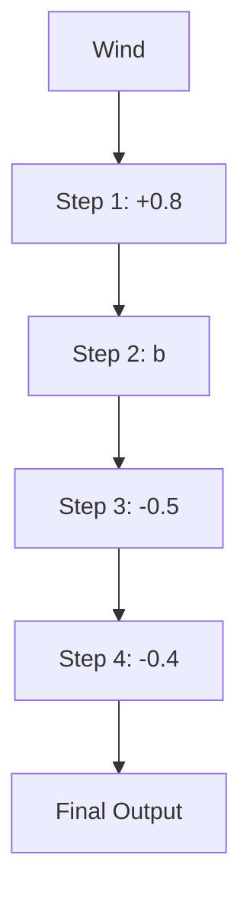
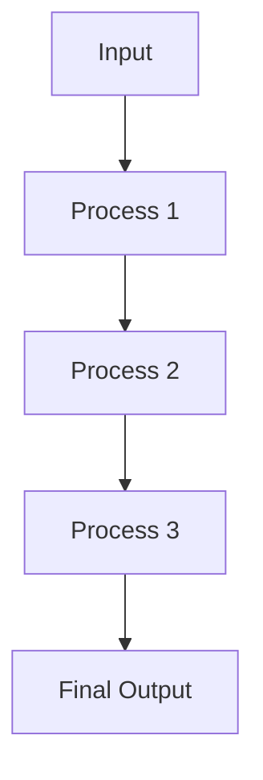
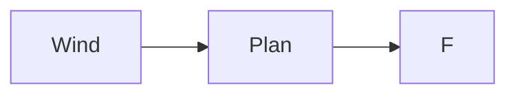

# IS: 875(Part3): Wind Loads on Buildings and Structures

# -Proposed Draft & Commentary

By

Dr.Prem Krishna

Dr. Krishen Kumar

Dr. N.M. Bhandari

Department of Civil Engineering

Indian Institute of Technology Roorkee

Roorkee

- This document has been developed under the project on Building Codes sponsored by Gujarat State Disaster Management Authority, Gandhinagar at Indian Institute of Technology Kanpur.  
- The views and opinions expressed are those of the authors and not necessarily of the GSDMA, the World Bank, IIT Kanpur, or the Bureau of Indian Standards.  
- Comments and feedbacks may please be forwarded to:
Prof. Sudhir K Jain, Dept. of Civil Engineering, IIT Kanpur, Kanpur 208016, email: nicee@iitk.ac.in

## Foreword

0.1 This Indian Standard IS:875 (Part 3) (Third Revision) was adopted by the Bureau of Indian Standards on \_\_\_\_(Date), after the draft finalized by the Structural Safety Sectional Committee had been approved by the Civil Engineering Division Council.

0.2 A building or a structure in general has to perform many functions satisfactorily. Amongst these functions are the utility of the building or the structure for the intended use and occupancy, structural safety, fire safety and compliance with hygienic, sanitation, ventilation and daylight standards. The design of the building is dependent upon the minimum requirements prescribed for each of the above functions. The minimum requirements pertaining to the structural safety of buildings are being covered in loading Codes by way of laying down minimum design loads which have to be assumed for dead loads, imposed loads, wind loads and other external loads, the structure would be required to bear. Strict conformity to loading standards, it is hoped, will not only ensure the structural safety of the buildings and structures, which are being designed and constructed in the country and thereby reduce the risk to life and property caused by unsafe structures, but also reduce the wastage caused by assuming unnecessarily heavy loadings without proper assessment.

0.3 This standard was first published in 1957 for the guidance of civil engineers, designers and architects associated with the planning and design of buildings. It included the provisions for the basic design loads (dead loads, live loads, wind loads and seismic loads) to be assumed in the design of the buildings. In its first revision in 1964, the wind pressure provisions were modified on the basis of studies of wind phenomenon and its effect on structures, undertaken by the special committee in consultation with the Indian Meteorological Department. In addition to this, new clauses on wind loads for butterfly type structures were included; wind pressure coefficients for

sheeted roofs, both curved and sloping were modified; seismic load provisions were deleted (separate Code having been prepared) and metric system of weights and measurements was adopted.

0.3.1 With the increased adoption of this Code, a number of comments were received on provisions on live load values adopted for different occupancies. Live load surveys have been carried out in America, Canada, UK and in India to arrive at realistic live loads based on actual determination of loading (movable and immovable) in different occupancies. Keeping this in view and other developments in the field of wind engineering, the Structural Safety Sectional Committee decided to prepare the second revision of IS: 875 in the following five parts:

Part 1: Dead loads

Part 2: Imposed loads

Part 3: Wind loads

Part 4: Snow loads

Part 5: Special loads and load combinations

Earthquake load being covered in a separate standard, namely, IS:1893(Part 1)- 2002\*, should be considered along with the above loads.

0.3.2 This part (Part 3) deals with wind loads to be considered when designing buildings, structures and components thereof. In its second revision in 1987, the following important modifications were made from those covered in the 1964 version of IS: 875:

(a) The earlier wind pressure maps (one giving winds of shorter duration and other excluding winds of shorter duration) were replaced by a single wind map giving basic maximum wind speed in m/s (peak gust speed averaged over a short time interval of about 3 seconds duration). The wind speeds were worked out for 50 years return period based on the up-to-date wind data of 43 dines pressure tube (DPT) anemograph stations and study of other related works available on the subject since 1964. The map and related recommendations were provided in the Code with the active cooperation of Indian Meteorological Department (IMD). Isotachs (lines of equal wind speed) were not given, as in the opinion of the committee there was still not enough extensive meteorological data at close enough stations in the country to justify drawing of isotachs.

(b) Modification factors to modify the basic wind speed to take into account the effects of terrain, local topography, size of structures, etc. were included.  
(c) Terrain was classified into four categories based on characteristics of the ground surface irregularities.  
(d) Force and pressure coefficients were included for a large range of clad and unclad buildings and for individual structural elements.  
(e) Force coefficients (drag coefficients) were given for frames, lattice towers, walls and hoardings.  
(f) The calculation of force on circular sections was included incorporating the effects of Reynolds number and surface roughness.  
(g) The external and internal pressure coefficients for gable roofs, lean-to roofs, curved roofs, canopy roofs (butterfly type structures) and multi-span roofs were rationalized.

(h) Pressure coefficients were given for combined roofs, roofs with sky light, circular silos, cylindrical elevated structures, grandstands, etc.  
(i) An analysis procedure for evaluating the dynamic response of flexible structures under wind loading using gust response factor was included.

0.3.3 The Committee responsible for the revision of wind maps, while reviewing available meteorological wind data and response of structures to wind, felt the paucity of data on which to base wind maps for Indian conditions on statistical analysis. The Committee, therefore, recommended to all individuals and organizations responsible for putting-up of tall structures to provide instrumentation in their existing and new structures (transmission towers, chimneys, cooling towers, buildings, etc.) at different elevations (at least at two levels) to continuously measure and monitor wind data. It was noted that instruments were required to collect data on wind direction, wind speed and structural response of the structure due to wind (with the help of accelerometers, strain gauges, etc). It was also the opinion of the committee that such instrumentation in tall structures will not in any way affect or alter the functional behaviour of such structures, and the data so collected will be very valuable in assessing more accurate wind loading on structures.

0.3.4 It is seen at the time of undertaking the third revision of this Code (during 2003-2004) that:

(i) Not much progress has yet been made in regard to instrumentation and collection of data in India as mentioned in 0.3.3 though additional data has become available through measurements of wind speed at the meteorological stations. In addition there is a need to address the issue of cyclonic winds and the damage caused by these winds.

(ii) There has been a substantial research effort on determination of wind effects on buildings and  
structures, the world over, during the past couple of decades, thus making available additional information of improved quality.  
(iii) A better understanding has developed concerning peak suctions/pressures.  
(iv) There is a better appreciation about the randomness that prevails in the directionality of wind, and the degree of correlation amongst pressures that it causes on a surface.  
(v) There is a better understanding of the significant influence of the averaging area used on the pressures evaluated.  
(vi) There is an appreciation of the fact that wind loads on different parts of the structure are not fully correlated.  
(vii) There is a significant effect possible on the wind forces in a building on account of interference between similar or dissimilar buildings.  
(viii) It is realized that as a result of the second revision, the standard produced was on contemporary lines. Changes are therefore warranted only where these would bring about an improvement in the quality of the standard.

In carrying out this revision, the above observations have been taken into account.

0.4 The Sectional Committee responsible for the preparation of this Standard has taken into account the prevailing practice in regard to Loading Standards followed in this country by the various authorities and has also taken note of the developments in a number of other countries. In the preparation of this Code, the following overseas Standards have also been examined:

(a) BS 6399-2:1997 Loading for

Buildings, Part 2: Code of Practice for Wind loads.

(b) AS/NZS1170.2: 2002 Structural Design Actions-Part 2: Wind Actions.  
(c) ASCE 7-02 American Society of Civil Engineers: Minimum Design Loads for Buildings and Other Structures.  
(d) National Building Code of Canada 1995.  
(e) Architectural Institute of Japan Recommendations for Loads on Buildings, 1996.

Wind Resistant Design Regulations, A World List. Association for Science Documents Information, Tokyo.

### 0.5

For the purpose of deciding whether a particular requirement of this Standard is complied with, the final value, observed or calculated, expressing the result of a test or analysis, shall be rounded off in accordance with IS:2-1960\*. The number of significant places retained in the rounded off value should be the same as that of the specified value in this Standard.

## 1 - Scope

1.1 -

This Standard gives wind forces and their effects (static and dynamic) that should be taken into account while designing buildings, structures and components thereof.

#### 1.1.1

Wind causes a random time-dependent load, which can be seen as a mean plus a fluctuating component. Strictly speaking all structures will experience dynamic oscillations due to the fluctuating component (gustiness) of wind. In short rigid structures these oscillations are insignificant, and therefore can be satisfactorily treated as having an equivalent static pressure. This is the approach taken by most Codes and Standards, as is also the case in this Standard. A structure may be deemed to be short and rigid if its natural time period is less than one second. The more flexible systems such as tall buildings undergo a dynamic response to the gustiness of wind. Methods for computing the dynamic effect of wind on buildings have been introduced in this Standard.

Apart from tall buildings there are several other structural forms (though outside the scope of this Standard) such as tall latticed towers, chimneys, guyed masts that need to be examined for aerodynamic effects.

#### 1.1.2 -

This Code also applies to buildings or other structures during erection/construction and the same shall be considered carefully during various stages of erection/construction. In locations where the strongest winds and icing may occur simultaneously, loads on structural members, cables and ropes shall be calculated by assuming an ice covering

C1.1 -

This Code provides information on wind effects for buildings and structures, and their components. Structures such as chimneys, cooling towers, transmission line towers and bridges are outside the scope of this Code. There are Indian Standards dealing with chimneys and cooling towers separately. Information on bridges (only static forces) is given in IRS and IRC Specifications. For aerodynamics of bridges, specialist literature may be consulted. With substantial work being done worldwide in the area of wind engineering, there is growing body of new information. The user of this Code is advised to consult specialist literature for the design of large or important projects involving various types of structures.

#### C1.1.1 -

Wind is not a steady phenomena due to natural turbulence and gustiness present in it. However, when averaged over a sufficiently long time duration (from a few minutes to an hour), a mean component of wind speed can be defined which would produce a static force on a structure. Superimposed on the mean/static component is the time varying component having multiple frequencies spread over a wide band.

#### C1.1.2 -

The construction period of a structure is much smaller than its expected life. Therefore, a smaller return period of 5 to 10 years or longer may be considered for arriving at the design factor (factor $k_{1}$ ) for construction stages/period of a structure

depending on its importance. In snowfall areas where icing occurs, wind loads have to be

based on climatic and local experience.

assessed accordingly. Elements such as cables and ropes can undergo a dynamic response in such cases and have to be examined accordingly.

#### 1.1.3

In the design of special structures, such as chimneys, overhead transmission line towers, etc., specific requirements as given in the respective Codes shall be adopted in conjunction with the provisions of this Code as far as they are applicable. Some of the Indian Standards available for the design of special structures are:

IS: 4998 (Part 1) –1992 Criteria for design of reinforced concrete chimneys: Part 1 - Design Criteria (first revision)

IS:6533 –1989 Code of practice for design and construction of steel chimneys

IS:5613 (Part 1/Sec 1)- 1985 Code of practice for design, installation and maintenance of overhead power lines: Part 1 Lines up to and including 11 kV, Section 1 Design

IS:802 (Part 1)-1995 Code of practice for use of structural steel in overhead transmission line towers: Part 1 Loads and permissible stresses (second revision)

IS:11504-1985 Criteria for structural design of reinforced concrete natural draught cooling towers

NOTE: 1 – This standard IS:875 (Part 3)-1987 does not apply to buildings or structures with unconventional shapes, unusual locations, and abnormal environmental conditions that have not been covered in this Code. Special investigations are necessary in such cases to establish wind loads and their effects. Wind tunnel studies may also be required in such situations.

NOTE: 2 – In the case of tall structures with unsymmetrical geometry, the designs ought to be checked for torsional effects due to wind pressure.

#### C1.1.3 - See C1.1

## 2 - Notations

### 2.1

The following notations shall be followed unless otherwise specified in relevant clauses. Notions have been defined in the text at their first appearance. A few of the notations have more than one definition, having been used for denoting different variables :

<table><tr><td>A =</td><td>Surface area of a structure or part of a structure</td></tr><tr><td> Ae  =</td><td>Effective frontal area</td></tr><tr><td> Az  =</td><td>Frontal contributory area at height z</td></tr><tr><td>b =</td><td>Breadth of a structure or structural member normal to the wind stream in the horizontal plane</td></tr><tr><td> Bs  =</td><td>Background factor</td></tr><tr><td> CD  =</td><td>Drag coefficient</td></tr><tr><td> CL  =</td><td>Lift coefficient</td></tr><tr><td> Cf  =</td><td>Force coefficient</td></tr><tr><td> Cfn  =</td><td>Normal force coefficient</td></tr><tr><td> Cft  =</td><td>Transverse force coefficient</td></tr><tr><td> C'f  =</td><td>Frictional drag coefficient</td></tr><tr><td> Cdyn  =</td><td>Dynamic response factor</td></tr><tr><td> Cp  =</td><td>Pressure coefficient</td></tr><tr><td> Cpe  =</td><td>External pressure coefficient</td></tr><tr><td> Cpi  =</td><td>Internal pressure coefficient</td></tr><tr><td> Cfs  =</td><td>Cross-wind force spectrum coefficient</td></tr><tr><td>d =</td><td>Depth of a structure or structural member parallel to wind stream in the horizontal plane</td></tr><tr><td>D =</td><td>Diameter of cylinder or sphere; Depth of structure</td></tr><tr><td>E =</td><td>Wind energy factor</td></tr><tr><td> f0  =</td><td>First mode natural frequency of vibration</td></tr><tr><td>F =</td><td>Force on a surface</td></tr><tr><td> Fn  =</td><td>Normal force</td></tr><tr><td> Ft  =</td><td>Transverse force</td></tr><tr><td> F'  =</td><td>Frictional force</td></tr>
</table>

<table><tr><td> gR  =</td><td>Peak factor for resonant response</td></tr><tr><td> gv  =</td><td>Peak factor for upwind velocity fluctuations</td></tr><tr><td>h =</td><td>Height of structure above mean ground level</td></tr><tr><td> hx  =</td><td>Height of development of a speed profile at distance x downwind from a change in terrain category</td></tr><tr><td> hp  =</td><td>Height of parapet</td></tr><tr><td> Hs  =</td><td>Height factor for resonant response</td></tr><tr><td> Ih  =</td><td>Turbulence intensity</td></tr><tr><td>IF</td><td>Interference factor</td></tr><tr><td>k =</td><td>Mode shape power exponent</td></tr><tr><td> k1 </td><td rowspan="4">Wind speed multiplication factors</td></tr><tr><td> k2 </td></tr><tr><td> k3 </td></tr><tr><td> k4 </td></tr><tr><td>K =</td><td>Force coefficient multiplication factor for members of finite length</td></tr><tr><td> Ka  =</td><td>Area averaging factor</td></tr><tr><td> Kc  =</td><td>Combination factor</td></tr><tr><td> Kd  =</td><td>Wind directionality factor</td></tr><tr><td> Km  =</td><td>Mode shape correction factor</td></tr><tr><td>I =</td><td>Length of a member or greater horizontal dimension of a building</td></tr><tr><td>L =</td><td>Actual length of upwind slope</td></tr><tr><td> Le  =</td><td>Effective length of upwind slope</td></tr><tr><td> Lh  =</td><td>Integral turbulence length scale</td></tr><tr><td>N =</td><td>Reduced frequency</td></tr><tr><td> pd  =</td><td>Design wind pressure</td></tr><tr><td> pz  =</td><td>Wind pressure at height z</td></tr><tr><td> pe  =</td><td>External wind pressure</td></tr><tr><td> pi  =</td><td>Internal wind pressure</td></tr><tr><td> Re  =</td><td>Reynolds number</td></tr><tr><td>S =</td><td>Size reduction factor</td></tr><tr><td> Sr  =</td><td>Strouhal number</td></tr><tr><td>T =</td><td>Fundamental time period of vibration</td></tr><tr><td> Vb  =</td><td>Regional basic wind speed</td></tr><tr><td> Vh  =</td><td>Design wind speed at height h</td></tr><tr><td> Vz  =</td><td>Design wind speed at height z</td></tr>
</table>

Notations have been defined also in the text at their first appearance. A few of the notations have more than one definition, having been used for denoting different parameters.

$\overline{V}_{z} =$ Hourly mean wind speed at height $z$  
W = Lesser horizontal dimension of a building in plan, or in the cross-section a structural member;  
$W' =$ Bay width in a multi-bay building;  
$W_{e}=$ Equivalent cross-wind static force  
X =      Distance downwind from a
        change in terrain category;
        fetch length  
Z = Height above average ground level  
$\alpha =$ Inclination of roof to the horizontal plane  
$\beta =$ Effective solidity ratio; Damping ratio  
$\varepsilon =$ Average height of surface roughness  
$\phi =$ Solidity ratio  
$\eta=$ Shielding factor or eddy shedding frequency  
$\theta =$ Wind direction in plan from a given axis; upwind ground / hill slope

## 3 - Terminology

For the purpose of this Code, the following definitions shall apply.

Angle of Attack / Incidence ( $\alpha$ ) - Angle in vertical plane between the direction of wind and a reference axis of the structure.

Breadth (b) - Breadth means horizontal dimension of the building measured normal to the direction of wind.

Depth (D) - Depth means the horizontal dimension of the building measured in the direction of the wind.

Note – Breadth and depth are dimensions measured in relation to the direction of wind, whereas length and width are dimensions related to the plan.

Developed Height – Developed height is the height of upward penetration of the wind speed profile in a new terrain. At large fetch lengths, such penetration reaches the gradient height, above which the wind speed may be taken to be constant. At lesser fetch lengths, a wind speed profile of a smaller height but similar to that of the fully developed profile of the terrain category has to be taken, with the additional provision that wind speed at the top of this shorter profile equals that of the unpenetrated earlier profile at that height.

Effective Frontal Area ( $A_{e}$ ) – The projected area of the structure normal to the direction of the wind.

Element of Surface Area – The area of surface over which the pressure coefficient is taken to be constant.

Force Coefficient ( $C_{f}$ ) - A non-dimensional coefficient such that the total wind force on a body is the product of the force coefficient, the dynamic pressure due to the incident design wind speed and the reference area over which the force is required.

NOTE - When the force is in the direction of the incident wind, the non-dimensional coefficient will be called as drag coefficient $(C_{D})$ . When the force is perpendicular to the direction of incident wind, the non-dimensional coefficient will be called as lift coefficient $(C_{L})$ .

Ground Roughness – The nature of the earth's surface as influenced by small scale obstructions such as trees and buildings (as distinct from topography) is called ground roughness.

Gust – A positive or negative departure of wind speed from its mean value, lasting for not more than, say, 2 minutes with the peak occurring over a specified interval of time. For example, 3 second gust wind speed.

Peak Gust – Peak gust or peak gust speed is the wind speed associated with the maximum value.

Fetch Length (X) – Fetch length is the distance measured along the wind from a boundary at which a change in the type of terrain occurs. When the changes in terrain types are encountered (such as, the boundary of a town or city, forest, etc.), the wind profile changes in character but such changes are gradual and start at ground level, spreading or penetrating upwards with increasing fetch length.

Gradient Height – Gradient height is the height above the mean ground level at which the gradient wind blows as a result of balance among pressure gradient force, Coriolis force and centrifugal force. For the purpose of this Code, the gradient height is taken as the height above the mean ground level, above which the variation of wind speed with height need not be considered.

Interference Factor – Ratio of the value of a typical response parameter for a structure due to interference divided by the corresponding value in the ‘stand alone’ case.

Mean Ground Level – The mean ground level is the average horizontal plane of the area in the close vicinity and immediately surrounding the structure.

Pressure Coefficient – Pressure coefficient is the ratio of the difference between the pressure acting at a point on a surface and the static pressure of the incident wind to the design wind pressure, where the static and design wind pressures are determined at the height of the point considered after taking into account the

geographical location, terrain conditions and shielding effect.

NOTE: Positive sign of the pressure coefficient indicates pressure acting towards the surface and negative sign indicates pressure acting away from the surface.

Return Period – Return period is the number of years, the reciprocal of which gives the probability of an extreme wind exceeding a given speed in any one year.

Shielding Effect – Shielding effect or shielding refers to the condition where wind has to pass along some structure(s) or structural element(s) located on the upstream wind side, before meeting the structure or structural element under consideration. A factor called shielding factor is used to account for such effects in estimating the force on the shielded structure(s).

Speed Profile – The variation of the horizontal component of the atmospheric wind speed with height above the mean ground level is termed as speed profile.

Suction – Suction means pressure less than the atmospheric (static) pressure and is considered to act away from the surface.

Solidity Ratio – Solidity ratio is equal to the effective area (projected area of all the individual elements) of a frame normal to the wind direction divided by the area enclosed by the boundary of the frame normal to the wind direction.

NOTE - Solidity ratio is to be calculated for individual frames.

Terrain Category – Terrain category means the characteristics of the surface irregularities of an area, which arise from natural or constructed features. The categories are numbered in increasing order of roughness.

Topography – The nature of the earth's surface as influenced by the hill and valley configurations in the vicinity of the existing / proposed structure.

## 4 - GENERAL

### 4.1 -

Wind is air in motion relative to the surface of the earth. The primary cause of wind is traced to earth's rotation and differences in terrestrial radiation. The radiation effects are mainly responsible for convection current either upwards or downwards. The wind generally blows horizontal to the ground at high speeds. Since vertical components of atmospheric motion are relatively small, the term 'wind' denotes almost exclusively the horizontal wind while 'vertical winds' are always identified as such. The wind speeds are assessed with the aid of anemometers or anemographs, which are installed at meteorological observatories at heights generally varying from 10 to 30 meters above ground.

### 4.2 -

Very strong winds are generally associated with cyclonic storms, thunderstorms, dust storms or vigorous monsoons. A feature of the cyclonic storms over the Indian region is that they rapidly weaken after crossing the coasts and move as depressions/ lows inland. The influence of a severe storm after striking the coast does not, in general exceed about 60 kilometers, though sometimes, it may extend even up to 120 kilometers. Very short duration hurricanes of very high wind speeds called Kal Baisaki or Norwesters occur fairly frequently during summer months over North East India.

### 4.3 -

The wind speeds recorded at any locality are extremely variable and in addition to steady wind at any time, there are effects of gusts, which may last for a few seconds. These gusts cause increase in air pressure but their effect on stability of the building may not be

### C4.1 -

For the purpose of this Code wind speed has been considered as that occurring at 10 m height above the general ground level. Several new recording stations have been established in the country by the Indian Meteorological Department over the last two decades, the information from which can help upgrade the wind zoning map of India. However, more extensive data are needed to make this exercise meaningful.

### C4.2 -

Several atmospheric phenomena are responsible for wind storms. Cyclonic storms, that hit some of the coastal regions of India, are the most devastating due to extremely high wind speeds in these storms accompanied by sea surge and flooding. These can last several hours. The current revised draft has recognized the fact that the high wind speeds that occur in cyclones far exceed the wind speeds for design given in the Code at present, and addresses the problem vis-à-vis the 60 km strip in the east coast and the Gujarat coast by including suitable factors to enhance the design wind speed, keeping in view the importance of the structure.

Tornados, which are a narrow band phenomenon of limited time duration, often occur during the summer, mostly in Northern parts of India. These, however, have extremely high wind speeds, often higher than in the severest cyclones.

### C4.3 -

Higher the intensity of a gust, lower is its duration. The Code specifies the basic wind speed as that of a gust of 3 second duration; or in other words, the wind speed averaged over a 3-second period. The effect of reduction in the average wind pressure with increase in the area over which the pressure is considered (the

so important; often, gusts affect only part of the building and the increased local pressures may be more than balanced by a momentary reduction in the pressure elsewhere. Because of the inertia of the building, short period gusts may not cause any appreciable increase in stress in main components of the building although the walls, roof sheeting and individual cladding units (glass panels) and their supporting members such as purlins, sheeting rails and glazing bars may be more seriously affected. Gusts can also be extremely important for design of structures with high slenderness ratios.

### 4.4 -

The response of a building to high wind pressures depends not only upon the geographical location and proximity of other obstructions to airflow but also upon the characteristics of the structure itself.

### 4.5 -

The effect of wind on the structure as a whole is determined by the combined action of external and internal pressures acting upon it. In all cases, the calculated wind loads act normal to the surface to which they apply.

### 4.6 -

The stability calculations as a whole shall be done with and without the wind loads on vertical surfaces, roofs and other parts of the building above average roof level.

tributary area) is accounted for by the ‘Area Averaging Factor, $K_{a}$ ’ defined in Section 5.4.2. A maximum reduction of 20% in wind pressures is specified for tributary area beyond 100 $m^{2}$ .

Contrary to this, one may consider wind effects over a limited (small) area of the surface. This is particularly important near the edges and ridge of a structure or sharp corners elsewhere in a building, where large suctions occur due to separation of flow and generation of eddies. The area of influence being small, there is better correlation within these areas. These local area effects are treated elsewhere in the Code.

### C4.4 -

The dynamic characteristics of a flexible structure defined by its time period of vibration and damping would affect its response to the gustiness or turbulence in wind, which itself gets modified due to presence of other structures/obstructions, particularly those in the close vicinity of the structure. The effect of the latter is difficult to evaluate and a simplified approach has been added for limited cases for the first time in the Code to approximate these so called interference effects in Section 7.

### C4.5 -

The pressures created inside a building due to access of wind through openings could be suction (negative) or pressure (positive) of the same order of intensity while those outside may also vary in magnitude with possible reversals. Thus the design value shall be taken as the algebraic sum of the two in appropriate/concerned direction.

Furthermore, the external pressures (or forces) acting on different parts of a framework do not correlate fully. Hence there is a reduction in the overall effect. This has been allowed for in clause 6.2.3.13.

### C4.6 -

The stability of a structure shall be checked both with and without the wind loads, as there may be reversal of the forces under wind besides a reduced factor of safety considered with the wind loads.

### 4.7 -

Buildings shall also be designed with due attention to the effects of wind on the comfort of people inside and outside the buildings.

### C4.7 -

Comfort of the inhabitants of a tall flexible building can be affected by large wind induced deflections or accelerations, particularly the latter. There is no criterion included in this Code for control on these parameters. Since there is no real tall building activity yet in India, the problem has not attained importance. Likewise, at the plaza level around a tall building, there may be accentuated flow conditions, particularly if the building has other similar structures adjacent to it. Thus the pedestrians at the plaza level can be put to inconvenience. A wind tunnel model study is required to determine the flow pattern and to carryout the design accordingly.

## 5 - WIND SPEED AND PRESSURE

### 5.1 - Nature of wind in Atmosphere

In general, wind speed in the atmospheric boundary layer increases with height from zero at ground level to a maximum at a height called the gradient height. There is usually a slight change in direction (Ekman effect) but this is ignored in the Code. The variation with height depends primarily on the terrain conditions. However, the wind speed at any height never remains constant and it has been found convenient to resolve its instantaneous magnitude into an average or mean value and a fluctuating component around this average value. The average value depends on the averaging time employed in analyzing the meteorological data and this averaging time can be taken to be from a few seconds to several minutes. The magnitude of fluctuating component of the wind speed, which represents the gustiness of wind, depends on the averaging time. Smaller the averaging interval, greater is the magnitude of the wind speed.

### 5.2 - Basic Wind Speed ( $V_b$ )

Figure 1 gives basic wind speed map of India, as applicable at 10 m height above mean ground level for different zones of the country. Basic wind speed is based on peak gust speed averaged over a short time interval of about 3 seconds and corresponds to 10m height above the mean ground level in an open terrain (Category 2). Basic wind speeds presented in Fig. 1 have been worked out for a 50-year return period. The basic wind speed for some important cities/towns is also given in Appendix A.

### C5.1 -

As is explained in Code, wind speed can be taken to comprise of a static (mean) component and a fluctuating component, with the magnitude of the latter varying with time interval over which the gust is averaged. Thus with reduction in the averaging time, the fluctuating wind speed would increase. The fluctuating velocity is normally expressed in terms of turbulence intensity which is the ratio of the standard deviation to the mean wind speed and is expressed in percentage.

### C5.2 -

Code defines the basic wind speed as the peak gust wind speed averaged over a period of 3 seconds. It includes both the mean and the fluctuating components of the turbulent wind. To obtain hourly mean wind speed, the 3-second value may be multiplied by factor 0.65. In the open terrain category, since wind speed varies with height, ground roughness, local topography and return period of the storm, besides the region of the country, the conditions for which $V_{b}$ is defined have been specified in this clause. The country has been divided into six wind zones and certain coastal regions affected by cyclonic storms as defined in clause 5.3.4.

### 5.3 -Design Wind Speed ( $V_{z}$ )

The basic wind speed for any site shall be obtained from Fig. 1 and shall be modified to include the following effects to get design wind speed, Vz at any height, Z for the chosen structure: (a) Risk level, (b) Terrain

roughness and height of structure, (c) Local topography, and (d) Importance factor for the cyclonic region. It can be mathematically expressed as follows:

$$
V _ {z} = V _ {b} k _ {1} k _ {2} k _ {3} k _ {4},
$$

where

$V_{z}$ = design wind speed at any height z in m/s,  
$k_{1}$ = probability factor (risk coefficient) (see 5.3.1),  
$k_{2}=$ terrain roughness and height factor (see 5.3.2),  
$k_{3}$ = topography factor (see 5.3.3), and  
$k_{4}=$ importance factor for the cyclonic region (see 5.3.4).

NOTE: The wind speed may be taken as constant upto a height of 10 m. However, pressures for buildings less than 10m high may be reduced by 20% for stability and design of the framing.

#### 5.3.1 - Risk Coefficient (k₁)

Fig. 1 gives basic wind speeds for terrain category 2 as applicable at 10 m height above mean ground level based on 50 years mean return period. The suggested life span to be assumed in design and the corresponding $k_{1}$ factors for different class of structures for the purpose of design are given in Table 1. In the design of all buildings and structures, a regional basic wind speed having a mean return period of 50 years shall be used except as specified in the note of Table 1.

### C5.3 -

The basic wind speed, $V_{b}$ corresponds to certain reference conditions. Hence, to account for various effects governing the design wind speed in any terrain condition, modifications in the form of factors $k_{1}$ , $k_{2}$ , $k_{3}$ , and $k_{4}$ are specified.

#### C5.3.1 -

The peak wind speed considered for design is based on the probability of occurrence of the maximum/severest storm over the design life of the structure. It is known that storms of greater severity are less frequent, that is, such storms have a longer return period. Thus for economical design of structures, the design wind speed has been related to the return-period of storms, with $V_{b}$ defined for 50-years return period considering the generally acceptable value of probability of exceedence as 0.63 for the design wind speed over the life of the structure. This has been termed as the risk level $P_{N}$ in N consecutive years (Table -1) and the corresponding value of the risk coefficient, $k_{1}$ , for N taken as 50 years, would be 1.0. The values of $k_{1}$ for N taken as 5, 25 and 100 years, and for various zones of the country, are given in Table-1. The designer may, however, use a higher value of N or $k_{1}$ , if it is considered necessary to reduce the risk level of an important structure.

geo

| City | Color |
| --- | --- |
| GILGIT | Blue |
| SRINAGAR | Blue |
| PONCH | Blue |
| CHAYEKANG | Blue |
| AMRITSAR | Blue |
| FIROZPUR | Green |
| SHIMLA | Green |
| CHANDIGARH | Green |
| BATHIND | Green |
| PATIALDE | Green |
| GORESHWAR | Green |
| SAHARANPUR | Green |
| KARVAL | Green |
| ALMORA | Green |
| HISAR | Green |
| MEERUT | Green |
| ROHOKHI | Green |
| RAMPUR | Green |
| BIKANAER | Green |
| JHUNIHUNUN | Green |
| SIKAR | Green |
| ALWAR | Green |
| JAGUR | Green |
| JAIPUR | Green |
| AGRA | Green |
| GWAUOR | Green |
| SHIVPUHANSI | Green |
| GUNA | Green |
| PANNA | Green |
| RAERARELI | Green |
| LUCKNOW | Green |
| GORAKHPUR | Green |
| MUXAFFARPUR | Green |
| ALLAHAR | Green |
| BARNASI | Green |
| PATA | Green |
| AURANGABAD | Green |
| DUMKA | Green |
| DHANSAG | Green |
| RANCHI | Green |
| JAMSHEDPUR | Green |
| KOLKATA | Green |
| JAMNAGAR | Green |
| BHAPAL | Green |
| JABALPUR | Green |
| AMBIKAPUR | Green |
| RAURKELA | Green |
| KENDUJHARGAR | Green |
| SAMBALPUR | Green |
| PHULABANI | Green |
| BHABANESHWAR | Green |
| BHAPANIPATNA | Green |
| JAGDALPUR | Green |
| KORAPUT | Green |
| KARIMNAGAR | Green |
| KARIMNAGAR | Green |
| KARIMNAGAR | Green |
| KARIMNAGAR | Green |
| KARIMNAGAR | Green |
| KARIMNAGAR | Green |
| KARIMNAGAR | Green |
| KARIMNAGAR | Green |
| KARIMNAGAR | Green |
| KARIMNAGAR | Green |
| KARIMNAGAR | Green |
| KARIMNAGAR | Green |
| KARIMNAGAR | Green |
| KARIMNAGAR | Green |
| KARIMNAGAR | Green |
| KARIMNAGAR | Green |
| KARIMNAGAR | Green |
| KARIMNAGAR | Green |
| KARIMNAGAR | Green |
| KARIMNAGAR | Green |
| KARIMNAGAR | Green |
| KARIMNAGAR | Green |
| KARIMNAGAR | Green |
| KARIMNAGAR | Green |
| KARIMNAGAR | Green |
| KARIMNAGAR | Green |
| KARIMNAGAR | Green |
| KARIMNAGAR | Green |
| KARIMNAGAR | Green |
| KARIMNAGAR | Green |
| KARIMNAGAR | Green |
| KARIMNAGAR | Green |
| KARIMNAGAR | Green |
| KARIMNAGAR | Green |
| KARIMNAGAR | Green |
| KARIMNAGAR | Green |
| KARIMNAGAR | Green |
| KARIMNAGAR | Green |
| KARIMNAGAR | Green |
| KARIMNAGAR | Green |
| KARIMNAGAR | Green |
| KARIMNAGAR | Green |
| KARIMNAGAR | Green |
| KARIMNAGAR | Green |
| KARIMNAGAR | Green |
| KARIMNAGAR | Green |
| KARIMNAGAR | Green |
| KARIMNAGAR | Green |
| KARIMNAGAR | Green |
| KARIMNAGAR | Green |
| KARIMNAGAR | Green |
| KARIMNAGAR | Green |
| KARIMNAGAR | Green |
| KARIMNAGAR | Green |
| KARIMNAGAR | Green |
| KARIMNAGAR | Green |
| KARIMNAGAR | Green |
| KARIMNAGAR | Green |
| KARIMNAGAR | Green |
| KARIMNAGAR | Green |
| KARIMNAGAR | Green |
| KARIMNAGAR | Green |
| KARIMNAGAR | Green |
| KARIMNAGAR | Green |
| KARIMNAGAR | Green |
| KARIMNAGAR | Green |
| KARIMNAGAR | Green |
| KARIMNAGAR | Green |
| KARIMNAGAR | Green |
| KARIMNAGAR | Green |
| KARIMNAGAR | Green |
| KARIMNAGAR | Green |
| KARIMNAGAR | Green |
| KARIMNAGAR | Green |
| KARIMNAGAR | Green |
| KARIMNAGAR | Green |
| KARIMNAGAR | Green |
| KARIMNAGAR | Green |
| KARIMNAGAR | Green |
| KARIMNAGAR | Green |
| KARIMNAGAR | Green |
| KARIMNAGAR | Green |
| KARIMNAGAR | Green |
| KARIMNAGAR | Green |
| KARIMNAGAR | Green |
| KARIMNAGAR | Green |
| KARIMNAGAR | Green |
| KARIMNAGAR | Green |
| KARIMNAGAR | Green |
| KARIMNAGAR | Green |
| KARIMNAGAR | Green |
| KARIMNAGAR | Green |
| KARIMNAGAR | Green |
| KARIMNAGAR | Green |
| KARIMNAGAR | Green |
| KARIMNAGAR | Green |
| KARIMNAGAR | Green |
| KARIMNAGAR | Green |
| KARIMNAGAR | Green |
| KARIMNAGAR | Green |
| KARIMNAGAR | Green |
| KARIMNAGAR | Green |
| KARIMNAGAR | Green |
| KARIMNAGAR | Green |
| KARIMNAGAR | Green |
| KARIMNAGAR | Green |
| KARIMNAGAR | Green |
| KARIMNAGAR | Green |
| KARIMNAGAR | Green |
| KARIMNAGAR | Green |
| KARIMNAGAR | Green |
| KARIMNAGAR | Green |
| KARIMNAGAR | Green |
| KARIMNAGAR | Green |
| KARIMNAGAR | Green |
| KARIMNAGAR | Green |
| KARIMNAGAR | Green |
| KARIMNAGAR | Green |
| KARIMNAGAR | Green |
| KARIMNAGAR | Green |
| KARIMNAGAR | Green |
| KARIMNAGAR | Green |
| KARIMNAGAR | Green |
| KARIMNAGAR | Green |
| KARIMNAGAR | Green |
| KARIMNAGAR | Green |
| KARIMNAGAR | Green |
| KARIMNAGAR | Green |
| KARIMNAGAR | Green |
| KARIMNAGAR | Green |
| KARIMNAGAR | Green |
| KARIMNAGAR | Green |
| KARIMNAGAR | Green |
| KARIMNAGAR | Green |
| KARIMNAGAR | Green |
| KARIMNAGAR | Green |
| KARIMNAGAR | Green |
| KARIMNAGAR | Green |
| KARIMNAGAR | Green |
| KARIMNAGAR | Green |
| KARIMNAGAR | Green |
| KARIMNAGAR | Green |
| KARIMNAGAR | Green |
| KARIMNAGAR | Green |
| KARIMNAGAR | Green |
| KARIMNAGAR | Green |
| KARIMNAGAR | Green |
| KARIMNAGAR | Green |
| KARIMNAGAR | Green |
| KARIMNAGAR | Green |
| KARIMNAGAR | Green |
| KARIMNAGAR | Green |
| KARIMNAGAR | Green |
| KARIMNAGAR | Green |
| KARIMNAGAR | Green |
| KARIMNAGAR | Green |
| KARIMNAGAR | Green |
| KARIMNAGAR | Green |
| KARIMNAGAR | Green |
| KARIMNAGAR | Green |
| KARIMNAGAR | Green |
| KARIMNAGAR | Green |
| KARIMNAGAR | Green |
| KARIMNAGAR | Green |
| KARIMNAGAR | Green |
| KARIMNAGAR | Green |
| KARIMNAGAR | Green |
| KARIMNAGAR | Green |
| KARIMNAGAR | Green |
| KARIMNAGAR | Green |
| KARIMNAGAR | Green |
| KARIMNAGAR | Green |
| KARIMNAGAR | Green |
| KARIMNAGAR | Green |
| KARIMNAGAR | Green |
| KARIMNAGAR | Green |
| KARIMNAGAR | Green |
| KARIMNAGAR | Green |
| KARIMNAGAR | Green |
| KARIMNAGAR | Green |
| KARIMNAGAR | Green |
| KARIMNAGAR | Green |
| KARIMNAGAR | Green |
| KARIMNAGAR | Green |
| KARIMNAGAR | Green |
| KARIMNAGAR | Green |
| KARIMNAGAR | Green |
| KARIMNAGAR | Green |
| KARIMNAGAR | Green |
| KARIMNAGAR | Green |
| KARIMNAGAR | Green |
| KARIMNAGAR | Green |
| KARIMNAGAR | Green |
| KARIMNAGAR | Green |
| KARIMNAGAR | Green |
| KARIMNAGAR | Green |
| KARIMNAGAR | Green |
| KARIMNAGAR | Green |
| KARIMNAGAR | Green |
| KARIMNAGAR | Green |
| KARIMNAGAR | Green |
| KARIMNAGAR | Green |
| KARIMNAGAR | Green |
| KARIMNAGAR | Green |
| KARIMNAGAR | Green |
| KARIMNAGAR | Green |
| KARIMNAGAR | Green |
| KARIMNAGAR | Green |
| KARIMNAGAR | Green |
| KARIMNAGAR | Green |
| KARIMNAGAR | Green |
| KARIMNAGAR | Green |
| KARIMNAGAR | Green |
| KARIMNAGAR | Green |
| KARIMNAGAR | Green |
| KARIMNAGAR | Green |
| KARIMNAGAR | Green |
| KARIMNAGAR | Green |
| KARIMNAGAR | Green |
| KARIMNAGAR | Green |
| KARIMNAGAR | Green |
| KARIMNAGAR | Green |
| KARIMNAGAR | Green |
| KARIMNAGAR | Green |
| KARIMNAGAR | Green |
| KARIMNAGAR | Green |
| KARIMNAGAR | Green |
| KARIMNAGAR | Green |
| KARIMNAGAR | Green |
| KARIMNAGAR | Green |
| KARIMNAGAR | Green |
| KARIMNAGAR | Green |
| KARIMNAGAR | Green |
| KARIMNAGAR | Green |
| KARIMNAGAR | Green |
| KARIMNAGAR | Green |
| KARIMNAGAR | Green |
| KARIMNAGAR | Green |
| KARIMNAGAR | Green |
| KARIMNAGAR | Green |
| KARIMNAGAR | Green |
| KARIMNAGAR | Green |
| KARIMNAGAR | Green |
| KARIMNAGAR | Green |
| KARIMNAGAR | Green |
| KARIMNAGAR | Green |
| KARIMNAGAR | Green |
| KARIMNAGAR | Green |
| KARIMNAGAR | Green |
| KARIMNAGAR | Green |
| KARIMNAGAR | Green |
| KARIMNAGAR | Green |
| KARIMNAGAR | Green |
| KARIMNAGAR | Green |
| KARIMNAGAR | Green |
| KARIMNAGAR | Green |
| KARIMNAGAR | Green |
| KARIMNAGAR | Green |
| KARIMNAGAR | Green |
| KARIMNAGAR | Green |
| KARIMNAGAR | Green |
| KARIMNAGAR | Green |
| KARIMNAGAR | Green |
| KARIMNAGAR | Green |
| KARIMNAGAR | Green |
| KARIMNAGAR | Green |
| KARIMNAGAR | Green |
| KARIMNAGAR | Green |
| KARIMNAGAR | Green |
| KARIMNAGAR | Green |
| KARIMNAGAR | Green |
| KARIMNAGAR | Green |
| KARIMNAGAR | Green |
| KARIMNAGAR | Green |
| KARIMNAGAR | Green |
| KARIMNAGAR | Green |
| KARIMNAGAR | Green |
| KARIMNAGAR | Green |
| KARIMNAGAR | Green |
| KARIMNAGAR | Green |
| KARIMNAGAR | Green |
| KARIMNAGAR | Green |
| KARIMNAGAR | Green |
| KARIMNAGAR | Green |
| KARIMNAGAR | Green |
| KARIMNAGAR | Green |
| KARIMNAGAR | Green |
| KARIMNAGAR | Green |
| KARIMNAGAR | Green |
| KARIMNAGAR | Green |
| KARIMNAGAR | Green |
| KARIMNAGAR | Green |
| KARIMNAGAR | Green |
| KARIMNAGAR | Green |
| KARIMNAGAR | Green |
| KARIMNAGAR | Green |
| KARIMNAGAR | Green |
| KARIMNAGAR | Green |
| KARIMNAGAR | Green |
| KARIMNAGAR | Green |
| KARIMNAGAR | Green |
| KARIMNAGAR | Green |
| KARIMNAGAR | Green |
| KARIMNAGAR | Green |
| KARIMNAGAR | Green |
| KARIMNAGAR | Green |
| KARIMNAGAR | Green |
| KARIMNAGAR | Green |
| KARIMNAGAR | Green |
| KARIMNAGAR | Green |
| KARIMNAGAR | Green |
| KARIMNAGAR | Green |
| KARIMNAGAR | Green |
| KARIMNAGAR | Green |
| KARIMNAGAR | Green |
| KARIMNAGAR | Green |
| KARIMNAGAR | Green |
| KARIMNAGAR | Green |
| KARIMNAGAR | Green |
| KARIMNAGAR | Green |
| KARIMNAGAR | Green |
| KARIMNAGAR | Green |
| KARIMNAGAR | Green |
| KARIMNAGAR | Green |
| KARIMNAGAR | Green |
| KARIMNAGAR | Green |
| KARIMNAGAR | Green |
| KARIMNAGAR | Green |
| KARIMNAGAR | Green |
| KARIMNAGAR | Green |
| KARIMNAGAR | Green |
| KARIMNAGAR | Green |
| KARIMNAGAR | Green |
| KARIMNAGAR | Green |
| KARIMNAGAR | Green |
| KARIMNAGAR | Green |
| KARIMNAGAR | Green |
| KARIMNAGAR | Green |
| KARIMNAGAR | Green |
| KARIMNAGAR | Green |
| KARIMNAGAR | Green |
| KARIMNAGAR | Green |
| KARIMNAGAR | Green |
| KARIMNAGAR | Green |
| KARIMNAGAR | Green |
| KARIMNAGAR | Green |
| KARIMNAGAR | Green |
| KARIMNAGAR | Green |
| KARIMNAGAR | Green |
| KARIMNAGAR | Green |
| KARIMNAGAR | Green |
| KARIMNAGAR | Green |
| KARIMNAGAR | Green |
| KARIMNAGAR | Green |
| KARIMNAGAR | Green |
| KARIMNAGAR | Green |
| KARIMNAGAR | Green |
| KARIMNAGAR | Green |
| KARIMNAGAR | Green |
| KARIMNAGAR | Green |
| KARIMNAGAR | Green |
| KARIMNAGAR | Green |
| KARIMNAGAR | Green |
| KARIMNAGAR | Green |
| KARIMNAGAR | Green |
| KARIMNAGAR | Green |
| KARIMNAGAR | Green |
| KARIMNAGAR | Green |
| KARIMNAGAR | Green |
| KARIMNAGAR | Green |
| KARIMNAGAR | Green |
| KARIMNAGAR | Green |
| KARIMNAGAR | Green |
| KARIMNAGAR | Green |
| KARIMNAGAR | Green |
| KARIMNAGAR | Green |
| KARIMNAGAR | Green |
| KARIMNAGAR | Green |
| KARIMNAGAR | Green |
| KARIMNAGAR | Green |
| KARIMNAGAR | Green |
| KARIMNAGAR | Green |
| KARIMNAGAR | Green |
| KARIMNAGAR | Green |
| KARIMNAGAR | Green |
| KARIMNAGAR | Green |
| KARIMNAGAR | Green |
| KARIMNAGAR | Green |
| KARIMNAGAR | Green |
| KARIMNAGAR | Green |
| KARIMNAGAR | Green |
| KARIMNAGAR | Green |
| KARIMNAGAR | Green |
| KARIMNAGAR | Green |
| KARIMNAGAR | Green |
| KARIMNAGAR | Green |
| KARIMNAGAR | Green |
| KARIMNAGAR | Green |
| KARIMNAGAR | Green |
| KARIMNAGAR | Green |
| KARIMNAGAR | Green |
| KARIMNAGAR | Green |
| KARIMNAGAR | Green |
| KARIMNAGAR | Green |
| KARIMNAGAR | Green |
| KARIMNAGAR | Green |
| KARIMNAGAR | Green |
| KARIMNAGAR | Green |
| KARIMNAGAR | Green |
| KARIMNAGAR | Green |
| KARIMNAGAR | Green |
| KARIMNAGAR | Green |
| KARIMNAGAR | Green |
| KARIMNAGAR | Green |
| KARIMNAGAR | Green |
| KARIMNAGAR | Green |
| KARIMNAGAR | Green |
| KARIMNAGAR | Green |
| KARIMNAGAR | Green |
| KARIMNAGAR | Green |
| KARIMNAGAR | Green |
| KARIMNAGAR | Green |
| KARIMNAGAR | Green |
| KARIMNAGAR | Green |
| KARIMNAGAR | Green |
| KARIMNAGAR | Green |
| KARIMNAGAR | Green |
| KARIMNAGAR | Green |
| KARIMNAGAR | Green |
| KARIMNAGAR | Green |
| KARIMNAGAR | Green |
| KARIMNAGAR | Green |
| KARIMNAGAR | Green |
| KARIMNAGAR | Green |
| KARIMNAGAR | Green |
| KARIMNAGAR | Green |
| KARIMNAGAR | Green |
| KARIMNAGAR | Green |
| KARIMNAGAR | Green |
| KARIMNAGAR | Green |
| KARIMNAGAR | Green |
| KARIMNAGAR | Green |
| KARIMNAGAR | Green |
| KARIMNAGAR | Green |
| KARIMNAGAR | Green |
| KARIMNAGAR | Green |
| KARIMNAGAR | Green |
| KARIMNAGAR | Green |
| KARIMNAGAR | Green |
| KARIMNAGAR | Green |
| KARIMNAGAR | Green |
| KARIMNAGAR | Green |
| KARIMNAGAR | Green |
| KARIMNAGAR | Green |
| KARIMNAGAR | Green |
| KARIMNAGAR | Green |
| KARIMNAGAR | Green |
| KARIMNAGAR | Green |
| KARIMNAGAR | Green |
| KARIMNAGAR | Green |
| KARIMNAGAR | Green |
| KARIMNAGAR | Green |
| KARIMNAGAR | Green |
| KARIMNAGAR | Green |
| KARIMNAGAR | Green |
| KARIMNAGAR | Green |
| KARIMNAGAR | Green |
| KARIMNAGAR | Green |
| KARIMNAGAR | Green |
| KARIMNAGAR | Green |
| KARIMNAGAR | Green |
| KARIMNAGAR | Green |
| KARIMNAGAR | Green |
| KARIMNAGAR | Green |
| KARIMNAGAR | Green |
| KARIMNAGAR | Green |
| KARIMNAGAR | Green |
| KARIMNAGAR | Green |
| KARIMNAGAR | Green |
| KARIMNAGAR | Green |
| KARIMNAGAR | Green |
| KARIMNAGAR | Green |
| KARIMNAGAR | Green |
| KARIMNAGAR | Green |
| KARIMNAGAR | Green |
| KARIMNAGAR | Green |
| KARIMNAGAR | Green |
| KARIMNAGAR | Green |
| KARIMNAGAR | Green |
| KARIMNAGAR | Green |
| KARIMNAGAR | Green |
| KARIMNAGAR | Green |
| KARIMNAGAR | Green |
| KARIMNAGAR | Green |
| KARIMNAGAR | Green |
| KARIMNAGAR | Green |
| KARIMNAGAR | Green |
| KARIMNAGAR | Green |
| KARIMNAGAR | Green |
| KARIMNAGAR | Green |
| KARIMNAGAR | Green |
| KARIMNAGAR | Green |
| KARIMNAGAR | Green |
| KARIMNAGAR | Green |
| KARIMNAGAR | Green |
| KARIMNAGAR | Green |
| KARIMNAGAR | Green |
| KARIMNAGAR | Green |
| KARIMNAGAR | Green |
| KARIMNAGAR | Green |
| KARIMNAGAR | Green |
| KARIMNAGAR | Green |
| KARIMNAGAR | Green |
| KARIMNAGAR | Green |
| KARIMNAGAR | Green |
| KARIMNAGAR | Green |
| KARIMNAGAR | Green |
| KARIMNAGAR | Green |
| KARIMNAGAR | Green |
| KARIMNAGAR | Green |
| KARIMNAGAR | Green |
| KARIMNAGAR | Green |
| KARIMNAGAR | Green |
| KARIMNAGAR | Green |
| KARIMNAGAR | Green |
| KARIMNAGAR | Green |
| KARIMNAGAR | Green |
| KARIMNAGAR | Green |
| KARIMNAGAR | Green |
| KARIMNAGAR | Green |
| KARIMNAGAR | Green |
| KARIMNAGAR | Green |
| KARIMNAGAR | Green |
| KARIMNAGAR | Green |
| KARIMNAGAR | Green |
| KARIMNAGAR | Green |
| KARIMNAGAR | Green |
| KARIMNAGAR | Green |
| KARIMNAGAR | Green |
| KARIMNAGAR | Green |
| KARIMNAGAR | Green |
| KARIMNAGAR | Green |
| KARIMNAGAR | Green |
| KARIMNAGAR | Green |
| KARIMNAGAR | Green |
| KARIMNAGAR | Green |
| KARIMNAGAR | Green |
| KARIMNAGAR | Green |
| KARIMNAGAR | Green |
| KARIMNAGAR | Green |
| KARIMNAGAR | Green |
| KARIMNAGAR | Green |
| KARIMNAGAR | Green |
| KARIMNAGAR | Green |
| KARIMNAGAR | Green |
| KARIMNAGAR | Green |
| KARIMNAGAR | Green |
| KARIMNAGAR | Green |
| KARIMNAGAR | Green |
| KARIMNAGAR | Green |
| KARIMNAGAR | Green |
| KARIMNAGAR | Green |
| KARIMNAGAR | Green |
| KARIMNAGAR | Green |
| KARIMNAGAR | Green |
| KARIMNAGAR | Green |
| KARIMNAGAR | Green |
| KARIMNAGAR | Green |
| KARIMNAGAR | Green |
| KARIMNAGAR | Green |
| KARIMNAGAR | Green |
| KARIMNAGAR | Green |
| KARIMNAGAR | Green |
| KARIMNAGAR | Green |
| KARIMNAGAR | Green |
| KARIMNAGAR | Green |
| KARIMNAGAR | Green |
| KARIMNAGAR | Green |
| KARIMNAGAR | Green |
| KARIMNAGAR | Green |
| KARIMNAGAR | Green |
| KARIMNAGAR | Green |
| KARIMNAGAR | Green |
| KARIMNAGAR | Green |
| KARIMNAGAR | Green |
| KARIMNAGAR | Green |
| KARIMNAGAR | Green |
| KARIMNAGAR | Green |
| KARIMNAGAR | Green |
| KARIMNAGAR | Green |
| KARIMNAGAR | Green |
| KARIMNAGAR | Green |
| KARIMNAGAR | Green |
| KARIMNAGAR | Green |
| KARIMNAGAR | Green |
| KARIMNAGAR | Green |
| KARIMNAGAR | Green |
| KARIMNAGAR | Green |
| KARIMNAGAR | Green |
| KARIMNAGAR | Green |
| KARIMNAGAR | Green |
| KARIMNAGAR | Green |
| KARIMNAGAR | Green |
| KARIMNAGAR | Green |
| KARIMNAGAR | Green |
| KARIMNAGAR | Green |
| KARIMNAGAR | Green |
| KARIMNAGAR | Green |
| KARIMNAGAR | Green |
| KARIMNAGAR | Green |
| KARIMNAGAR | Green |
| KARIMNAGAR | Green |
| KARIMNAGAR | Green |
| KARIMNAGAR | Green |
| KARIMNAGAR | Green |
| KARIMNAGAR | Green |
| KARIMNAGAR | Green |
| KARIMNAGAR | Green |
| KARIMNAGAR | Green |
| KARIMNAGAR | Green |
| KARIMNAGAR | Green |
| KARIMNAGAR | Green |
| KARIMNAGAR | Green |
| KARIMNAGAR | Green |
| KARIMNAGAR | Green |
| KARIMNAGAR | Green |
| KARIMNAGAR | Green |
| KARIMNAGAR | Green |
| KARIMNAGAR | Green |
| KARIMNAGAR | Green |
| KARIMNAGAR | Green |
| KARIMNAGAR | Green |
| KARIMNAGAR | Green |
| KARIMNAGAR | Green |
| KARIMNAGAR | Green |
| KARIMNAGAR | Green |
| KARIMNAGAR | Green |
| KARIMNAGAR | Green |
| KARIMNAGAR | Green |
| KARIMNAGAR | Green |
| KARIMNAGAR | Green |
| KARIMNAGAR | Green |
| KARIMNAGAR | Green |
| KARIMNAGAR | Green |
| KARIMNAGAR | Green |
| KARIMNAGAR | Green |
| KARIMNAGAR | Green |
| KARIMNAGAR | Green |
| KARIMNAGAR | Green |
| KARIMNAGAR | Green |
| KARIMNAGAR | Green |
| KARIMNAGAR | Green |
| KARIMNAGAR | Green |
| KARIMNAGAR | Green |
| KARIMNAGAR | Green |
| KARIMNAGAR | Green |
| KARIMNAGAR | Green |
| KARIMNAGAR | Green |
| KARIMNAGAR | Green |
| KARIMNAGAR | Green |
| KARIMNAGAR | Green |
| KARIMNAGAR | Green |
| KARIMNAGAR | Green |
| KARIMNAGAR | Green |
| KARIMNAGAR | Green |
| KARIMNAGAR | Green |
| KARIMNAGAR | Green |
| KARIMNAGAR | Green |
| KARIMNAGAR | Green |
| KARIMNAGAR | Green |
| KARIMNAGAR | Green |
| KARIMNAGAR | Green |
| KARIMNAGAR | Green |
| KARIMNAGAR | Green |
| KARIMNAGAR | Green |
| KARIMNAGAR | Green |
| KARIMNAGAR | Green |
| KARIMNAGAR | Green |
| KARIMNAGAR | Green |
| KARIMNAGAR | Green |
| KARIMNAGAR | Green |
| KARIMNAGAR | Green |
| KARIMNAGAR | Green |
| KARIMNAGAR | Green |
| KARIMNAGAR | Green |
| KARIMNAGAR | Green |
| KARIMNAGAR | Green |
| KARIMNAGAR | Green |
| KARIMNAGAR | Green |
| KARIMNAGAR | Green |
| KARIMNAGAR | Green |
| KARIMNAGAR | Green |
| KARIMNAGAR | Green |
| KARIMNAGAR | Green |
| KARIMNAGAR | Green |
| KARIMNAGAR | Green |
| KARIMNAGAR | Green |
| KARIMNAGAR | Green |
| KARIMNAGAR | Green |
| KARIMNAGAR | Green |
| KARIMNAGAR | Green |
| KARIMNAGAR | Green |
| KARIMNAGAR | Green |
| KARIMNAGAR | Green |
| KARIMNAGAR | Green |
| KARIMNAGAR | Green |
| KARIMNAGAR | Green |
| KARIMNAGAR | Green |
| KARIMNAGAR | Green |
| KARIMNAGAR | Green |
| KARIMNAGAR | Green |
| KARIMNAGAR | Green |
| KARIMNAGAR | Green |
| KARIMNAGAR | Green |
| KARIMNAGAR | Green |
| KARIMNAGAR | Green |
| KARIMNAGAR | Green |
| KARIMNAGAR | Green |
| KARIMNAGAR | Green |
| KARIMNAGAR | Green |
| KARIMNAGAR | Green |
| KARIMNAGAR | Green |
| KARIMNAGAR | Green |
| KARIMNAGAR | Green |
| KARIMNAGAR | Green |
| KARIMNAGAR | Green |
| KARIMNAGAR | Green |
| KARIMNAGAR | Green |
| KARIMNAGAR | Green |
| KARIMNAGAR | Green |
| KARIMNAGAR | Green |
| KARIMNAGAR | Green |
| KARIMNAGAR | Green |
| KARIMNAGAR | Green |
| KARIMNAGAR | Green |
| KARIMNAGAR | Green |
| KARIMNAGAR | Green |
| KARIMNAGAR | Green |
| KARIMNAGAR | Green |
| KARIMNAGAR | Green |
| KARIMNAGAR | Green |
| KARIMNAGAR | Green |
| KARIMNAGAR | Green |
| KARIMNAGAR | Green |
| KARIMNAGAR | Green |
| KARIMNAGAR | Green |
| KARIMNAGAR | Green |
| KARIMNAGAR | Green |
| KARIMNAGAR | Green |
| KARIMNAGAR | Green |
| KARIMNAGAR | Green |
| KARIMNAGAR | Green |
| KARIMNAGAR | Green |
| KARIMNAGAR | Green |
| KARIMNAGAR | Green |
| KARIMNAGAR | Green |
| KARIMNAGAR | Green |
| KARIMNAGAR | Green |
| KARIMNAGAR | Green |
| KARIMNAGAR | Green |
| KARIMNAGAR | Green |
| KARIMNAGAR | Green |
| KARIMNAGAR | Green |
| KARIMNAGAR | Green |
| KARIMNAGAR | Green |
| KARIMNAGAR | Green |
| KARIMNAGAR | Green |
| KARIMNAGAR | Green |
| KARIMNAGAR | Green |

Figure 1: Basic wind speed in m/s (based on 50 year return period)

Table 1: Risk coefficients for different classes of structures in different wind speed zones [Clause 5.3.1]

<table><caption><b>Table 1 Risk coefficients for different classes of structures in different wind speed zones [Clause 5.3.1]</b></caption><tr><td rowspan="2">Class of Structure</td><td rowspan="2">Mean Probable design life of structure in years</td><td colspan="6"> k1  factor for Basic Wind Speed (m/s) of</td></tr><tr><td>33</td><td>39</td><td>44</td><td>47</td><td>50</td><td>55</td></tr><tr><td>All general buildings and structures</td><td>50</td><td>1.0</td><td>1.0</td><td>1.0</td><td>1.0</td><td>1.0</td><td>1.0</td></tr><tr><td>Temporary sheds, structures such as those used during construction operations (for example, formwork and false work), structures during construction stages, and boundary walls</td><td>5</td><td>0.82</td><td>0.76</td><td>0.73</td><td>0.71</td><td>0.70</td><td>0.67</td></tr><tr><td>Buildings and structures presenting a low degree of hazard to life and property in the event of failure, such as isolated towers in wooded areas, farm buildings other than residential buildings, etc.</td><td>25</td><td>0.94</td><td>0.92</td><td>0.91</td><td>0.90</td><td>0.90</td><td>0.89</td></tr><tr><td>Important buildings and structures such as hospitals, communication buildings, towers and power plant structures</td><td>100</td><td>1.05</td><td>1.06</td><td>1.07</td><td>1.07</td><td>1.08</td><td>1.08</td></tr><tr><td colspan="8">NOTE - The factor  k1  is based on statistical concepts, which take account of the degree of reliability required, and period of time in years during which there will be exposure to wind, that is, life of the structure. Whatever wind speed is adopted for design purposes, there is always a probability (howsoever small) that it may be exceeded in a storm of exceptional violence; the greater the number of years over which there will be exposure to wind, the greater is the probability. High return periods ranging from 100 to 1000 years (implying lower risk level) in association with greater period of exposure may have to be selected for exceptionally important structures, such as, nuclear power reactors and satellite communication towers. Equation given below may be used in such cases to estimate  k1  factors for different periods of exposure and chosen probability of exceedence (risk level). The probability level of 0.63 is normally considered sufficient for design of buildings and structures against wind effects and the values of  k1  corresponding to this risk level are given above. The factor k1 is given by the equation shown below the table, where N =  mean probable design life of the structure in years; PN =  risk level in N consecutive years (probability that the design wind speed is exceeded at least once in N successive years), nominal value = 0.63; XN,P =  extreme wind speed for given value of N and  PN ; and X50,0.63 =  extreme wind speed for N = 50 years and  PN = 0.63 A and B are coefficients having the following values for different basic wind speed zones:</td></tr><tr><td rowspan="7"></td><td>Zone</td><td>A</td><td>B</td><td rowspan="7" colspan="4"></td></tr><tr><td>33 m/s</td><td>83.2</td><td>9.2</td></tr><tr><td>39 m/s</td><td>84.0</td><td>14.0</td></tr><tr><td>44 m/s</td><td>88.0</td><td>18.0</td></tr><tr><td>47 m/s</td><td>88.0</td><td>20.5</td></tr><tr><td>50 m/s</td><td>88.8</td><td>22.8</td></tr><tr><td>55 m/s</td><td>90.8</td><td>27.3</td></tr>
</table>

$$
k_1 = \frac{X_{N,P_N}}{X_{50,0.63}} = \frac{A - B\left[\ln\left\{-\frac{1}{N}\ln\left(1 - P_N\right)\right\}\right]}{A + 4B}
$$

Table 2: $k_{2}$ factors to obtain design wind speed variation with height in different terrains [Clause 5.3.2.2]

<table><caption><b>Table 2 $k_{2}$ factors to obtain design wind speed variation with height in different terrains [Clause 5.3.2.2]</b></caption><tr><td rowspan="2">Height (z) (m)</td><td colspan="4">Terrain and height multiplier ( k2 )</td></tr><tr><td>Terrain Category 1</td><td>Terrain Category 2</td><td>Terrain Category 3</td><td>Terrain Category 4</td></tr><tr><td>10</td><td>1.05</td><td>1.00</td><td>0.91</td><td>0.80</td></tr><tr><td>15</td><td>1.09</td><td>1.05</td><td>0.97</td><td>0.80</td></tr><tr><td>20</td><td>1.12</td><td>1.07</td><td>1.01</td><td>0.80</td></tr><tr><td>30</td><td>1.15</td><td>1.12</td><td>1.06</td><td>0.97</td></tr><tr><td>50</td><td>1.20</td><td>1.17</td><td>1.12</td><td>1.10</td></tr><tr><td>100</td><td>1.26</td><td>1.24</td><td>1.20</td><td>1.20</td></tr><tr><td>150</td><td>1.30</td><td>1.28</td><td>1.24</td><td>1.24</td></tr><tr><td>200</td><td>1.32</td><td>1.30</td><td>1.27</td><td>1.27</td></tr><tr><td>250</td><td>1.34</td><td>1.32</td><td>1.29</td><td>1.28</td></tr><tr><td>300</td><td>1.35</td><td>1.34</td><td>1.31</td><td>1.30</td></tr><tr><td>350</td><td>1.37</td><td>1.36</td><td>1.32</td><td>1.31</td></tr><tr><td>400</td><td>1.38</td><td>1.37</td><td>1.34</td><td>1.32</td></tr><tr><td>450</td><td>1.39</td><td>1.38</td><td>1.35</td><td>1.33</td></tr><tr><td>500</td><td>1.40</td><td>1.39</td><td>1.36</td><td>1.34</td></tr><tr><td colspan="5">NOTE: For intermediate values of height z and terrain category, use linear interpolation.</td></tr>
</table>

#### 5.3.2 - Terrain and Height Factor $(\mathbf{k}_2)$

5.3.2.1 -

Terrain – Selection of terrain categories shall be made with due regard to the effect of obstructions which constitute the ground surface roughness. The terrain category used in the design of a structure may vary depending on the direction of wind under consideration. Wherever sufficient meteorological information is available about the wind direction, the orientation of any building or structure may be suitably planned.

Terrain in which a specific structure stands shall be assessed as being one of the following terrain categories:

a) Category 1 – Exposed open terrain with a few or no obstructions and in which the average height of any object surrounding the structure is less than 1.5 m.

NOTE – This category includes open sea coasts and flat treeless plains.

b) Category 2 – Open terrain with well-scattered obstructions having height generally between 1.5 and 10 m.

NOTE – This is the criterion for measurement of regional basic wind speeds and includes airfields, open parklands and undeveloped sparsely built-up outskirts of towns and suburbs. Open land adjacent to seacoast may also be classified as Category 2 due to roughness of large sea waves at high winds.

c) Category 3 – Terrain with numerous closely spaced obstructions having the size of building-structures up to 10 m in height with or without a few isolated tall structures.

NOTE 1 – This category includes well-wooded areas, and shrubs, towns and industrial areas fully or partially developed.

NOTE 2 – It is likely that the next higher category than this will not exist in most design situations and that selection of a more severe category will be deliberate.

NOTE 3 – Particular attention must be given to performance of obstructions in areas affected by fully developed tropical cyclones. Vegetation, which is likely to be blown down or defoliated, cannot be relied upon to maintain Category 3 conditions. Where such a situation exists, either an

##### C5.3.2.1 -

The Code defines 4 types of terrains and explains that a structure may effectively lie in two different types of terrain for two different wind directions. In addition, the designer shall keep in mind, the future development of the surrounding area which may alter the ground roughness and hence the terrain category. It may be noted that Category 2 has been considered as the datum with respect to which the other terrain categories have been defined. In a given situation, the effect of terrain condition, if deviated from the above reference terrain, is accounted for through the factor, $k_{2}$ .

Photographs CP1 to CP4 (Cook 1985) are given to demonstrate how terrain categories 1 to 4 may be assigned. This is merely for guidance purpose.

intermediate category with speed multipliers midway between the values for Category 2 and 3 given in Table 2 may be used, or Category 2 be selected having due regard to local conditions.

d) Category 4 – Terrain with numerous large high closely spaced obstructions.

NOTE – This category includes large city centers, generally with obstructions taller than 25 m and well-developed industrial complexes.

5.3.2.2 -

Variation of wind speed with height for different terrains ( $k_{2}$ factor) – Table 2 gives multiplying factor ( $k_{2}$ ) by which the basic wind speed given in Fig. 1 shall be multiplied to obtain the wind speed at different heights, in each terrain category.

C5.3.2.2 -

The variation of wind speed with height is also dependent upon the ground roughness and is thus different for each terrain category, as can be visualized from Fig. C1. Wind blows at a given height, with lesser speeds in rougher terrains and with higher speeds in smoother terrains. Further, in any terrain, wind speed increases along the height upto the gradient height and the values of the gradient heights are higher for rougher terrains. By definition, wind speeds beyond gradient heights in all terrains are equal. At any height in a given terrain, the magnitude of wind speed depends on the averaging time. Shorter the averaging time, the higher is the mean wind speed. Also it takes quite a distance, called fetch length, for wind to travel over a typical terrain to fully develop the speed profile idealized for that terrain category.

line

| Stage | Value (m) | Percentage |
| --- | --- | --- |
| 1 | 62 | 100% |
| 1 | 86 | 92% |
| 1 | 93 | 100% |
| 2 | 58 | 100% |
| 2 | 76 | 93% |
| 2 | 85 | 100% |
| 3 | 40 | 100% |
| 3 | 62 | 90% |
| 3 | 72 | 100% |
| 3 | 82 | 96% |
| 4 | 23 | 100% |
| 4 | 49 | 93% |
| 4 | 59 | 100% |
| 4 | 72 | 90% |
| 4 | 80 | 100% |

Fig. C 1 - Boundary Layer Profile for Different Approach Terrains

5.3.2.3 -

Terrain categories in relation to the direction of wind – As also mentioned in 5.3.2.1, the terrain category used in the design of a

C5.3.2.3 -

Ground obstructions in the path of wind may be different for different directions of the wind.

structure may vary depending on the direction of wind under consideration. Where sufficient meteorological information is available, the basic wind speed may be varied for specific wind directions.

##### 5.3.2.4 -

Changes in terrain categories – The speed profile for a given terrain category does not develop to full height immediately with the commencement of that terrain category but develops gradually to height ( $h_{x}$ ) which increases with the fetch or upwind distance (x).

a) Fetch and developed height relationship – The relation between the developed height ( $h_{x}$ ) and the fetch length (x) for wind-flow over each of the four terrain categories may be taken as given in Table 3.  
b) For structures of heights greater than the developed height ( $h_{x}$ ) in Table 3, the speed profile may be determined in accordance with the following:

(i) The less or least rough terrain, or  
(ii) The method described in Appendix B.

C5.3.2.4 -

Self explanatory.

Table 3: Fetch and developed height relationship [Clause 5.3.2.4]

<table><caption><b>Table 3 Fetch and developed height relationship [Clause 5.3.2.4]</b></caption><tr><td rowspan="2">Fetch (x)(km)</td><td colspan="4">Developed Height  hx  (m)</td></tr><tr><td>Terrain Category 1</td><td>Terrain Category 2</td><td>Terrain Category 3</td><td>Terrain Category 4</td></tr><tr><td>(1)</td><td>(2)</td><td>(3)</td><td>(4)</td><td>(5)</td></tr><tr><td>0.2</td><td>12</td><td>20</td><td>35</td><td>60</td></tr><tr><td>0.5</td><td>20</td><td>30</td><td>55</td><td>95</td></tr><tr><td>1</td><td>25</td><td>45</td><td>80</td><td>130</td></tr><tr><td>2</td><td>35</td><td>65</td><td>110</td><td>190</td></tr><tr><td>5</td><td>60</td><td>100</td><td>170</td><td>300</td></tr><tr><td>10</td><td>80</td><td>140</td><td>250</td><td>450</td></tr><tr><td>20</td><td>120</td><td>200</td><td>350</td><td>500</td></tr><tr><td>50</td><td>180</td><td>300</td><td>400</td><td>500</td></tr>
</table>

natural_image

Aerial view of agricultural fields with large white polygons and scattered small settlements under a cloudy sky (no visible text or symbols)

CP1 – Photograph Indicative of Terrain Category 1 Features

natural_image

Aerial black-and-white view of agricultural fields with varying crop patterns and trees (no visible text or symbols)

CP2 – Photograph Indicative of Terrain Category 2 Features

natural_image

Aerial black-and-white view of agricultural fields with scattered trees and a small settlement (no visible text or symbols)

CP3 – Photograph Indicative of Terrain Category 3 Features  

natural_image

Aerial black-and-white view of a rural settlement with houses, roads, and surrounding farmland (no visible text or signage)

CP4 – Photograph Indicative of Terrain Category 4 Features

#### 5.3.3 -

Topography ( $k_3$ factor) – The basic wind speed $V_b$ given in Fig. 1 takes account of the general level of site above sea level. This does not allow for local topographic features such as hills, valleys, cliffs, escarpments, or ridges, which can significantly affect the wind speed in their vicinity. The effect of topography is to accelerate wind near the summits of hills or crests of cliffs, escarpments or ridges and decelerate the wind in valleys or near the foot of cliffs, steep escarpments, or ridges.

##### 5.3.3.1 -

The effect of topography will be significant at a site when the upwind slope ( $\theta$ ) is greater than about $3^{\circ}$ , and below that, the value of $k_{3}$ may be taken to be equal to 1.0. The value of $k_{3}$ is confined in the range of 1.0 to 1.36 for slopes greater than $3^{\circ}$ . A method of evaluating the value of $k_{3}$ for values greater than 1.0 is given in Appendix C. It may be noted that the value of $k_{3}$ varies with height above ground level, at a maximum near the ground, and reducing to 1.0 at higher levels, for hill slope in excess of $17^{\circ}$ .

#### 5.3.4 -

Importance Factor for Cyclonic Region ( $k_{4}$ )

Cyclonic storms usually occur on the east coast of the country in addition to the Gujarat coast on the west. Studies of wind speed and damage to buildings and structures point to the fact that the speeds given in the basic wind speed map are often exceeded during the cyclones. The effect of cyclonic storms is largely felt in a belt of approximately 60 km width at the coast. In order to ensure greater safety of structures in this region (60 km wide on the east coast as well as on the Gujarat coast), the following values of $k_{4}$ are stipulated, as applicable according to the importance of the structure:

Structures of post-cyclone importance 1.30

Industrial structures 1.15

All other structures 1.00

#### C5.3.3 -

The factor $k_{3}$ is a measure of the enhancement that occurs in wind speeds over hills, cliffs and escarpments.

##### C5.3.3.1

No increase in wind speed is indicated for upwind ground slopes upto $3^{\circ}$ , while a maximum increase of 36% is specified for slopes beyond $17^{\circ}$ . Maximum effect is seen to occur at the crest of a cliff or escarpment and reduces gradually with distance from the crest. Also, locally $k_{3}$ reduces from the base of a structure to its top.

#### C5.3.4

A belt of approximately 60 km width near sea coast in certain parts of the country is identified to be affected by cyclonic storms. The peak wind speeds in these regions may exceed 70 m/s. Therefore, factor $k_{4}$ has been introduced with a maximum value of 1.30. However, the highest value may be used only for structures of post-cyclone importance such as cyclone shelters, hospitals, school and community buildings, communication towers, power-plant structures, and water tanks, while a lower value of 1.15 may be used for industrial structures, damage to which can cause serious economic losses. For reasons of economy, other structures may be designed for a $k_{4}$ value of unity, that is, without considering the effect of the possible higher wind speeds in cyclonic storms.

For non-cyclonic regions, the factor $k_{4}$ shall obviously be taken as 1.0.

### 5.4 – Design Wind Pressure

The wind pressure at any height above mean ground level shall be obtained by the following relationship between wind pressure and wind speed:

$$
\mathrm{p}_z = 0.6 \ \mathrm{V}_z^2
$$

where

$p_{z}$ = wind pressure in $N/m^{2}$ at height z, and $V_{z}$ = design wind speed in m/s at height z.

The design wind pressure $p_{d}$ can be obtained as,

$$
p _ {d} = K _ {d}. K _ {a}. K _ {c}. p _ {z}
$$

where

$K_{d}$ = Wind directionality factor

$K_{a}$ = Area averaging factor

$K_{c}$ = Combination factor (See 6.2.3.13)

NOTE 1 – The coefficient 0.6 (in SI units) in the above formula depends on a number of factors and mainly on the atmospheric pressure and air temperature. The value chosen corresponds to the average Indian atmospheric conditions.

NOTE 2 - $K_{a}$ should be taken as 1.0 when considering local pressure coefficients.

#### 5.4.1 - Wind Directionality Factor, $K_{d}$

Considering the randomness in the directionality of wind and recognizing the fact that pressure or force coefficients are

determined for specific wind directions, it is specified that for buildings, solid signs, open signs, lattice frameworks, and trussed towers (triangular, square, rectangular) a factor of 0.90 may be used on the design wind pressure. For circular or near – circular forms this factor may be taken as 1.0.

For the cyclone affected regions also, the factor $K_{d}$ shall be taken as 1.0.

### C5.4

The relationship between design wind speed $V_{z}$ and the pressure produced by it assumes the mass density of air as $1.20 \, kg/m^{3}$ , which changes somewhat with the atmospheric temperature and pressure.

To obtain the design wind pressure, various modifications through factors $K_{d}$ , $K_{a}$ and $K_{c}$ are to be applied. These factors are explained in following Sections.

#### C5.4.1 -

The factor recognizes the fact of (i) reduced probability of maximum winds coming from any given direction (ii) reduced probability of the

maximum pressure coefficient occurring for any given wind direction.

This factor has not been included in the 1987 version of the Code. Some of the other Codes (ASCE/Australian) give varying values of the factor for different situations based on a more detailed study of wind directionality. A flat value of 0.9 has been used in the present revision except for circular, near – circular and axisymmetric sections which offer a uniform resistance, irrespective of the direction of wind. These have been assigned a value of 1.0 for the factor $K_{d}$ .

#### 5.4.2 - Area Averaging Factor, $K_{a}$

Pressure coefficients given in Section 6.2 are a result of averaging the measured pressure values over a given area. As the area becomes larger, the correlation of measured values decrease and vice-versa. The decrease in pressures due to larger areas may be taken into account as given in Table 4.

Table 4: Area averaging factor ( $K_{a}$ ) [Clause 5.4.2]

<table><caption><b>Table 4 Area averaging factor ( $K_{a}$ ) [Clause 5.4.2]</b></caption><tr><td>Tributary Area (A) ( m2 )</td><td>Area Averaging Factor ( Ka )</td></tr><tr><td> &le; 10 </td><td>1.0</td></tr><tr><td>25</td><td>0.9</td></tr><tr><td> &ge; 100 </td><td>0.8</td></tr>
</table>

### 5.5 – Offshore Wind Speed

Cyclonic storms form far away from the sea coast and gradually reduce in speed as they approach the sea coast. Cyclonic storms generally extend up to about 60 kilometers inland after striking the coast. Their effect on land is already reflected in basic wind speeds specified in Fig.1. The influence of wind speed off the coast up to a distance of about 200 kilometers may be taken as 1.15 times the value on the nearest coast in the absence of any definite wind data.

#### C5.4.2 -

It is well recognized that the incoming wind becomes increasingly un-correlated as the area considered increases. This would naturally lead to a lack of correlation amongst pressures induced by the wind impinging on a surface, pressures being directly proportional to the square of the wind speed. In fact, the lack of correlation amongst the pressures gets modified because of the generation of local eddies and the distortion of those contained in the incoming wind, as the wind flows past a surface. The reduced correlation is deemed to be accounted for by introducing the area reduction factor, to be used as a multiplier for the pressures/forces occurring on the structure. The area to be considered for any part of the building for computing the area reduction factor, $K_{a}$ , shall be the surface area from which the wind pressures/forces get transferred to the element/part of the structure being designed. This area is defined as the tributary area for the element/part of the structure. Thus, as an example, the tributary area will be smaller for a purlin as compared to that for a roof truss or a framework.

Conversely, near the edges and corners of a structure, there are local area effects. Because of separation of the flow at the edges and the corners, suctions are experienced at these locations, which can be quite high, though the area of influence of such suction peaks is expected to be small. The magnitude of these suctions can be greatly influenced by the geometry of the structure and the angle of wind incidence. Local area effects are already being taken into account in the 1987 version of the Code for the design of the cladding and its connections to the supporting framework. These should not be used for calculating the forces on the roof or the framework as a whole.

### C5.5 -

The cyclonic storms are formed away from the coasts and have wind speeds much higher than recorded on the coasts. At least 15% higher wind speed than at the coast may be considered for distances upto about 200 kilometers into the sea in the affected regions.

## 6 - WIND PRESSURES AND FORCES ON BUILDINGS/STRUCTURES

### 6.1 - General

Wind load on a building shall be calculated for:

a) The building as a whole,  
b) Individual structural elements such as roofs and walls, and  
c) Individual cladding units including glazing and their fixtures.

### C6.1 -

A major purpose of the Code is to determine forces and pressures on components of a building or a structure as required for design purposes. For clad buildings, pressures on the cladding are required in order to design the cladding and its supporting elements, from which the forces get transferred to the framework. Thus the building frame experiences the cumulative effect of pressures produces forces on different parts of the cladding – both on the walls as well as the roof as the case may be. These forces are used in designing the framework. The Code provides values of pressure coefficients for a variety of cases covered. Besides, force coefficients are given for (i) clad buildings and (ii) unclad structures and (iii) elements. These coefficients can be used to determine forces on an element, or an assembly of members or a framework. Local pressure coefficients given in Section 6.2.3.3 can be used for individual cladding units including their fixtures.

Both pressure and force coefficients are derived on the basis of models tested in wind tunnels.

### 6.2 - Pressure Coefficients

The pressure coefficients are always given for a particular surface or part of the surface of a building. The wind load acting normal to a surface is obtained by multiplying area of the surface or its appropriate portion by the pressure coefficient $(C_{p})$ and the corresponding design wind pressure. The average values of these pressure coefficients for some building shapes are given in Sections 6.2.2 and 6.2.3.

Areas of high local pressure or suction frequently occur near the edges of walls and roofs. In addition, higher values may also be experienced on small (local) areas of walls. Coefficients for these are given separately for the design of cladding in Section 6.2.3.3. Coefficients for the local effects should only be used for calculation of forces on these local areas affecting roof

#### C6.2.1 – Pressure Coefficients

Wind causes pressure or suction normal to the surface of a building or structure. The nature and magnitude of these pressures/suctions is dependent upon a large number of variables, namely, the geometry, the nature of the incident wind, direction of wind incidence, point of separation etc., which determine the nature of wind flow over or around a building/structure. As mentioned in C 6.1.2, separation of the flow at the edges and corners and formation of vortices generates suctions, often large in magnitude. The pressures caused are also often quite sensitive to changes in geometry and the angle of wind incidence. The most common approach to the determination of pressure distribution on different building forms is to test geometrically similar rigid models in a simulated wind environment in wind tunnels. This is generally carried out by making 'point' pressure measurements over the model and averaging the

sheeting, glass panels, individual cladding units including their fixtures. They should not be used for calculating forces on entire structural elements such as roof, walls or structure as a whole.

NOTE 1 – The pressure coefficients given in different tables have been obtained mainly from measurements on models in wind tunnels.

NOTE 2 – For pressure coefficients for structures not covered here, reference may be made to specialist literature on the subject or advice may be sought from specialists in the subject.

NOTE 3 – Influence of local values of suction or pressure may not be of much consequence for the overall safety of the structure but can be a cause of local damage to cladding or glazing. This in turn may have a ‘chain’ effect and lead to much economic loss.

pressure values over a specified tributary area. Early wind tunnel work did not recognize the importance of simulating the 'boundary layer' flow of wind and its characteristics, primarily the turbulence. However, there has been a realization of the importance of such simulation over the last 3-4 decades. The body of information that has thus emerged is expected to better represent the wind effects expected in the field. The lack of adequacy of the database, however, remains because of the large variability involved both, with respect to the wind – its structure and directionality - as well as the building geometry.

Typically, pressure coefficient contours over a gable roof may be as seen in Figure C2. Obviously, it will be ideal to divide the roof into a large number of zones to specify the pressures for each zone. This would increase accuracy but will create difficulties in practical design work. Making a coarser grid-work will lead to averaged out values such as in Figure C 3. The approach adopted in practice is to go by the latter and use area averages which, in an overall analysis, may be on the conservative side.

Pressure coefficients are commonly based on the quasi – steady assumption, whereby the pressure coefficient is taken to be the ratio of mean pressure measured over a point or pressure averaged over a small tributary area divided by the dynamic pressure $\left(\frac{1}{2}\rho V^{2}\right)$ for the mean speed of incident wind. Here $\rho$ is the mass density of air and V the wind speed. The approach followed in the present Indian Code as well as the proposed revision (and several other Codes) is to take V as the peak gust value. Some Codes use the mean wind speed averaged over a longer period. This approach implicitly assumes that the fluctuations in pressure follow directly those in the speed. This of course may not be true, since the wind turbulence gets modified as it approaches the structure, and eddies form at separation. However, the method has the advantage of simplicity, though it may not be suitable for very large structures. This is for two reasons – (i) the increasing lack of correlations over an extended area, and (ii) the dynamics of a large structural system.

Pressures are caused both on the exterior as well as the interior surfaces, the latter being dependent on openings (or permeability) in the structure, mostly in the walls. The following sections, namely 6.2.2 and 6.2.3, respectively give values

of pressure coefficients for the interior and exterior surfaces.

#### 6.2.1 – Wind Load on Individual Members

When calculating the wind load on individual structural elements such as roofs and walls, and individual cladding units and their fittings, it is essential to take account of the pressure difference between opposite faces of such elements or units. For clad structures, it is, therefore, necessary to know the internal pressure as well as the external pressure. Then the wind load, F, acting in a direction normal to the individual structural element or cladding unit is:

$$
F = (C _ {p e} - C _ {p i}) A p _ {d}
$$

where

$C_{pe}$ = external pressure coefficient,

$C_{pi}$ = internal pressure coefficient

A = surface area of structural element or cladding unit, and

$p_{d} =$ design wind pressure

NOTE 1 - If the surface design pressure varies with height, the surface areas of the structural element may be sub-divided so that the specified pressures are taken over appropriate areas.

NOTE 2 – Positive wind load indicates the force acting towards the structural element (pressure) and negative away from it (suction).

contour

| Contour Level | Value |
| --- | --- |
| Top | 3.50 |
| Upper-Mid | 3.10 |
| Mid | 2.90 |
| Lower-Mid | 2.70 |
| Bottom | 2.30 |
| Contour Line 1 | -2.30 |
| Contour Line 2 | -2.50 |
| Contour Line 3 | -2.70 |
| Contour Line 4 | -2.90 |
| Contour Line 5 | -2.70 |
| Contour Line 6 | -2.90 |
| Contour Line 7 | -3.10 |
| Contour Line 8 | -3.30 |
| Contour Line 9 | -3.50 |
| Contour Line 10 | -3.70 |
| Contour Line 11 | -3.90 |
| Contour Line 12 | -4.10 |
| Contour Line 13 | -4.30 |
| Contour Line 14 | -4.50 |
| Contour Line 15 | -4.70 |
| Contour Line 16 | -4.90 |
| Contour Line 17 | -5.10 |
| Contour Line 18 | -5.30 |
| Contour Line 19 | -5.50 |
| Contour Line 20 | -5.70 |

(a)

contour

| Contour Line Value | Description |
| --- | --- |
| -1.35 | Topmost contour line |
| -1.35 | Second contour line |
| -1.25 | Third contour line |
| -1.25 | Fourth contour line |
| -1.25 | Fifth contour line |
| -1.25 | Sixth contour line |
| -1.15 | Seventh contour line |
| -1.15 | Eighth contour line |
| -1.15 | Ninth contour line |
| -1.05 | Tenth contour line |
| -1.05 | Eleventh contour line |
| -1.05 | Twelfth contour line |
| -1.05 | Thirteenth contour line |
| -1.05 | Fourteenth contour line |
| -0.95 | Bottommost contour line |
| -0.95 | Innermost contour line |
| -0.95 | Centered contour line |
| -0.95 | Outermost contour line |
| -0.95 | Outermost contour line |
| -0.95 | Outermost contour line |
| -0.95 | Outermost contour line |
| -0.95 | Outermost contour line |
| -0.95 | Outermost contour line |
| -0.95 | Outermost contour line |
| -0.95 | Outermost contour line |
| -0.95 | Outermost contour line |
| -0.95 | Outermost contour line |
| -0.95 | Outermost contour line |
| -0.95 | Outermost contour line |
| -0.95 | Outermost contour line |
| -0.95 | Outermost contour line |
| -0.95 | Outermost contour line |
| -0.95 | Outermost contour line |
| -0.95 | Outermost contour line |
| -0.95 | Outermost contour line |
| -0.95 | Outermost contour line |
| -0.95 | Outermost contour line |
| -0.95 | Outermost contour line |
| -0.95 | Outermost contour line |
| -0.95 | Outermost contour line |
| -0.95 | Outermost contour line |
| -0.95 | Outermost contour line |
| -0.95 | Outermost contour line |
| -0.95 | Outermost contour line |
| -0.95 | Outermost contour line |
| -0.95 | Outermost contour line |
| -0.95 | Outermost contour line |
| -0.95 | Outermost contour line |
| -0.95 | Outermost contour line |
| -0.95 | Outermost contour line |
| -0.95 | Outermost contour line |
| -0.95 | Outermost contour line |
| -0.95 | Outermost contour line |
| -0.95 | Outermost contour line |
| -0.95 | Outermost contour line |
| -0.95 | Outermost contour line |
| -0.95 | Outermost contour line |
| -0.95 | Outermost contour line |
| -0.95 | Outermost contour line |
| -0.95 | Outermost contour line |
| -0.95 | Outermost contour line |
| -0.95 | Outermost contour line |
| -0.95 | Outermost contour line |
| -0.95 | Outermost contour line |
| -0.95 | Outermost contour line |
| -0.95 | Outermost contour line |
| -0.95 | Outermost contour line |
| -0.95 | Outermost contour line |
| -0.95 | Outermost contour line |
| -0.95 | Outermost contour line |
| -0.95 | Outermost contour line |
| -0.95 | Outermost contour line |
| -0.95 | Outermost contour line |
| -0.95 | Outermost contour line |
| -0.95 | Outermost contour line |
| -0.95 | Outermost contour line |
| -0.95 | Outermost contour line |
| -0.95 | Outermost contour line |
| -0.95 | Outermost contour line |
| -0.95 | Outermost contour line |
| -0.95 | Outermost contour line |
| -0.95 | Outermost contour line |
| -0.95 | Outermost contour line |
| -0.95 | Outermost contour line |
| -0.95 | Outermost contour line |
| -0.95 | Outermost contour line |
| -0.95 | Outermost contour line |
| -0.95 | Outermost contour line |
| -0.95 | Outermost contour line |
| -0.95 | Outermost contour line |
| -0.95 | Outermost contour line |
| -0.95 | Outermost contour line |
| -0.95 | Outermost contour line |
| -0.95 | Outermost contour line |
| -0.95 | Outermost contour line |
| -0.95 | Outermost contour line |
| -0.95 | Outermost contour line |
| -0.95 | Outermost contour line |
| -0.95 | Outermost contour line |
| -0.95 | Outermost contour line |
| -0.95 | Outermost contour line |
| -0.95 | Outermost contour line |
| -0.95 | Outermost contour line |
| -0.95 | Outermost contour line |
| -0.95 | Outermost contour line |
| -0.95 | Outermost contour line |
| -0.95 | Outermost contour line |
| -0.95 | Outermost contour line |
| -0.95 | Outermost contour line |
| -0.95 | Outermost contour line |
| -0.95 | Outermost contour line |
| -0.95 | Outermost contour line |
| -0.95 | Outermost contour line |
| -0.95 | Outermost contour line |
| -0.95 | Outermost contour line |
| -0.95 | Outermost contour line |
| -0.95 | Outermost contour line |
| -0.95 | Outermost contour line |
| -0.95 | Outermost contour line |
| -0.95 | Outermost contour line |
| -0.95 | Outermost contour line |
| -0.95 | Outermost contour line |
| -0.95 | Outermost contour line |
| -0.95 | Outermost contour line |
| -0.95 | Outermost contour line |
| -0.95 | Outermost contour line |
| -0.95 | Outermost contour line |
| -0.95 | Outermost contour line |
| -0.95 | Outermost contour line |
| -0.95 | Outermost contour line |
| -0.95 | Outermost contour line |
| -0.95 | Outermost contour line |
| -0.95 | Outermost contour line |
| -0.95 | Outermost contour line |
| -0.95 | Outermost contour line |
| -0.95 | Outermost contour line |
| -0.95 | Outermost contour line |
| -0.95 | Outermost contour line |
| -0.95 | Outermost contour line |
| -0.95 | Outermost contour line |
| -0.95 | Outermost contour line |
| -0.95 | Outermost contour line |
| -0.95 | Outermost contour line |
| -0.95 | Outermost contour line |
| -0.95 | Outermost contour line |
| -0.95 | Outermost contour line |
| -0.95 | Outermost contour line |
| -0.95 | Outermost contour line |
| -0.95 | Outermost contour line |
| -0.95 | Outermost contour line |
| -0.95 | Outermost contour line |
| -0.95 | Outermost contour line |
| -0.95 | Outermost contour line |
| -0.95 | Outermost contour line |
| -0.95 | Outermost contour line |
| -0.95 | Outermost contour line |
| -0.95 | Outermost contour line |
| -0.95 | Outermost contour line |
| -0.95 | Outermost contour line |
| -0.95 | Outermost contour line |
| -0.95 | Outermost contour line |
| -0.95 | Outermost contour line |
| -0.95 | Outermost contour line |
| -0.95 | Outermost contour line |
| -0.95 | Outermost contour line |
| -0.95 | Outermost contour line |
| -0.95 | Outermost contour line |
| -0.95 | Outermost contour line |
| -0.95 | Outermost contour line |
| -0.95 | Outermost contour line |
| -0.95 | Outermost contour line |
| -0.95 | Outermost contour line |
| -0.95 | Outermost contour line |
| -0.95 | Outermost contour line |
| -0.95 | Outermost contour line |
| -0.95 | Outermost contour line |
| -0.95 | Outermost contour line |
| -0.95 | Outermost contour line |
| -0.95 | Outermost contour line |
| -0.95 | Outermost contour line |
| -0.95 | Outermost contour line |
| -0.95 | Outermost contour line |
| -0.95 | Outermost contour line |
| -0.95 | Outermost contour line |
| -0.95 | Outermost contour line |
| -0.95 | Outermost contour line |
| -0.95 | Outermost contour line |
| -0.95 | Outermost contour line |
| -0.95 | Outermost contour line |
| -0.95 | Outermost contour line |
| -0.95 | Outermost contour line |
| -0.95 | Outermost contour line |
| -0.95 | Outermost contour line |
| -0.95 | Outermost contour line |
| -0.95 | Outermost contour line |
| -0.95 | Outermost contour line |
| -0.95 | Outermost contour line |
| -0.95 | Outermost contour line |
| -0.95 | Outermost contour line |
| -0.95 | Outermost contour line |
| -0.95 | Outermost contour line |
| -0.95 | Outermost contour line |
| -0.95 | Outermost contour line |
| -0.95 | Outermost contour line |
| -0.95 | Outermost contour line |
| -0.95 | Outermost contour line |
| -0.95 | Outermost contour line |
| -0.95 | Outermost contour line |
| -0.95 | Outermost contour line |
| -0.95 | Outermost contour line |
| -0.95 | Outermost contour line |
| -0.95 | Outermost contour line |
| -0.95 | Outermost contour line |
| -0.95 | Outermost contour line |
| -0.95 | Outermost contour line |
| -0.95 | Outermost contour line |
| -0.95 | Outermost contour line |
| -0.95 | Outermost contour line |
| -0.95 | Outermost contour line |
| -0.95 | Outermost contour line |
| -0.95 | Outermost contour line |
| -0.95 | Outermost contour line |
| -0.95 | Outermost contour line |
| -0.95 | Outermost contour line |
| -0.95 | Outermost contour line |
| -0.95 | Outermost contour line |
| -0.95 | Outermost contour line |
| -0.95 | Outermost contour line |
| -0.95 | Outermost contour line |
| -0.95 | Outermost contour line |
| -0.95 | Outermost contour line |
| -0.95 | Outermost contour line |
| -0.95 | Outermost contour line |
| -0.95 | Outermost contour line |
| -0.95 | Outermost contour line |
| -0.95 | Outermost contour line |
| -0.95 | Outermost contour line |
| -0.95 | Outermost contour line |
| -0.95 | Outermost contour line |
| -0.95 | Outermost contour line |
| -0.95 | Outermost contour line |
| -0.95 | Outermost contour line |
| -0.95 | Outermost contour line |
| -0.95 | Outermost contour line |
| -0.95 | Outermost contour line |
| -0.95 | Outermost contour line |
| -0.95 | Outermost contour line |
| -0.95 | Outermost contour line |
| -0.95 | Outermost contour line |
| -0.95 | Outermost contour line |
| -0.95 | Outermost contour line |
| -0.95 | Outermost contour line |
| -0.95 | Outermost contour line |
| -0.95 | Outermost contour line |
| -0.95 | Outermost contour line |
| -0.95 | Outermost contour line |
| -0.95 | Outermost contour line |
| -0.95 | Outermost contour line |
| -0.95 | Outermost contour line |
| -0.95 | Outermost contour line |
| -0.95 | Outermost contour line |
| -0.95 | Outermost contour line |
| -0.95 | Outermost contour line |
| -0.95 | Outermost contour line |
| -0.95 | Outermost contour line |
| -0.95 | Outermost contour line |
| -0.95 | Outermost contour line |
| -0.95 | Outermost contour line |
| -0.95 | Outermost contour line |
| -0.95 | Outermost contour line |
| -0.95 | Outermost contour line |
| -0.95 | Outermost contour line |
| -0.95 | Outermost contour line |
| -0.95 | Outermost contour line |
| -0.95 | Outermost contour line |
| -0.95 | Outermost contour line |
| -0.95 | Outermost contour line |
| -0.95 | Outermost contour line |
| -0.95 | Outermost contour line |
| -0.95 | Outermost contour line |
| -0.95 | Outermost contour line |
| -0.95 | Outermost contour line |
| -0.95 | Outermost contour line |
| -0.95 | Outermost contour line |
| -0.95 | Outermost contour line |
| -0.95 | Outermost contour line |
| -0.95 | Outermost contour line |
| -0.95 | Outermost contour line |
| -0.95 | Outermost contour line |
| -0.95 | Outermost contour line |
| -0.95 | Outermost contour line |
| -0.95 | Outermost contour line |
| -0.95 | Outermost contour line |
| -0.95 | Outermost contour line |
| -0.95 | Outermost contour line |
| -0.95 | Outermost contour line |
| -0.95 | Outermost contour line |
| -0.95 | Outermost contour line |
| -0.95 | Outermost contour line |
| -0.95 | Outermost contour line |
| -0.95 | Outermost contour line |
| -0.95 | Outermost contour line |
| -0.95 | Outermost contour line |
| -0.95 | Outermost contour line |
| -0.95 | Outermost contour line |
| -0.95 | Outermost contour line |
| -0.95 | Outermost contour line |
| -0.95 | Outermost contour line |
| -0.95 | Outermost contour line |
| -0.95 | Outermost contour line |
| -0.95 | Outermost contour line |
| -0.95 | Outermost contour line |
| -0.95 | Outermost contour line |
| -0.95 | Outermost contour line |
| -0.95 | Outermost contour line |
| -0.95 | Outermost contour line |
| -0.95 | Outermost contour line |
| -0.95 | Outermost contour line |
| -0.95 | Outermost contour line |
| -0.95 | Outermost contour line |
| -0.95 | Outermost contour line |
| -0.95 | Outermost contour line |
| -0.95 | Outermost contour line |
| -0.95 | Outermost contour line |
| -0.95 | Outermost contour line |
| -0.95 | Outermost contour line |
| -0.95 | Outermost contour line |
| -0.95 | Outermost contour line |
| -0.95 | Outermost contour line |
| -0.95 | Outermost contour line |
| -0.95 | Outermost contour line |
| -0.95 | Outermost contour line |
| -0.95 | Outermost contour line |
| -0.95 | Outermost contour line |
| -0.95 | Outermost contour line |
| -0.95 | Outermost contour line |
| -0.95 | Outermost contour line |
| -0.95 | Outermost contour line |
| -0.95 | Outermost contour line |
| -0.95 | Outermost contour line |
| -0.95 | Outermost contour line |
| -0.95 | Outermost contour line |
| -0.95 | Outermost contour line |
| -0.95 | Outermost contour line |
| -0.95 | Outermost contour line |
| -0.95 | Outermost contour line |
| -0.95 | Outermost contour line |
| -0.95 | Outermost contour line |
| -0.95 | Outermost contour line |
| -0.95 | Outermost contour line |
| -0.95 | Outermost contour line |
| -0.95 | Outermost contour line |
| -0.95 | Outermost contour line |
| -0.95 | Outermost contour line |
| -0.95 | Outermost contour line |
| -0.95 | Outermost contour line |
| -0.95 | Outermost contour line |
| -0.95 | Outermost contour line |
| -0.95 | Outermost contour line |
| -0.95 | Outermost contour line |
| -0.95 | Outermost contour line |
| -0.95 | Outermost contour line |
| -0.95 | Outermost contour line |
| -0.95 | Outermost contour line |
| -0.95 | Outermost contour line |
| -0.95 | Outermost contour line |
| -0.95 | Outermost contour line |
| -0.95 | Outermost contour line |
| -0.95 | Outermost contour line |
| -0.95 | Outermost contour line |
| -0.95 | Outermost contour line |
| -0.95 | Outermost contour line |
| -0.95 | Outermost contour line |
| -0.95 | Outermost contour line |
| -0.95 | Outermost contour line |
| -0.95 | Outermost contour line |
| -0.95 | Outermost contour line |
| -0.95 | Outermost contour line |
| -0.95 | Outermost contour line |
| -0.95 | Outermost contour line |
| -0.95 | Outermost contour line |
| -0.95 | Outermost contour line |
| -0.95 | Outermost contour line |
| -0.95 | Outermost contour line |
| -0.95 | Outermost contour line |
| -0.95 | Outermost contour line |
| -0.95 | Outermost contour line |
| -0.95 | Outermost contour line |
| -0.95 | Outermost contour line |
| -0.95 | Outermost contour line |
| -0.95 | Outermost contour line |
| -0.95 | Outermost contour line |
| -0.95 | Outermost contour line |
| -0.95 | Outermost contour line |
| -0.95 | Outermost contour line |
| -0.95 | Outermost contour line |
| -0.95 | Outermost contour line |
| -0.95 | Outermost contour line |
| -0.95 | Outermost contour line |
| -0.95 | Outermost contour line |
| -0.95 | Outermost contour line |
| -0.95 | Outermost contour line |
| -0.95 | Outermost contour line |
| -0.95 | Outermost contour line |
| -0.95 | Outermost contour line |
| -0.95 | Outermost contour line |
| -0.95 | Outermost contour line |
| -0.95 | Outermost contour line |
| -0.95 | Outermost contour line |
| -0.95 | Outermost contour line |
| -0.95 | Outermost contour line |
| -0.95 | Outermost contour line |
| -0.95 | Outermost contour line |
| -0.95 | Outermost contour line |
| -0.95 | Outermost contour line |
| -0.95 | Outermost contour line |
| -0.95 | Outermost contour line |
| -0.95 | Outermost contour line |
| -0.95 | Outermost contour line |
| -0.95 | Outermost contour line |
| -0.95 | Outermost contour line |
| -0.95 | Outermost contour line |
| -0.95 | Outermost contour line |
| -0.95 | Outermost contour line |
| -0.95 | Outermost contour line |
| -0.95 | Outermost contour line |
| -0.95 | Outermost contour line |
| -0.95 | Outermost contour line |
| -0.95 | Outermost contour line |
| -0.95 | Outermost contour line |
| -0.95 | Outermost contour line |
| -0.95 | Outermost contour line |
| -0.95 | Outermost contour line |
| -0.95 | Outermost contour line |
| -0.95 | Outermost contour line |
| -0.95 | Outermost contour line |
| -0.95 | Outermost contour line |
| -0.95 | Outermost contour line |
| -0.95 | Outermost contour line |
| -0.95 | Outermost contour line |
| -0.95 | Outermost contour line |
| -0.95 | Outermost contour line |
| -0.95 | Outermost contour line |
| -0.95 | Outermost contour line |
| -0.95 | Outermost contour line |
| -0.95 | Outermost contour line |
| -0.95 | Outermost contour line |
| -0.95 | Outermost contour line |
| -0.95 | Outermost contour line |
| -0.95 | Outermost contour line |
| -0.95 | Outermost contour line |
| -0.95 | Outermost contour line |
| -0.95 | Outermost contour line |
| -0.95 | Outermost contour line |
| -0.95 | Outermost contour line |
| -0.95 | Outermost contour line |
| -0.95 | Outermost contour line |
| -0.95 | Outermost contour line |
| -0.95 | Outermost contour line |
| -0.95 | Outermost contour line |
| -0.95 | Outermost contour line |
| -0.95 | Outermost contour line |
| -0.95 | Outermost contour line |
| -0.95 | Outermost contour line |
| -0.95 | Outermost contour line |
| -0.95 | Outermost contour line |
| -0.95 | Outermost contour line |
| -0.95 | Outermost contour line |
| -0.95 | Outermost contour line |
| -0.95 | Outermost contour line |
| -0.95 | Outermost contour line |
| -0.95 | Outermost contour line |
| -0.95 | Outermost contour line |
| -0.95 | Outermost contour line |
| -0.95 | Outermost contour line |
| -0.95 | Outermost contour line |
| -0.95 | Outermost contour line |
| -0.95 | Outermost contour line |
| -0.95 | Outermost contour line |
| -0.95 | Outermost contour line |
| -0.95 | Outermost contour line |
| -0.95 | Outermost contour line |
| -0.95 | Outermost contour line |
| -0.95 | Outermost contour line |
| -0.95 | Outermost contour line |
| -0.95 | Outermost contour line |
| -0.95 | Outermost contour line |
| -0.95 | Outermost contour line |
| -0.95 | Outermost contour line |
| -0.95 | Outermost contour line |
| -0.95 | Outermost contour line |
| -0.95 | Outermost contour line |
| -0.95 | Outermost contour line |
| -0.95 | Outermost contour line |
| -0.95 | Outermost contour line |
| -0.95 | Outermost contour line |
| -0.95 | Outermost contour line |
| -0.95 | Outermost contour line |
| -0.95 | Outermost contour line |
| -0.95 | Outermost contour line |
| -0.95 | Outermost contour line |
| -0.95 | Outermost contour line |
| -0.95 | Outermost contour line |
| -0.95 | Outermost contour line |
| -0.95 | Outermost contour line |
| -0.95 | Outermost contour line |
| -0.95 | Outermost contour line |
| -0.95 | Outermost contour line |
| -0.95 | Outermost contour line |
| -0.95 | Outermost contour line |
| -0.95 | Outermost contour line |
| -0.95 | Outermost contour line |
| -0.95 | Outermost contour line |
| -0.95 | Outermost contour line |
| -0.95 | Outermost contour line |
| -0.95 | Outermost contour line |
| -0.95 | Outermost contour line |
| -0.95 | Outermost contour line |
| -0.95 | Outermost contour line |
| -0.95 | Outermost contour line |
| -0.95 | Outermost contour line |
| -0.95 | Outermost contour line |
| -0.95 | Outermost contour line |
| -0.95 | Outermost contour line |
| -0.95 | Outermost contour line |
| -0.95 | Outermost contour line |
| -0.95 | Outermost contour line |
| -0.95 | Outermost contour line |
| -0.95 | Outermost contour line |
| -0.95 | Outermost contour line |
| -0.95 | Outermost contour line |
| -0.95 | Outermost contour line |
| -0.95 | Outermost contour line |
| -0.95 | Outermost contour line |
| -0.95 | Outermost contour line |
| -0.95 | Outermost contour line |
| -0.95 | Outermost contour line |
| -0.95 | Outermost contour line |
| -0.95 | Outermost contour line |
| -0.95 | Outermost contour line |
| -0.95 | Outermost contour line |
| -0.95 | Outermost contour line |
| -0.95 | Outermost contour line |
| -0.95 | Outermost contour line |
| -0.95 | Outermost contour line |
| -0.95 | Outermost contour line |
| -0.95 | Outermost contour line |
| -0.95 | Outermost contour line |
| -0.95 | Outermost contour line |
| -0.95 | Outermost contour line |
| -0.95 | Outermost contour line |
| -0.95 | Outermost contour line |
| -0.95 | Outermost contour line |
| -0.95 | Outermost contour line |
| -0.95 | Outermost contour line |
| -0.95 | Outermost contour line |
| -0.95 | Outermost contour line |
| -0.95 | Outermost contour line |
| -0.95 | Outermost contour line |
| -0.95 | Outermost contour line |
| -0.95 | Outermost contour line |
| -0.95 | Outermost contour line |
| -0.95 | Outermost contour line |
| -0.95 | Outermost contour line |
| -0.95 | Outermost contour line |
| -0.95 | Outermost contour line |
| -0.95 | Outermost contour line |
| -0.95 | Outermost contour line |
| -0.95 | Outermost contour line |
| -0.95 | Outermost contour line |
| -0.95 | Outermost contour line |
| -0.95 | Outermost contour line |
| -0.95 | Outermost contour line |
| -0.95 | Outermost contour line |
| -0.95 | Outermost contour line |
| -0.95 | Outermost contour line |
| -0.95 | Outermost contour line |
| -0.95 | Outermost contour line |
| -0.95 | Outermost contour line |
| -0.95 | Outermost contour line |
| -0.95 | Outermost contour line |
| -0.95 | Outermost contour line |
| -0.95 | Outermost contour line |
| -0.95 | Outermost contour line |
| -0.95 | Outermost contour line |
| -0.95 | Outermost contour line |
| -0.95 | Outermost contour line |
| -0.95 | Outermost contour line |
| -0.95 | Outermost contour line |
| -0.95 | Outermost contour line |
| -0.95 | Outermost contour line |
| -0.95 | Outermost contour line |
| -0.95 | Outermost contour line |
| -0.95 | Outermost contour line |
| -0.95 | Outermost contour line |
| -0.95 | Outermost contour line |
| -0.95 | Outermost contour line |
| -0.95 | Outermost contour line |
| -0.95 | Outermost contour line |
| -0.95 | Outermost contour line |
| -0.95 | Outermost contour line |
| -0.95 | Outermost contour line |
| -0.95 | Outermost contour line |
| -0.95 | Outermost contour line |
| -0.95 | Outermost contour line |
| -0.95 | Outermost contour line |
| -0.95 | Outermost contour line |
| -0.95 | Outermost contour line |
| -0.95 | Outermost contour line |
| -0.95 | Outermost contour line |
| -0.95 | Outermost contour line |
| -0.95 | Outermost contour line |
| -0.95 | Outermost contour line |
| -0.95 | Outermost contour line |
| -0.95 | Outermost contour line |
| -0.95 | Outermost contour line |
| -0.95 | Outermost contour line |
| -0.95 | Outermost contour line |
| -0.95 | Outermost contour line |
| -0.95 | Outermost contour line |
| -0.95 | Outermost contour line |
| -0.95 | Outermost contour line |
| -0.95 | Outermost contour line |
| -0.95 | Outermost contour line |
| -0.95 | Outermost contour line |
| -0.95 | Outermost contour line |
| -0.95 | Outermost contour line |
| -0.95 | Outermost contour line |
| -0.95 | Outermost contour line |
| -0.95 | Outermost contour line |
| -0.95 | Outermost contour line |
| -0.95 | Outermost contour line |
| -0.95 | Outermost contour line |
| -0.95 | Outermost contour line |
| -0.95 | Outermost contour line |
| -0.95 | Outermost contour line |
| -0.95 | Outermost contour line |
| -0.95 | Outermost contour line |
| -0.95 | Outermost contour line |
| -0.95 | Outermost contour line |
| -0.95 | Outermost contour line |
| -0.95 | Outermost contour line |
| -0.95 | Outermost contour line |
| -0.95 | Outermost contour line |
| -0.95 | Outermost contour line |
| -0.95 | Outermost contour line |
| -0.95 | Outermost contour line |
| -0.95 | Outermost contour line |
| -0.95 | Outermost contour line |
| -0.95 | Outermost contour line |
| -0.95 | Outermost contour line |
| -0.95 | Outermost contour line |
| -0.95 | Outermost contour line |
| -0.95 | Outermost contour line |
| -0.95 | Outermost contour line |
| -0.95 | Outermost contour line |
| -0.95 | Outermost contour line |
| -0.95 | Outermost contour line |
| -0.95 | Outermost contour line |
| -0.95 | Outermost contour line |
| -0.95 | Outermost contour line |
| -0.95 | Outermost contour line |
| -0.95 | Outermost contour line |
| -0.95 | Outermost contour line |
| -0.95 | Outermost contour line |
| -0.95 | Outermost contour line |
| -0.95 | Outermost contour line |
| -0.95 | Outermost contour line |
| -0.95 | Outermost contour line |
| -0.95 | Outermost contour line |
| -0.95 | Outermost contour line |
| -0.95 | Outermost contour line |
| -0.95 | Outermost contour line |
| -0.95 | Outermost contour line |
| -0.95 | Outermost contour line |

(b)  
Fig. C2 : Typical Contours of Pressure Coefficients over a Pitched Roof (a) $C_{p\ min}$ (b) $C_{p}$  
mean

natural_image

Pure mechanical or architectural diagram showing a curved structure with dashed lines, no text or symbols present

Fig. C3 : Variation of ressure over a Pitched Roof ( —) and the Average Value ( - - )

#### 6.2.2 – Internal Pressure Coefficients $C_{pi}$

Internal air pressure in a building depends upon the degree of permeability of cladding to the flow of air. The internal air pressure may be positive or negative depending on the direction of flow of air in relation to openings in the building.

#### C6.2.2 -

Internal pressures are not influenced much by the external shape or geometry of the building but are primarily a function of the openings in it. These can be positive or negative and have to be combined algebraically with the external values, $C_{pe}$ , to obtain the critical design combination. Internal pressures vary with the degree of permeability, specified herein as small, medium and large. Small permeability implies upto 5% openings and may be deemed to occur even with doors and windows closed, since flow can take place through slits and recesses in doors, windows, etc. Buildings with one large opening may be treated as per Fig. 2 in the Code.

##### 6.2.2.1 -

In case of buildings where the claddings permit the flow of air with openings not more than about 5 percent of the wall area but where there are no large openings, it is necessary to consider the possibility of the internal pressure being positive or negative. Two design conditions shall be examined, one with an internal pressure coefficient of +0.2 and other with an internal pressure coefficient of -0.2.

The internal pressure coefficient is algebraically added to the external pressure coefficient and the analysis which indicates greater distress of the member, shall be adopted. In most situations a simple inspection of the sign of external pressure will at once indicate the proper sign of the internal pressure coefficient to be taken for design.

Note: The term small permeability relates to the flow of air commonly afforded by claddings not only through open windows and doors, but also through the slits round the closed windows and doors and through chimneys, ventilators and through the joints between roof coverings, the total open area being less than 5 percent of area of the walls having the openings.

##### 6.2.2.2 -

Buildings with medium and large openings - Buildings with medium and large openings may also exhibit either positive or negative internal pressure depending upon the direction of wind. Buildings with medium

openings between about 5 to 20 percent of the wall area shall be examined for an internal pressure coefficient of +0.5 and later with an internal pressure coefficient of -0.5, and the analysis, which produces greater distress in the members, shall be adopted. Buildings with large openings, that is, openings larger than 20 percent of the wall area shall be examined once with an internal pressure coefficient of +0.7 and again with an internal pressure coefficient of -0.7, and the analysis, which produces greater distress in the members, shall be adopted.

Buildings with one open side or openings exceeding 20 percent of the wall area may be assumed to be subjected to internal positive pressure or suction similar to those for buildings with large openings. A few examples of buildings with one-sided openings are shown in Fig.2 indicating values of internal pressure coefficients with respect to the direction of wind.

In buildings with roofs but no walls, the roofs will be subjected to pressure from both inside and outside and the recommendations are as given in 6.2.3.2.

#### 6.2.3 - External Pressure Coefficients

##### 6.2.3.1

Walls - The average external pressure coefficient for the walls of clad buildings of rectangular plan shall be as given in Table 5. In addition, local pressure concentration coefficients are also given.

#### C6.2.3

It has been explained in C 6.2/6.2.1 as to how pressure coefficients are obtained. Since the present version of I.S. 875 (Part 3)-1987 was written, there have been further studies of wind effects on low buildings. These have further underlined the influence of wind incidence angle particularly on edges and corners. Recent versions of some international Codes have been revised on the basis of these studies. However, a comparative analysis has shown that the overall design values as obtained by the present IS Code do not differ by significant enough extent to warrant a revision of these coefficients. Furthermore, though the revised international Codes have become more elaborate, and, also a little more accurate, these have also become somewhat more complex to use. Most part of this section has therefore been retained as it occurs in the current Code.

##### C6.2.3.1 -

Table 5 provides mean pressure coefficients for walls of closed rectangular buildings with different aspect ratios. Local pressure coefficients at the edges of the wall, which have relevance to the design of the cladding and its connections to

##### 6.2.3.2

Pitched, Hipped and Monoslope Roofs of Rectangular Clad Buildings— The average external pressure coefficients and pressure concentration coefficients for pitched roofs of rectangular clad buildings shall be as given in Table 6. Where no pressure concentration coefficients are given, the average coefficients shall apply. The pressure coefficients on the underside of any overhanging roof shall be taken in accordance with 6.2.3.5.

NOTE 1 - The pressure concentration shall be assumed to act outward (suction pressure) at the ridges, eaves, cornices and 90 degree corners of roofs.

NOTE 2 - The pressure concentration shall not be included with the net external pressure when computing overall load.

NOTE 3 – For hipped roofs, pressure coefficients (including local values) may be taken on all the four slopes, as appropriate from Table 6, and be reduced by 20% for the hip slope.

For monoslope roofs of rectangular clad buildings, the average pressure coefficient and pressure concentration coefficient for monoslope (lean-to) roofs of rectangular clad buildings shall be as given in Table 7.

the supporting framework, are also given in the Table. Information on force coefficients for free standing walls is given separately in 6.3.2.2.

##### C6.2.3.2 -

This clause provides information on the roofs of clad buildings, which are perhaps the most commonly used. Table 6 gives pressure coefficients for pitched roofs with different aspect ratios and varying roof pitch for two directions of wind incidence - $0^{\circ}$ and $90^{\circ}$ . The roof surface is divided into different zones for the purpose of specifying the design pressure coefficients. The values on the leeward slope are not affected much by the variations in geometry, which is not so for the windward slope where values vary from large pressures to suctions. Local pressure coefficients (for the design of cladding and its connections) at the edges and ridge are also given – these act upwards, i.e., suction. It is now known that wind directions other than $0^{\circ}$ and $90^{\circ}$ can give values higher than those at $0^{\circ}$ and $90^{\circ}$ . However, values are given here for $0^{\circ}$ and $90^{\circ}$ only, for simplicity in design.

For monoslope and hipped roofs also the pressure coefficients can be taken from Table 6, for the applicable roof slope. It has, however, been shown that hipped roofs experience smaller suction as compared to pitched roofs of corresponding geometry (see Fig. C4 and also C5). Thus a relief of 20% is being permitted in the pressure coefficients for the hipped slopes.

Furthermore, clad buildings with monoslope roofs are covered in detail in Table 7. Pressure coefficients for different angles of wind incidence are given therein.

Fig. C 4: Worst Peak Negative Pressure Coefficients – all azimuths (Meecham 1992)  
  
Fig. C 5 : Effects of Roof Architecture on Uplifts

flowchart

flowchart

(c) For $(b/d) = 1$ , use average values Arrows indicate direction of wind.

Figure 2: Large opening in buildings (values of coefficients of internal pressure) with top closed [Clause 6.2.2.2]

Table 5 External Pressure Coefficients ( $C_{pe}$ ) for Walls of Rectangular Clad Buildings (Clause 6.2.3.1)

<table><caption><b>Table 5 External Pressure Coefficients ( $C_{pe}$ ) for Walls of Rectangular Clad Buildings (Clause 6.2.3.1)</b></caption><tr><td rowspan="2">BUILDING HEIGHT RATIO</td><td rowspan="2">BUILDING PLAN RATIO</td><td rowspan="2">ELEVATION</td><td rowspan="2">PLAN</td><td rowspan="2">WIND ANGLE θ</td><td colspan="4">Cpe FOR SURFACE</td><td>LOCAL Cpe</td></tr><tr><td>A</td><td>B</td><td>C</td><td>D</td><td></td></tr><tr><td rowspan="2"> h / W &lt; 1 / 2 </td><td></td><td></td><td></td><td>degrees090</td><td>+0·7-0·5</td><td>-0·2-0·5</td><td>-0·5+0·7</td><td>-0·5-0·2</td><td>}-0·8</td></tr><tr><td> 3 / 2 &lt; l / W &lt; 4 </td><td></td><td></td><td>090</td><td>+0·7-0·5</td><td>-0·25-0·5</td><td>-0·6+0·7</td><td>-0·6-0·1</td><td>}-1·0</td></tr><tr><td rowspan="2"> 1 / 2 &lt; h / W &lt; 3 / 2 </td><td></td><td></td><td></td><td>090</td><td>+0·7-0·6</td><td>-0·25-0·6</td><td>-0·6+0·7</td><td>-0·6-0·25</td><td>}-1·1</td></tr><tr><td> 3 / 2 &lt; l / W &lt; 4 </td><td></td><td></td><td>090</td><td>+0·7-0·5</td><td>-0·3-0·5</td><td>-0·7+0·7</td><td>-0·7-0·1</td><td>}-1·1</td></tr><tr><td rowspan="2"> 3 / 2 &lt; h / W &lt; 6 </td><td></td><td></td><td></td><td>090</td><td>+0·8-0·8</td><td>-0·25-0·8</td><td>-0·8+0·8</td><td>-0·8-0·25</td><td>}-1·2</td></tr><tr><td> 3 / 2 &lt; l / W &lt; 4 </td><td></td><td></td><td>090</td><td>+0·7-0·5</td><td>-0·4-0·5</td><td>-0·7+0·8</td><td>-0·7-0·1</td><td>}-1·2</td></tr><tr><td rowspan="3"></td><td> l / W = 3 / 2 </td><td rowspan="3"></td><td rowspan="3"> B</td><td>090</td><td>+0·95-0·8</td><td>-1·85-0·8</td><td>-0·9+0·9</td><td>-0·9-0·85</td><td>}-1·25</td></tr><tr><td> l / W = 1·0 </td><td>090</td><td>+0·95-0·7</td><td>-1·25-0·7</td><td>-0·7+0·95</td><td>-0·7-1·25</td><td>}-1·25</td></tr><tr><td> l / W = 2 </td><td>090</td><td>+0·85-0·75</td><td>-0·75-0·75</td><td>-0·75+0·85</td><td>-0·75-0·75</td><td>}-1·25</td></tr>
</table>

Note - $h$ is the height to caves or parapet, $l$ is the greater horizontal dimension of a building and $w$ is the lesser horizontal dimension of a building.

Table 6 External Pressure Coefficients ( $C_{pe}$ ) for Pitched Roofs of Rectangular Clad Buildings (Clause 6.2.3.2)

<table><caption><b>Table 6 External Pressure Coefficients ( $C_{pe}$ ) for Pitched Roofs of Rectangular Clad Buildings (Clause 6.2.3.2)</b></caption><tr><td rowspan="2">Building Height Ratio</td><td rowspan="2"></td><td>Roof Angle α</td><td colspan="2">Wind angle θ 0°</td><td colspan="2">Wind angle θ 90°</td><td colspan="4">Local Coefficients</td></tr><tr><td>Degrees</td><td>EF</td><td>GH</td><td>EG</td><td>FH</td><td></td><td></td><td></td><td></td></tr><tr><td rowspan="7"> h / w &le; 1 / 2 </td><td rowspan="7"></td><td>0</td><td>-0.8</td><td>-0.4</td><td>-0.8</td><td>-0.4</td><td>-2.0</td><td>-2.0</td><td>-2.0</td><td>---</td></tr><tr><td>5</td><td>-0.9</td><td>-0.4</td><td>-0.8</td><td>-0.4</td><td>-1.4</td><td>-1.2</td><td>-1.2</td><td>-1.0</td></tr><tr><td>10</td><td>-1.2</td><td>-0.4</td><td>-0.8</td><td>-0.6</td><td>-1.0</td><td>-1.4</td><td></td><td>-1.2</td></tr><tr><td>20</td><td>-0.4</td><td>-0.4</td><td>-0.7</td><td>-0.6</td><td>-0.8</td><td></td><td></td><td>-1.2</td></tr><tr><td>30</td><td>0</td><td>-0.4</td><td>-0.7</td><td>-0.6</td><td></td><td></td><td></td><td>-1.1</td></tr><tr><td>45</td><td>+0.3</td><td>-0.5</td><td>-0.7</td><td>-0.6</td><td></td><td></td><td></td><td>-1.1</td></tr><tr><td>60</td><td>+0.7</td><td>-0.6</td><td>-0.7</td><td>-0.6</td><td></td><td></td><td></td><td>-1.1</td></tr><tr><td rowspan="7"> 1 / 2 &lt; h / w &le; 3 / 2 </td><td rowspan="7"></td><td>0</td><td>-0.8</td><td>-0.6</td><td>-1.0</td><td>-0.6</td><td>-2.0</td><td>-2.0</td><td>-2.0</td><td>---</td></tr><tr><td>5</td><td>-0.9</td><td>-0.6</td><td>-0.9</td><td>-0.6</td><td>-2.0</td><td>-2.0</td><td>-1.5</td><td>-1.0</td></tr><tr><td>10</td><td>-1.1</td><td>-0.6</td><td>-0.8</td><td>-0.6</td><td>-2.0</td><td>-2.0</td><td>-1.5</td><td>-1.2</td></tr><tr><td>20</td><td>-0.7</td><td>-0.5</td><td>-0.8</td><td>-0.6</td><td>-1.5</td><td>-1.5</td><td>-1.5</td><td>-1.0</td></tr><tr><td>30</td><td>-0.2</td><td>-0.5</td><td>-0.8</td><td>-0.8</td><td>-1.0</td><td></td><td></td><td>-1.0</td></tr><tr><td>45</td><td>+0.2</td><td>-0.5</td><td>-0.8</td><td>-0.8</td><td></td><td></td><td></td><td></td></tr><tr><td>60</td><td>+0.6</td><td>-0.5</td><td>-0.8</td><td>-0.8</td><td></td><td></td><td></td><td></td></tr><tr><td rowspan="8"> 3 / 2 &lt; h / w &lt; 6 </td><td rowspan="8"></td><td>0</td><td>-0.7</td><td>-0.6</td><td>-0.9</td><td>-0.7</td><td>-2.0</td><td>-2.0</td><td>-2.0</td><td>---</td></tr><tr><td>5</td><td>-0.7</td><td>-0.6</td><td>-0.8</td><td>-0.8</td><td>-2.0</td><td>-2.0</td><td>-1.5</td><td>-1.0</td></tr><tr><td>10</td><td>-0.7</td><td>-0.6</td><td>-0.8</td><td>-0.8</td><td>-2.0</td><td>-2.0</td><td>-1.5</td><td>-1.2</td></tr><tr><td>20</td><td>-0.8</td><td>-0.6</td><td>-0.8</td><td>-0.8</td><td>-1.5</td><td>-1.5</td><td>-1.5</td><td>-1.2</td></tr><tr><td>30</td><td>-1.0</td><td>-0.5</td><td>-0.8</td><td>-0.7</td><td>-1.5</td><td></td><td></td><td></td></tr><tr><td>40</td><td>-0.2</td><td>-0.5</td><td>-0.8</td><td>-0.7</td><td>-1.0</td><td></td><td></td><td></td></tr><tr><td>50</td><td>+0.2</td><td>-0.5</td><td>-0.8</td><td>-0.7</td><td></td><td></td><td></td><td></td></tr><tr><td>60</td><td>+0.5</td><td>-0.5</td><td>-0.8</td><td>-0.7</td><td></td><td></td><td></td><td></td></tr>
</table>

Contd....

NOTE 1 – h is the height to eaves or parapet and w is the lesser plan dimension of a building.  
NOTE 2 – Where no local coefficients are given, the overall coefficients apply.  
NOTE 3 – For hipped roofs the local coefficient for the hip ridge may be conservatively taken as the central ridge value.

text_image

y
y
E
G
F
H
L
WIND
θ
KEY PLAN

Y = h or 0.15 W,
whichever is the smaller

6.2.3.3- Canopy roofs with - The pressure coefficients are given in Tables 8 and 9 separately for mono pitch and double pitch canopy roofs such as open-air parking garages, shelter areas, outdoor areas, railway platforms, stadiums and theatres. The coefficients take account of the combined effect of the wind exerted on and under the roof for all wind directions; the resultant is to be taken normal to the canopy. Where the local coefficients overlap, the greater of the two given values should be taken. However, the effect of partial closures of one side and / or both sides, such as those due to trains, buses and stored materials shall be foreseen and taken into account.

The solidity ratio $\phi$ is equal to the area of obstructions under the canopy divided by the gross area under the canopy, both areas normal to the wind direction. $\phi = 0$ represents a canopy with no obstructions underneath. $\phi = 1$ represents the canopy fully blocked with contents to the downwind eaves. Values of $C_{p}$ for intermediate solidities may be linearly interpolated between these two extremes, and applied upwind of the position of maximum blockage only. Downwind of the position of maximum blockage the coefficients for $\phi = 0$ may be used.

In addition to the pressure forces normal to the canopy, there will be horizontal loads on the canopy due to the wind pressure on any fascia and due to friction over the surface of the canopy. For any wind direction, only the greater of these two forces need be taken into account. Fascia loads should be calculated on the area of the surface facing the wind, using a force coefficient of 1.3. Frictional drag should be calculated using the coefficients given in 6.3.1.

##### C6.2.3.3 -

Tables 8 and 9 give pressure coefficients for the limited ratios of h/w ( $\frac{1}{4}$ to 1) and L/W (1 to 3) for free standing canopies for the roof slope varying between $0^{\circ}$ and $30^{\circ}$ . Positive values are not affected by the blockage under the roof while the suction (negative values) are given for two cases, $\phi = 0$ for no blockage and $\phi = 1$ for full blockage.

Table 7 External Pressure Coefficients ( $C_{pe}$ ) for Monoslope Roofs for Rectangular Clad Buildings with $\frac{h}{w} < 2$ (Clause 6.2.3.2)  

text_image

WIND
θ
y
H_e
L_e
H_1
H
L
L_1
H_2
L_2
W
y = h or 0.15 w,
whichever is the lesser
w
y
α
h

Note: Area H and area L refer to the whole quadrant

<table><caption><b>Table 7 External Pressure Coefficients ( $C_{pe}$ ) for Monoslope Roofs for Rectangular Clad Buildings with $\frac{h}{w} < 2$ (Clause 6.2.3.2)</b></caption><tr><td>Roof Angle α</td><td colspan="10">Wind Angle θ</td><td rowspan="2" colspan="6">Local  Cpe </td></tr><tr><td></td><td colspan="2"> 0&deg; </td><td colspan="2"> 45&deg; </td><td colspan="2"> 90&deg; </td><td colspan="2"> 135&deg; </td><td colspan="2"> 180&deg; </td></tr><tr><td>Degree</td><td>H</td><td>L</td><td>H</td><td>L</td><td>H&amp;L</td><td>H&amp;L</td><td>H</td><td>L</td><td>H</td><td>L</td><td> H1 </td><td> H2 </td><td> L1 </td><td> L2 </td><td> He </td><td> Le </td></tr><tr><td></td><td></td><td></td><td></td><td></td><td>Applies to Length w/2 from wind ward end</td><td>Applies to remainder</td><td></td><td></td><td></td><td></td><td></td><td></td><td></td><td></td><td></td><td></td></tr><tr><td>5</td><td>-1.0</td><td>-0.5</td><td>-1.0</td><td>-0.9</td><td>-1.0</td><td>-0.5</td><td>-0.9</td><td>-1.0</td><td>-0.5</td><td>-1.0</td><td>-2.0</td><td>-1.5</td><td>-2.0</td><td>-1.5</td><td>-2.0</td><td>-2.0</td></tr><tr><td>10</td><td>-1.0</td><td>-0.5</td><td>-1.0</td><td>-0.8</td><td>-1.0</td><td>-0.5</td><td>-0.8</td><td>-1.0</td><td>-0.4</td><td>-1.0</td><td>-2.0</td><td>-1.5</td><td>-2.0</td><td>-1.5</td><td>-2.0</td><td>-2.0</td></tr><tr><td>15</td><td>-0.9</td><td>-0.5</td><td>-1.0</td><td>-0.7</td><td>-1.0</td><td>-0.5</td><td>-0.6</td><td>-1.0</td><td>-0.3</td><td>-1.0</td><td>-1.8</td><td>-0.9</td><td>-1.8</td><td>-1.4</td><td>-2.0</td><td>-2.0</td></tr><tr><td>20</td><td>-0.8</td><td>-0.5</td><td>-1.0</td><td>-0.6</td><td>-0.9</td><td>-0.5</td><td>-0.5</td><td>-1.0</td><td>-0.2</td><td>-1.0</td><td>-1.8</td><td>-0.8</td><td>-1.8</td><td>-1.4</td><td>-0.2</td><td>-2.0</td></tr><tr><td>25</td><td>-0.7</td><td>-0.5</td><td>-1.0</td><td>-0.6</td><td>-0.8</td><td>-0.5</td><td>-0.3</td><td>-0.9</td><td>-0.1</td><td>-0.9</td><td>-1.8</td><td>-0.7</td><td>-0.9</td><td>-0.9</td><td>-0.2</td><td>-2.0</td></tr><tr><td>30</td><td>0.5</td><td>-0.5</td><td>-1.0</td><td>-0.6</td><td>-0.8</td><td>-0.5</td><td>-0.1</td><td>-0.6</td><td>0</td><td>-0.6</td><td>-1.8</td><td>-0.5</td><td>-0.5</td><td>-0.5</td><td>-0.2</td><td>-2.0</td></tr>
</table>

Note - h is the height to eaves at lower side, l is the greater horizontal dimension of a building and W is the smaller horizontal dimension of a building.

Table 8 Pressure Coefficients for Monoslope Roofs (Clause 6.2.3.3)  

text_image

-Cp
α
+Cp
h

text_image

L/10
L
W/10
W/10
W/10

<table><caption><b>Table 8 Pressure Coefficients for Monoslope Roofs (Clause 6.2.3.3)</b></caption><tr><td rowspan="2">ROOF ANGLE (DEGREES)</td><td rowspan="2">SOLIDITY RATIO</td><td colspan="4">MAXIMUM (LARGEST + VE) AND MINIMUM (LARGEST - VE) PRESSURE COEFFICIENTS</td></tr><tr><td>Overall Coefficients</td><td colspan="3">Local Coefficients</td></tr><tr><td>0</td><td rowspan="7">All values of  &phi; </td><td>+0·2</td><td>+0·5</td><td>+1·8</td><td>+1·1</td></tr><tr><td>5</td><td>+0·4</td><td>+0·8</td><td>+2·1</td><td>+1·3</td></tr><tr><td>10</td><td>+0·5</td><td>+1·2</td><td>+2·4</td><td>+1·6</td></tr><tr><td>15</td><td>+0·7</td><td>+1·4</td><td>+2·7</td><td>+1·8</td></tr><tr><td>20</td><td>+0·8</td><td>+1·7</td><td>+2·9</td><td>+2·1</td></tr><tr><td>25</td><td>+1·0</td><td>+2·0</td><td>+3·1</td><td>+2·3</td></tr><tr><td>30</td><td>+1·2</td><td>+2·2</td><td>+3·2</td><td>+2·4</td></tr><tr><td rowspan="2">0</td><td> &phi;=0 </td><td>-0·5</td><td>-0·6</td><td>-1·3</td><td>-1·4</td></tr><tr><td> &phi;=1 </td><td>-1·0</td><td>-1·2</td><td>-1·8</td><td>-1·9</td></tr><tr><td rowspan="2">5</td><td> &phi;=0 </td><td>-0·7</td><td>-1·1</td><td>-1·7</td><td>-1·8</td></tr><tr><td> &phi;=1 </td><td>-1·1</td><td>-1·6</td><td>-2·2</td><td>-2·3</td></tr><tr><td rowspan="2">10</td><td> &phi;=0 </td><td>-0·9</td><td>-1·5</td><td>-2·0</td><td>-2·1</td></tr><tr><td> &phi;=1 </td><td>-1·3</td><td>-2·1</td><td>-2·6</td><td>-2·7</td></tr><tr><td rowspan="2">15</td><td> &phi;=0 </td><td>-1·1</td><td>-1·8</td><td>-2·4</td><td>-2·5</td></tr><tr><td> &phi;=1 </td><td>-1·4</td><td>-2·3</td><td>-2·9</td><td>-3·0</td></tr><tr><td rowspan="2">20</td><td> &phi;=0 </td><td>-1·3</td><td>-2·2</td><td>-2·8</td><td>-2·9</td></tr><tr><td> &phi;=1 </td><td>-1·5</td><td>-2·6</td><td>-3·1</td><td>-3·2</td></tr><tr><td rowspan="2">25</td><td> &phi;=0 </td><td>-1·6</td><td>-2·6</td><td>-3·2</td><td>-3·2</td></tr><tr><td> &phi;=1 </td><td>-1·7</td><td>-2·8</td><td>-3·5</td><td>-3·5</td></tr><tr><td rowspan="2">30</td><td> &phi;=0 </td><td>-1·8</td><td>-3·0</td><td>-3·8</td><td>-3·6</td></tr><tr><td> &phi;=1 </td><td>-1·8</td><td>-3·0</td><td>-3·8</td><td>-3·6</td></tr><tr><td colspan="6">Note - For monopitch canopies the centre of pressure should be taken to act at 0.3 W from the windward</td></tr>
</table>

Table 9 Pressure Coefficients for Free Standing Double Sloped Roofs (Clause 6.2.3.3)  

text_image

ve ROOF ANGLE
+ve ROOF ANGLE

<table><caption><b>Table 9 Pressure Coefficients for Free Standing Double Sloped Roofs (Clause 6.2.3.3)</b></caption><tr><td rowspan="2">Roof Angle (Degrees)</td><td rowspan="2">Solidity Ratio</td><td colspan="5">MAXIMUM (LARGEST+VE) AND MINIMUM (LARGEST - VE) PRESSURE COEFFICIENTS</td></tr><tr><td>Overall Coefficients</td><td colspan="4">Local Coefficients</td></tr><tr><td>-20</td><td rowspan="10">All values of φ</td><td>+0·7</td><td>+0·8</td><td>+1·6</td><td>+0·6</td><td>+1·7</td></tr><tr><td>-15</td><td>+0·5</td><td>+0·6</td><td>+1·5</td><td>+0·7</td><td>+1·4</td></tr><tr><td>-10</td><td>+0·4</td><td>+0·6</td><td>+1·4</td><td>+0·8</td><td>+1·1</td></tr><tr><td>-5</td><td>+0·3</td><td>+0·5</td><td>+1·5</td><td>+0·8</td><td>+0·8</td></tr><tr><td>+5</td><td>+0·3</td><td>+0·6</td><td>+1·8</td><td>+1·3</td><td>+0·4</td></tr><tr><td>+10</td><td>+0·4</td><td>+0·7</td><td>+1·8</td><td>+1·4</td><td>+0·4</td></tr><tr><td>+15</td><td>+0·4</td><td>+0·9</td><td>+1·9</td><td>+1·4</td><td>+0·4</td></tr><tr><td>+20</td><td>+0·6</td><td>+1·1</td><td>+1·9</td><td>+1·5</td><td>+0·4</td></tr><tr><td>+25</td><td>+0·7</td><td>+1·2</td><td>+1·9</td><td>+1·6</td><td>+0·5</td></tr><tr><td>+30</td><td>+0·9</td><td>+1·3</td><td>+1·9</td><td>+1·6</td><td>+0·7</td></tr><tr><td rowspan="2">-20</td><td>φ=0</td><td>-0·7</td><td>-0·9</td><td>-1·3</td><td>-1·6</td><td>-0·6</td></tr><tr><td>φ=1</td><td>-0·9</td><td>-1·2</td><td>-1·7</td><td>-1·9</td><td>-1·2</td></tr><tr><td rowspan="2">-15</td><td>φ=0</td><td>-0·6</td><td>-0·8</td><td>-1·3</td><td>-1·6</td><td>-0·6</td></tr><tr><td>φ=1</td><td>-0·8</td><td>-1·1</td><td>-1·7</td><td>-1·9</td><td>-1·2</td></tr><tr><td rowspan="2">-10</td><td>φ=0</td><td>-0·6</td><td>-0·8</td><td>-1·3</td><td>-1·5</td><td>-0·6</td></tr><tr><td>φ=1</td><td>-0·8</td><td>-1·1</td><td>-1·7</td><td>-1·9</td><td>-1·3</td></tr><tr><td rowspan="2">-5</td><td>φ=0</td><td>-0·5</td><td>-0·7</td><td>-1·3</td><td>-1·6</td><td>-0·6</td></tr><tr><td>φ=1</td><td>-0·8</td><td>-1·5</td><td>-1·7</td><td>-1·9</td><td>-1·4</td></tr><tr><td rowspan="2">+5</td><td>φ=0</td><td>-0·6</td><td>-0·6</td><td>-1·4</td><td>-1·4</td><td>-1·1</td></tr><tr><td>φ=1</td><td>-0·9</td><td>-1·3</td><td>-1·8</td><td>-1·8</td><td>-2·1</td></tr><tr><td rowspan="2">+10</td><td>φ=0</td><td>-0·7</td><td>-0·7</td><td>-1·5</td><td>-1·4</td><td>-1·4</td></tr><tr><td>φ=1</td><td>-1·1</td><td>-1·4</td><td>-2·0</td><td>-1·8</td><td>-2·4</td></tr><tr><td rowspan="2">+15</td><td>φ=0</td><td>-0·8</td><td>-0·9</td><td>-1·7</td><td>-1·4</td><td>-1·8</td></tr><tr><td>φ=1</td><td>-1·2</td><td>-1·5</td><td>-2·2</td><td>-1·9</td><td>-2·8</td></tr><tr><td rowspan="2">+20</td><td>φ=0</td><td>-0·9</td><td>-1·2</td><td>-1·8</td><td>-1·4</td><td>-2·0</td></tr><tr><td>φ=1</td><td>-1·3</td><td>-1·7</td><td>-2·3</td><td>-1·9</td><td>-3·0</td></tr><tr><td rowspan="2">+25</td><td>φ=0</td><td>-1·0</td><td>-1·4</td><td>-1·9</td><td>-1·4</td><td>-2·0</td></tr><tr><td>φ=1</td><td>-1·4</td><td>-1·9</td><td>-2·4</td><td>-2·1</td><td>-3·0</td></tr><tr><td rowspan="2">+30</td><td>φ=0</td><td>-1·0</td><td>-1·4</td><td>-1·9</td><td>-1·4</td><td>-2·0</td></tr><tr><td>φ=1</td><td>-1·4</td><td>-2·1</td><td>-2·6</td><td>-2·2</td><td>-3·0</td></tr><tr><td colspan="7">Each slope of a duopitch canopy should be able to withstand forces using both the maximum and the minimum coefficients, and the whole canopy should be able to support forces using one slope at the maximum coefficient with the other slope at the minimum coefficient. For duopitch canopies the centre of pressure should be taken to act at the centre of each slope.</td></tr>
</table>

6.2.3.4- Pitched and saw-tooth roofs of multi-span buildings - For pitched (Fig. 3) and saw-tooth roofs (Fig. 4) of multi-span buildings, the external average pressure coefficients shall be as given in Tables 10 and 11 respectively provided that all spans are equal. Where two values are given for a coefficient, both shall be considered for design. All pressure coefficients shall be used with the value of wind speed applied at average roof height (h).

External pressure coefficients for wind directions of $\theta = 90^{\circ} / 270^{\circ}$ shall be obtained from clauses 6.2.3.1 and 6.2.3.2 but [-0.05 (n-1)] shall be added to the roof pressure coefficients in the region 0 to 1h from the leading edge, where n is the total number of spans. For this calculation, take n = 4, if n is greater than 4. Local pressures may be taken at the edges and ridge of each span, over a width equal to h or 0.1 $d_{s}$ whichever is smaller. For the end spans, take the local coefficient as -2.0 and for the intermediate spans as -1.5.

##### C6.2.3.4 -

The Figures and Tables are self-explanatory. It is to be noted that whereas the roof surfaces of exterior spans (A, B, C, Y for pitched roofs, and A, B, C, D, W, X, Y for saw-tooth roofs) will experience different wind pressures, the roofs of interior spans (M for pitched roof and M, N for saw-tooth roof) will experience similar effects. Furthermore, for some surfaces, both negative as well as positive values are applicable and should be considered, as found critical in design.

Tables 10 and 11 have to be used in conjunction with Tables 5 and 6 to give the complete information on wind forces on such structures.

text_image

Wind
direction
A
B
α
C
C
M
M
M
M
M
Y
h
w

Figure 3: External pressure coefficients ( $C_{pe}$ ) for multi-span buildings having pitched roofs [Clause 6.2.3.4]

text_image

Wind
direction
θ = 0°
A
B
C
D
M
N
M
N
W
X
Y
h
W
Wind
direction
θ = 180°

Figure 4: External pressure coefficients ( $C_{pe}$ ) for multi-span buildings having saw-tooth roofs [Clause 6.2.3.4]

Table 10: External pressure coefficients ( $C_{pe}$ ) for multi-span buildings having pitch roofs [Clause 6.2.3.4]

<table><caption><b>Table 10 External pressure coefficients ( $C_{pe}$ ) for multi-span buildings having pitch roofs [Clause 6.2.3.4]</b></caption><tr><td colspan="5">Surface reference (see Figure3)</td></tr><tr><td>A</td><td>B</td><td>C</td><td>M</td><td>Y</td></tr><tr><td>0.7</td><td colspan="2">Use Table 6 for (h/w) and  &alpha; , as appropriate</td><td>-0.3 and 0.2 for  &alpha; &lt; 10&deg; - 0.5 and 0.3 for  &alpha; &ge; 10&deg; </td><td>-0.2</td></tr>
</table>

Table 11: External pressure coefficients ( $C_{pe}$ ) for multi-span buildings having saw tooth roofs [Clause 6.2.3.4]

<table><caption><b>Table 11 External pressure coefficients ( $C_{pe}$ ) for multi-span buildings having saw tooth roofs [Clause 6.2.3.4]</b></caption><tr><td rowspan="2">Wind Direction θ (degrees)</td><td colspan="9">Surface reference (see Figure 4)</td></tr><tr><td>A</td><td>B</td><td>C</td><td>D</td><td>M</td><td>N</td><td>W</td><td>X</td><td>Y</td></tr><tr><td>0</td><td>0.7</td><td>-0.9</td><td>-0.9</td><td>-0.5, 0.2</td><td>-0.5, 0.5</td><td>-0.5, 0.3</td><td>-0.3, 0.5</td><td>-0.4</td><td>-0.2</td></tr><tr><td>180</td><td>-0.2</td><td>-0.2, 0.2</td><td>-0.3</td><td>-0.2, 0.2</td><td>-0.4</td><td>-0.4</td><td>-0.7</td><td>-0.3</td><td>0.7</td></tr>
</table>

6.2.3.5- Pressure coefficients on overhangs from roofs - The pressure coefficients on the top-overhanging portion of a roof shall be taken to be the same as that of the nearest top portion of the non-overhanging portion of the roof. The pressure coefficients for the underside surface of the overhanging portion shall be taken as follows and shall be taken as positive if the overhanging portion is on the windward side:

a) 1.25 if the overhang slopes downwards,  
b) 1.00 if the overhang is horizontal, and  
c) 0.75 if the overhang slopes upwards.

For overhanging portions on sides other than the windward side, the average pressure coefficients on adjoining walls may be used.

6.2.3.6 - Curved Roofs -For curved roofs, the external pressure coefficients shall be as given in Table12.

##### C6.2.3.5 -

Overhangs from a building are affected by wind pressure acting from underneath. These combined with pressures (or suctions) on the top surface often create a severe design condition.

##### C6.2.3.6 -

This clause specifies values of pressure coefficients on curved convex roof surfaces, which are perhaps the most common amongst curved roofs. Most part of the roof exterior is subjected to suction. A variety of other curved shapes have been used in roofs, such as, domical, singly curved concave, saucer shaped, and doubly curved (hyperbolic paraboloid). Values of wind pressure coefficients are available for such shapes, more as a result of case specific studies, and are contained in the literature (Krishna, 1989). Considering that these roof shapes are not a common occurrence, these are not covered in this Code or in other International Codes.

Table 12: External pressure coefficients for curved roofs. [Clause 6.2.3.6] C  

text_image

Wind
0.7H
C₁
-0.4
H
l

(a) Roof springing from ground level

text_image

C
-0.4
H
0.7H
C₂
+0.8
-0.6
Wind
l

(b) Roof on elevated structure

<table><caption><b>Table 12 External pressure coefficients for curved roofs. [Clause 6.2.3.6] C</b></caption><tr><td>H/I</td><td>C</td><td> C1 </td><td> C2 </td></tr><tr><td>0.1</td><td>-0.8</td><td>+0.1</td><td>-0.8</td></tr><tr><td>0.2</td><td>-0.9</td><td>+0.3</td><td>-0.7</td></tr><tr><td>0.3</td><td>-1.0</td><td>+0.4</td><td>-0.3</td></tr><tr><td>0.4</td><td>-1.1</td><td>+0.6</td><td>+0.4</td></tr><tr><td>0.5</td><td>-1.2</td><td>+0.7</td><td>+0.7</td></tr>
</table>

NOTE - When the wind is blowing normal to gable ends, $C_{pe}$ may be taken as equal to -0.7 for the full width of the roof over a length of $l/2$ from the gable ends and -0.5 for the remaining portion.

text_image

Central Half (C)
Windward Quarter (C2)
Leeward Quarter (-0.4)
a
H
H/L ≥ 0.6
a/l > 0.6
Portion of roof below this line
to be treated as an extension
of vertical supports
Wind
+0.8
l
L
-0.6

(c) Doubly curved roofs

##### 6.2.3.7 – Cylindrical structures

For the purpose of calculating the wind pressure distribution around a cylindrical structure of circular cross-section, the value of external pressure coefficients given in Table 13 may be used provided that the Reynolds number is greater than 10,000. These may be used for wind blowing normal to the axis of cylinders having axis normal to the ground plane (that is, chimneys and silos) and cylinders having their axis parallel to the ground plane (that is, horizontal tanks) provided that the clearance between the tank and the ground is not less than the diameter D of the cylinder.

h is height of a vertical cylinder or length of a horizontal cylinder. Where there is a free flow of air around both ends, h is to be taken as half the length when calculating h/D ratio.

In the calculation of the resulting pressure on the periphery of the cylinder, the value of $C_{pi}$ shall be taken into account. For open-ended cylinders, $C_{pi}$ shall be taken as follows:

a) -0.8 where h/D is not less than 0.3, and  
b) -0.5 where h/D is less than 0.3.

6.2.3.8- Roofs and bottoms of cylindrical structures - The external pressure coefficients for roofs and bottoms of cylindrical elevated structures shall be as given in Table 14. For details of roof pressure distribution see Fig. 5.

The total resultant load (P) acting on the roof of the structure is given by the following formula:

$$
P = 0. 7 8 5 D ^ {2} \quad (p _ {i} - C _ {p e} p _ {d})
$$

where $p_{i}$ is the pressure inside the tank caused by the stored fluid vapours.

The resultant of P for roofs lies at 0.1 D from the center of the roof on the windward side.

##### C6.2.3.7 -

Wind effects on cylindrical structures are influenced by the Reynold's Number, Re given by VD/v, where V is the velocity of wind, D the diameter, and v the kinematic viscosity of air. The values given in the Code are for Re greater than 10,000, a value commonly achieved in practice. These are given for different proportions of a cylinder, and values of $C_{pi}$ are specified for open ended cylinders.

Slender cylinders, such as those with h/D greater than 5 may experience aerodynamic effects in the along-wind as well as across-wind direction. These are dealt with later in Sections 8 and 9.

##### C6.2.3.8 -

The clause specifies forces on roofs over a cylindrical structure, placed on ground or elevated. The roof may be flat, sloping or domical. While Table 14 gives the overall force coefficients, detailed pressure distribution over a conical roof is given in Fig. 5.

In addition to the external pressures/forces, internal pressure may also occur on the roof of a container. This may be due to the vapour of the liquid stored, or due to wind where there is a degree of permeability to allow entry to the wind. $C_{pi}$ should be taken as zero for an R.C.C. water tank, as the roof is made monolithic with the walls and the opening in roof is always kept closed.

Table 13: External pressure distribution coefficients around cylindrical structures  
[Clause 6.2.3. 7]  

text_image

D
h

text_image

h/D = 25
h/D = 7
h/D = 1
Cpe
θ
Wind
D

<table><caption><b>Table 13 External pressure distribution coefficients around cylindrical structures</b></caption><tr><td rowspan="2">Position of Periphery θ (degrees)</td><td colspan="3">Pressure Coefficients,  Cpe </td></tr><tr><td>h/D = 25</td><td>h/D = 7</td><td>h/D = 1</td></tr><tr><td>0</td><td>1.0</td><td>1.0</td><td>1.0</td></tr><tr><td>15</td><td>0.8</td><td>0.8</td><td>0.8</td></tr><tr><td>30</td><td>0.1</td><td>0.1</td><td>0.1</td></tr><tr><td>45</td><td>-0.9</td><td>-0.8</td><td>-0.7</td></tr><tr><td>60</td><td>-1.9</td><td>-1.7</td><td>-1.2</td></tr><tr><td>75</td><td>-2.5</td><td>-2.2</td><td>-1.6</td></tr><tr><td>90</td><td>-2.6</td><td>-2.2</td><td>-1.7</td></tr><tr><td>105</td><td>-1.9</td><td>-1.7</td><td>-1.2</td></tr><tr><td>120</td><td>-0.9</td><td>-0.8</td><td>-0.7</td></tr><tr><td>135</td><td>-0.7</td><td>-0.6</td><td>-0.5</td></tr><tr><td>150</td><td>-0.6</td><td>-0.5</td><td>-0.4</td></tr><tr><td>165</td><td>-0.6</td><td>-0.5</td><td>-0.4</td></tr><tr><td>180</td><td>-0.6</td><td>-0.5</td><td>-0.4</td></tr>
</table>

Table 14: External pressure coefficients for roofs and bottoms of cylindrical buildings [Clause 6.2.3. 8]  

<table><caption><b>Table 14 External pressure coefficients for roofs and bottoms of cylindrical buildings [Clause 6.2.3. 8]</b></caption><tr><td colspan="5">Coefficient of External Pressure,  Cpe Roof shape / Bottom of Elevated Structure</td></tr><tr><td colspan="2">a, b and c</td><td colspan="3">d</td></tr><tr><td>H/D</td><td>Roof</td><td>(Z/H)-1</td><td>Roof</td><td>Bottom</td></tr><tr><td>0.5</td><td>-0.65</td><td>1.00</td><td>-0.75</td><td>-0.8</td></tr><tr><td>1.00</td><td>-1.00</td><td>1.25</td><td>-0.75</td><td>-0.7</td></tr><tr><td>2.00</td><td>-1.00</td><td>1.50</td><td>-0.75</td><td>-0.6</td></tr>
</table>

  
PLAN

$$
a = 0. 5 D \text { for } 2 <   (h / D) <   3
$$

$$
= 0. 1 5 h + 0. 2 D \text { for } 0. 2 <   (h / D) <   2
$$

(For Force Coefficient Corresponding to Shell Portion, See Table 20)

Figure 5: External pressure coefficient on the upper conical roof surface of a circular structure standing on ground.[Clause 6.2.3.8]

Table 15: External pressure coefficients, $C_{pe}$ for combined roofs. [Clause 6.2.3.9]  

line

| h1/h2 | Cpe (a) | Cpe (b) |
| --- | --- | --- |
| 1.2 | 0.13 | — |
| 1.8 | 0.13 | — |
| 2.0 | 0.2 | — |
| 2.5 | 0.4 | — |
| 3.0 | 0.6 | — |
| 3.5 | 0.8 | — |
| 1.2 | — | -0.6 |
| 1.8 | — | -0.2 |
| 2.0 | — | 0.2 |
| 2.5 | — | 0.4 |
| 3.0 | — | 0.6 |
| 3.5 | — | 0.8 |

Values of $C_{pe}$

<table><caption><b>Table 15 External pressure coefficients, $C_{pe}$ for combined roofs. [Clause 6.2.3.9]</b></caption><tr><td>6.1.1.1 Portion</td><td>6.1.1.2 Direction 1</td><td>Direction 2</td></tr><tr><td>a</td><td>From the Diagram</td><td rowspan="2">-0.4</td></tr><tr><td>b</td><td> Cpe = -0.5, (h1/h2) &le; 1.7  Cpe = +0.7, (h1/h2) &gt; 1.7 </td></tr><tr><td>c and d</td><td colspan="2">See 6.2.3.2</td></tr><tr><td>e</td><td colspan="2">See 6.2.3.5</td></tr>
</table>

Table 16: External pressure coefficients, $C_{pe}$ for roofs with a skylight. –[Clause 6.2.3.10]  

line

| Point | Wind Value |
| --- | --- |
| 1 | -0.6 |
| 2 | -0.6 |
| 3 | +0.4 |
| 4 | -0.6 |
| 5 | -0.5 |

text_image

Wind
-0.8
-0.6
-0.5
h2
h1
a
b
b1
b2

<table><caption><b>Table 16 External pressure coefficients, $C_{pe}$ for roofs with a skylight. –[Clause 6.2.3.10]</b></caption><tr><td></td><td colspan="2"> b1 &gt; b2 </td><td> b1 &le; b2 </td></tr><tr><td>Portion</td><td>a</td><td>b</td><td>a and b</td></tr><tr><td> Cpe </td><td>-0.6</td><td>+0.7</td><td>See Table 15</td></tr>
</table>

6.2.3.9 - Combined roofs - The average external pressure coefficients for combined roofs are shown in Table 15

6.2.3.10 - Roofs with skylight - The average external pressure coefficients for roofs with skylight are shown in Table 16.

6.2.3.11 -

Grandstands - The pressure coefficients on the roof (top and bottom) and rear wall of a typical grandstand roof, which is open on three sides, is given in Table 17. The pressure coefficients are valid for a particular ratio of dimensions as specified in Table 17 but may be used for deviations up to 20 percent. In general, the maximum wind load occurs when the wind is blowing into the open front of the stand, causing positive pressure under the roof and negative pressure on the roof.

6.2.3.12-

Spheres – The external pressure coefficients for spheres shall be as given in Table 18.

6.2.3.13-

Frames - When taking wind loads on frames of clad buildings it is reasonable to assume that the pressures or suctions over the entire structure will not be fully correlated. Therefore when taking the combined effect of wind loads on the frame, the forces obtained in the frame may be reduced as per values of $K_{c}$ given in Table 19.

C6.2.3.9-

This clause deals with a situation often found in practice – that of a pitched roof with a porch (or a car park), both open and closed. The clause takes recourse to the use of clauses 6.2.3.2 and 6.2.3.5 for assigning pressure coefficients on roof slopes and on overhangs respectively. Two principal wind directions are covered for the building with varying geometrical proportions.

C6.2.3.10 -

The clause gives pressure coefficients and the corresponding figures/tables are self explanatory

C6.2.3.11 -

The clause gives pressure coefficients and the corresponding figures/tables are self explanatory

C6.2.3.12 -

The clause gives pressure coefficients and the corresponding figures/tables are self explanatory.

C6.2.3.13 -

Pressure coefficients on different faces of a structure, namely the walls or the roof slopes are given in the Code. These values, as explained earlier, are obtained by averaging values of measured pressures in different parts of the structure. For analysing a frame, reactions from these different parts will be accounted for. Forces on account of internal pressures will also be included. The frame will experience the integrated effect of these different force components, caused by wind which is characterized by randomness. Thus the forces from different components are going to be only partly correlated. A reduction factor on the computed responses of the frame is thus being permitted. The factor varies between 0.8 and 1.0.

Table 17: Pressure coefficients at top and bottom of roof of grandstands open on three sides (roof angle up to 5°) [Clause 6.2.3.11]

$$
(h: b: I = 0. 8: 1: 2. 2)
$$

text_image

AC | EG
B D F H
h
0.4 h
JL KM

text_image

A
B
E
F
J
K
θ
0°
C
D
G
H
L
M
l

b

<table><caption><b>Table 17 Pressure coefficients at top and bottom of roof of grandstands open on three sides (roof angle up to 5°) [Clause 6.2.3.11]</b></caption><tr><td colspan="9"><b>Front and Back of Wall</b></td></tr><tr><td>θ</td><td>J</td><td>K</td><td>L</td><td>M</td></tr><tr><td>0°</td><td>+0.9</td><td>-0.5</td><td>+0.9</td><td>-0.5</td></tr><tr><td>45°</td><td>+0.8</td><td>-0.6</td><td>+0.4</td><td>-0.4</td></tr><tr><td>135°</td><td>-1.1</td><td>+0.6</td><td>-1.0</td><td>+0.4</td></tr><tr><td>180°</td><td>-0.3</td><td>+0.9</td><td>-0.3</td><td>+0.9</td></tr><tr><td colspan="9"><b>Top and Bottom of Roof</b></td></tr><tr><td>θ</td><td>A</td><td>B</td><td>C</td><td>D</td><td>E</td><td>F</td><td>G</td><td>H</td></tr><tr><td> 0&deg; </td><td>-1.0</td><td>+0.9</td><td>-1.0</td><td>+0.9</td><td>-0.7</td><td>+0.9</td><td>-0.7</td><td>+0.9</td></tr><tr><td> 45&deg; </td><td>-1.0</td><td>+0.9</td><td>-0.7</td><td>+0.4</td><td>-0.5</td><td>+0.8</td><td>-0.5</td><td>+0.3</td></tr><tr><td> 135&deg; </td><td>-0.4</td><td>-1.1</td><td>-0.7</td><td>-1.0</td><td>-0.9</td><td>-1.1</td><td>-0.9</td><td>-1.0</td></tr><tr><td> 180&deg; </td><td>-0.6</td><td>-0.3</td><td>-0.6</td><td>-0.3</td><td>-0.6</td><td>-0.3</td><td>-0.6</td><td>-0.3</td></tr>
</table>

Table 18: External pressure distribution coefficients around spherical structures [Clause 6.2.3.12]  

text_image

Wind
θ
Cpe
D
C

<table><caption><b>Table 18 External pressure distribution coefficients around spherical structures [Clause 6.2.3.12]</b></caption><tr><td>Position of Periphery,  &theta;  in Degrees</td><td> Cpe </td><td>Remarks</td></tr><tr><td>0</td><td>+1.0</td><td rowspan="13"> Cf = 0.5 for DVz &lt; 7  = 0.2 for DVz &ge; 7 where D is the diameter of the sphere</td></tr><tr><td>15</td><td>+0.9</td></tr><tr><td>30</td><td>+0.5</td></tr><tr><td>45</td><td>-0.1</td></tr><tr><td>60</td><td>-0.7</td></tr><tr><td>75</td><td>-1.1</td></tr><tr><td>90</td><td>-1.2</td></tr><tr><td>105</td><td>-1.0</td></tr><tr><td>120</td><td>-0.6</td></tr><tr><td>135</td><td>-0.2</td></tr><tr><td>150</td><td>+0.1</td></tr><tr><td>165</td><td>+0.3</td></tr><tr><td>180</td><td>+0.4</td></tr>
</table>

Table 19: Combination factors for wind pressure contributed from two or more building surfaces to effects on major structural elements [Clause 6.2.3.13]

<table><caption><b>Table 19 Combination factors for wind pressure contributed from two or more building surfaces to effects on major structural elements [Clause 6.2.3.13]</b></caption><tr><td>Design case</td><td>Combination factor (Kc)</td><td>Example diagrams</td></tr><tr><td>(a) Where wind action from any single surface contributes 75 percent or more to an action effect.</td><td>1.0</td><td>----</td></tr><tr><td>(b) Pressures from windward and leeward walls in combination with positive or negative roof pressures</td><td>0.8</td><td></td></tr><tr><td>(c) Positive pressures on roofs in combination with negative internal pressures (from a wall opening)</td><td>0.8</td><td></td></tr><tr><td>(d) Negative pressures on roofs or walls in combination with positive internal pressures</td><td>0.95</td><td></td></tr><tr><td>(c) All other cases</td><td>1.0</td><td>----</td></tr><tr><td colspan="3">NOTE: The action combination factors less than 1.0 can be justified because wind pressures are highly fluctuating and do not occur simultaneously on all building surfaces.</td></tr>
</table>

### 6.3 - Force Coefficients

The value of force coefficients apply to a building or structure as a whole, and when multiplied by the effective frontal area $A_{e}$ of the building or structure and by design wind pressure $p_{d}$ , gives the total wind load on that particular building or structure.

$$
F = C _ {f} A _ {e} p _ {d}
$$

where F is the force acting in a direction specified in the respective tables and $C_{f}$ is the force coefficient for the building.

NOTE 1 –The value of the force coefficient differs for the wind acting on different faces of a building or structure. In order to determine the critical load, the total wind load should be calculated for each wind direction.  
NOTE 2 – If surface design pressure varies with height, the surface area of the building/structure may be sub-divided so that specified pressures are taken over appropriate areas.  
NOTE 3 –In tapered buildings/structures, the force coefficients shall be applied after subdividing the building/structure into suitable number of strips and the load on each strip calculated individually, taking the area of each strip as $A_{e}$ .

#### 6.3.1 – Frictional Drag:

A force due to frictional drag shall be taken into account in addition to those loads specified in 6.2. For rectangular clad buildings, this addition is necessary only where the ratio $d/h$ or $d/b$ is greater than 4. The frictional drag force, $F'$ , in the direction of wind is given by the following formulae:

If $h \leq b$ , $F' = C_f' (d - 4h) \, bp_d + C_f' (d - 4h) \, 2 \, hp_d$ , and

If $h > b$ , $F' = C_f' (d - 4b) \, bp_d + C_f' (d - 4b) \, 2 \, hp_d$

The first term in each case gives the drag on the roof and the second on the walls. The value of $C_f'$ has the following values:

$C_{f}^{\prime}=$ 0.01 for smooth surfaces without corrugations or ribs across the wind direction,

$C_{f}^{\prime}=$ 0.02 for surfaces with corrugations or ribs across the wind direction,

### C6.3 -

An obstruction to the flow of wind by an object results in creating a pressure on the surface of the object, in a direction normal to it. When multiplied by the area over which the pressure is acting, a force results. Since the pressure over a surface varies, the computation of force over an area can be done by dividing the surface into small tributary areas, and then summing up the forces over these small areas. In other words, a force over an element of a structure, or the structure as a whole is obtained as an integration of the term ‘pressure × area’, as relevant. Such a force can be obtained on a clad building, or an unclad building or its components and can be expressed in terms of a force coefficient, as in this clause. In deducing the force coefficient the direction of the force has to be specified. A force taken to act in the direction of the wind is called ‘drag’, while that in a direction perpendicular to it is called ‘lift’.

Whereas the use of the force coefficients as given will only help in determining the overall force system on the structure and its foundation in order to design the framework or to compute stability; the distribution of pressure (and hence the local pressure coefficient) is essentially required for designing the fasteners, cladding, and its support system.

#### C6.3.1 -

The flow of wind around/over a structure, as mentioned already, causes surface pressures. In addition, there is friction between the surface of the structure and the wind flowing over it. This results in a frictional force in the direction of wind. This clause specifies the frictional drag for a rectangular clad building.

$C_{f}^{\prime}$ = 0.04 for surfaces with ribs across the wind direction,

For other buildings, the effect of frictional drag has been indicated where necessary, in the values of pressure coefficients and force coefficients.

#### 6.3.2 – Force Coefficients for Clad Buildings

#### C6.3.2 -

Clad rectangular buildings with different proportions are covered in this clause in addition to buildings of a variety of other shapes, both with sharp edges as well as rounded corners. For cases where the edges are sharp, or nearly so, the Reynolds number has only a limited influence on the wind pressures or forces. However, for rounded edges, or for shapes which are circular or near circular, Reynolds number has a marked effect. This has been accounted for in Table 20 by specifying the applicable range of $V_{z}b$ . The force values are also a function of the aspect ratio. However, noticing the lack of sensitivity to the height/breadth ratio, Table-20 from the existing Code has been consolidated.

##### 6.3.2.1 – Clad buildings of uniform section -

The overall force coefficients for rectangular clad buildings of uniform section with flat roofs in uniform flow shall be as given in Fig. 6 and for other clad buildings of uniform section (without projections, except where otherwise shown) shall be as given in Table 20.

##### 6.3.2.2 – Free standing walls and hoardings

Force coefficients for free standing walls and hoardings shall be as given in Table 21.

To allow for oblique winds, the design shall also be checked for net pressure normal to the surface varying linearly from a maximum of $1.7 C_{f}$ at the windward edge to $0.44 C_{f}$ at the leeward edge.

The wind load on appurtenances and supports for hoardings shall be accounted for separately by using the appropriate net pressure coefficients. Allowance shall be made for shielding effects of one element on another.

6.3.2.3 - Solid circular shapes mounted on a surface - The force coefficients for solid circular shapes mounted on a surface shall be as given in Table 22.

#### 6.3.3 – Force Coefficients for Unclad Buildings and Frameworks

This section applies to frameworks of unclad buildings and to frameworks of buildings while temporarily unclad.

##### 6.3.3.1 – Individual members -

(a) The force coefficients (Table 24) refer to members of infinite length. For members of finite length, the coefficients should be multiplied by a factor K that depends on the ratio l/b where l is the length of the member and b is the width across the direction of wind. Table 23 gives the required values of K. The following special cases must be noted while estimating K.

i. Where any member abuts onto a plate or wall in such a way that free flow of air around that end of the member is prevented, then the ratio of l/b shall be doubled for the purpose of determining K; and  
ii. When both ends of a member are so obstructed, the ratio $l / b$ shall be taken as infinity for the purpose of determining $K$ .

(b) Flat-sided members – Force coefficients for wind normal to the longitudinal axis of flat-sided structural members shall be as given in Table 24.

The force coefficients are given for two mutually perpendicular directions relative to a reference axis on the structural member. They are denoted by $C_{fn}$ and $C_{ft}$ , and give the forces normal and transverse, respectively, to the reference plane as shown in Table 24.

Normal force, $F_{n} = C_{fn} p_{d} K / b$

Transverse force, $F_{t}=C_{ft}p_{d}K/lb$

(c) Circular sections – Force coefficients for members of circular section shall be as given in Table 20.

(d) Force coefficients for wires and cables shall be as given in Table 25 according to the diameter (D), the design wind speed ( $V_{z}$ ) and the surface roughness.

#### C6.3.3 -

Force coefficients in this section are given for skeletal frameworks or individual elements, which imply considerations of their shape, aspect ratio, Reynolds number effect and shielding amongst members. The angle of wind incidence can also affect the coefficients.

##### C6.3.3.1 -

For a member of finite length, held in free space, wind would escape at the two ends of the member. Thus there is a reduction in the overall wind force acting on the member. The shorter the member the greater is this reduction. Table 23 gives the reduction factors. In reckoning the length of the member, the end conditions play a role. For example, if a member is connected into plates at the ends, its length is to be treated as infinite, with reduction factor becoming 1.0.

Table 24 provides the coefficients for flat-sided members, in which Reynolds number will not have an influence. Table 25 likewise gives the values for wires and cables, for which Reynolds number will have a marked influence. Wind forces will also be influenced by the surface roughness.

line

| a/b | h/b = \(\infty\) | h/b = 20 | h/b = 10 | h/b = 5 | h/b = 3 | h/b = 1 |
| --- | --- | --- | --- | --- | --- | --- |
| 0.5 | ~2.5 | ~2.3 | ~1.9 | ~1.5 | ~1.3 | ~1.2 |
| 1.0 | ~2.0 | ~1.8 | ~1.6 | ~1.4 | ~1.2 | ~1.1 |
| 1.5 | ~1.6 | ~1.5 | ~1.4 | ~1.2 | ~1.1 | ~1.0 |
| 2.0 | ~1.4 | ~1.3 | ~1.2 | ~1.1 | ~1.0 | ~1.0 |
| 2.5 | ~1.3 | ~1.2 | ~1.1 | ~1.0 | ~1.0 | ~1.0 |
| 3.0 | ~1.2 | ~1.1 | ~1.0 | ~1.0 | ~1.0 | ~1.0 |

flowchart

text_image

h
F
Elevation

$F = C_{f}p_{d}bh$

6A Values of $C_f$ versus $a / b$ for $h / b \geq 1$  

line

| a/b | Cf (h/b = 1/4) | Cf (h/b = 1/2) |
| --- | --- | --- |
| 0 | ~1.15 | ~1.15 |
| 0.5 | ~1.18 | ~1.18 |
| 1.0 | 1.2 | 1.2 |
| 1.5 | ~1.18 | ~1.05 |
| 2.0 | ~1.1 | ~0.98 |
| 2.5 | ~1.05 | ~0.93 |
| 3.0 | 1.0 | ~0.91 |

6B Values of $C_f$ versus $a / b$ for $h / b < 1$  
Figure 6: Force coefficients for rectangular clad buildings in uniform flow [Clause 6.3.2.1]

Table 20: Force coefficients $C_{f}$ for clad buildings of uniform section (acting in the direction of wind) [Clause 6.3.2.1]

<table><caption><b>Table 20 Force coefficients $C_{f}$ for clad buildings of uniform section (acting in the direction of wind) [Clause 6.3.2.1]</b></caption><tr><td colspan="2" rowspan="2">Plan Shape</td><td rowspan="2"> Vzb m2/s </td><td colspan="3"> Cf  for Height / Breadth Ratio</td></tr><tr><td> &le; 2 </td><td>10</td><td> &ge; 20 </td></tr><tr><td rowspan="3"></td><td>All Surfaces</td><td>&lt; 6</td><td rowspan="2">0.7</td><td rowspan="2">0.9</td><td rowspan="2">1.2</td></tr><tr><td>Rough or with projections</td><td> &ge; 6 </td></tr><tr><td>Smooth</td><td> &ge; 6 </td><td>0.5</td><td>0.5</td><td>0.6</td></tr><tr><td rowspan="2"></td><td rowspan="2">Ellipse b/d = 1/2</td><td>&lt; 10</td><td>0.5</td><td>0.6</td><td>0.7</td></tr><tr><td> &ge; 10 </td><td>0.2</td><td>0.2</td><td>0.2</td></tr><tr><td rowspan="2"></td><td rowspan="2">Ellipse b/d = 2</td><td>&lt; 8</td><td>0.9</td><td>1.1</td><td>1.7</td></tr><tr><td> &ge; 8 </td><td>0.9</td><td>1.1</td><td>1.5</td></tr><tr><td rowspan="2"></td><td rowspan="2">b/d = 1 r/b = 1/3</td><td>&lt; 4</td><td>0.6</td><td>0.8</td><td>1.0</td></tr><tr><td> &ge; 4 </td><td>0.4</td><td>0.5</td><td>0.5</td></tr><tr><td rowspan="2"></td><td rowspan="2">b/d = 1 r/b = 1/6</td><td>&lt; 10</td><td>0.8</td><td>1.0</td><td>1.3</td></tr><tr><td> &ge; 10 </td><td>0.5</td><td>0.6</td><td>0.6</td></tr><tr><td rowspan="2"></td><td rowspan="2">b/d = 1/2 r/b = 1/2</td><td>&lt; 3</td><td>0.3</td><td>0.3</td><td>0.4</td></tr><tr><td> &ge; 3 </td><td>0.2</td><td>0.3</td><td>0.3</td></tr><tr><td></td><td>b/d = 1/2 r/b = 1/6</td><td>All values</td><td>0.5</td><td>0.6</td><td>0.7</td></tr><tr><td></td><td>b/d = 2r/b = 1/12</td><td>All values</td><td>1.0</td><td>1.2</td><td>1.9</td></tr><tr><td rowspan="2"></td><td rowspan="2">b/d = 2r/b = 1/4</td><td>&lt; 6</td><td>0.8</td><td>1.0</td><td>1.6</td></tr><tr><td>≥ 6</td><td>0.5</td><td>0.5</td><td>0.6</td></tr><tr><td rowspan="2"></td><td rowspan="2">r/a = 1/3</td><td>&lt; 10</td><td>0.9</td><td>1.1</td><td>1.5</td></tr><tr><td>≥ 10</td><td>0.5</td><td>0.5</td><td>0.6</td></tr><tr><td></td><td>r/a = 1/12</td><td>All values</td><td>0.9</td><td>1.2</td><td>1.6</td></tr><tr><td></td><td>r/a = 1/48</td><td>All values</td><td>0.9</td><td>1.2</td><td>1.6</td></tr><tr><td rowspan="2"></td><td rowspan="2">r/b = 1/4</td><td>&lt; 11</td><td>0.7</td><td>0.9</td><td>1.2</td></tr><tr><td>≥ 11</td><td>0.4</td><td>0.5</td><td>0.5</td></tr><tr><td></td><td>r/b = 1/12</td><td>All values</td><td>0.8</td><td>1.1</td><td>1.4</td></tr><tr><td></td><td>r/b = 1/48</td><td>All Values</td><td>0.8</td><td>1.0</td><td>1.3</td></tr><tr><td rowspan="2"></td><td rowspan="2">r/b = 1/4</td><td>&lt; 8</td><td>0.8</td><td>1.0</td><td>1.3</td></tr><tr><td>≥ 8</td><td>0.4</td><td>0.5</td><td>0.5</td></tr><tr><td></td><td>1/48 &lt; r/b &lt; 1/12</td><td>All Values</td><td>1.2</td><td>1.6</td><td>2.1</td></tr><tr><td rowspan="2"></td><td rowspan="2">12-sided polygon</td><td>&lt; 12</td><td>0.8</td><td>1.0</td><td>1.3</td></tr><tr><td>≥ 12</td><td>0.7</td><td>0.8</td><td>1.1</td></tr><tr><td></td><td>Octagon</td><td>All values</td><td>1.1</td><td>1.2</td><td>1.4</td></tr><tr><td></td><td>Hexagon</td><td>All values</td><td>1.2</td><td>1.4</td><td>1.5</td></tr>
</table>

Structures that, are in the supercritical flow regime because of their size and design wind speed, may need further calculation to ensure that the greatest loads do not occur at some wind speed below the maximum when the flow will be sub-critical.

The coefficients are for buildings without projections, except where otherwise shown. In this table $V_{z}b$ is used as an indication of the airflow regime.

Table 21: Force coefficients for low walls or hoardings (< 15 m high). [Clause 6.3.2.2]  

text_image

b
h
h'

Above Ground h' ≥ 0.25 h

text_image

b
h

One edge on Ground

<table><caption><b>Table 21 Force coefficients for low walls or hoardings (< 15 m high). [Clause 6.3.2.2]</b></caption><tr><td colspan="2">Width to Height Ratio, b/h</td><td rowspan="2">Drag Coefficient,  Cf </td></tr><tr><td>Wall above Ground</td><td>Wall on Ground</td></tr><tr><td>From 0.5 to 6</td><td>From 1 to 12</td><td>1.2</td></tr><tr><td>10</td><td>20</td><td>1.3</td></tr><tr><td>16</td><td>32</td><td>1.4</td></tr><tr><td>20</td><td>40</td><td>1.5</td></tr><tr><td>40</td><td>80</td><td>1.75</td></tr><tr><td>60</td><td>120</td><td>1.8</td></tr><tr><td>80 or more</td><td>160 or more</td><td>2.0</td></tr>
</table>

Table 22: Force coefficients for solid shapes mounted on a surface. [Clause 6.3.2.3]

<table><caption><b>Table 22 Force coefficients for solid shapes mounted on a surface. [Clause 6.3.2.3]</b></caption><tr><td>SIDE ELEVATION</td><td>DESCRIPTION OF SHAPE</td><td> Cf </td></tr><tr><td></td><td>CIRCULAR DISC</td><td>1.2</td></tr><tr><td></td><td>HEMISPHERICAL BOWL</td><td>1.4</td></tr><tr><td></td><td>HEMISPHERICAL BOWL</td><td>0.4</td></tr><tr><td></td><td>HEMISPHERICAL SOLID</td><td>1.2</td></tr><tr><td></td><td>SPHERICAL SOLID</td><td>0.5 FOR  VzD &lt; 7 0.2 FOR  VzD &ge; 7 </td></tr>
</table>

Table 23 : Reduction factor K for individual members. [Clause 6.3.3.1 (a)]

<table><caption><b>Table 23 Reduction factor K for individual members. [Clause 6.3.3.1 (a)]</b></caption><tr><td>I /b or I /D</td><td>2</td><td>5</td><td>10</td><td>20</td><td>40</td><td>50</td><td>100</td><td>∞</td></tr><tr><td>Circular cylinder, subcritical flow</td><td>0.58</td><td>0.62</td><td>0.68</td><td>0.74</td><td>0.82</td><td>0.87</td><td>0.98</td><td>1.00</td></tr><tr><td>Circular cylinder, supercritical flow (DVz≥ 6 m2/s)</td><td>0.80</td><td>0.80</td><td>0.82</td><td>0.90</td><td>0.98</td><td>0.99</td><td>1.00</td><td>1.00</td></tr><tr><td>Flat plate perpendicular to wind (DVz≥ 6 m2/s)</td><td>0.62</td><td>0.66</td><td>0.69</td><td>0.81</td><td>0.87</td><td>0.90</td><td>0.95</td><td>1.00</td></tr>
</table>

<table><caption><b>Table 24 &nbsp;Force coefficients (Cf) for individual structural members of infinite length [Clause 6.3.3.1(b)]</b></caption><tr><td colspan="3"></td><td colspan="2"></td><td colspan="2"></td><td colspan="2"></td><td colspan="2"></td><td colspan="2"></td></tr><tr><td> &theta; </td><td> Cfn </td><td> Cft </td><td> Cfn </td><td> Cft </td><td> Cfn </td><td> Cft </td><td> Cfn </td><td> Cft </td><td> Cfn </td><td> Cft </td><td> Cfn </td><td> Cft </td></tr><tr><td>Degrees</td><td></td><td></td><td></td><td></td><td></td><td></td><td></td><td></td><td></td><td></td><td></td><td></td></tr><tr><td>0</td><td>+1.9</td><td>+0.95</td><td>+1.8</td><td>+1.8</td><td>+1.75</td><td>+0.1</td><td>+1.6</td><td>0</td><td>+2.0</td><td>0</td><td>+2.05</td><td>0</td></tr><tr><td>45</td><td>+1.8</td><td>+0.8</td><td>+2.1</td><td>+1.8</td><td>+0.85</td><td>+0.85</td><td>+1.5</td><td>-0.1</td><td>+1.2</td><td>+0.9</td><td>+1.85</td><td>+0.6</td></tr><tr><td>90</td><td>+2.0</td><td>+1.7</td><td>-1.9</td><td>-1.0</td><td>+0.1</td><td>+1.75</td><td>-0.95</td><td>+0.7</td><td>-1.6</td><td>+2.15</td><td>0</td><td>+0.6</td></tr><tr><td>135</td><td>-1.8</td><td>-0.1</td><td>-2.0</td><td>+0.3</td><td>-0.75</td><td>+0.75</td><td>-0.5</td><td>+1.05</td><td>-1.1</td><td>+2.4</td><td>-1.6</td><td>+0.4</td></tr><tr><td>180</td><td>-2.0</td><td>+0.1</td><td>-1.4</td><td>-1.4</td><td>-1.75</td><td>-0.1</td><td>-1.5</td><td>0</td><td>-1.7</td><td>±2.1</td><td>-1.8</td><td>0</td></tr><tr><td colspan="3"></td><td colspan="2"></td><td colspan="2"></td><td colspan="2"></td><td colspan="2"></td><td colspan="2"></td></tr><tr><td> &theta; </td><td> Cfn </td><td> Cft </td><td> Cfn </td><td> Cft </td><td> Cfn </td><td> Cft </td><td> Cfn </td><td> Cft </td><td> Cfn </td><td> Cft </td><td></td><td></td></tr><tr><td>Degrees</td><td></td><td></td><td></td><td></td><td></td><td></td><td></td><td></td><td></td><td></td><td></td><td></td></tr><tr><td>0</td><td>+1.4</td><td>0</td><td>+2.05</td><td>0</td><td>+1.6</td><td>0</td><td>+2.0</td><td>0</td><td>+2.0</td><td>0</td><td></td><td></td></tr><tr><td>45</td><td>+1.2</td><td>+1.6</td><td>+1.95</td><td>+0.6</td><td>+1.5</td><td>+1.5</td><td>+1.8</td><td>+0.1</td><td>+1.55</td><td>+1.55</td><td></td><td></td></tr><tr><td>90</td><td>0</td><td>+2.2</td><td>+0.5</td><td>+0.9</td><td>0</td><td>+1.9</td><td>0</td><td>+0.1</td><td>0</td><td>+2.0</td><td></td><td></td></tr><tr><td colspan="13">NOTE: In this table, the force coefficient  Cf  is given in relation to the dimension b and not, as in other cases, in relation to effective frontal area  Ae .</td></tr>
</table>

Table 25: Force coefficients for wires and cables (l/d = 100). [Clause 6.3.3.1(d)]

<table><caption><b>Table 25 Force coefficients for wires and cables (l/d = 100). [Clause 6.3.3.1(d)]</b></caption><tr><td rowspan="2">Flow Regime</td><td colspan="4">Force Coefficients,  Cf  for</td></tr><tr><td>Smooth Surface</td><td>Moderately Smooth Wire (Galvanized or Painted)</td><td>Fine Stranded Cables</td><td>Thick Stranded Cables</td></tr><tr><td> DVz &lt; 0.6 m2/s </td><td>--</td><td>--</td><td>1.2</td><td>1.3</td></tr><tr><td> DVz &ge; 0.6 m2/s </td><td>--</td><td>--</td><td>0.9</td><td>1.1</td></tr><tr><td> DVz &lt; 6 m2/s </td><td>1.2</td><td>1.2</td><td>--</td><td>--</td></tr><tr><td> DVz &ge; 6 m2/s </td><td>0.5</td><td>0.7</td><td>--</td><td>--</td></tr>
</table>

6.3.3.2 – Single frames - Force coefficients for a single frame having either:

(a) all flat sided members, or  
(b) all circular members in which all the members of the frame have either:

i) $DV_{z}$ less than $6 \, m^{2}/s$ , or  
ii) $DV_{z}$ greater than $6 \, m^{2}/s$

shall be as given in Table 26 according to the type of the member, the diameter (D), the design wind speed ( $V_{z}$ ) and the solidity ratio ( $\phi$ ).

C 6.3.3.2 -

Force coefficients for single frames are given for flat sided members or members of circular section, the latter being influenced by the flow regime. Where a frame consists of both flat sided members and members of circular cross-section, the coefficients for these respective shapes may be taken from Table 26.

The solidity ratio of the frame also affects the value of $C_{f}$ . The solidity ratio implies the ratio of net exposed area of the frame members divided by the gross area bound by these members. See Fig. C6.

$$
\phi = \frac {\text {Shaded area}}{\text {Area} a b c d}
$$

natural_image

Geometric diagram showing nested rectangles labeled a, b, c, d with a shaded triangular region (no text or symbols beyond labels)

Fig. C6

For latticed steel towers $\phi$ varies typically between about 0.1 and 0.3. For lattice frames see 6.3.3.4.

Table 26: Force coefficients for single frames [Clause 6.3.3.2]

<table><caption><b>Table 26 Force coefficients for single frames [Clause 6.3.3.2]</b></caption><tr><td rowspan="3">Solidity Ratio  &phi; </td><td colspan="3">Force Coefficients,  Cf </td></tr><tr><td rowspan="2">Flat-sided members</td><td colspan="2">For Circular Members</td></tr><tr><td>Sub-critical flow ( DVz &lt; 6 m2/s )</td><td>Supercritical flow ( DVz &ge; 6 m2/s )</td></tr><tr><td>0.1</td><td>1.9</td><td>1.2</td><td>0.7</td></tr><tr><td>0.2</td><td>1.8</td><td>1.2</td><td>0.8</td></tr><tr><td>0.3</td><td>1.7</td><td>1.2</td><td>0.8</td></tr><tr><td>0.4</td><td>1.7</td><td>1.1</td><td>0.8</td></tr><tr><td>0.5</td><td>1.6</td><td>1.1</td><td>0.8</td></tr><tr><td>0.75</td><td>1.6</td><td>1.5</td><td>1.4</td></tr><tr><td>1.00</td><td>2.0</td><td>2.0</td><td>2.0</td></tr><tr><td colspan="4">NOTE: Linear interpolation between the values is permitted.</td></tr>
</table>

Force coefficients for a single frame not complying with the above requirements shall be calculated as follows:

$$
\mathrm{C} _ {\mathrm{f}} = \gamma \mathrm{C} _ {\mathrm{f} _ {\text {super}}} + (1 - \gamma) \frac {\mathrm{A} _ {\text {circ sub}}}{\mathrm{A} _ {\text {sub}}} \mathrm{C} _ {\mathrm{f} _ {\text {sub}}} + (1 - \gamma) \frac {\mathrm{A} _ {\text {flat}}}{\mathrm{A} _ {\text {sub}}} \mathrm{C} _ {\mathrm{f} _ {\text {flat}}}
$$

where

$C_{f super}$ = force coefficient for the supercritical circular members as given in Table 26.

$C_{f\ sub}$ = force coefficient for subcritical circular members as given in Table 26.

$C_{f\ flat}$ = force coefficient for the flat sided members as given in Table 26,

$A_{circ\ sub}$ = effective area of subcritical circular members,

$A_{flat}$ = effective area of flat-sided members,

$A_{sub} = A_{circ sub} + A_{flat}, and$

$$
\gamma = \left(\frac {\text {Area of the frame in a supercritical flow}}{\mathrm{A} _ {\mathrm{e}}}\right)
$$

6.3.3.3 - Multiple frame buildings - This section applies to structures having two or more parallel frames where the windward frames may have a shielding effect upon the

##### C6.3.3.3 -

During the construction of a clad building, a situation will often occur when the framework will still be unclad (This may occur for a structure

frames to leeward side. The windward frame and any unshielded parts of other frames shall be calculated in accordance with 6.3.3.2, but the wind load on the parts of frames that are sheltered should be multiplied by a shielding factor which is dependent upon the solidity ratio of the windward frame, the types of members comprising the frame and the spacing ratio of the frames. The values of the shielding factors are given in Table 27.

or a part of it even permanently). For such unclad frames, or parts thereof, force coefficients can be taken as in 6.3.3.2. If there are multiple frames, as envisaged in this clause, and as will occur commonly, one frame may shield the other. The manner of accounting for this shielding, and its extent, is clearly explained in the Clause.

Table 27: Shielding factor η for multiple frames [Clause 6.3.3.3]

<table><caption><b>Table 27 Shielding factor η for multiple frames [Clause 6.3.3.3]</b></caption><tr><td rowspan="2">Effective Solidity Ratio, β</td><td colspan="5">Frame Spacing Ratio</td></tr><tr><td>&lt;0.5</td><td>1.0</td><td>2.0</td><td>4.0</td><td>&gt;8.0</td></tr><tr><td>0</td><td>1.0</td><td>1.0</td><td>1.0</td><td>1.0</td><td>1.0</td></tr><tr><td>0.1</td><td>0.9</td><td>1.0</td><td>1.0</td><td>1.0</td><td>1.0</td></tr><tr><td>0.2</td><td>0.8</td><td>0.9</td><td>1.0</td><td>1.0</td><td>1.0</td></tr><tr><td>0.3</td><td>0.7</td><td>0.8</td><td>1.0</td><td>1.0</td><td>1.0</td></tr><tr><td>0.4</td><td>0.6</td><td>0.7</td><td>1.0</td><td>1.0</td><td>1.0</td></tr><tr><td>0.5</td><td>0.5</td><td>0.6</td><td>0.9</td><td>1.0</td><td>1.0</td></tr><tr><td>0.7</td><td>0.3</td><td>0.6</td><td>0.8</td><td>0.9</td><td>1.0</td></tr><tr><td>1.0</td><td>0.3</td><td>0.6</td><td>0.6</td><td>0.8</td><td>1.0</td></tr><tr><td colspan="6">NOTE: Linear interpolation between values is permitted.</td></tr>
</table>

Where there are more than two frames of similar geometry and spacing, the wind load on the third and subsequent frames should be taken as equal to that on the second frame. The loads on the various frames shall be added to obtain total load on the structure.

a) The frame spacing ratio is equal to the distance, centre to centre of the frames, beams or girders divided by the least overall dimension of the frame, beam or girder measured at right angles to the direction of the wind. For triangular framed structures or

rectangular framed structures diagonal to the wind, the spacing ratio should be calculated from the mean distance between the frames in the direction of the wind.

b) Effective solidity ratio, $\beta$ :

$$
\beta = \phi \text { for   flat - sided   members. }
$$

β is to be obtained from Fig. 7 for members of circular cross-sections.

line

| Solidity Ratio, \(\phi\) | Effective solidity Ratio, \(\beta\) |
| --- | --- |
| 0 | 0 |
| 0.1 | ~0.02 |
| 0.2 | ~0.06 |
| 0.3 | 0.15 |
| 0.4 | 0.25 |
| 0.5 | ~0.38 |

Figure 7: Effective solidity ratio, $\beta$ for round section members [Clause 6.3.3.3(b)]

##### 6.3.3.4 - Lattice towers -

a) Force coefficient for lattice towers of square or equilateral triangle section with flat-sided members for wind blowing against any face shall be as given in Table 28.

##### C6.3.3.4 -

The clause provides for force coefficients for square as well as triangular based latticed towers with flat-sided or circular sections used for the members. Such towers often taper from the base towards the top. The frontal area exposed to the wind as well as the solidity ratio therefore goes on changing. It may thus become necessary to divide the tower into several smaller parts along the height and compute forces on each part separately. (a), (b) and (c) deal with towers with flat sided members, while (d) and (e) address towers with circular members. For square based towers, it is pertinent to distinguish between 'wind onto face' or 'onto corner'. Former is critical for the design of bracings while the latter for tower legs.

Table 28: Overall force coefficient for towers composed of flat-sided members [Clause 6.3.3.4(a)]

<table><caption><b>Table 28 Overall force coefficient for towers composed of flat-sided members [Clause 6.3.3.4(a)]</b></caption><tr><td>Solidity Ratio</td><td colspan="2">Force Coefficient for</td></tr><tr><td>φ</td><td>Square Towers</td><td>Equilateral Triangular Towers</td></tr><tr><td>0.1</td><td>3.8</td><td>3.1</td></tr><tr><td>0.2</td><td>3.3</td><td>2.7</td></tr><tr><td>0.3</td><td>2.8</td><td>2.3</td></tr><tr><td>0.4</td><td>2.3</td><td>1.9</td></tr><tr><td>0.5</td><td>2.1</td><td>1.5</td></tr>
</table>

b) For square lattice towers with flat-sided members the maximum load, which occurs when the wind blows into a corner, shall be taken as 1.2 times the load for the wind blowing against a face.  
c) For equilateral-triangle lattice towers with flat-sided members the load may be assumed to be constant for any inclination of wind to a face.  
d) Force coefficients for lattice towers of square section with circular members, all in the same flow regime, may be as given in Table 29.  
e) Force coefficients for lattice towers of equilateral-triangle section with circular members all in the same flow regime may be as given in Table 30.

Table 29: Overall force coefficient for square towers composed of rounded members [Clause 6.3.3.4 (d)]

<table><caption><b>Table 29 Overall force coefficient for square towers composed of rounded members [Clause 6.3.3.4 (d)]</b></caption><tr><td rowspan="3">Solidity Ratio of Front Face</td><td colspan="4">Force Coefficient for</td></tr><tr><td colspan="2">Sub-critical flow (DVz&lt; 6 m2/s)</td><td colspan="2">Supercritical flow (DVz≥ 6 m2/s)</td></tr><tr><td>Onto face</td><td>Onto corner</td><td>Onto face</td><td>Onto corner</td></tr><tr><td>0.05</td><td>2.4</td><td>2.5</td><td>1.1</td><td>1.2</td></tr><tr><td>0.1</td><td>2.2</td><td>2.3</td><td>1.2</td><td>1.3</td></tr><tr><td>0.2</td><td>1.9</td><td>2.1</td><td>1.3</td><td>1.6</td></tr><tr><td>0.3</td><td>1.7</td><td>1.9</td><td>1.4</td><td>1.6</td></tr><tr><td>0.4</td><td>1.6</td><td>1.9</td><td>1.4</td><td>1.6</td></tr><tr><td>0.5</td><td>1.4</td><td>1.9</td><td>1.4</td><td>1.6</td></tr>
</table>

Table 30: Overall force coefficient for equilateral-triangular towers composed of rounded members [Clause 6.3.3.4 (e)]

<table><caption><b>Table 30 Overall force coefficient for equilateral-triangular towers composed of rounded members [Clause 6.3.3.4 (e)]</b></caption><tr><td rowspan="2">Solidity Ratio of Front Face &phi; </td><td colspan="2">Force Coefficient for</td></tr><tr><td>Subcritical Flow (DVz &lt; 6 m2/s) </td><td>Supercritical Flow (DVz &ge; 6 m2/s) </td></tr><tr><td>0.05</td><td>1.8</td><td>0.8</td></tr><tr><td>0.1</td><td>1.7</td><td>0.8</td></tr><tr><td>0.2</td><td>1.6</td><td>1.1</td></tr><tr><td>0.3</td><td>1.5</td><td>1.1</td></tr><tr><td>0.4</td><td>1.5</td><td>1.1</td></tr><tr><td>0.5</td><td>1.4</td><td>1.2</td></tr>
</table>

6.3.3.5 – Tower Appurtenances -The wind loading on tower appurtenances, such as ladders, conduits, lights, elevators, etc, shall be calculated using appropriate net pressure coefficients for these elements. Allowance may be made for shielding effect from other elements.

## 7 - INTERFERENCE EFFECTS

### 7.1 - General

Wind interference is caused by modification in the wind characteristics produced by the obstruction caused by an object or a structure in the path of the wind. If such wind strikes another structure, the wind pressures usually get enhanced, though there can also be some shielding effect between two very closely spaced buildings/structures. The actual phenomenon is too complex to justify generalization of the wind forces/pressures produced due to interference, which can only be ascertained by detailed wind tunnel/CFD studies. However, some guidance can be provided for the purpose of preliminary design. To account for the effect of interference, a wind interference factor (IF) has been introduced as a multiplying factor to be applied to the design wind pressure/force. Interference effects can be more significant for tall buildings. Since the values of IF can vary considerably based on building geometry and location, the given values of IF are a kind of median values and are meant only for preliminary design estimates. The designer is advised that for assigning values of IF for final design particularly for tall buildings, specialist literature be consulted or a wind tunnel study carried out.

### C7.1 -

When a structure is surrounded by other structures of similar size, the oncoming wind characteristics may get substantially modified due to formation of a highly turbulent wake zone on the downstream side of the interfering structure(s). While the mean speed may reduce (shielding effect), the fluctuating speed component of the wind gets significantly enhanced on account of the high turbulence so generated. Besides, large size eddies are formed and released at more or less regular intervals. As a result, narrow but unstable shear zones are created at the wake boundaries. The modifications in the flow affect the small height (rigid) structures differently than the flexible tall structures. The mean pressures over the short rigid structures may often reduce (shielding) while the fluctuating ones may get enhanced. In tall structures, whereas the mean along-wind response may often reduce, the fluctuating along-wind response (dynamic component) and the across-wind response quite commonly get enhanced.

Interference is governed by a large number of geometrical parameters (shape and size of various interfering structures vis-à-vis those of the interfered structure, and, layout of interfering and interfered structures defined by their relative distances and orientations which could be innumerable), and flow parameters (wind direction, wind angle of attack and Strouhal Number/Reduced velocity, besides Reynolds number in case of rounded bodies), which has made generalization and codification of interference effect difficult, though much research has been done on the subject and a good amount of literature is available on the same.

It is usual to express the effect of interference in terms of the ratio of the modified pressure/force due to interference and the wind pressure/force without any interference (i.e., stand-alone condition). This non-dimensional term is called Interference Factor (IF).

### 7.2 – Roof of Low-rise Buildings

Maximum increase in wind force on the roof due to interference from similar buildings in case of closely spaced low-rise buildings may be upto 25% for distance (x) between the buildings of 5 times the dimension (b) of the interfering building normal to the direction of wind.

### C7.2 -

As explained above, there could be some shielding effect when the two buildings are too close (x < 0.5 b) to each other. Such situations may arise in row-housings or group/mass housing schemes. It would be conservative to neglect shielding (i.e., take IF as unity) in such cases or take specialist advice. The

Interference effect beyond 20b may be considered to be negligible (Figure 8). For intermediate spacings, linear interpolation may be used.

Code recommends IF values in the range of 1.0 to 1.25 considering worst wind direction.

Figure C7 shows how the value of IF varies for a typical case. Use of interference factors will be of greater relevance for buildings in terrain categories 1 and 2.

text_image

Wind
b
x

$$
\mathrm{x} \leq 0. 5 \mathrm{b} \quad \mathrm{IF} = 1. 0 0
$$

$$
2 b \leq x \leq 5 b \quad \text {   IF   } = 1. 2 5
$$

$$
x = 1 0 b \quad \text {IF} = 1. 1 0
$$

$$
x = 2 0 b \quad \text {IF} = 1. 0 0
$$

Figure 8 : Interference factor (IF) for roof of low buildings [Clause 7.2]

contour

| Contour Line Value |
| --- |
| 1.02 |
| 0.98 |
| 1.02 |
| 1.02 |
| 1.06 |
| 1.10 |
| 1.10 |
| 1.06 |
| 1.06 |
| 1.06 |
| 1.06 |
| 1.06 |
| 1.06 |
| 1.06 |
| 1.06 |
| 1.06 |
| 1.06 |
| 1.06 |
| 1.06 |
| 1.06 |
| 1.06 |
| 1.06 |
| 1.06 |
| 1.06 |
| 1.06 |
| 1.06 |
| 1.06 |
| 1.06 |
| 1.06 |
| 1.06 |
| 1.06 |
| 1.06 |
| 1.06 |
| 1.06 |
| 1.06 |
| 1.06 |
| 1.06 |
| 1.06 |
| 1.06 |
| 1.06 |
| 1.06 |
| 1.06 |
| 1.06 |
| 1.06 |
| 1.06 |
| 1.06 |
| 1.06 |
| 1.06 |
| 1.06 |
| 1.06 |
| 1.06 |
| 1.06 |
| 1.06 |
| 1.06 |
| 1.06 |
| 1.06 |
| 1.06 |
| 1.06 |
| 1.06 |
| 1.06 |
| 1.06 |
| 1.06 |
| 1.06 |
| 1.06 |
| 1.06 |
| 1.06 |
| 1.06 |
| 1.06 |
| 1.06 |
| 1.06 |
| 1.06 |
| 1.06 |
| 1.06 |
| 1.06 |
| 1.06 |
| 1.06 |
| 1.06 |
| 1.06 |
| 1.06 |
| 1.06 |
| 1.06 |
| 1.06 |
| 1.06 |
| 1.06 |
| 1.06 |
| 1.06 |
| 1.06 |
| 1.06 |
| 1.06 |
| 1.06 |
| 1.06 |
| 1.06 |
| 1.06 |
| 1.06 |
| 1.06 |
| 1.06 |
| 1.06 |
| 1.06 |
| 1.06 |
| 1.06 |
| 1.06 |
| 1.06 |
| 1.06 |
| 1.06 |
| 1.06 |
| 1.06 |
| 1.06 |
| 1.06 |
| 1.06 |
| 1.06 |
| 1.06 |
| 1.06 |
| 1.06 |
| 1.06 |
| 1.06 |
| 1.06 |
| 1.06 |
| 1.06 |
| 1.06 |
| 1.06 |
| 1.06 |
| 1.06 |
| 1.06 |
| 1.06 |
| 1.06 |
| 1.06 |
| 1.06 |
| 1.06 |
| 1.06 |
| 1.06 |
| 1.06 |
| 1.06 |
| 1.06 |
| 1.06 |
| 1.06 |
| 1.06 |
| 1.06 |
| 1.06 |
| 1.06 |
| 1.06 |
| 1.06 |
| 1.06 |
| 1.06 |
| 1.06 |
| 1.06 |
| 1.06 |
| 1.06 |
| 1.06 |
| 1.06 |
| 1.06 |
| 1.06 |
| 1.06 |
| 1.06 |
| 1.06 |
| 1.06 |
| 1.06 |
| 1.06 |
| 1.06 |
| 1.06 |
| 1.06 |
| 1.06 |
| 1.06 |
| 1.06 |
| 1.06 |
| 1.06 |
| 1.06 |
| 1.06 |
| 1.06 |
| 1.06 |
| 1.06 |
| 1.06 |
| 1.06 |
| 1.06 |
| 1.06 |
| 1.06 |
| 1.06 |
| 1.06 |
| 1.06 |
| 1.06 |
| 1.06 |
| 1.06 |
| 1.06 |
| 1.06 |
| 1.06 |
| 1.06 |
| 1.06 |
| 1.06 |
| 1.06 |
| 1.06 |
| 1.06 |
| 1.06 |
| 1.06 |
| 1.06 |
| 1.06 |
| 1.06 |
| 1.06 |
| 1.06 |
| 1.06 |
| 1.06 |
| 1.06 |
| 1.06 |
| 1.06 |
| 1.06 |
| 1.06 |
| 1.06 |
| 1.06 |
| 1.06 |
| 1.06 |
| 1.06 |
| 1.06 |
| 1.06 |
| 1.06 |
| 1.06 |
| 1.06 |
| 1.06 |
| 1.06 |
| 1.06 |
| 1.06 |
| 1.06 |
| 1.06 |
| 1.06 |
| 1.06 |
| 1.06 |
| 1.06 |
| 1.06 |
| 1.06 |
| 1.06 |
| 1.06 |
| 1.06 |
| 1.06 |
| 1.06 |
| 1.06 |
| 1.06 |
| 1.06 |
| 1.06 |
| 1.06 |
| 1.06 |
| 1.06 |
| 1.06 |
| 1.06 |
| 1.06 |
| 1.06 |
| 1.06 |
| 1.06 |
| 1.06 |
| 1.06 |
| 1.06 |
| 1.06 |
| 1.06 |
| 1.06 |
| 1.06 |
| 1.06 |
| 1.06 |
| 1.06 |
| 1.06 |
| 1.06 |
| 1.06 |
| 1.06 |
| 1.06 |
| 1.06 |
| 1.06 |
| 1.06 |
| 1.06 |
| 1.06 |
| 1.06 |
| 1.06 |
| 1.06 |
| 1.06 |
| 1.06 |
| 1.06 |
| 1.06 |
| 1.06 |
| 1.06 |
| 1.06 |
| 1.06 |
| 1.06 |
| 1.06 |
| 1.06 |
| 1.06 |
| 1.06 |
| 1.06 |
| 1.06 |
| 1.06 |
| 1.06 |
| 1.06 |
| 1.06 |
| 1.06 |
| 1.06 |
| 1.06 |
| 1.06 |
| 1.06 |
| 1.06 |
| 1.06 |
| 1.06 |
| 1.06 |
| 1.06 |
| 1.06 |
| 1.06 |
| 1.06 |
| 1.06 |
| 1.06 |
| 1.06 |
| 1.06 |
| 1.06 |
| 1.06 |
| 1.06 |
| 1.06 |
| 1.06 |
| 1.06 |
| 1.06 |
| 1.06 |
| 1.06 |
| 1.06 |
| 1.06 |
| 1.06 |
| 1.06 |
| 1.06 |
| 1.06 |
| 1.06 |
| 1.06 |
| 1.06 |
| 1.06 |
| 1.06 |
| 1.06 |
| 1.06 |
| 1.06 |
| 1.06 |
| 1.06 |
| 1.06 |
| 1.06 |
| 1.06 |
| 1.06 |
| 1.06 |
| 1.06 |
| 1.06 |
| 1.06 |
| 1.06 |
| 1.06 |
| 1.06 |
| 1.06 |
| 1.06 |
| 1.06 |
| 1.06 |
| 1.06 |
| 1.06 |
| 1.06 |
| 1.06 |
| 1.06 |
| 1.06 |
| 1.06 |
| 1.06 |
| 1.06 |
| 1.06 |
| 1.06 |
| 1.06 |
| 1.06 |
| 1.06 |
| 1.06 |
| 1.06 |
| 1.06 |
| 1.06 |
| 1.06 |
| 1.06 |
| 1.06 |
| 1.06 |
| 1.06 |
| 1.06 |
| 1.06 |
| 1.06 |
| 1.06 |
| 1.06 |
| 1.06 |
| 1.06 |
| 1.06 |
| 1.06 |
| 1.06 |
| 1.06 |
| 1.06 |
| 1.06 |
| 1.06 |
| 1.06 |
| 1.06 |
| 1.06 |
| 1.06 |
| 1.06 |
| 1.06 |
| 1.06 |
| 1.06 |
| 1.06 |
| 1.06 |
| 1.06 |
| 1.06 |
| 1.06 |
| 1.06 |
| 1.06 |
| 1.06 |
| 1.06 |
| 1.06 |
| 1.06 |
| 1.06 |
| 1.06 |
| 1.06 |
| 1.06 |
| 1.06 |
| 1.06 |
| 1.06 |
| 1.06 |
| 1.06 |
| 1.06 |
| 1.06 |
| 1.06 |
| 1.06 |
| 1.06 |
| 1.06 |
| 1.06 |
| 1.06 |
| 1.06 |
| 1.06 |
| 1.06 |
| 1.06 |
| 1.06 |
| 1.06 |
| 1.06 |
| 1.06 |
| 1.06 |
| 1.06 |
| 1.06 |
| 1.06 |
| 1.06 |
| 1.06 |
| 1.06 |
| 1.06 |
| 1.06 |
| 1.06 |
| 1.06 |
| 1.06 |
| 1.06 |
| 1.06 |
| 1.06 |
| 1.06 |
| 1.06 |
| 1.06 |
| 1.06 |
| 1.06 |
| 1.06 |
| 1.06 |
| 1.06 |
| 1.06 |
| 1.06 |
| 1.06 |
| 1.06 |
| 1.06 |
| 1.06 |
| 1.06 |
| 1.06 |
| 1.06 |
| 1.06 |
| 1.06 |
| 1.06 |
| 1.06 |
| 1.06 |
| 1.06 |
| 1.06 |
| 1.06 |
| 1.06 |
| 1.06 |
| 1.06 |
| 1.06 |
| 1.06 |
| 1.06 |
| 1.06 |
| 1.06 |
| 1.06 |
| 1.06 |
| 1.06 |
| 1.06 |
| 1.06 |
| 1.06 |
| 1.06 |
| 1.06 |
| 1.06 |
| 1.06 |
| 1.06 |
| 1.06 |
| 1.06 |
| 1.06 |
| 1.06 |
| 1.06 |
| 1.06 |
| 1.06 |
| 1.06 |
| 1.06 |
| 1.06 |
| 1.06 |
| 1.06 |
| 1.06 |
| 1.06 |
| 1.06 |
| 1.06 |
| 1.06 |
| 1.06 |
| 1.06 |
| 1.06 |
| 1.06 |
| 1.06 |
| 1.06 |
| 1.06 |
| 1.06 |
| 1.06 |
| 1.06 |
| 1.06 |
| 1.06 |
| 1.06 |
| 1.06 |
| 1.06 |
| 1.06 |
| 1.06 |
| 1.06 |
| 1.06 |
| 1.06 |
| 1.06 |
| 1.06 |
| 1.06 |
| 1.06 |
| 1.06 |
| 1.06 |
| 1.06 |
| 1.06 |
| 1.06 |
| 1.06 |
| 1.06 |
| 1.06 |
| 1.06 |
| 1.06 |
| 1.06 |
| 1.06 |
| 1.06 |
| 1.06 |
| 1.06 |
| 1.06 |
| 1.06 |
| 1.06 |
| 1.06 |
| 1.06 |
| 1.06 |
| 1.06 |
| 1.06 |
| 1.06 |
| 1.06 |
| 1.06 |
| 1.06 |
| 1.06 |
| 1.06 |
| 1.06 |
| 1.06 |
| 1.06 |
| 1.06 |
| 1.06 |
| 1.06 |
| 1.06 |
| 1.06 |
| 1.06 |
| 1.06 |
| 1.06 |
| 1.06 |
| 1.06 |
| 1.06 |
| 1.06 |
| 1.06 |
| 1.06 |
| 1.06 |
| 1.06 |
| 1.06 |
| 1.06 |
| 1.06 |
| 1.06 |
| 1.06 |
| 1.06 |
| 1.06 |
| 1.06 |
| 1.06 |
| 1.06 |
| 1.06 |
| 1.06 |
| 1.06 |
| 1.06 |
| 1.06 |
| 1.06 |
| 1.06 |
| 1.06 |
| 1.06 |
| 1.06 |
| 1.06 |
| 1.06 |
| 1.06 |
| 1.06 |
| 1.06 |
| 1.06 |
| 1.06 |
| 1.06 |
| 1.06 |
| 1.06 |
| 1.06 |
| 1.06 |
| 1.06 |
| 1.06 |
| 1.06 |
| 1.06 |
| 1.06 |
| 1.06 |
| 1.06 |
| 1.06 |
| 1.06 |
| 1.06 |
| 1.06 |
| 1.06 |
| 1.06 |
| 1.06 |
| 1.06 |
| 1.06 |
| 1.06 |
| 1.06 |
| 1.06 |
| 1.06 |
| 1.06 |
| 1.06 |
| 1.06 |
| 1.06 |
| 1.06 |
| 1.06 |
| 1.06 |
| 1.06 |
| 1.06 |
| 1.06 |
| 1.06 |
| 1.06 |
| 1.06 |
| 1.06 |
| 1.06 |
| 1.06 |
| 1.06 |
| 1.06 |
| 1.06 |
| 1.06 |
| 1.06 |
| 1.06 |
| 1.06 |
| 1.06 |
| 1.06 |
| 1.06 |
| 1.06 |
| 1.06 |
| 1.06 |
| 1.06 |
| 1.06 |
| 1.06 |
| 1.06 |
| 1.06 |
| 1.06 |
| 1.06 |
| 1.06 |
| 1.06 |
| 1.06 |
| 1.06 |
| 1.06 |
| 1.06 |
| 1.06 |
| 1.06 |
| 1.06 |
| 1.06 |
| 1.06 |
| 1.06 |
| 1.06 |
| 1.06 |
| 1.06 |
| 1.06 |
| 1.06 |
| 1.06 |
| 1.06 |
| 1.06 |
| 1.06 |
| 1.06 |
| 1.06 |
| 1.06 |
| 1.06 |
| 1.06 |
| 1.06 |
| 1.06 |
| 1.06 |
| 1.06 |
| 1.06 |
| 1.06 |
| 1.06 |
| 1.06 |
| 1.06 |
| 1.06 |
| 1.06 |
| 1.06 |
| 1.06 |
| 1.06 |
| 1.06 |
| 1.06 |
| 1.06 |
| 1.06 |
| 1.06 |
| 1.06 |
| 1.06 |
| 1.06 |
| 1.06 |
| 1.06 |
| 1.06 |
| 1.06 |
| 1.06 |
| 1.06 |
| 1.06 |
| 1.06 |
| 1.06 |
| 1.06 |
| 1.06 |
| 1.06 |
| 1.06 |
| 1.06 |
| 1.06 |
| 1.06 |
| 1.06 |
| 1.06 |
| 1.06 |
| 1.06 |
| 1.06 |
| 1.06 |
| 1.06 |
| 1.06 |
| 1.06 |
| 1.06 |
| 1.06 |
| 1.06 |
| 1.06 |
| 1.06 |
| 1.06 |
| 1.06 |
| 1.06 |
| 1.06 |
| 1.06 |
| 1.06 |
| 1.06 |
| 1.06 |
| 1.06 |
| 1.06 |
| 1.06 |
| 1.06 |
| 1.06 |
| 1.06 |
| 1.06 |
| 1.06 |
| 1.06 |
| 1.06 |
| 1.06 |
| 1.06 |
| 1.06 |
| 1.06 |
| 1.06 |
| 1.06 |
| 1.06 |
| 1.06 |
| 1.06 |
| 1.06 |
| 1.06 |
| 1.06 |
| 1.06 |
| 1.06 |
| 1.06 |
| 1.06 |
| 1.06 |
| 1.06 |
| 1.06 |
| 1.06 |
| 1.06 |
| 1.06 |
| 1.06 |
| 1.06 |
| 1.06 |
| 1.06 |
| 1.06 |
| 1.06 |
| 1.06 |
| 1.06 |
| 1.06 |
| 1.06 |
| 1.06 |
| 1.06 |
| 1.06 |
| 1.06 |
| 1.06 |
| 1.06 |
| 1.06 |
| 1.06 |
| 1.06 |
| 1.06 |
| 1.06 |
| 1.06 |
| 1.06 |
| 1.06 |
| 1.06 |
| 1.06 |
| 1.06 |
| 1.06 |
| 1.06 |
| 1.06 |
| 1.06 |
| 1.06 |
| 1.06 |
| 1.06 |
| 1.06 |
| 1.06 |
| 1.06 |
| 1.06 |
| 1.06 |
| 1.06 |
| 1.06 |
| 1.06 |
| 1.06 |
| 1.06 |
| 1.06 |
| 1.06 |
| 1.06 |
| 1.06 |
| 1.06 |
| 1.06 |
| 1.06 |
| 1.06 |
| 1.06 |
| 1.06 |
| 1.06 |
| 1.06 |
| 1.06 |
| 1.06 |
| 1.06 |
| 1.06 |
| 1.06 |
| 1.06 |
| 1.06 |
| 1.06 |
| 1.06 |
| 1.06 |
| 1.06 |
| 1.06 |
| 1.06 |
| 1.06 |
| 1.06 |
| 1.06 |
| 1.06 |
| 1.06 |
| 1.06 |
| 1.06 |
| 1.06 |
| 1.06 |
| 1.06 |
| 1.06 |
| 1.06 |
| 1.06 |
| 1.06 |
| 1.06 |
| 1.06 |
| 1.06 |
| 1.06 |
| 1.06 |
| 1.06 |
| 1.06 |
| 1.06 |
| 1.06 |
| 1.06 |
| 1.06 |
| 1.06 |
| 1.06 |
| 1.06 |
| 1.06 |
| 1.06 |
| 1.06 |
| 1.06 |
| 1.06 |
| 1.06 |
| 1.06 |
| 1.06 |
| 1.06 |
| 1.06 |
| 1.06 |
| 1.06 |
| 1.06 |
| 1.06 |
| 1.06 |
| 1.06 |
| 1.06 |
| 1.06 |
| 1.06 |
| 1.06 |
| 1.06 |
| 1.06 |
| 1.06 |
| 1.06 |
| 1.06 |
| 1.06 |
| 1.06 |
| 1.06 |
| 1.06 |
| 1.06 |
| 1.06 |
| 1.06 |
| 1.06 |
| 1.06 |
| 1.06 |
| 1.06 |
| 1.06 |
| 1.06 |
| 1.06 |
| 1.06 |
| 1.06 |
| 1.06 |
| 1.06 |
| 1.06 |
| 1.06 |
| 1.06 |
| 1.06 |
| 1.06 |
| 1.06 |
| 1.06 |
| 1.06 |
| 1.06 |
| 1.06 |
| 1.06 |
| 1.06 |
| 1.06 |
| 1.06 |
| 1.06 |
| 1.06 |
| 1.06 |
| 1.06 |
| 1.06 |
| 1.06 |
| 1.06 |
| 1.06 |
| 1.06 |
| 1.06 |
| 1.06 |
| 1.06 |
| 1.06 |
| 1.06 |
| 1.06 |
| 1.06 |
| 1.06 |
| 1.06 |
| 1.06 |
| 1.06 |
| 1.06 |
| 1.06 |
| 1.06 |
| 1.06 |
| 1.06 |
| 1.06 |
| 1.06 |
| 1.06 |
| 1.06 |
| 1.06 |
| 1.06 |
| 1.06 |
| 1.06 |
| 1.06 |
| 1.06 |
| 1.06 |
| 1.06 |
| 1.06 |
| 1.06 |
| 1.06 |
| 1.06 |
| 1.06 |
| 1.06 |
| 1.06 |
| 1.06 |
| 1.06 |
| 1.06 |
| 1.06 |
| 1.06 |
| 1.06 |
| 1.06 |
| 1.06 |
| 1.06 |
| 1.06 |
| 1.06 |
| 1.06 |
| 1.06 |
| 1.06 |
| 1.06 |
| 1.06 |
| 1.06 |
| 1.06 |
| 1.06 |
| 1.06 |
| 1.06 |
| 1.06 |
| 1.06 |
| 1.06 |
| 1.06 |
| 1.06 |
| 1.06 |
| 1.06 |
| 1.06 |
| 1.06 |
| 1.06 |
| 1.06 |
| 1.06 |
| 1.06 |
| 1.06 |
| 1.06 |
| 1.06 |
| 1.06 |
| 1.06 |
| 1.06 |
| 1.06 |
| 1.06 |
| 1.06 |
| 1.06 |
| 1.06 |
| 1.06 |
| 1.06 |
| 1.06 |
| 1.06 |
| 1.06 |
| 1.06 |
| 1.06 |
| 1.06 |
| 1.06 |
| 1.06 |
| 1.06 |
| 1.06 |
| 1.06 |
| 1.06 |
| 1.06 |
| 1.06 |
| 1.06 |
| 1.06 |
| 1.06 |
| 1.06 |
| 1.06 |
| 1.06 |
| 1.06 |
| 1.06 |
| 1.06 |
| 1.06 |
| 1.06 |
| 1.06 |
| 1.06 |
| 1.06 |
| 1.06 |
| 1.06 |
| 1.06 |
| 1.06 |
| 1.06 |
| 1.06 |
| 1.06 |
| 1.06 |
| 1.06 |
| 1.06 |
| 1.06 |
| 1.06 |
| 1.06 |
| 1.06 |
| 1.06 |
| 1.06 |
| 1.06 |
| 1.06 |
| 1.06 |
| 1.06 |
| 1.06 |
| 1.06 |
| 1.06 |
| 1.06 |
| 1.06 |
| 1.06 |
| 1.06 |
| 1.06 |
| 1.06 |
| 1.06 |
| 1.06 |
| 1.06 |
| 1.06 |
| 1.06 |
| 1.06 |
| 1.06 |
| 1.06 |
| 1.06 |
| 1.06 |
| 1.06 |
| 1.06 |
| 1.06 |
| 1.06 |
| 1.06 |
| 1.06 |
| 1.06 |
| 1.06 |
| 1.06 |
| 1.06 |
| 1.06 |
| 1.06 |
| 1.06 |
| 1.06 |
| 1.06 |
| 1.06 |
| 1.06 |
| 1.06 |
| 1.06 |
| 1.06 |
| 1.06 |
| 1.06 |
| 1.06 |
| 1.06 |
| 1.06 |
| 1.06 |
| 1.06 |
| 1.06 |
| 1.06 |
| 1.06 |
| 1.06 |
| 1.06 |
| 1.06 |
| 1.06 |
| 1.06 |
| 1.06 |
| 1.06 |
| 1.06 |
| 1.06 |
| 1.06 |
| 1.06 |
| 1.06 |
| 1.06 |
| 1.06 |
| 1.06 |
| 1.06 |
| 1.06 |
| 1.06 |
| 1.06 |
| 1.06 |
| 1.06 |
| 1.06 |
| 1.06 |
| 1.06 |
| 1.06 |
| 1.06 |
| 1.06 |
| 1.06 |
| 1.06 |
| 1.06 |
| 1.06 |
| 1.06 |
| 1.06 |
| 1.06 |
| 1.06 |
| 1.06 |
| 1.06 |
| 1.06 |

Fig. C 7 : Typical Interference factor contours for design pressure coefficients over the roof of a Gabled building (TB) as a building of same size is placed at different positions in plan (Kwatra 2000)

### 7.3 – Tall Buildings

Based on studies on tall rectangular buildings, Fig. 9 gives various zones of interference. The wind interference factor (IF) for preliminary estimate of the wind forces may be assumed as follows for interference caused by a tall building of same or greater height.

<table><tr><td>Zone</td><td>Z1</td><td>Z2</td><td>Z3</td><td>Z4</td></tr><tr><td>IF</td><td>1.60</td><td>1.25</td><td>1.15</td><td>1.07</td></tr>
</table>

The interference effect due to buildings of height less than one-third of the height of the building under consideration may be considered to be negligible while for interference from a building of intermediate height, linear interpolation may be used between one-third and full height.

### C7.3 -

Tall flexible buildings (Time period of vibration, T > 1.0 sec) would respond to wind dynamically not only in the direction of wind (along-wind or drag) but also normal to the flow direction (across-wind or lift). Interference could increase the dynamic response substantially in either directions, generally to different extent as one might expect. Interference effects are primarily due to modifications in the incident and wake flow characteristics. The turbulence characteristics (like eddy sizes, etc.) of he wind approaching the building face and then releasing from the sides get affected. Interfering structures sometime bring the vortex shedding frequency close to the natural frequency of the structure while in other situation they may push it away from the natural frequency. There is a decrease in the interference effect as the height of the interfering structure(s) becomes smaller than the affected structure/building, becoming insignificant for height of the interfering structure(s) smaller than one-third the height of the building under interference. The values may vary widely depending upon the interf-se location of the buildings / structures involved. The complex phenomenon of interference due to several upstream or downstream structures has to be studied through the wind tunnel studies as generalization is difficult if at all possible. The values of IF provided in the Code are for guidance only and for assigning values of IF for final design specialist literature be consulted or wind tunnel model study carried out.

text_image

Wind
Z1 – Zone of high interference
Z2 – Zone of moderate interference
Z3 – Zone of low interference
Z4 – Zone of insignificant interference

Figure 9 : Interference zones for tall rectangular buildings of same or greater height [Clause 7.3]

## 8 - DYNAMIC EFFECTS

### 8.1 - General

Flexible slender structures and structural elements shall be investigated to ascertain the importance of wind induced oscillations or excitations along and across the direction of wind.

In general, the following guidelines may be used for examining the problems of wind-induced oscillations:

a) Buildings and closed structures with a height to minimum lateral dimension ratio of more than about 5.0, or  
b) Buildings and closed structures with natural frequency in the first mode less than 1.0 Hz.

Any building or structure which satisfies either of the above two criteria shall be examined for dynamic effects of wind. For buildings and closed structures with natural frequency in the first mode more than 1 Hz, the dynamic response factor $C_{dyn}$ may be taken as 0.90.

NOTE 1 – The fundamental time period (T) may either be established by experimental observations on similar buildings or calculated by any rational method of analysis. In the absence of such data, T may be determined as follows for multi-storied buildings:

(a) For moment resistant frames without bracings or shear walls for resisting the lateral loads

$$
T = 0. 1 n
$$

where

n = number of storeys including basement storeys; and

(b) For all others

$$
T = \frac {0 . 0 9 H}{\sqrt {d}}
$$

where

$H =$ total height of the main structure of the building in meters, and

$d =$ maximum base dimension of building in meters in a direction parallel to the applied wind force.

NOTE 2 – If preliminary studies indicate that wind-induced oscillations are likely to be significant, investigations should be pursued with the aid of analytical methods or, if necessary, by means of wind tunnel tests on models.

### C8.1 -

Section 8 of the Code contains methods of evaluating the dynamic effects of wind on flexible structures that can oscillate in the wind. The wind on earth's surface is turbulent in nature that gives rise to randomly varying wind pressures about a certain value associated with the mean wind speed. The dynamic part of the wind pressures would set up oscillations in a flexible structure, which may be defined as one having the fundamental time period of vibration more than 1.0 second. Oscillations will thus be caused in the along-wind direction. Furthermore, flexible structures also respond in the across-wind direction on account of vortex shedding. In the cross-wind direction, a flexible structure would tend to oscillate due to shedding of the eddies alternately from either sides of the structure at regular intervals, thus imposing a dynamic force that has a major component in a direction normal to that of the wind (lift) and only a small component along the direction of wind (drag). This force due to regular shedding of the eddies was first observed by Von Karman. The frequency of eddy shedding is dependent on structure size, shape and wind speed, all grouped into a non-dimensional parameter called Strouhal Number. The IS:875(Part 3) – 1987 Code does not lay down any specific procedure for determining the design wind force related to the cross-wind motion.

Structures which are relatively stiff are not dynamically sensitive to wind. The dynamic response factor for rigid structures is reported to be less than 0.85 (ASCE 7-02). However, a somewhat conservative value is recommended in this revised draft.

The dynamic response induced by the wind can be attributed to the following actions of wind:

(a) Non-correlation of the fluctuating along-wind pressures over the height and width of a structure.  
(b) Resonant vibrations of a structure.  
(c) Vortex shedding forces acting mainly in a direction normal to the direction of wind causing across-wind as well as torsional response.

The fluctuating wind pressures are random in nature and have a wide range of frequencies. The frequencies away from the natural frequencies of vibration of a structure (about $\pm$ 20% on either sides) have relatively very small dynamic effect and the

NOTE 3 – Cross-wind motions may be due to lateral gustiness of the wind, unsteady wake flow (for example, vortex shedding), negative aerodynamic damping or due to a combination of these effects. These cross-wind motions may become critical in the design of tall buildings/structures.

NOTE 4 – Motions in the direction of wind (known also as buffeting) are caused by fluctuating wind force associated with gusts. The excitation depends on gust energy available at the resonant frequency.

NOTE 5 – The eddies shed from an upstream body may intensify motion in the direction of the wind, and may also affect crosswind motion.

NOTE 6 – The designer shall also be aware of the following three forms of wind induced motion which are characterized by increasing amplitude of oscillation with the increase of wind speed.

a) Galloping – Galloping is transverse oscillations of some structures due to the development of aerodynamic forces which are in phase with the motion. It is characterized by the progressively increasing amplitude of transverse vibration with increase of wind speed. The cross-sections which are particularly prone to this type of excitation include the following:

i) All structures with non-circular cross-sections, such as triangular, square, polygons, as well as angles, crosses, and T-sections.

ii) Twisted cables and cables with ice encrustations.

b) Flutter - Flutter is unstable oscillatory motion of a structure due to coupling between aerodynamic force and elastic deformation of the structure. Perhaps the most common form is oscillatory motion due to combined bending and torsion. Although oscillatory motion in each degree of freedom may be damped, instability can set in due to energy transfer from one mode of oscillation to another, and the structure is seen to execute sustained or divergent oscillations with a type of motion which is a combination of the individual modes of vibration. Such energy transfer takes place when the natural frequencies of modes, taken individually, are close to each other (ratio being typically less than 2.0). Flutter can set in at wind speeds much less than those required for exciting the individual modes of motion. Long span suspension bridge decks or any member of a structure with large values of d/t (where d is the length of the member and t is its dimension parallel to wind stream) are prone to low speed flutter. Wind tunnel testing is required to determine critical flutter speeds and the likely structural response. Other types of flutter are single degree of freedom stall flutter, torsional flutter, etc.

c) Ovalling – Thin walled structures with open ends at one or both ends such as oil storage tanks and natural draught cooling towers, in which the ratio of the diameter of minimum lateral dimension to the

associated wind pressures are almost static in nature while those in the narrow bands around the natural frequencies of vibration of the structure produce a large response that is essentially dynamic and limited only by damping in the system. At the same time, the lower frequency components of the wind speed and pressures have the greatest energy, so that the higher frequency modes of a structure would be subjected to lower excitation forces. Thus, generally the major dynamic response of a flexible structure due to wind is confined only to the fundamental mode of vibration of the structure. This is particularly true of tall buildings and towers, the contribution from higher modes of vibration being rarely significant.

The dynamic along-wind response of a structure comprises of a non-resonant component and a resonant component, on which is superimposed a static component due to the mean wind speed. Thus the total along-wind response (deflection, force, etc.) is obtained as the sum of ‘mean’ value and a ‘peak’ value. The latter can be determined by applying the theory of distribution of random variables and expressed in terms of standard deviation, also called as the root mean square (rms). value, by the following expression:

$$
x _ {p k} = \bar {x} + g \sigma
$$

where $x_{pk}$ , $\bar{x}$ and $\sigma$ are the peak, mean and standard deviation respectively of the variable x and g is called the peak factor having a value between 3.5 and 4.0.

The across-wind response, on the other hand, has zero mean and involves a different mechanism of excitation (vortex shedding) and is more structure specific, needing calculation models that are based on spectra generated from wind-tunnel studies.

wall thickness is of the order of 100 or more, are prone to ovalling oscillations. These oscillations are characterized by periodic radial deformation of the hollow structure.

NOTE 7 – Buildings and structures that may be subjected to serious wind excited oscillations require careful investigations. It is to be noted that wind induced oscillations may occur at wind speeds lower than the static design wind speed for the location.

NOTE 8 – Analytical methods for the response of dynamic structures to wind loading can be found in the following publications:

i) Wind Effects on Structures by E. Simiu and R.H. Scanlan, John Wiley and Sons, New York, 1996.  
ii) Supplement to the National Building Code of Canada, 1980, NRCC, No.17724, Ottawa, National Research Council of Canada, 1980.  
iii) Wind forces on structures by Peter Sachs, Pergamon Press, 1978.  
iv) Flow Induced Vibration by Robert D. Blevins, Van Nostrand Reinhold Co. New York, 1990.  
v) Wind Engineering – A Handbook for Structural Engineers by Henry Liu, Prentice Hall, New Jersey, 1991  
vi) Wind Effects on Civil Engineering Structures (Part 2) by V. Kolousek, M. Pirner, O. Fishcer and J. Naprstek, Elsevier Science Pub. Co., Amsterdam, 1984.  
vii) Appropriate Indian Standards (See 1.1.3)

NOTE 9 – In assessing wind loads due to such dynamic phenomenon as galloping, flutter and ovalling, if the required information is not available either in the references of Note 8 or other literature, specialist advise shall be sought, including experiments on models in wind tunnels.

### 8.2 - Motion due to Vortex Shedding

#### 8.2.1 – Slender Structures

For a structure, the eddy shedding frequency $\eta$ shall be determined by the following formula:

$$
\eta = \frac {S _ {r} V _ {z}}{b} \text {where}
$$

$S_{r}$ = Strouhal number,

$V_{z}$ = design wind speed, and

b = breadth of a structure or structural member normal to the wind direction as well as the axis of the structure/member.

#### C8.2.1 -

Expression for the frequency of vortex shedding by a structure / member has been given. Strouhal number values for shapes often encountered are also given. Explanatory notes 1 to 4 give more information on the phenomenon and its effect.

a) Circular Structures – For structures circular in cross-section:  
b) Rectangular Structures – For structures of rectangular cross-section:

$$
\begin{array}{l} S_r = 0.20 \text{ for } b V_z \text{ not greater than } 7, \\ \text{and} \end{array}
$$

$$
= 0.25 \text{ for } b V_z \text{ greater than } 7.
$$

$$
S_r = 0.15 \text{ for all values of } b V_z.
$$

NOTE 1 – Significant cross wind motions may be produced by vortex shedding if the natural frequency of the structure or structural element is equal to the frequency of the vortex shedding within the range of expected wind speeds. In such cases, further analysis should be carried out on the basis of references given in Note 8 of 8.1.

NOTE 2 – Unlined welded steel chimneys/stacks and similar structures are prone to excitations by vortex shedding.

NOTE 3 – Intensification of the effects of periodic vortex shedding has been reported in cases where two or more similar structures are located in close proximity, for example, at less than 20 b apart, where b is the dimension of the structure normal to the wind.

NOTE 4 – The formulae given in 8.2.1 (a) and (b) are valid for infinitely long cylindrical structures. The value of S decreases slowly as the ratio of length to maximum transverse width decreases; the reduction being up to about half the value, if the structure is only three times higher than its width. Vortex shedding need not be considered if the ratio of length to maximum transverse dimension is less than 2.0.

## 9 - Dynamic Response Factor

### 9.1 – Along Wind Load

For calculation of action effects (bending moments, shear forces, member forces) at a height s on the structure, the wind pressures on the structure at a height z shall be multiplied by dynamic response factor $C_{dyn}$ . This factor is dependent on both z and s and s < z < h (Fig. 10).

For calculation of base bending moment, deflections and acceleration at the top of the structure, a single value of $C_{dyn}$ shall be used with s taken as zero.

### C9.1 -

To obtain the along-wind response of a flexible structure (time period > 1.0 sec), the design wind pressure $p_{z}$ has to be multiplied by the dynamic response factor $C_{dyn}$ . This approach is based on the stochastic response of an elastic structure acted upon by turbulent wind producing random pressures. The structure is considered to vibrate in its fundamental mode of vibration. The dynamic response factor, $C_{dyn}$ includes the effect of non-correlation of the peak pressures by defining a size reduction factor, S. It also accounts for the resonant and the non-resonant effects of the random wind forces. The definition of dynamic response factor $C_{dyn}$ has changed from that in the earlier Code (1987 edition) which was applied to the wind loading due to hourly mean wind speed, against the 3-sec gust speed being used now.

The equation for $C_{dyn}$ contains two terms, one for the low frequency wind speed variations called the non-resonant or ‘background’ effects, and the other for resonance effects. The first term accounts for the quasi-static dynamic response below the natural frequency of vibration of the structure while the second term depends on the gust energy and aerodynamic admittance at the natural frequency of vibration as well as on the damping in the system.

The resonant response is insignificant for rigid structures (T < 1.0 Sec). For flexible structures, the background factor $B_{s}$ may be small resulting in reduced wind forces obtained from dynamic analysis as compared to the static analysis.

Turbulence intensity, $I_{h}$ is defined as the average level of fluctuations in the wind speed as a ratio of the mean wind speed.

text_image

Level at which
action effects are calculated
h = average roof height
of structure above
the ground
z
s

Figure 10 : Notation for heights [Clause 9.1]

Along-wind load on a structure on a strip area $(A_{e})$ at any height (z) is given by:

$$
F _ {z} = C _ {f} A _ {e} p _ {z} C _ {d y n}
$$

where

$F_{z}$ = along-wind equivalent static load on the structure at any height z corresponding to strip area $A_{e}$ ,

$C_{f}$ = force coefficient for the building,

$A_{e}$ = effective frontal (strip) area considered for the structure at height z,

$p_{z} =$ wind pressure at height $z$ obtained as $0.6V_{z}^{2}(\mathrm{N} / \mathrm{m}^{2})$

$C_{dyn}$ = Dynamic response factor (= total load/ mean load), and is given by:

$$
C _ {d y n} = \frac {1 + 2 I _ {h} \left[ g _ {v} ^ {2} B _ {s} + \frac {H _ {s} g _ {R} ^ {2} S E}{\beta} \right] ^ {0 . 5}}{\left(1 + 2 g _ {v} I _ {h}\right)}
$$

where

$I_{h}$ = turbulence intensity, obtained from Table 31 by setting z equal to h

$g_{v}$ = peak factor for the upwind velocity fluctuations, which shall be taken as 3.5

$B_{s}$ = background factor, which is a measure of the slowly varying background component of the fluctuating response, caused by low frequency wind speed variations, given as follows:

$$
B _ {s} = \frac {1}{1 + \frac {\left[ 3 6 (h - s) ^ {2} + 6 4 b _ {s h} ^ {2} \right] ^ {0 . 5}}{2 L _ {h}}}
$$

$$
\begin{array}{l} H _ {s} \quad = \text { height   factor   for   the   resonant   response } \\ = 1 + (s / h) ^ {2} \\ \end{array}
$$

$$
\begin{array}{r l} g _ {R} & = \text { peak   factor   for   resonant   response   (1 } \\ & \text { hour   period)   given   by: } \end{array}
$$

$$
g _ {R} = \sqrt {\left[ 2 \log_ {\mathrm{e}} \left(3 6 0 0 \mathrm{f} _ {0}\right) \right]}
$$

$$
\mathrm{S} \quad = \text {size reduction factor given as follows:}
$$

$$
S = \frac {1}{\left[ 1 + \frac {4 f _ {0} h \left(1 + g _ {v} I _ {h}\right)}{V _ {h}} \right] \left[ 1 + \frac {4 f _ {0} b _ {0 h} \left(1 + g _ {v} I _ {h}\right)}{V _ {h}} \right]}
$$

$$
\begin{array}{r l} E \quad & = (\pi / 4) \text {times the spectrum of} \\ & \text {turbulence in the approaching wind} \\ & \text {stream, given as follows:} \end{array}
$$

$$
E = \frac {\pi N}{\left(1 + 7 0 N ^ {2}\right) ^ {5 / 6}}
$$

$$
\begin{array}{r l} \beta \quad & = \text {ratio of structural damping to critical damping of a structure, as given in Table 32.} \end{array}
$$

$$
\begin{array}{r l} b _ {s h} \quad & = \text {average breadth of the structure} \\ & \text {between heights s and h} \end{array}
$$

$$
\begin{array}{r l} L _ {h} \quad & = \text {measure of the integral turbulence} \\ & \text {length scale at height h = 100 (h / 10)} ^ {0. 2 5} \end{array}
$$

$$
\begin{array}{r l} f _ {0} \quad & = \text {first mode natural frequency of} \\ & \text {vibration of a structure in the along-} \\ & \text {wind direction in Hertz} \end{array}
$$

$$
\begin{array}{r l} b _ {0 h} \quad & = \text {average breadth of the structure} \\ & \text {between heights 0 and h} \end{array}
$$

$$
N \quad = \text { reduced   frequency }
$$

$$
= f _ {0} L _ {h} \left[ 1 + (g _ {v} I _ {h}) \right] / V _ {h},
$$

$$
V _ {h} \quad = \text { design   wind   speed   at   height   h }
$$

#### 9.1.1 – Peak Along-wind Acceleration

The peak acceleration, $x_{h}$ at the top of a tall building in the along-wind direction shall be obtained from the following expression.

#### C9.1.1 -

Acceleration is assumed to be produced only by the resonant component of the response, hence only the second term under the square-root has been considered. Also only the first mode response is

$$
\ddot {\mathbf {x}} _ {\mathrm{h}} = \frac {6}{\mathrm{m} _ {0} \mathrm{h} ^ {2}} \frac {\mathrm{g} _ {\mathrm{R}} \mathrm{I} _ {\mathrm{h}} \sqrt {\frac {\mathrm{SE}}{\beta}}}{\left(1 + 2 \mathrm{g} _ {\mathrm{v}} \mathrm{I} _ {\mathrm{h}}\right)} \left[ \sum_ {\mathrm{z} = 0} ^ {\mathrm{h}} \mathrm{C} _ {\mathrm{f}} \mathrm{p} _ {\mathrm{z}} \mathrm{A} _ {\mathrm{e}} \mathrm{Z} \right]
$$

where

$m_{0}$ = average mass per unit height (kg/m).

The acceleration at any height may be obtained by considering it to vary linearly with height.

assumed to dominate and it is assumed that the mode shape is linear. Thus the acceleration would also vary linearly with height

Table 31 : Turbulence intensity ( $I_{z}$ ) [Clause 9.1]

<table><caption><b>Table 31 Turbulence intensity ( $I_{z}$ ) [Clause 9.1]</b></caption><tr><td>Height (z) m</td><td>Terrain category 1</td><td>Terrain category 2</td><td>Terrain category 3</td><td>Terrain category 4</td></tr><tr><td>10</td><td>0.157</td><td>0.183</td><td>0.239</td><td>0.342</td></tr><tr><td>15</td><td>0.152</td><td>0.176</td><td>0.225</td><td>0.342</td></tr><tr><td>20</td><td>0.147</td><td>0.171</td><td>0.215</td><td>0.342</td></tr><tr><td>30</td><td>0.140</td><td>0.162</td><td>0.203</td><td>0.305</td></tr><tr><td>40</td><td>0.133</td><td>0.156</td><td>0.195</td><td>0.285</td></tr><tr><td>50</td><td>0.128</td><td>0.151</td><td>0.188</td><td>0.270</td></tr><tr><td>75</td><td>0.118</td><td>0.140</td><td>0.176</td><td>0.248</td></tr><tr><td>100</td><td>0.108</td><td>0.131</td><td>0.166</td><td>0.233</td></tr><tr><td>150</td><td>0.095</td><td>0.117</td><td>0.150</td><td>0.210</td></tr><tr><td>200</td><td>0.085</td><td>0.107</td><td>0.139</td><td>0.196</td></tr><tr><td>250</td><td>0.080</td><td>0.098</td><td>0.129</td><td>0.183</td></tr><tr><td>300</td><td>0.074</td><td>0.092</td><td>0.121</td><td>0.173</td></tr><tr><td>400</td><td>0.068</td><td>0.082</td><td>0.108</td><td>0.155</td></tr><tr><td>500</td><td>0.058</td><td>0.074</td><td>0.098</td><td>0.141</td></tr>
</table>

Table 32: Damping coefficient [Clause 9.1]

<table><caption><b>Table 32 Damping coefficient [Clause 9.1]</b></caption><tr><td>Nature of Structure</td><td>Damping Coefficient, β</td></tr><tr><td>Welded steel structures</td><td>0.010</td></tr><tr><td>Bolted steel structures</td><td>0.020</td></tr><tr><td>Reinforced or prestressed concrete</td><td>0.020</td></tr>
</table>

## 10 - CROSS-WIND RESPONSE

### 10.1 - General

This Section gives method for determining equivalent static wind force and base overturning moment in the cross-wind direction for tall enclosed buildings and towers of rectangular cross-section. Calculation of cross-wind response is not required for lattice towers.

### C10.1 -

Forces causing cross-wind response of tall structures are of three kinds.

(a) Incident turbulence : Turbulence In the wind gives rise to fluctuations in wind speeds and directions which in turn produce forces varying with time. The magnitude of the across-wind force (also called as lift) and the pitching moment thus produced would depend not only on the turbulence level but also the mean wind speed and the angle of attack (angle of wind incidence in elevation). This effect is important for canopy and similar roofs and bridge decks particularly with fast rate of change of the lift and moment coefficients with respect to the angle of attack. Computation of these forces need wind tunnel studies and / or CFD analysis and are outside the scope of this Code.

(b) Cross-wind displacement : Mechanisms that may get activated under the cross-wind displacements are of different nature. The excitations under all these mechanisms are dependent on displacement and their derivatives, including rotations. They are named differently depending upon the type of excitation, such as galloping, flutter, lock-in, etc. All these excitations are also affected by turbulence in the wind. They occur only in very flexible structures with damping that is a fraction of 1% of the critical damping. The analysis of these structures is also beyond the scope of this Code.

(c) Wake Excitation : It is the most common type of across-wind excitation and is caused by shedding of the vortices by a structure at regular intervals alternately from its two opposite sides. The periodicity of eddy shedding is defined by Strouhal Number that depends on the shape of cross-section of the structure. Resonance would result when the frequency of eddy shedding matches the natural frequency of vibration of the structure. This would give rise to large amplitudes of vibration which are limited only by the damping present in the system. In case of tall structures the wind speed as well as turbulence vary with the height of structure. The latter is spread over a band of frequencies. For this reason wake excitation includes also the response due to non-resonant frequencies. This Code describes the methods of computing the cross-wind response at resonant wind speeds due to wake excitation

### 10.2 – Cross-wind response of tall enclosed buildings and towers of rectangular cross-section

#### 10.2.1 - Equivalent static wind force

The equivalent cross-wind static force per unit height ( $W_e$ ) as a function of $z$ in Newton per meter height, shall be as follows:

$$
W _ {e} (z) = 0. 6 [ V _ {h} ] ^ {2} d C _ {d y n}
$$

where $d =$ Lateral dimension of the structure parallel to the wind stream, and

$$
C _ {\mathrm{dyn}} = 1. 5 g _ {R} \left(\frac {b}{d}\right) \frac {K _ {m}}{\left(1 + g _ {v} I _ {h}\right) ^ {2}} \left(\frac {z}{h}\right) ^ {k} \sqrt {\frac {\pi C _ {\mathrm{fs}}}{\beta}}
$$

where

$K_{m}$ = mode shape correction factor for cross–wind acceleration

$$
= 0. 7 6 + 0. 2 4 k
$$

where

k = mode shape power exponent for the fundamental mode of vibration

= 1.5 for a uniform cantilever  
= 0.5 for a slender framed structure (moment resistant)  
= 1.0 for building with central core and moment resisting façade  
= 2.3 for a tower decreasing in stiffness with height, or with a large mass at the top

$C_{fs}$ = cross–wind force spectrum coefficient generalized for a linear mode shape (Figures 11–14).

$G_{R}$ , $g_{v}$ , $I_{h}$ and $\beta$ have been defined in 9.1.

#### 10.2.2 - Cross-wind base overturning moment

The cross-wind base overturning moment ( $M_{0}$ ) in Newton – meters is given by:

$$
M _ {0} = 0. 5 g _ {R} b \left[ \frac {0 . 6 \left(V _ {z}\right) ^ {2}}{\left(1 + g _ {v} I _ {h}\right) ^ {2}} \right] h ^ {2} \left(\frac {3}{k + 2}\right) K _ {m} \sqrt {\frac {\pi C _ {f s}}{\beta}}
$$

where the value $\left(\frac{3}{k + 2}\right)K_{m}$ is the mode shape

### C10.2 -

The excitation of the building/structure is considered in its natural mode of vibration. The forcing function for the across-wind excitation is based on studies conducted by Saunders, Melbourne and others on specific cases of width-to-length ratios and height-to-width ratios of the buildings and is expressed in a non-dimensional spectral form.

#### C10.2.1 -

It represents a lateral load varying with height and is proportional to the mode shape of the fundamental mode of vibration of the structure, defined by the power exponent k. The force spectrum coefficient $C_{fs}$ for some typical cases is given in 10.2.3 for buildings having square and rectangular plan shapes.

#### C10.2.2 -

It is obtained from the equivalent static wind force given in the preceding clause.

correction factor for cross-wind base overturning moment.

#### 10.2.3 Cross-wind force spectrum coefficient ( $C_{fs}$ )

The reduced velocity ( $V_{n}$ ) shall be calculated as follows:

$$
V _ {n} = \frac {V _ {z}}{f _ {0} b (1 + g _ {v} I _ {h})}
$$

Values of the cross–wind force spectrum coefficient ( $C_{fs}$ ) generalized for a linear mode shape shall be calculated from the reduced velocity ( $V_n$ ) given in Figures 11–14.

#### C10.2.3 -

Since the spectra given in the Code are based on linear mode shape, these need a correction to be applied for the non-linear mode shapes defined by mode shape power exponent (k) values other than unity. Thus a correction factor $K_{m}$ has been incorporated in the expression for $C_{dyn}$ given in Section 10.2.1.

line

| Reduced Velocity (Vn) | Turbulence intensity at 2h/3 of 0.12 | Turbulence intensity at 2h/3 of 0.20 |
| --- | --- | --- |
| 2 | ~-3.3 | ~-2.7 |
| 4 | ~-2.8 | ~-2.3 |
| 6 | ~-2.1 | ~-1.9 |
| 8 | ~-1.6 | ~-1.7 |
| 10 | ~-1.4 | ~-1.7 |
| 12 | ~-1.5 | ~-1.7 |
| 14 | ~-1.8 | ~-1.9 |
| 16 | ~-2.0 | ~-2.0 |

Figure 11: Cross–wind force spectrum coefficient for a 3:1:1 square section [Clause 10.2.3]

line

| Reduced Velocity Vn | Turbulence intensity at 2h/3 of 0.12 | Turbulence intensity at 2h/3 of 0.20 |
| --- | --- | --- |
| 0 | -2.0 | -2.0 |
| 2 | ~-1.5 | ~-1.5 |
| 4 | ~-1.1 | ~-1.3 |
| 6 | ~-1.1 | ~-1.25 |
| 8 | ~-1.5 | ~-1.5 |
| 10 | ~-2.3 | ~-2.0 |
| 12 | ~-3.0 | ~-2.5 |
| 14 | ~-3.3 | ~-2.7 |

Figure 12: Cross–wind force spectrum coefficient for a 6:1:1 square section [Clause 10.2.3]

line

| Reduced Velocity Vn | Turbulence intensity at 2h/3 of 0.12 | Turbulence intensity at 2h/3 of 0.20 |
| --- | --- | --- |
| 2 | ~-3.25 | ~-3.05 |
| 4 | ~-3.15 | ~-2.95 |
| 6 | ~-2.85 | ~-2.65 |
| 8 | ~-2.05 | ~-2.05 |
| 10 | ~-1.2 | ~-1.4 |
| 12 | ~-2.3 | ~-2.3 |
| 14 | ~-2.85 | ~-2.75 |
| 16 | ~-3.05 | ~-2.9 |
| 18 | ~-3.05 | ~-2.9 |

Figure 13: Crosswind force spectrum coefficient for a 6:2:1 rectangular section [Clause 10.2.3]

line

| Reduced Velocity Vn | Turbulence intensity at 2h/3 of 0.12 (Log10(Cfs)) | Turbulence intensity at 2h/3 of 0.20 (Log10(Cfs)) |
| --- | --- | --- |
| 0 | ~-1.65 | ~-1.45 |
| 2 | ~-1.75 | ~-1.60 |
| 4 | ~-1.90 | ~-1.80 |
| 6 | ~-2.15 | ~-2.05 |
| 8 | ~-2.50 | ~-2.40 |
| 10 | ~-2.90 | ~-2.80 |
| 11 | ~-3.35 | ~-3.25 |

Figure 14: Cross–wind force spectrum coefficient for a 6:1:2 rectangular section [Clause 10.2.3]

#### 10.2.4 - Peak Across-wind Acceleration

The peak across-wind acceleration, $y_{h}$ at the top of a tall building is given by the following expression

$$
y _ {h} ^ {\cdot \cdot} = \frac {0 . 9 0 b g _ {R}}{m _ {0}} \left[ \frac {V _ {h}}{1 + g _ {v} I _ {h}} \right] ^ {2} K _ {m} \sqrt {\frac {\pi C _ {f s}}{\beta}}
$$

where $m_{0}$ = mass per unit height.

The acceleration at any level may be obtained by linear interpolation, assuming acceleration at the base to be zero.

#### C10.2.4 -

In the cross-wind direction, accelerations are obtained from the expression for the cross-wind force given in Section 10.2.1. The mass per unit height, $m_{0}$ has been assumed to be constant. The variation of displacement and hence the acceleration is assumed to be linear along the height.

## A Appendix 'A' — Basic Wind Speed at 10 m Height for some Important Cities/Towns (Clause 5.2)
(Clause 5.2)  
Basic Wind Speed at 10m Height for some Important Cities/Towns

<table><tr><td>City/Town</td><td>Basic Wind Speed (m/s)</td><td>City/Town</td><td>Basic Wind Speed (m/s)</td></tr><tr><td>Agra</td><td>47</td><td>Kanpur</td><td>47</td></tr><tr><td>Ahmedabad</td><td>39</td><td>Kohima</td><td>44</td></tr><tr><td>Ajmer</td><td>47</td><td>Kolkata</td><td>50</td></tr><tr><td>Almora</td><td>47</td><td>Kurnool</td><td>39</td></tr><tr><td>Amritsar</td><td>47</td><td>Lakshadweep</td><td>39</td></tr><tr><td>Asansol</td><td>47</td><td>Lucknow</td><td>47</td></tr><tr><td>Aurangabad</td><td>39</td><td>Ludhiana</td><td>47</td></tr><tr><td>Bahraich</td><td>47</td><td>Madurai</td><td>39</td></tr><tr><td>Bangalore</td><td>33</td><td>Mandi</td><td>39</td></tr><tr><td>Barauni</td><td>47</td><td>Mangalore</td><td>39</td></tr><tr><td>Breilly</td><td>47</td><td>Moradabad</td><td>47</td></tr><tr><td>Bhatinda</td><td>47</td><td>Mumbai</td><td>44</td></tr><tr><td>Bhilai</td><td>39</td><td>Mysore</td><td>33</td></tr><tr><td>Bhopal</td><td>39</td><td>Nagpur</td><td>44</td></tr><tr><td>Bhubaneshwar</td><td>50</td><td>Nainital</td><td>47</td></tr><tr><td>Bhuj</td><td>50</td><td>Nasik</td><td>39</td></tr><tr><td>Bikaner</td><td>47</td><td>Nellore</td><td>50</td></tr><tr><td>Bokaro</td><td>47</td><td>Panjim</td><td>39</td></tr><tr><td>Calicut</td><td>39</td><td>Patiala</td><td>47</td></tr><tr><td>Chandigarh</td><td>47</td><td>Patna</td><td>47</td></tr><tr><td>Chennai</td><td>50</td><td>Pondicherry</td><td>50</td></tr><tr><td>Coimbatore</td><td>39</td><td>Port Blair</td><td>44</td></tr><tr><td>Cuttack</td><td>50</td><td>Pune</td><td>39</td></tr><tr><td>Darbhanga</td><td>55</td><td>Raipur</td><td>39</td></tr><tr><td>Darjeeling</td><td>47</td><td>Rajkot</td><td>39</td></tr><tr><td>Dehra Dun</td><td>47</td><td>Ranchi</td><td>39</td></tr><tr><td>Delhi</td><td>47</td><td>Roorkee</td><td>39</td></tr><tr><td>Durgapur</td><td>47</td><td>Rourkela</td><td>39</td></tr><tr><td>Gangtok</td><td>47</td><td>Shimla</td><td>39</td></tr><tr><td>Guwahati</td><td>50</td><td>Srinagar</td><td>39</td></tr><tr><td>Gaya</td><td>39</td><td>Surat</td><td>44</td></tr><tr><td>Gorakhpur</td><td>47</td><td>Tiruchirapalli</td><td>47</td></tr><tr><td>Hyderabad</td><td>44</td><td>Trivandrum</td><td>39</td></tr><tr><td>Imphal</td><td>47</td><td>Udaipur</td><td>47</td></tr><tr><td>Jabalpur</td><td>47</td><td>Vadodara</td><td>44</td></tr><tr><td>Jaipur</td><td>47</td><td>Varanasi</td><td>47</td></tr><tr><td>Jamshedpur</td><td>47</td><td>Vijaywada</td><td>50</td></tr><tr><td>Jhansi</td><td>47</td><td>Visakhapatnam</td><td>50</td></tr><tr><td>Jodhpur</td><td>47</td><td></td><td></td></tr>
</table>

## B Appendix 'B' — Changes in Terrain Categories [Clause 5.3.2.4(b)(ii)]

[Clause 5.3.2.4 (b)(ii)]

Changes in Terrain Categories

### B-1 Low To High Number

B-1.1 In case of transition from a low category number (corresponding to a low terrain roughness) to a high category number (corresponding to a rougher terrain), the speed profile over the rougher terrain shall be determined as follows:

(a) Below height $h_{x}$ , the speeds shall be determined in relation to the rougher (nearby) terrain; and  
(b) Above height $h_{x}$ , the speeds shall be determined in relation to the less rough (more distant) terrain.

### B-2 High To Low Number

B-2.1 In case of transition from a more rough to a less rough terrain, the speed profile shall be determined as follows:

(a) Above height $h_{x}$ , the speeds shall be determined in accordance with the rougher (more distant) terrain; and  
(b) Below height $h_{x}$ , the speed shall be taken as the lesser of the following:

i. That determined in accordance with the less rough (nearby) terrain, and  
ii. The speed at height $h_{x}$ , as determined in relation to the rougher (more distant) terrain.

NOTE: Examples of determination of speed profiles in the vicinity of a change in terrain category are shown in Fig. 15 a and 15 b.

### B-3 More Than One Category

B-3.1 Terrain changes involving more than one category shall be treated in similar fashion to that described in B-1 and B-2.

NOTE: Example involving three terrain categories is shown in Fig. 15 c.

$x_{4} =$ fetch, $h_4 =$ height for category 4

...... Profile for category 4  
---- Profile for category 2  
Design profile at A

text_image

Design profile at A
Wind
Direction
h4 x4
h4
A
Category 2
x4
Category 4

(a) Determination of Speed Profile near a change in Terrain Category from less rough to more rough.

$x_{2} =$ fetch, $h_2 =$ height for category 2

Profile for category 4  
---- Profile for category 2  
Design profile at A

text_image

Wind
Direction
Category 4
h2
A
x2
Category 2

(b) Determination of Speed Profile near a change in Terrain Category (more rough to less rough)

$x_{4} =$ fetch, $h_4 =$ height for category 4

$x_{1} =$ fetch, $h_1 =$ height for category 1

text_image

x4 = fetch, h4 = height for category 4
x1 = fetch, h1 = height for category 1
Wind Direction
Category 3
h1 x1
h1
h4 x4
h4
h1
A
Category 1
B
x4
x1
Category 4

Velocity profile for category 4  
---- Velocity profile for category 3  
---- Velocity profile for category 1  
Design Profile

line

| Height | Velocity (Solid Line) | Velocity (Dashed Line) | Velocity (Dotted Line) |
| --- | --- | --- | --- |
| h1 | — | — | — |
| h4 | — | — | — |

Speed Profile at A

line

| Height | Velocity (Solid Line) | Velocity (Dotted Line) | Velocity (Dashed Line) |
| --- | --- | --- | --- |
| h1 | Constant | Increasing | — |
| h4 | Constant | Increasing | Increasing |

Speed Profile at A

line

| Height | Solid Line (Velocity) | Dashed Line (Velocity) | Dotted Line (Velocity) |
| --- | --- | --- | --- |
| h4 | ~0.4 | ~0.5 | ~0.6 |

Speed Profile at B  
(c) Determination of Design Profiles involving more than one change in Terrain Category  
Figure 15: Speed Profile in the vicinity of a change in Terrain Category

## C Appendix 'C' — Effect of a Cliff or Escarpment on Equivalent Height above Ground (k₃ Factor) [Clause 5.3.3.1]
[Clause 5.3.3.1]

# Effect of a Cliff or Escarpment on Equivalent Height above Ground

( $k_{3}$ FACTOR)

### C-1

The influence of the topographic feature is considered to extend $1.5 L_{e}$ upwind and $2.5 L_{e}$ downwind of the summit of crest of the feature where $L_{e}$ is the effective horizontal length of the hill depending on slope as indicated below (see Fig. 15).

<table><tr><td>Slope</td><td> Le </td></tr><tr><td> 3&deg; &lt; &theta; &le; 17&deg; </td><td>L</td></tr><tr><td> &gt;17&deg; </td><td>Z/0.3</td></tr>
</table>

where

L = actual length of the upwind slope in the wind direction,

Z = effective height of the feature, and

$\theta$ = upwind slope in the wind direction.

If the zone downwind from the crest of the feature is relatively flat ( $\theta < 3^{0}$ ) for a distance exceeding $L_{e}$ , then the feature should be treated as an escarpment. If not, then the feature should be treated as a hill or ridge. Examples of typical features are given in Figure 16.

NOTE:1-No difference is made, in evaluating $k_{3}$ between a three dimensional hill and a two dimension ridge.

NOTE: 2 – In an undulating terrain, it is often not possible to decide whether the local topography to the site is significant in terms of wind flow. In such cases, the average value of the terrain upwind of the site for a distance of 5 km should be taken as the base level to assess the height Z, and the upwind slope $\theta$ , of the feature.

### C-2 Topography Factor, $k_{3}$

The topography factor $k_{3}$ is given by the following:

$$
k _ {3} = 1 + C. s
$$

where C has the following values:

<table><tr><td>Slope</td><td>C</td></tr><tr><td> 3&deg; &lt; &theta; &le; 17&deg; </td><td>1.2 (z/L)</td></tr><tr><td> &gt;17&deg; </td><td>0.36</td></tr>
</table>

and s is a factor derived in accordance with C-2.1 appropriate to the reference height, H on the structure above the mean local ground level, and the distance, x from the summit or crest, relative to the effective length, $L_{e}$ .

C-2.1 The factor, s, should be determined from:

(a) Fig. 17 for cliffs and escarpments, and  
(b) Fig. 18 for hills and ridges.

NOTE: Where the downwind slope of a hill or ridge is greater than $3^{\circ}$ , there will be large regions of reduced accelerations or even shelter and it is not possible to give general design rules to cater for these circumstances. Values of s from Fig. 18 may be used as upper bound values.

text_image

Region affected by Topographical
1.5 Le
Cres
1.5 Le
2.5 Le
Wind
Average ground level
Upwind slope
x
θ
L
5 km
Downwind slope
-ve upwind +ve Downwind

(a) General Notations

text_image

Wind
Crest
Downwind Slope > 3°

(b) Hill and Ridge

text_image

Wind
Crest
Downwind slope < 3°
θ

(c) Cliff and Escarpment  
Figure 16: Topographical dimensions

contour

| X/Le | H/Le (s=0.05) | H/Le (s=0.1) | H/Le (s=0.2) |
| --- | --- | --- | --- |
| -1.5 | 0 | — | — |
| -1.0 | ~0.7 | 0 | — |
| -0.5 | ~1.5 | ~0.7 | ~0.2 |
| 0 | ~1.9 | ~1.3 | ~0.7 |
| 0.5 | ~2.0 | ~1.4 | ~0.8 |
| 1.0 | ~1.9 | ~1.2 | ~0.6 |
| 1.5 | ~1.5 | ~0.8 | ~0.3 |
| 2.0 | ~0.5 | ~0.2 | 0 |

Figure 17: Factors for cliff and escarpment

contour

| Upwind X/Le | H/Le (s=0.05) | H/Le (s=0.1) | H/Le (s=0.2) | H/Le (s=0.6) | H/Le (s=0.8) |
| --- | --- | --- | --- | --- | --- |
| -1.5 | — | — | — | — | — |
| -1.0 | ~0.5 | — | — | — | — |
| -0.5 | ~1.5 | ~0.8 | ~0.4 | ~0.2 | ~0.1 |
| 0 | ~1.9 | ~1.3 | ~0.7 | ~0.4 | ~0.3 |
| 0.5 | — | ~1.3 | ~0.8 | ~0.6 | ~0.4 |
| 1.0 | — | ~1.2 | ~0.8 | ~0.6 | ~0.4 |
| 1.5 | — | ~1.1 | ~0.7 | ~0.5 | ~0.3 |
| 2.0 | — | ~1.0 | ~0.6 | ~0.4 | ~0.2 |
| 2.5 | — | ~0.9 | ~0.5 | ~0.3 | ~0.1 |

Figure 18 : Factors for ridge and hill

## SELECTED BIBLIOGRAPHY

1. Ahmad, Shakeel, “Wind pressures on low rise hip roof buildings”. Ph.D. Thesis, Civil Engineering Department, University of Roorkee (Now Indian Institute of Technology Roorkee), May 2000.  
2. Bailey, P.A., and Kwok, K.C.S., “Interference Excitation of Twin Tall Buildings”. Journal of Wind Engineering and Industrial Aerodynamics, Vol. 21, 1985, pp. 323–338.  
3. Bayar, D.C., “Drag coefficients of latticed towers”. Journal of Structural Engineering, ASCE, Vol. 112, 1986, pp. 417–430.  
4. Bowen, A.J., “The prediction of mean wind speeds above simple 2D hill shape”. Journal of Wind Engineering and Industrial Aerodynamics, Vol. 15, 1983, pp 259–220.  
5. Cook, N.J., The designer's guide to wind loading of building structures – Part 1". Butterworths, London, 1985.  
6. Davenport, A.G., “Gust loading factors”. Journal of the Structural Division, ASCE, Vol. 93, 1967, pp. 11–34.  
7. Gumley, S.J., “A parametric study of extreme pressures for the static design of canopy structures”. Journal of Wind Engineering and Industrial Aerodynamics, Vol. 16, 1984, pp 43–56.  
8. Gupta, Abhay, “Wind tunnel studies on aerodynamic interference in tall rectangular buildings”. Ph.D. Thesis, Civil Engineering Department, University of Roorkee (Now Indian Institute of Technology Roorkee), 1996.  
9. Holmes, J.D., “Mean and fluctuating internal pressures induced by wind”. Proc. 5 $^{th}$ International Conference on Wind Engineering, Fort Collins, 1979, pp. 435–450.  
10. Holmes, J.D., “Recent development in the codification of wind loads on low-rise structures”, Proc. Asia–Pacific Symposium on Wind Engineering, Roorkee, India, December 1985, pp. iii–xvi.  
11. Hussain, M., and Lee, B.E., “A wind tunnel study of the mean pressure forces acting on large groups of low rise buildings”. Journal of Wind Engineering and Industrial Aerodynamics, Vol. 6, 1980, pp 207–225.  
12. Krishna, P., “Wind loads on curved roofs”, Proceeding of Second Asia Pacific Conference on Wind Engineering (APCWE-II), Beijing, China, 1989.  
13. Kwatra, Naveen, “Experimental studies and ANN modelling of wind loads on low buildings”. Ph.D. Thesis, Civil Engineering Department, University of Roorkee (Now Indian Institute of Technology Roorkee), February 2000.  
14. Lakshmanan, N., Arunachalam, S. and Harikrishna, P., “Parameters of risk coefficients for structures located in cyclone prone regions”. Proc. of the National Conference on Wind Engineering, 145–153, April 2002, Roorkee.  
15. Letchford, C.W. and Holmes, J.D., “Wind loads on freestanding walls in turbulent boundary layers”. Journal of Wind Engineering and Industrial Aerodynamics, Vol. 51, 1994, pp 1 to 27.  
16. Macdonald, P.A., Holmes, J.D., and Kwok, K.C.S., “Wind loads on circular storage bins, silos and tanks. II. Effect of grouping”. Journal of Wind Engineering and Industrial Aerodynamics, Vol. 34, 1990, pp. 77–95.  
17. Meecham, D., “The improved performance of hip roofs in extreme wind – A case study”, Journal of Wind Engineering & industrial Aerodynamics, Vol. 41-44, p.1717-1726, 1992.  
18. Melbourne, W.H., “Cross–wind response of structures to wind action”. 4 $^{th}$ International Conference on Wind Engineering Effects on Buildings and Structures, Cambridge University Press, London, 1975.  
19. Paterson, D.A., and Holmes, J.D., “Computation of wind flow over topography”. Preprints, Journal of Wind Engineering and Industrial Aerodynamics, Vol. 46–47, 1993, pp 471–476.  
20. Robertson, A.P., Hoxey, R.P., and Moran, P., “A full scale study of wind loads on agricultural canopy structures and proposal for design”. Journal of Wind Engineering and Industrial Aerodynamics, Vol. 21, 1985, pp 167–205.  
21. Saathoff, P. and Stathopoulos, T., “Wind loads on buildings with sawtooth roofs”. J. Struct. Engrg., ASCE, 118(2) 429–446.  
22. Sachs, P., “Wind forces in engineering”. Pergamon Pres, 1978.  
23. Saunders, J.W., and Melbourne, W.H., “Tall rectangular building response to cross–wind excitation”. Proc. 4 $^{th}$ International Conference on Wind Effects on Buildings and Structures, Cambridge University Press, September 1975, pp. 369–379.  
24. Saunders, J.W., and Melbourne, W.H., “Buffeting effects of upwind buildings”. 5 $^{th}$ International Conference on Wind Engineering (Fort Collins), U.S.A. Pergammon Press, 1979.  
25. Shanmugasundaram, J., Annamalai, G., and Venkateswaralu, B., “Probabilistics models for cyclonic wind speeds in India”. Proc. of Second Asia Pacific International Conference on Wind Engineering 123–130, 1989, Beijing, China.  
26. Simiu, E. and Scanlan, Robert H., “Wind effects on structure – Fundamentals and applications to design”, – third edition. Book published by John Willey & Sons Inc. 605 Third Avenue, New York, 1996  
27. Stathopoulos, T. and Saathoff, P., “Wind pressures on roofs of various geometries”. J. Wind Engrg. and Industrial Aerodynamics, 38, 273–284, 1991.  
28. Stathopoulos, T., and Mohammadian, A.R., “Code provisions for wind pressures on low buildings with mono slope roofs”. Proc. of Asia Pacific Symposium on Wind Engineering, December 5–7, 1985, Roorkee.  
29. Venkateswaralu, B., Arumugam, M., and Arunachalam, S., “Risk analysis of cyclonic wind data”. Prof. of National Seminar on Tall Reinforced Concrete Chimneys, 25–27, April 1985, New Delhi.  
30. Vickery, B.J., “On the reliability of gust loading factors”. Civil Engineering Transactions, I.E. Aust., Vol. 13, 1971, pp. 1–9.  
31. Yahyai, Mahmood, “Aerodynamic interference in tall buildings”. Ph.D. Thesis, Civil Engineering Department, University of Roorkee (Now Indian Institute of Technology Roorkee), December 1990.

## ACKNOWLEDGEMENTS

This work has been supported through a project entitled Review of Building Codes and Preparation of Commentary and Handbooks awarded to IIT Kanpur by the Gujarat State Disaster Management Authority (GSDMA), Gandhinagar through World Bank finances. The views and opinions expressed herein are those of the authors and not necessarily those of the GSDMA or the World Bank.

Prof. Ashiwini Kumar, IIT Kanpur, Dr. N. Lakshmanan, Structural Engineering Research Centre, Chennai and Prof. P.N. Godbole of VNIT Nagpur were the reviewers of the document. Prof. L.M. Gupta of VNIT Nagpur also contributed through review comments.
